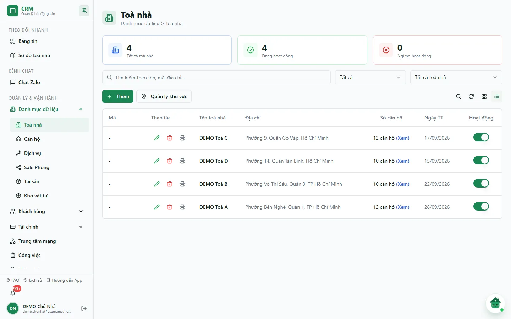
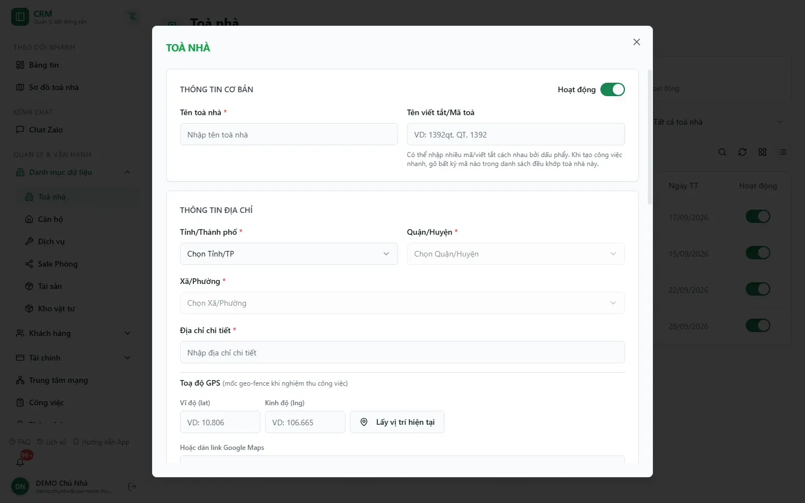
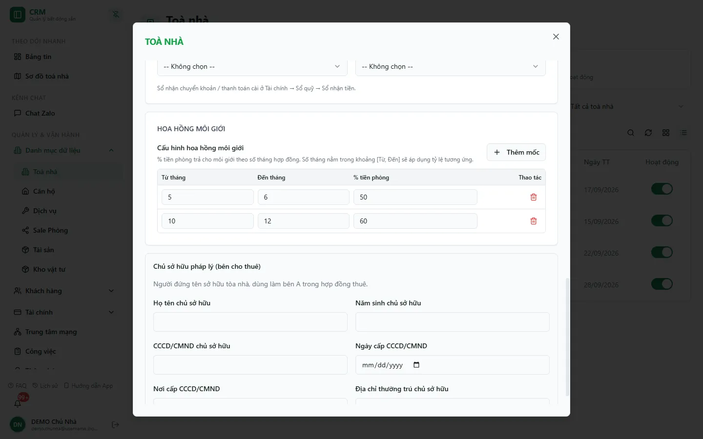

# Bước 1: Tạo khu vực & toà nhà

Toà nhà là đơn vị trung tâm của cả hệ thống: mọi hợp đồng, hoá đơn, công tơ, sổ quỹ và báo cáo sau này đều gắn với một toà. Đây là việc đầu tiên bạn làm khi khởi tạo dữ liệu — tạo **khu vực** (nhãn nhóm các toà theo địa bàn) rồi **thêm từng toà nhà**. Bạn quay lại màn hình này mỗi khi tiếp nhận thêm một toà mới để vận hành.

::: info Điều kiện tiên quyết
- Tài khoản có `buildings.view` để mở trang và `buildings.create` để thêm toà. Tạo khu vực cần thêm `areas.create`.
- Capability và phạm vi là hai lớp độc lập: tên vai trò không tự cấp quyền; dữ liệu chỉ hiện trong phạm vi hiệu lực. Với thao tác tạo dữ liệu cấp tổ chức, nên dùng phạm vi **Toàn tổ chức**.
- Chưa cần dữ liệu nào khác: đây là bước khởi tạo đầu tiên, tầng/phòng và dịch vụ sẽ thêm ở các bước sau.
:::

## Hướng dẫn từng bước

**Bước 1**: Tại thanh menu bên trái, mở **Quản lý & Vận hành** => **Danh mục dữ liệu** => **Toà nhà** (`/buildings`). Màn hình có ba thẻ thống kê (**Tất cả toà nhà**, **Đang hoạt động**, **Ngừng hoạt động**), hàng bộ lọc, nút **Thêm**, **Quản lý khu vực** và bảng các toà nằm trong phạm vi được giao.

**Bước 2**: Ấn nút **Quản lý khu vực** trên thanh công cụ. Trong hộp thoại **Quản lý khu vực**, gõ tên vào ô *Tên khu vực mới* (ví dụ "Quận 7", "Khu A") rồi thêm. Khu vực mới hiện thành một thẻ trong danh sách; mỗi khu chỉ cần một cái tên, không có ô mã hay mô tả.

::: tip Khu vực là nhãn nhóm, không bắt buộc
Một toà có thể thuộc **nhiều khu vực** cùng lúc. Khu vực chỉ dùng để nhóm và chọn nhanh cả nhóm toà ở các ô lọc — bạn có thể tạo toà trước, gán vào khu sau. Việc gán/bỏ toà khỏi khu cũng làm ngay trong hộp thoại **Quản lý khu vực**. Trang `/areas` cũ không còn; mở địa chỉ đó sẽ chuyển về `/buildings`.
:::

**Bước 3**: Đóng hộp thoại khu vực, ấn nút **Thêm** để mở form tạo toà. Hộp thoại **TOÀ NHÀ** hiện ra, cuộn dọc qua các khối: **Thông tin cơ bản**, **Thông tin địa chỉ**, **Dịch vụ toà nhà**, **Cấu hình**, **Hoa hồng môi giới** và **Chủ sở hữu pháp lý (bên cho thuê)**.

**Bước 4**: Điền khối **Thông tin cơ bản** và **Thông tin địa chỉ**. Các trường bắt buộc (có dấu `*`) gồm **Tên toà nhà**, **Tỉnh/Thành phố**, **Quận/Huyện**, **Xã/Phường** và **Địa chỉ chi tiết**.
- **Tên viết tắt/Mã toà** là tuỳ chọn; có thể nhập nhiều mã cách nhau bởi dấu phẩy (vd `1392qt, QT, 1392`) — khi tạo công việc nhanh, gõ mã nào trong danh sách cũng khớp đúng toà. Hệ thống không chặn mã trùng, nên chủ động đặt mã khác nhau để khỏi chọn nhầm.
- **Toạ độ GPS** (tuỳ chọn) là mốc geo-fence khi nghiệm thu công việc: nhập **Vĩ độ (lat)** / **Kinh độ (lng)**, ấn **Lấy vị trí hiện tại**, hoặc dán link Google Maps.
- Công tắc **Hoạt động** ở góc khối đầu mặc định bật. Chỉ toà **Đang hoạt động** mới xuất hiện trong ô chọn toà khi thêm phòng.

**Bước 5**: (Tuỳ chọn) Cuộn xuống các khối còn lại:
- **Dịch vụ toà nhà**: tích cột **Sử dụng** cho dịch vụ áp cho toà; ô **Đơn giá** để trống thì dùng giá chung của dịch vụ, điền số thì toà dùng giá riêng.
- **Cấu hình**: bật **Có thang máy** nếu muốn báo cáo Phân bổ lợi nhuận cảnh báo khi toà thiếu phiếu bảo trì thang máy; chọn **Mẫu in hóa đơn** và **Mẫu hợp đồng** riêng cho toà.
- **Hoa hồng môi giới**: bảng **Từ tháng – Đến tháng – % tiền phòng**, ấn **Thêm mốc** để thêm bậc. Form mới có sẵn hai mốc gợi ý; sửa hoặc xoá theo chính sách của bạn.
- **Chủ sở hữu pháp lý (bên cho thuê)**: người đứng tên sở hữu toà, dùng làm bên A trong hợp đồng thuê và hồ sơ CT01 — gồm họ tên, năm sinh, CCCD/CMND, ngày cấp, nơi cấp, địa chỉ thường trú.

**Bước 6**: Ấn **Lưu**. Toà mới xuất hiện trong bảng danh sách. Nếu lưu được toà nhưng phần dịch vụ hoặc chủ sở hữu chưa ghi xong, form báo **ID toà đã lưu** và lần lưu tiếp chỉ hoàn tất phần còn thiếu — không tạo lại toà; nút huỷ đổi thành **Đóng để đối chiếu tòa đã lưu**.

::: tip Sổ nhận tiền không còn nằm trong form toà
Form toà hiện không còn hai ô sổ quỹ mặc định TT/TK. Sổ nhận **Chuyển khoản / Thanh toán** của từng toà do **chủ công ty** cài tại **Sổ quỹ** => tab **Sổ nhận tiền** (`/finance/cashbooks?tab=so-nhan-tien`). Xem [Bước 5: Sổ quỹ & loại thu chi](/01-bat-dau/so-quy-loai-thu-chi/).
:::

::: info Giấy tờ chỗ ở hợp pháp (chỉ khi sửa toà)
Khi mở **Sửa** một toà đã có, cuối form có thêm khối tải ảnh **giấy tờ chứng minh chỗ ở hợp pháp** — tải một lần, dùng đính kèm cho hồ sơ đăng ký tạm trú của mọi khách trong toà. Xem [Hồ sơ CT01](/03-quan-ly-van-hanh/ho-so-ct01/).
:::

## Các tính năng khác trên màn hình

| Nút / Bộ lọc | Công dụng |
|---|---|
| **Sửa** (bút chì trên dòng toà) | Mở lại form **TOÀ NHÀ** để chỉnh thông tin, dịch vụ, cấu hình, hoa hồng, chủ sở hữu và giấy tờ. |
| **Xoá** (thùng rác) | Xoá mềm toà; hệ thống chặn nếu toà còn căn hộ ("Không thể xóa tòa nhà đang có … căn hộ"). |
| **In** (máy in) | In trang danh sách đang hiển thị. |
| Cột **Số căn hộ** → **(Xem)** | Mở danh sách căn hộ của đúng toà đó. |
| Cột **Ngày TT** | Ngày cập nhật gần nhất của hồ sơ toà. |
| Công tắc **Hoạt động** trên dòng | Bật/tắt nhanh Đang hoạt động ↔ Ngừng hoạt động, không cần mở form. |
| Ô tìm kiếm | Tìm theo **tên**, **mã** hoặc **địa chỉ** toà. |
| Bộ lọc trạng thái | **Tất cả** / **Đang hoạt động** / **Ngừng hoạt động**. |
| Bộ lọc toà nhà | Chọn đúng **1 toà** hoặc **Tất cả toà nhà**; danh sách xếp phẳng A→Z. |
| **Dạng lưới / Dạng danh sách**, **Làm mới** | Đổi cách hiển thị và tải lại dữ liệu. |

::: warning Xoá toà là hành động khó hoàn tác
Nút **Xoá** ẩn toà khỏi danh sách. Chỉ xoá khi chắc chắn toà không còn được dùng. Nếu toà đang là phạm vi làm việc của nhân viên hoặc còn phòng/hợp đồng hoạt động, hãy xử lý các dữ liệu đó trước.
:::

## Tình huống & lỗi thường gặp

| Tình huống | Cách xử lý |
|---|---|
| Ấn **Lưu** bị từ chối dù thấy nút **Thêm** | Nút có thể vẫn hiện; máy chủ kiểm tra `buildings.create` và phạm vi khi lưu. Tài khoản phạm vi theo toà thường không tạo được toà mới — nhờ chủ công ty tạo rồi gán bạn vào toà đó. |
| Form báo "Chưa tải đủ dịch vụ của tòa. Tải lại trước khi lưu." | Danh sách dịch vụ chưa tải xong hoặc tải lỗi. Ấn **Tải lại dịch vụ**, đợi khối báo biến mất rồi mới **Lưu**. |
| Không lưu được, báo thiếu địa chỉ | Điền đủ **Tỉnh/Thành phố, Quận/Huyện, Xã/Phường và Địa chỉ chi tiết**. |
| Báo lỗi trùng dữ liệu khi lưu | Thông báo trùng là chung cho thao tác ghi, không chứng minh mã toà bị ràng buộc duy nhất. Kiểm tra dữ liệu liên quan rồi thử lại; vẫn nên đặt mã toà khác nhau. |
| Bấm **Xoá** nhưng bị chặn | Toà còn căn hộ. Chuyển/xử lý phòng trước rồi thử lại. |
| Danh sách trống dù đã tạo toà | Kiểm tra bộ lọc toà nhà/trạng thái còn đang lọc; hoặc tài khoản không có quyền xem toà đó (màn hình hiện "Chưa có toà nhà nào" thay vì báo lỗi quyền). |
| Bảng hiện khối xám kèm "Mạng đang chậm, vẫn đang tải." | Dữ liệu đang tải chậm. Đợi thêm hoặc ấn **Thử lại**; không tạo lại toà trong lúc chờ. |

## Thử trực tiếp trên sandbox

<SandboxTry account="demo.chunha" app-path="/buildings" app-label="Mở màn hình Toà nhà" fixtures="DEMO Toà A, DEMO Toà B, DEMO Toà C, DEMO Toà D" view-only>

**Bài tập thực hành**

1. Quan sát bốn toà **DEMO Toà A/B/C/D** (snapshot 07/10/2026: 12, 10, 10, 12 căn hộ; cả bốn đang hoạt động) trong phạm vi toàn tổ chức của tài khoản chủ.
2. Ấn nút **Thêm** để mở form tạo toà. Cuộn qua các khối: thông tin cơ bản, địa chỉ, dịch vụ, cấu hình, hoa hồng môi giới, chủ sở hữu pháp lý (không cần lưu).

**Kết quả mong đợi**

- Bạn thấy bốn toà của snapshot DEMO hiện hành.
- Bạn nắm được các trường **bắt buộc**: tên toà, bộ ba địa giới và địa chỉ chi tiết.

::: tip Bài tập chỉ quan sát
Không bấm **Lưu** nếu không được bài thực hành yêu cầu; sandbox dùng chung và thao tác mới sẽ ảnh hưởng người đang học cùng.
:::

</SandboxTry>

## Quy trình liên quan

- [Tạo tầng & phòng](/01-bat-dau/tao-tang-phong/) — bước tiếp theo: thêm phòng cho toà vừa tạo.
- [Dịch vụ & định mức](/01-bat-dau/dich-vu-dinh-muc/) — thiết lập dịch vụ để bật cho từng toà trong khối **Dịch vụ toà nhà**.
- [Sổ quỹ & loại thu chi](/01-bat-dau/so-quy-loai-thu-chi/) — tạo sổ quỹ và cài sổ nhận tiền theo toà.
- [Toà nhà](/03-quan-ly-van-hanh/toa-nha/) — quản lý và tra cứu toà trong vận hành hằng ngày.
