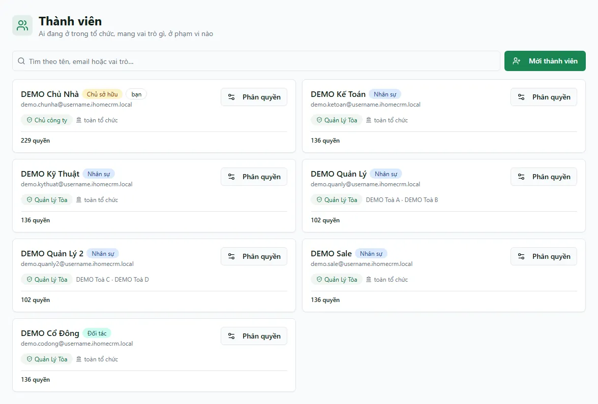

# Bước 6: Thêm nhân viên & phân quyền

Trang chuẩn hiện nay là **Thành viên** (`/settings/members`), **Mẫu vai trò** (`/settings/roles`) và **Tổ chức** (`/settings/organization`). URL cũ `/settings/staff` chỉ chuyển hướng sang Thành viên. Thành viên mới được thêm bằng **lời mời email**, không phải tạo username/mật khẩu trực tiếp.

::: info Điều kiện tiên quyết
- `users.view` để mở các trang quản trị thành viên; `users.create` để mời người; `users.edit` để sửa vai trò, phạm vi và ngoại lệ.
- Có sẵn ít nhất một phạm vi nếu muốn gán vai trò ngay: **Toàn tổ chức**, **Khu vực**, **Toà nhà** hoặc **Sổ quỹ**.
- Chuẩn bị email thật của người được mời. Người nhận phải đăng nhập bằng đúng email đó trước khi mở liên kết `/invite/:token`.
:::

## 1. Tạo hoặc chọn vai trò

Mở `/settings/roles`. Vai trò là **gói capability dùng lại**, không chứa phạm vi. Bạn có thể tạo vai trò, nhân bản hoặc sửa vai trò tự tạo.

::: warning Sửa vai trò ảnh hưởng ngay người đang dùng
Khác hệ “mẫu sao chép một lần” cũ, sửa một vai trò hiện hành làm thay đổi quyền của mọi thành viên đang mang vai trò đó. Kiểm tra số người bị ảnh hưởng trước khi lưu.
:::

## 2. Mời thành viên

**Bước 1**: Vào `/settings/members`, ấn **Mời thành viên**.

**Bước 2**: Nhập **Email**, chọn **Loại thành viên**: Nhân viên, Đối tác, Cổ đông hoặc Chủ sở hữu. Chủ sở hữu có toàn quyền, nên chỉ chọn khi thật sự cần.

**Bước 3**: Có thể chọn một **Vai trò khi vào**. Nếu đã chọn vai trò, phải chọn ít nhất một phạm vi áp dụng.

**Bước 4**: Ấn **Tạo lời mời**. Hệ thống hiện chưa gửi email tự động: liên kết mời chỉ hiện **một lần**, hãy sao chép và gửi cho người nhận.

**Bước 5**: Người nhận đăng nhập bằng đúng email được mời, mở `/invite/:token` và chấp nhận vào tổ chức. Link hết hạn phải được tạo lại.

## 3. Chỉnh quyền hiệu lực

Mở một thành viên để thấy ba tab:

- **Vai trò & phạm vi**: một người có thể mang nhiều vai trò ở nhiều phạm vi. Mỗi vai trò phải có ít nhất một phạm vi.
- **Ngoại lệ**: thêm hoặc bớt một capability riêng cho người đó, có phạm vi cụ thể. **DENY/Cấm** luôn thắng quyền Cho từ vai trò khác.
- **Quyền hiệu lực**: kết quả cuối cùng sau khi cộng vai trò, scope và ngoại lệ; dùng tab này để kiểm tra trước khi kết luận người dùng “đã có quyền”.

### Các loại phạm vi

| Phạm vi | Hiệu lực |
|---|---|
| **Toàn tổ chức (ORGANIZATION)** | Bao gồm mọi dữ liệu hiện tại và các toà/sổ quỹ tạo trong tương lai; là lựa chọn độc quyền. |
| **Khu vực (AREA)** | Bao gồm các toà thuộc khu; khi danh sách toà trong khu đổi, phạm vi hiệu lực đổi theo. |
| **Toà nhà (BUILDING)** | Chỉ các toà được chọn. |
| **Sổ quỹ (CASHBOOK)** | Chỉ sổ được chọn; vẫn phải qua possession CUSTODIAN/KNOWER cho nghiệp vụ tiền. |

::: warning Không thể tự sửa quyền của chính mình
Hộp thoại chặn người dùng thay đổi authorization của chính họ. Hãy nhờ một chủ sở hữu hoặc người quản trị khác thực hiện.
:::

## Tình huống & lỗi thường gặp

| Tình huống | Cách xử lý |
|---|---|
| Tạo lời mời xong không có email gửi đi | Đúng hành vi hiện tại. Sao chép link đang hiện và gửi thủ công; đóng hộp thoại sẽ không xem lại được link. |
| Nút tạo lời mời bị khoá khi đã chọn vai trò | Chọn ít nhất một phạm vi áp dụng cho vai trò. |
| Người nhận mở link nhưng không vào được | Họ phải đăng nhập bằng đúng email đã được mời; kiểm tra link còn hạn. |
| Đã gán role nhưng không thấy dữ liệu | Role chưa có scope, scope không phù hợp capability hoặc RLS chỉ cho thấy toà/sổ được giao. |
| Có hai vai trò, một Cho và một Cấm cùng capability | **Cấm thắng** trong quyền hiệu lực. |
| Không thấy toà mới tạo sau này | Dùng phạm vi Toàn tổ chức hoặc cập nhật scope toà/khu; scope toà lẻ không tự bao gồm toà mới. |

## Thử trực tiếp trên sandbox

<SandboxTry account="demo.chunha" app-path="/settings/members" app-label="Mở màn Thành viên" fixtures="7 tài khoản demo" view-only>

Quan sát danh sách tài khoản DEMO và mở hộp quyền của một người để xem ba tab. Snapshot hiện hành gồm `demo.chunha`, `demo.quanly`, `demo.quanly2`, `demo.ketoan`, `demo.sale`, `demo.kythuat`, `demo.codong`.

- `demo.quanly`: phạm vi DEMO Toà A + B.
- `demo.quanly2`: phạm vi DEMO Toà C + D.
- `demo.kythuat`: phạm vi toàn tổ chức DEMO.
- `demo.ketoan`, `demo.sale`, `demo.codong`: chủ đích giữ phạm vi toàn tổ chức.

</SandboxTry>

## Quy trình liên quan

- [Tạo khu vực & toà nhà](/01-bat-dau/tao-toa-nha/)
- [Đăng nhập](/01-bat-dau/dang-nhap/)
- [Sandbox — Môi trường thực hành](/01-bat-dau/sandbox/)
