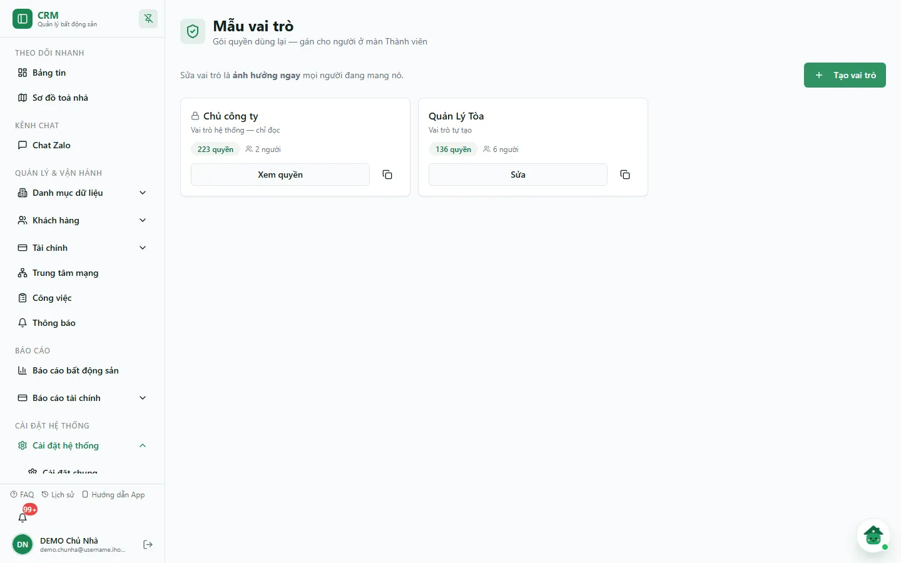
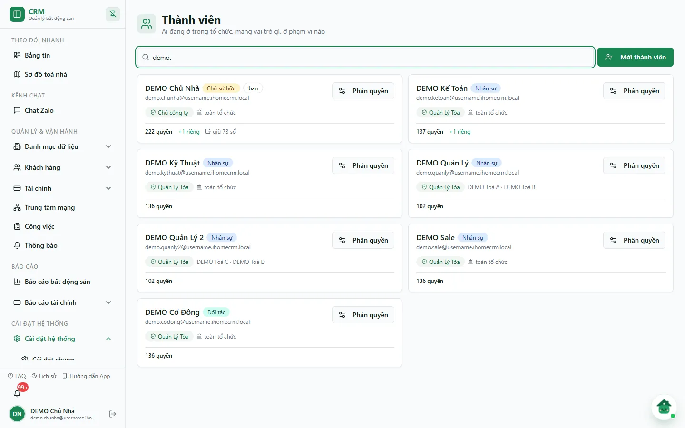
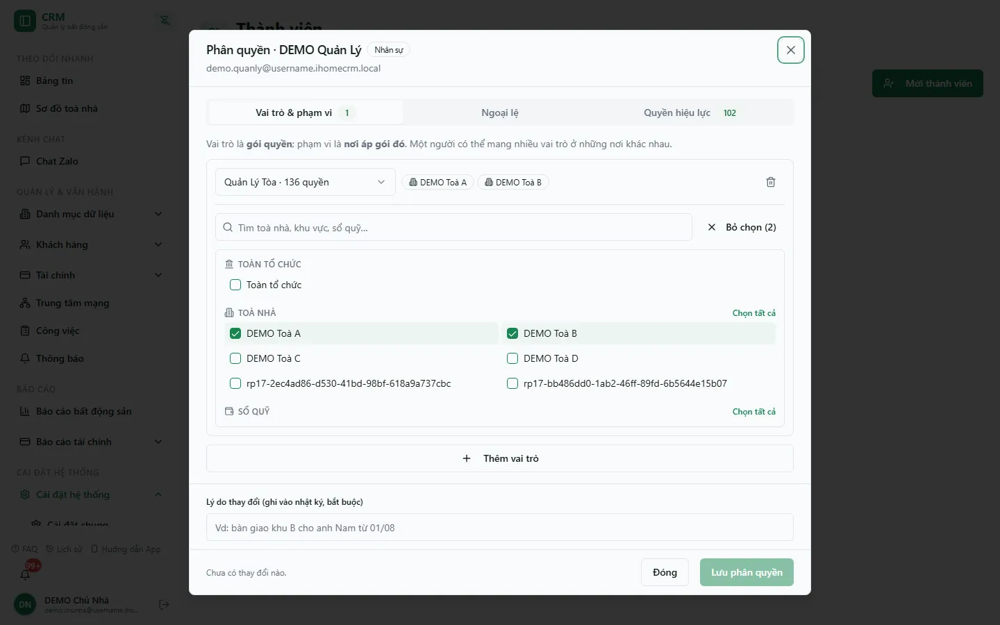

# Bước 6: Thêm nhân viên & phân quyền

Ba trang chuẩn nằm dưới **Cài đặt hệ thống**: **Thành viên** (`/settings/members`), **Mẫu vai trò** (`/settings/roles`) và **Tổ chức** (`/settings/organization`). URL cũ `/settings/staff` chỉ chuyển hướng sang Thành viên. Thành viên mới được thêm bằng **lời mời** (đường dẫn gửi tay), không phải tạo username/mật khẩu trực tiếp.

::: info Điều kiện tiên quyết
- `users.view` để mở các trang quản trị thành viên; `users.create` để mời người; `users.edit` để sửa vai trò, phạm vi và ngoại lệ.
- Có sẵn ít nhất một phạm vi nếu muốn gán vai trò ngay: **Toàn tổ chức**, **Khu vực**, **Toà nhà** hoặc **Sổ quỹ**.
- Chuẩn bị email thật của người được mời. Người nhận phải đăng nhập bằng đúng email đó trước khi mở đường dẫn `/invite/:token`.
:::

## 1. Tạo hoặc chọn vai trò

**Bước 1**: Mở **Cài đặt hệ thống** => **Mẫu vai trò** (`/settings/roles`). Vai trò là **gói quyền dùng lại**, không chứa phạm vi. Mỗi thẻ vai trò cho biết số quyền, số mục bị cấm (nếu có) và số người đang mang.

**Bước 2**: Ấn **Tạo vai trò**, đặt **Tên vai trò** (vd "Kế toán khu B") và bật các **Quyền** cần thiết rồi lưu. Với vai trò có sẵn:
- **Vai trò hệ thống — chỉ đọc** (có biểu tượng ổ khoá, như **Chủ công ty**): chỉ **Xem quyền**; muốn chỉnh thì ấn nút nhân bản ở góc thẻ để tạo bản sao.
- **Vai trò tự tạo**: ấn **Sửa** để chỉnh, hoặc nhân bản thành vai trò mới.

::: warning Sửa vai trò ảnh hưởng ngay người đang dùng
Sửa một vai trò làm thay đổi quyền của **mọi thành viên đang mang vai trò đó** ngay lập tức. Hộp sửa sẽ báo "**N người** đang mang vai trò này" — kiểm tra số người bị ảnh hưởng trước khi lưu.
:::

## 2. Mời thành viên

**Bước 3**: Mở **Cài đặt hệ thống** => **Thành viên** (`/settings/members`). Mỗi người là một thẻ gồm tên, loại thành viên, email, các vai trò kèm phạm vi, tổng số quyền và các chỉ số **+N riêng** / **−N bị cấm** / **giữ N sổ**. Ô **Tìm theo tên, email hoặc vai trò…** giúp lọc nhanh.

**Bước 4**: Ấn **Mời thành viên**. Trong hộp thoại, nhập **Email**, chọn **Loại thành viên**: **Nhân sự**, **Đối tác**, **Cổ đông** hoặc **Chủ sở hữu**. Chủ sở hữu có toàn quyền, kể cả sửa phân quyền người khác — chỉ chọn khi thật sự cần.

**Bước 5**: Có thể chọn một **Vai trò khi vào (tuỳ chọn)**; để *Chưa gán — cấp sau* nếu muốn phân quyền sau. Nếu đã chọn vai trò, ô **Áp vai trò ở đâu** hiện ra và phải chọn ít nhất một phạm vi.

**Bước 6**: Ấn **Tạo lời mời**. Hệ thống **chưa gửi email tự động**: đường dẫn mời chỉ hiện **một lần duy nhất** cùng thời điểm hết hạn — sao chép (nút bên cạnh ô đường dẫn) và gửi cho người nhận rồi ấn **Xong**.

**Bước 7**: Người nhận đăng nhập bằng đúng email được mời, mở đường dẫn `/invite/:token` và chấp nhận vào tổ chức. Đường dẫn hết hạn phải được tạo lại.

## 3. Chỉnh quyền hiệu lực

**Bước 8**: Trên thẻ thành viên, ấn **Phân quyền**. Hộp **Phân quyền · *tên người*** có ba tab:

- **Vai trò & phạm vi**: vai trò là *gói quyền*, phạm vi là *nơi áp gói đó*. Một người có thể mang nhiều vai trò ở nhiều nơi; ấn **Thêm vai trò** để thêm dòng. Mỗi vai trò phải có ít nhất một phạm vi.
- **Ngoại lệ**: thêm hoặc bớt một quyền lẻ cho riêng người đó, có phạm vi và **lý do** bắt buộc. **Cấm** luôn thắng quyền **Cho** từ vai trò khác. Cấp quyền liên quan sổ quỹ không tự trao quyền giữ sổ.
- **Quyền hiệu lực**: kết quả cuối cùng sau khi cộng vai trò, phạm vi và ngoại lệ; dùng tab này để kiểm tra trước khi kết luận người dùng "đã có quyền".

**Bước 9**: Điền **Lý do thay đổi (ghi vào nhật ký, bắt buộc)**, xem lại danh sách quyền **Sẽ MẤT** / **Sẽ ĐƯỢC THÊM**, rồi ấn **Lưu phân quyền**. Ấn **Đóng** nếu chỉ xem.

### Các loại phạm vi

| Phạm vi | Hiệu lực |
|---|---|
| **Toàn tổ chức** (ORGANIZATION) | Bao gồm mọi dữ liệu hiện tại và các toà/sổ quỹ tạo trong tương lai; là lựa chọn độc quyền — chọn nó thì các phạm vi hẹp bị bỏ. |
| **Khu vực** (AREA) | Bao gồm các toà thuộc khu; khi danh sách toà trong khu đổi, phạm vi hiệu lực đổi theo. |
| **Toà nhà** (BUILDING) | Chỉ các toà được chọn. |
| **Sổ quỹ** (CASHBOOK) | Chỉ sổ được chọn; nghiệp vụ tiền vẫn phải là Người giữ sổ / Người được xem sổ. |

::: warning Không thể tự sửa quyền của chính mình
Hộp phân quyền chặn người dùng thay đổi quyền của chính họ ("Không thể tự sửa quyền của chính mình."). Hãy nhờ một chủ sở hữu hoặc người quản trị khác thực hiện.
:::

## Tình huống & lỗi thường gặp

| Tình huống | Cách xử lý |
|---|---|
| Tạo lời mời xong không có email gửi đi | Đúng hành vi hiện tại. Sao chép đường dẫn đang hiện và gửi thủ công; đóng hộp thoại sẽ không xem lại được. |
| Không tạo được lời mời khi đã chọn vai trò | Chọn ít nhất một phạm vi ở **Áp vai trò ở đâu**. |
| Người nhận mở link nhưng không vào được | Họ phải đăng nhập bằng đúng email đã được mời; kiểm tra link còn hạn. |
| Thẻ thành viên ghi "chưa gán phạm vi — không có tác dụng" | Vai trò đó chưa có phạm vi nên không cấp quyền gì. Mở **Phân quyền** và chọn phạm vi. |
| Đã gán vai trò nhưng không thấy dữ liệu | Phạm vi không phù hợp hoặc chỉ cho thấy toà/sổ được giao. Kiểm tra tab **Quyền hiệu lực**. |
| Có hai vai trò, một Cho và một Cấm cùng quyền | **Cấm thắng** trong quyền hiệu lực. |
| Không thấy toà mới tạo sau này | Dùng phạm vi **Toàn tổ chức** hoặc cập nhật phạm vi toà/khu; phạm vi toà lẻ không tự bao gồm toà mới. |

## Thử trực tiếp trên sandbox

<SandboxTry account="demo.chunha" app-path="/settings/members" app-label="Mở màn Thành viên" fixtures="7 tài khoản demo" view-only>

Quan sát danh sách tài khoản DEMO (gõ `demo.` vào ô tìm) và mở **Phân quyền** của một người để xem ba tab, rồi **Đóng** — không lưu. Snapshot 07/10/2026 gồm `demo.chunha` (Chủ sở hữu, vai trò **Chủ công ty**), `demo.quanly`, `demo.quanly2`, `demo.ketoan`, `demo.sale`, `demo.kythuat` (Nhân sự) và `demo.codong` (Đối tác); sáu tài khoản sau cùng mang vai trò **Quản Lý Tòa**.

- `demo.quanly`: phạm vi DEMO Toà A + B.
- `demo.quanly2`: phạm vi DEMO Toà C + D.
- `demo.kythuat`, `demo.ketoan`, `demo.sale`, `demo.codong`: phạm vi toàn tổ chức.

</SandboxTry>

## Quy trình liên quan

- [Tạo khu vực & toà nhà](/01-bat-dau/tao-toa-nha/)
- [Sổ quỹ & loại thu chi](/01-bat-dau/so-quy-loai-thu-chi/) — giao Người giữ sổ / Người được xem sổ.
- [Phân quyền](/05-cai-dat/phan-quyen/)
- [Đăng nhập](/01-bat-dau/dang-nhap/)
- [Sandbox — Môi trường thực hành](/01-bat-dau/sandbox/)
