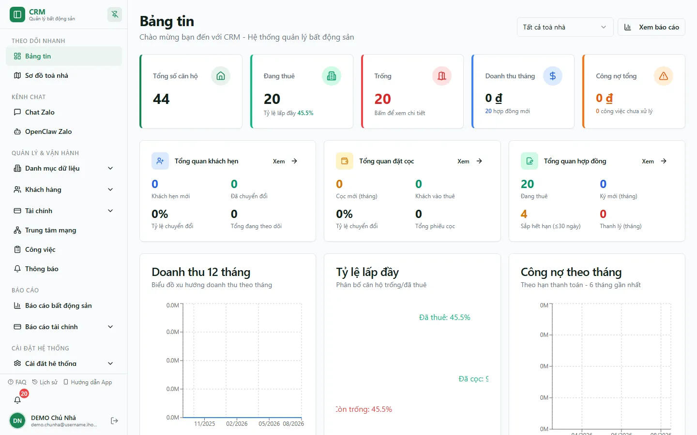

# Bảng tin

Trên desktop, `/` là Bảng tin; `/dashboard` chuyển về `/`. Trên mobile, `/` là HomeLauncher và `/dashboard` mở Bảng tin mobile. Cả hai route đều yêu cầu đăng nhập nhưng hiện không có route guard capability riêng; dữ liệu bên trong vẫn được RLS và các hook lọc theo tài khoản/phạm vi.

::: info Điều kiện tiên quyết
- Đã [đăng nhập](/01-bat-dau/dang-nhap/).
- Có toà/phòng trong phạm vi để KPI có dữ liệu.
- Catalog có `dashboard.view` và `dashboard.view_finance`, nhưng trang desktop hiện chưa ẩn các thẻ tài chính theo `dashboard.view_finance`; không dùng capability này như bằng chứng rằng số tiền chắc chắn bị che trên UI hiện tại.
:::

## Hướng dẫn

**Bước 1**: Mở Bảng tin và đọc các thẻ KPI đầu trang: tổng căn, đang thuê, phòng trống, doanh thu tháng, công nợ và các số phụ thuộc dữ liệu hiện hành.

::: info Snapshot DEMO được kiểm tra
Tại thời điểm chụp, toàn tổ chức DEMO có **44 căn**, **20 đang thuê**, **20 trống**, **20 hợp đồng đang thuê** và **4 hợp đồng sắp hết hạn**; doanh thu tháng và công nợ tổng đang hiển thị `0 đ`. Đây là snapshot theo dữ liệu hiện tại, không phải số cố định của sản phẩm.
:::

**Bước 2**: Chọn một toà ở bộ lọc. Các query thống kê, biểu đồ doanh thu/lấp đầy, cảnh báo và hoạt động gần đây đều nhận phạm vi toà hiện tại; tài khoản chỉ nhìn thấy toà được RLS cho phép.

**Bước 3**: Xem biểu đồ doanh thu và lấp đầy để so sánh các kỳ. Phòng giữ chỗ được tách khỏi phòng trống khi dữ liệu cọc/hợp đồng tồn tại.

**Bước 4**: Xem **Cảnh báo** và **Hoạt động gần đây**. Chọn một dòng để đi tới nghiệp vụ liên quan nếu tài khoản có quyền mở route đích.

**Bước 5**: Khu báo cáo ở cuối trang điều hướng tới các báo cáo mà tài khoản được cấp capability. Không dựa vào số lượng thẻ/báo cáo ghi cứng vì catalog có thể thay đổi.

::: tip Chu kỳ làm mới
Các query dashboard đặt chu kỳ làm mới khoảng **5 phút**. Sau giao dịch quan trọng, có thể tải lại trang nếu cần kiểm tra ngay.
:::

## Trạng thái và ngoại lệ

| Tình huống | Giải thích / xử lý |
|---|---|
| Desktop vào `/dashboard` nhưng quay về `/` | Đúng route hiện hành; desktop dùng `/`. |
| Mobile vào `/` không thấy KPI | `/` mobile là HomeLauncher; mở `/dashboard`. |
| Số liệu bằng 0 hoặc thiếu toà | Kiểm tra phạm vi thành viên và dữ liệu thật trong các toà được giao. |
| Thẻ tài chính vẫn hiện dù thiếu `dashboard.view_finance` | UI desktop hiện chưa áp dụng capability đó để ẩn thẻ; đây là ngoại lệ implementation hiện tại. |
| Chọn toà nhưng cảnh báo/hoạt động không đổi | Tải lại nếu cache chưa làm mới; các hook hiện đã nhận building filter, không còn cố ý hiển thị toàn cục. |
| Nhấn cảnh báo nhưng không mở được đích | Route đích còn cần capability riêng; quyền xem Dashboard không mở mọi nghiệp vụ. |

## Thử trực tiếp trên sandbox

<SandboxTry account="demo.chunha" app-path="/" view-only>

Chọn lần lượt bốn toà DEMO để thấy KPI, biểu đồ, cảnh báo và hoạt động thay đổi theo toà. Sau đó dùng `demo.quanly` để kiểm chứng danh sách toà chỉ còn A+B.

</SandboxTry>

## Quy trình liên quan

- [Làm quen giao diện](/01-bat-dau/lam-quen-giao-dien/)
- [Sơ đồ toà nhà](/02-theo-doi-nhanh/so-do-toa-nha/)
- [Thông báo](/02-theo-doi-nhanh/thong-bao/)
- [Việc của tôi](/02-theo-doi-nhanh/viec-cua-toi/)
