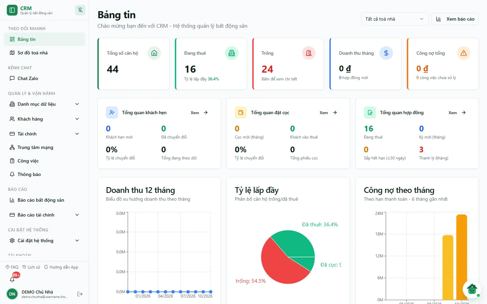
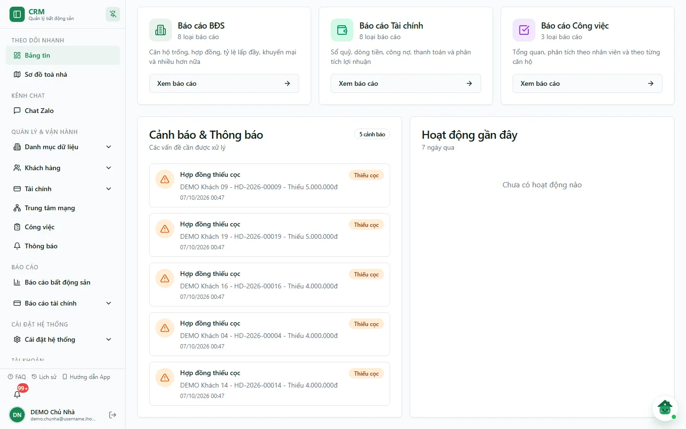
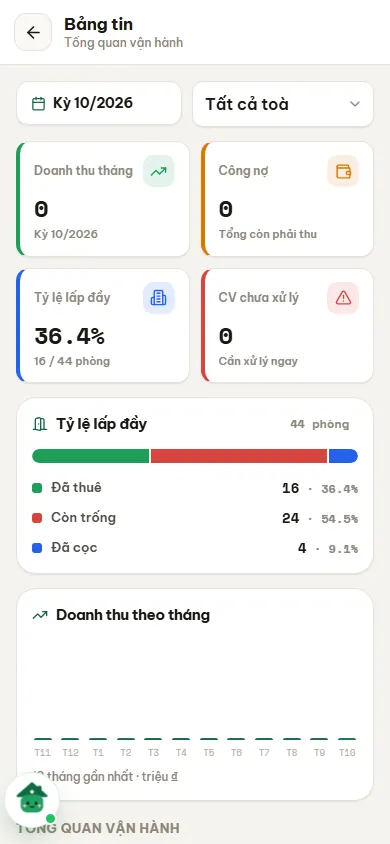

# Bảng tin

**Bảng tin** là màn mở đầu ngày làm việc: nhìn nhanh số phòng đang thuê/trống, doanh thu và công nợ tháng, tình hình khách hẹn – đặt cọc – hợp đồng, rồi đọc các cảnh báo cần xử lý. Trên máy tính, `/` chính là Bảng tin và `/dashboard` chuyển về `/`. Trên điện thoại, `/` là màn hình chính dạng lưới biểu tượng; Bảng tin mobile mở ở `/dashboard` (ô **Bảng tin** trên màn hình chính).

::: info Điều kiện tiên quyết
- Đã [đăng nhập](/01-bat-dau/dang-nhap/). Route `/` và `/dashboard` chỉ yêu cầu đăng nhập, không có route guard capability riêng; mục **Bảng tin** trên menu luôn hiện. Dữ liệu bên trong vẫn được RLS và các hook lọc theo tài khoản/phạm vi toà.
- Có toà/phòng trong phạm vi để KPI có dữ liệu.
- Catalog có `dashboard.view` và `dashboard.view_finance`, nhưng màn Bảng tin hiện **chưa** ẩn thẻ doanh thu/công nợ theo `dashboard.view_finance` (đối chiếu source 07/10/2026). Đừng dùng quyền này như bằng chứng rằng số tiền bị che trên giao diện.
:::

## Hướng dẫn trên máy tính

**Bước 1**: Tại menu bên trái, mục **THEO DÕI NHANH**, ấn chọn **Bảng tin**. Đầu trang có ô chọn toà (mặc định **Tất cả toà nhà**), nút **Xem báo cáo** (mở Báo cáo BĐS) và năm thẻ KPI: **Tổng số căn hộ**, **Đang thuê** (kèm tỷ lệ lấp đầy), **Trống**, **Doanh thu tháng** (kèm số hợp đồng mới) và **Công nợ tổng** (kèm số công việc chưa xử lý). Ngay dưới là ba khối **Tổng quan khách hẹn**, **Tổng quan đặt cọc**, **Tổng quan hợp đồng**, rồi ba biểu đồ **Doanh thu 12 tháng**, **Tỷ lệ lấp đầy** và **Công nợ theo tháng**.

::: info Snapshot DEMO ngày 07/10/2026
Toàn tổ chức DEMO đang có **44 căn**, **16 đang thuê** (lấp đầy 36,4%), **24 trống**; khối hợp đồng ghi **16 đang thuê**, **3 thanh lý trong tháng**; doanh thu tháng và công nợ tổng hiển thị `0 đ`. Đây là dữ liệu tại thời điểm chụp, không phải số cố định.
:::

**Bước 2**: Chọn một toà ở ô chọn toà đầu trang. KPI, ba khối tổng quan, biểu đồ doanh thu/lấp đầy, cảnh báo và hoạt động gần đây đều đổi theo toà đang chọn; bạn chỉ thấy các toà được phân quyền. Riêng biểu đồ **Công nợ theo tháng** (theo hạn thanh toán, 6 tháng gần nhất) hiện **không** nhận bộ lọc toà.

**Bước 3**: Ấn thẻ **Trống** (dòng *Bấm để xem chi tiết*) để mở hộp **Danh sách phòng trống**: cột Tòa nhà, Căn hộ, Tầng, Giá thuê, Số ngày trống; bấm một dòng để mở chi tiết phòng, hoặc **Xem báo cáo đầy đủ**. Ở ba khối tổng quan, nút **Xem** mở lần lượt Khách hẹn, Đặt cọc, Hợp đồng.

**Bước 4**: Kéo xuống khu **Báo cáo & Phân tích** (ba thẻ Báo cáo BĐS, Báo cáo Tài chính, Báo cáo Công việc — mỗi thẻ có nút **Xem báo cáo**), rồi đọc **Cảnh báo & Thông báo** (hoá đơn quá hạn, hợp đồng hết hạn, công việc khẩn cấp, thiếu cọc…) và **Hoạt động gần đây** (7 ngày qua).

Các con số "8 loại báo cáo / 3 loại báo cáo / 19 loại báo cáo" trên thẻ là chữ cố định trong giao diện; danh sách báo cáo thực tế còn tuỳ quyền `reports_*` của tài khoản.

::: tip Chu kỳ làm mới
Các truy vấn Bảng tin tự làm mới khoảng **5 phút** một lần khi tab đang mở. Sau một giao dịch quan trọng, có thể tải lại trang để kiểm tra ngay.
:::

## Bảng tin trên điện thoại

Trên điện thoại, mở ô **Bảng tin** ở màn hình chính (hoặc vào thẳng `/dashboard`). Màn **Bảng tin — Tổng quan vận hành** có kỳ hiện tại, ô chọn toà (**Tất cả toà**), bốn thẻ **Doanh thu tháng**, **Công nợ**, **Tỷ lệ lấp đầy**, **CV chưa xử lý**, thanh **Tỷ lệ lấp đầy** (Đã thuê / Còn trống / Đã cọc), biểu đồ **Doanh thu theo tháng**, rồi tổng quan vận hành, cảnh báo và hoạt động gần đây.

## Trạng thái và ngoại lệ

| Tình huống | Giải thích / xử lý |
|---|---|
| Máy tính vào `/dashboard` nhưng quay về `/` | Đúng thiết kế; trên máy tính Bảng tin nằm ở `/`. |
| Điện thoại vào `/` không thấy KPI chi tiết | `/` trên điện thoại là màn hình chính dạng lưới; mở ô **Bảng tin** (`/dashboard`). |
| Số liệu bằng 0 hoặc thiếu toà | Kiểm tra phạm vi toà được giao và dữ liệu thật trong các toà đó. |
| Thẻ tài chính vẫn hiện dù thiếu `dashboard.view_finance` | Giao diện hiện chưa dùng quyền này để ẩn thẻ; đây là giới hạn của bản hiện hành. |
| Đổi toà nhưng biểu đồ Công nợ theo tháng không đổi | Biểu đồ này chưa nhận bộ lọc toà; xem công nợ theo toà ở [Thu tiền](/03-quan-ly-van-hanh/thu-tien-mobile/) hoặc báo cáo tài chính. |
| Khu vực hiện khung "Chưa tải được…" kèm nút **Tải lại** | Một truy vấn của khu đó lỗi (mạng, hết thời gian chờ). Bấm **Tải lại**; các khu khác vẫn dùng được. |
| Nhấn cảnh báo/nút **Xem** nhưng không mở được đích | Route đích còn cần quyền riêng; vào được Bảng tin không có nghĩa mở được mọi nghiệp vụ. |

## Thử trực tiếp trên sandbox

<SandboxTry account="demo.chunha" app-path="/" app-label="Mở Bảng tin" view-only>

1. Chọn lần lượt các toà DEMO ở ô chọn toà để thấy KPI, ba khối tổng quan, cảnh báo và hoạt động đổi theo toà.
2. Bấm thẻ **Trống** để mở **Danh sách phòng trống**, xem rồi đóng hộp thoại.
3. Đăng nhập `demo.quanly` để kiểm chứng ô chọn toà chỉ còn các toà được giao.

</SandboxTry>

## Quy trình liên quan

- [Làm quen giao diện](/01-bat-dau/lam-quen-giao-dien/)
- [Sơ đồ toà nhà](/02-theo-doi-nhanh/so-do-toa-nha/)
- [Thông báo](/02-theo-doi-nhanh/thong-bao/)
- [Việc của tôi](/02-theo-doi-nhanh/viec-cua-toi/)
