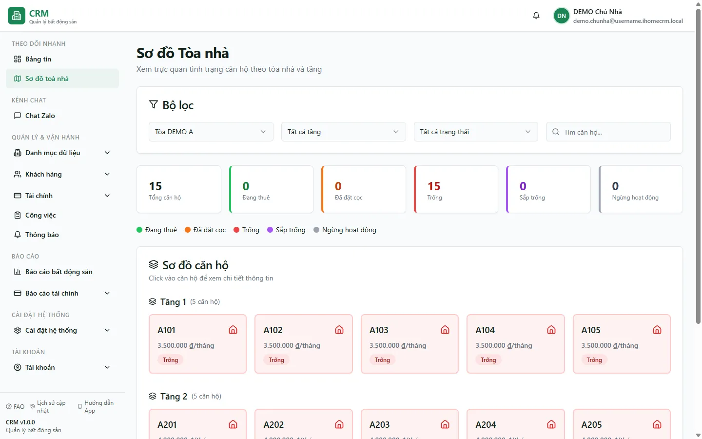

# Sơ đồ toà nhà

Trang **Sơ đồ toà nhà** vẽ toàn bộ phòng của một toà thành lưới xếp theo tầng, mỗi phòng tô màu theo trạng thái để bạn nắm nhanh phòng nào đang thuê, phòng nào còn trống hay đã đặt cọc. Đây là màn hình **chỉ để xem**, hợp lý khi bạn cần một cái nhìn tổng quan tình trạng cho thuê của toà mà không phải mở từng phòng. Trạng thái các phòng được tính tự động từ hợp đồng đang hiệu lực và cọc giữ chỗ, nên sơ đồ luôn phản ánh đúng thực tế mà không ai phải cập nhật tay.

::: info Điều kiện tiên quyết
- Quyền **Bất động sản → Toà nhà (Xem)** để thấy trang và danh sách toà (bạn chỉ thấy các toà được phân quyền).
- Đã có **toà nhà** cùng **tầng** và **phòng** — xem [Tạo tầng & phòng](/01-bat-dau/tao-tang-phong/) nếu toà còn trống.
- Trạng thái "Đang thuê" / "Sắp trống" tự hiện khi phòng có hợp đồng; trạng thái "Đã đặt cọc" tự hiện khi có phiếu thu cọc giữ chỗ.
:::

## Hướng dẫn từng bước

**Bước 1**: Tại menu điều hướng, ấn chọn **Sơ đồ toà nhà**. Màn hình hiện lưới các phòng, xếp theo từng tầng và tô màu theo trạng thái.

**Bước 2**: Tại ô lọc **Toà nhà** ở đầu trang, chọn toà cần xem. Bạn có thể gõ tên toà (ví dụ *Tòa DEMO A*) hoặc gõ tên khu vực để thu hẹp nhanh; sơ đồ sẽ vẽ lại toàn bộ phòng của toà vừa chọn. Nếu bạn chưa chọn, trang tự lấy toà đầu tiên trong danh sách.

**Bước 3**: Tại ô lọc **Tầng**, chọn một tầng để xem riêng lưới tầng đó, hoặc để **Tất cả tầng** để xem cả toà với các phòng gom nhóm theo từng tầng.

**Bước 4**: Đối chiếu màu mỗi ô phòng với **chú thích màu** ở đầu trang. Có 5 trạng thái:

| Trạng thái | Ý nghĩa |
| --- | --- |
| **Đang thuê** | Phòng có hợp đồng đang hiệu lực. |
| **Sắp trống** | Hợp đồng của phòng còn 1–30 ngày là hết hạn. |
| **Đã đặt cọc** | Có phiếu thu cọc giữ chỗ (chưa ký hợp đồng) — hệ thống tự đặt. |
| **Trống** | Phòng chưa có hợp đồng và chưa có cọc giữ chỗ. |
| **Ngừng hoạt động** | Phòng đang bảo trì hoặc tạm ngừng cho thuê. |

**Bước 5**: Ấn vào một ô phòng bất kỳ để mở hộp chi tiết phòng — xem thông tin phòng cùng các nút thao tác nhanh (tạo hợp đồng, báo cáo công việc).

::: tip
Trạng thái trên sơ đồ được tính tự động: "Đang thuê / Sắp trống" suy từ hợp đồng đang hiệu lực, "Đã đặt cọc" suy từ phiếu thu cọc giữ chỗ. Muốn đổi trạng thái một phòng, hãy sửa ở hợp đồng hoặc phiếu cọc — không có ô chỉnh trạng thái ngay trên sơ đồ này.
:::

## Các tính năng khác trên màn hình

| Nút / Bộ lọc | Công dụng |
| --- | --- |
| Ô lọc **Toà nhà** | Chọn 1 toà để vẽ sơ đồ; gõ tên toà hoặc tên khu vực để tìm nhanh. |
| Ô lọc **Tầng** | Xem riêng một tầng, hoặc **Tất cả tầng** để nhóm phòng theo từng tầng. |
| Ô lọc **Trạng thái** | Chỉ hiển thị các phòng đúng trạng thái đang chọn. |
| Ô **tìm phòng / khách** | Gõ tên phòng hoặc tên khách để lọc nhanh trong toà đang xem. |
| Thẻ thống kê | Đếm nhanh số phòng theo từng trạng thái của toà đang xem. |
| Chú thích màu | Bảng màu giải nghĩa 5 trạng thái phòng. |
| Nút **Tạo hợp đồng** (trong chi tiết phòng) | Mở form hợp đồng đã điền sẵn toà và phòng. |
| Nút **Báo cáo công việc** (trong chi tiết phòng) | Chuyển sang trang Việc để ghi nhận công việc / sự cố cho phòng. |

Các bộ lọc (toà, tầng, trạng thái, ô tìm) được giữ lại khi bạn tải lại trang (F5), nên quay lại màn hình bạn không phải chọn lại từ đầu.

## Tình huống & lỗi thường gặp

| Tình huống | Cách xử lý |
| --- | --- |
| Sơ đồ trống, không thấy phòng nào | Kiểm tra toà đang chọn đã có phòng chưa; tạo tầng & phòng trước — xem [Tạo tầng & phòng](/01-bat-dau/tao-tang-phong/). |
| Không thấy toà cần xem trong ô lọc | Bạn chỉ thấy các toà được phân quyền; nhờ quản trị gán toà cho tài khoản của bạn. |
| Ô **Tầng** không có tầng nào để chọn | Toà chưa khai báo tầng; tạo tầng qua form Căn hộ (nút **+ Thêm tầng**). |
| Phòng vẫn hiện "Trống" dù khách đã đặt cọc | Cọc phải là phiếu thu có hạng mục cọc và chưa gắn hợp đồng thì mới tự chuyển sang "Đã đặt cọc"; kiểm tra lại phiếu cọc. |
| Muốn kéo-thả, sắp xếp vị trí phòng trên sơ đồ | Trang này chỉ để xem trạng thái. Việc vẽ sơ đồ tọa độ theo tầng nằm ở module **Sale Phòng**, không phải màn hình này. |
| Trạng thái một phòng hiển thị sai | Trạng thái tính tự động từ hợp đồng đang hiệu lực và phiếu cọc; sửa ở hợp đồng hoặc phiếu cọc, không chỉnh trên sơ đồ. |

## Thử trực tiếp trên sandbox

<SandboxTry account="demo.quanly" app-path="/building-map" app-label="Mở Sơ đồ toà nhà" view-only>

Chọn **Tòa DEMO A** ở ô lọc **Toà nhà**, rồi quan sát màu trạng thái của từng phòng theo tầng.

Bạn hãy nhìn thấy:
- Lưới các phòng (A101, A102…) gom nhóm theo tầng.
- Mỗi phòng tô một màu, khớp với **chú thích màu** ở đầu trang (Đang thuê / Đã đặt cọc / Trống / Sắp trống / Ngừng hoạt động).
- Ấn thử một phòng để mở hộp chi tiết phòng.

</SandboxTry>

## Quy trình liên quan

- [Tạo tầng & phòng](/01-bat-dau/tao-tang-phong/) — khai báo phòng để chúng xuất hiện trên sơ đồ.
- [Căn hộ / Phòng](/03-quan-ly-van-hanh/can-ho-phong/) — quản lý chi tiết từng phòng và trạng thái.
- [Toà nhà](/03-quan-ly-van-hanh/toa-nha/) — quản lý toà, tầng và cấu hình toà.
