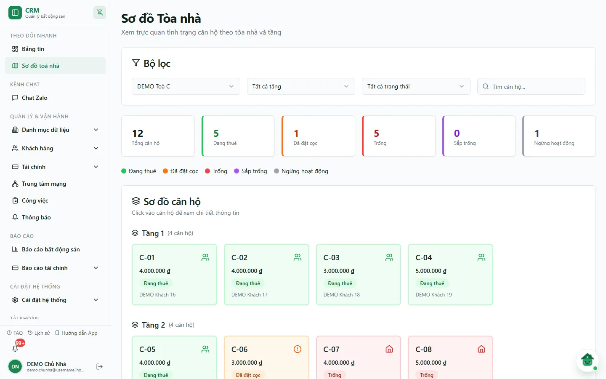
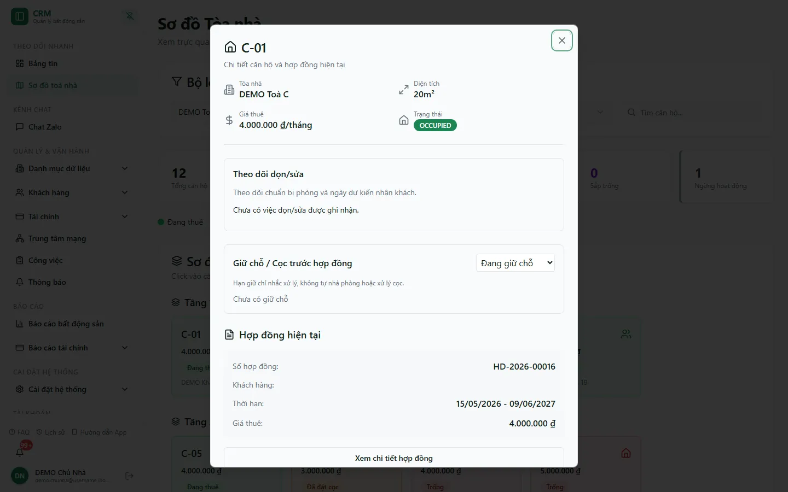
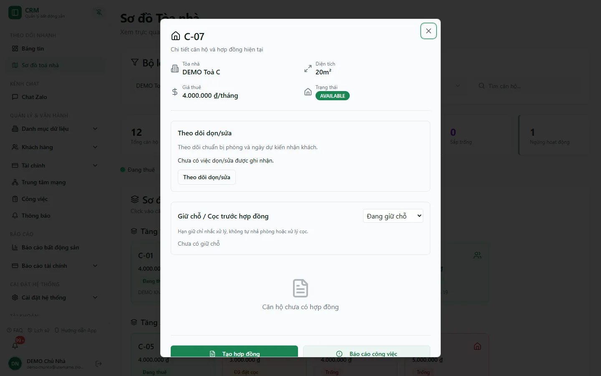

# Sơ đồ toà nhà

Trang **Sơ đồ Tòa nhà** vẽ toàn bộ căn hộ của một toà thành lưới xếp theo tầng, mỗi căn tô màu theo trạng thái để bạn nắm nhanh căn nào đang thuê, căn nào còn trống, đã đặt cọc hay sắp trống. Đây là màn hình **để xem**: muốn đổi trạng thái thì sửa ở hợp đồng, giữ chỗ/đặt cọc hoặc căn hộ. Trên điện thoại, cùng đường dẫn mở bản sơ đồ dạng app riêng.

::: info Điều kiện tiên quyết
- Route `/building-map` yêu cầu đăng nhập và `buildings.view`; danh sách toà/phòng còn được RLS lọc theo phạm vi.
- Đã có **toà nhà**, **tầng** và **căn hộ** — xem [Tạo tầng & phòng](/01-bat-dau/tao-tang-phong/) nếu toà còn trống.
- "Đang thuê" / "Sắp trống" tự hiện khi căn có hợp đồng còn hiệu lực; "Đã đặt cọc" và "Ngừng hoạt động" đọc từ trạng thái căn hộ khi căn chưa có hợp đồng.
:::

## Hướng dẫn từng bước

**Bước 1**: Tại menu bên trái, mục **THEO DÕI NHANH**, ấn chọn **Sơ đồ toà nhà**. Màn hình có khung **Bộ lọc** (toà, tầng, trạng thái, ô **Tìm căn hộ...**), sáu thẻ đếm (**Tổng căn hộ**, **Đang thuê**, **Đã đặt cọc**, **Trống**, **Sắp trống**, **Ngừng hoạt động**), dòng chú thích màu và khung **Sơ đồ căn hộ** gom căn theo từng tầng.

**Bước 2**: Ở ô chọn toà, chọn toà cần xem — gõ tên toà (ví dụ *DEMO Toà A*) hoặc tên khu vực để thu hẹp nhanh. Nếu chưa chọn, trang tự lấy toà đầu tiên trong danh sách. Ô **Tầng** cho xem riêng một tầng hoặc **Tất cả tầng**; ô trạng thái lọc theo một trạng thái; ô **Tìm căn hộ...** lọc theo tên căn hoặc tên khách.

**Bước 3**: Đối chiếu màu mỗi ô căn hộ với chú thích:

| Trạng thái | Ý nghĩa |
| --- | --- |
| **Đang thuê** | Căn có hợp đồng còn hiệu lực, còn hơn 30 ngày mới hết hạn. |
| **Sắp trống** | Hợp đồng còn hiệu lực nhưng chỉ còn 1–30 ngày là hết hạn. |
| **Đã đặt cọc** | Căn chưa có hợp đồng và đang được giữ chỗ (trạng thái căn `RESERVED`, do luồng giữ chỗ/đặt cọc tự đặt). |
| **Trống** | Căn chưa có hợp đồng và không ở trạng thái giữ chỗ hay bảo trì. |
| **Ngừng hoạt động** | Căn chưa có hợp đồng và đang ở trạng thái bảo trì (`MAINTENANCE`). |

Mỗi ô hiện **giá đang thu**: căn có hợp đồng hiển thị giá thuê theo hợp đồng; nếu giá niêm yết của căn khác giá hợp đồng thì giá niêm yết in mờ bên cạnh. Căn không có hợp đồng hiển thị giá niêm yết.

**Bước 4**: Ấn vào một ô căn hộ để mở hộp chi tiết: Tòa nhà, Diện tích, Giá thuê, Trạng thái; khung **Theo dõi dọn/sửa**; khung **Giữ chỗ / Cọc trước hợp đồng**; và **Hợp đồng hiện tại** (số hợp đồng, khách hàng, thời hạn, giá thuê, nút **Xem chi tiết hợp đồng**) cùng hoá đơn gần nhất nếu có.

**Bước 5**: Với căn chưa có hợp đồng, hộp chi tiết ghi **Căn hộ chưa có hợp đồng** và có hai nút **Tạo hợp đồng** và **Báo cáo công việc**; khung **Theo dõi dọn/sửa** có nút cùng tên để ghi tình trạng chuẩn bị phòng. Các nút này chỉ điều hướng/mở form — màn đích tự kiểm quyền tạo hợp đồng/công việc.

::: tip Trạng thái tính tự động
"Đang thuê / Sắp trống" suy từ hợp đồng còn hiệu lực; khi không có hợp đồng thì đọc trạng thái căn hộ. Không có ô chỉnh trạng thái ngay trên sơ đồ. Khung **Giữ chỗ / Cọc trước hợp đồng** ghi rõ: hạn giữ chỗ chỉ để nhắc xử lý, **không** tự nhả phòng hay tự xử lý cọc.
:::

## Các tính năng khác trên màn hình

| Nút / Bộ lọc | Công dụng |
| --- | --- |
| Ô chọn toà | Chọn 1 toà để vẽ sơ đồ; gõ tên toà hoặc tên khu vực để tìm nhanh. |
| Ô **Tầng** | Xem riêng một tầng, hoặc **Tất cả tầng** để nhóm căn theo tầng. |
| Ô trạng thái | **Tất cả trạng thái** hoặc chỉ một trạng thái. |
| Ô **Tìm căn hộ...** | Gõ tên căn hoặc tên khách để lọc trong toà đang xem. |
| Sáu thẻ đếm | Đếm căn theo trạng thái của toà đang xem (trước khi áp lọc trạng thái/tìm kiếm). |
| Nút trong hộp chi tiết | **Xem chi tiết hợp đồng**, **Tạo hợp đồng**, **Báo cáo công việc**, **Theo dõi dọn/sửa** — route/form đích tự kiểm quyền. |

Các bộ lọc toà, tầng, trạng thái và ô tìm được giữ lại khi bạn tải lại trang (F5) trong cùng tab trình duyệt.

## Tình huống & lỗi thường gặp

| Tình huống | Cách xử lý |
| --- | --- |
| Sơ đồ trống, ghi *Không tìm thấy căn hộ nào* | Toà chưa có căn, hoặc bộ lọc/từ khoá đang loại hết; đổi bộ lọc hoặc tạo tầng & phòng — xem [Tạo tầng & phòng](/01-bat-dau/tao-tang-phong/). |
| Không thấy toà cần xem | Bạn chỉ thấy các toà được phân quyền; nhờ quản trị gán toà cho tài khoản. |
| Căn vẫn hiện "Trống" dù khách đã cọc | "Đã đặt cọc" chỉ hiện khi căn đang ở trạng thái giữ chỗ; kiểm tra phiếu giữ chỗ/đặt cọc ở [Đặt cọc](/03-quan-ly-van-hanh/dat-coc/). |
| Căn hiện "Đã đặt cọc" nhưng phiếu cọc chưa duyệt | Giữ phòng là quy tắc vận hành, không chứng minh tiền đã vào sổ — tiền thật chỉ tính khi phiếu ở trạng thái **Đã Thu**. |
| Giá trên ô khác giá niêm yết | Ô hiển thị giá theo hợp đồng đang hiệu lực; số mờ bên cạnh là giá niêm yết. |
| Muốn kéo-thả vị trí căn trên sơ đồ | Màn này chỉ để xem. Vẽ sơ đồ toạ độ theo tầng nằm ở [Sale Phòng](/03-quan-ly-van-hanh/sale-phong/). |

## Thử trực tiếp trên sandbox

<SandboxTry account="demo.quanly" app-path="/building-map" app-label="Mở Sơ đồ toà nhà" view-only>

1. Chọn một toà DEMO ở ô chọn toà, quan sát màu trạng thái từng căn theo tầng và sáu thẻ đếm.
2. Ấn một căn đang thuê và một căn trống để so hai hộp chi tiết; chỉ xem rồi đóng — không bấm **Tạo hợp đồng** hay lưu **Theo dõi dọn/sửa**.
3. Tài khoản `demo.quanly` chỉ thấy các toà được giao.

</SandboxTry>

## Quy trình liên quan

- [Tạo tầng & phòng](/01-bat-dau/tao-tang-phong/) — khai báo căn để chúng xuất hiện trên sơ đồ.
- [Căn hộ / Phòng](/03-quan-ly-van-hanh/can-ho-phong/) — quản lý chi tiết từng căn và trạng thái.
- [Đặt cọc](/03-quan-ly-van-hanh/dat-coc/) — giữ chỗ, cọc trước hợp đồng.
- [Toà nhà](/03-quan-ly-van-hanh/toa-nha/) — quản lý toà, tầng và cấu hình toà.
