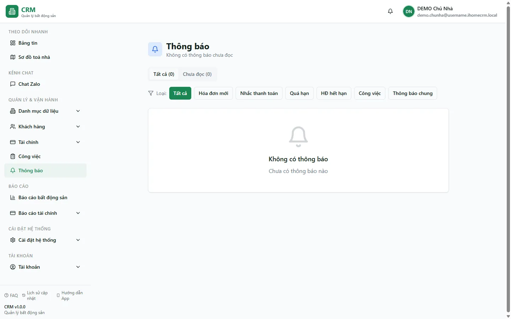

# Thông báo

Trang **Thông báo** gom mọi nhắc nhở hệ thống sinh tự động — hợp đồng sắp hết hạn, hoá đơn tới hạn / quá hạn, hợp đồng còn thiếu cọc, thưởng khi hoàn thành việc — vào một hàng đợi để bạn xem, đánh dấu đã đọc và xoá. Dùng trang này mỗi ngày để không bỏ lỡ việc cần xử lý, hoặc bấm chuông ở góc trên màn hình để liếc nhanh 10 thông báo mới nhất.

::: info Điều kiện tiên quyết
- Quyền **Thông báo** (xem) — nhân viên cần được cấp module quyền này để thấy thông báo của chủ nhà.
- Có sẵn dữ liệu đang vận hành để hệ thống có cái mà nhắc: hợp đồng đang hiệu lực, hoá đơn đã duyệt, hoặc hợp đồng còn thiếu cọc.
- Thông báo nhắc chỉ được sinh khi **chính tài khoản chủ nhà** mở app (Bảng tin / Dashboard) và tự làm mới mỗi 6 giờ. Nhân viên mở app không tự sinh thông báo cho chủ.
- Muốn nhận thông báo đẩy lên **thanh trạng thái điện thoại / máy tính**: cấp quyền thông báo cho trình duyệt khi được hỏi (trên iPhone phải "Thêm vào màn hình chính" trước).
:::

## Hướng dẫn từng bước

**Bước 1**: Tại thanh điều hướng, mở **Theo dõi nhanh** => **Thông báo** (hoặc bấm biểu tượng **chuông** ở góc trên rồi chọn **Xem tất cả**). Màn hình hiện danh sách thông báo, mới nhất ở trên, mỗi dòng có nhãn loại, tiêu đề và nội dung.

**Bước 2**: Tại đầu trang, chọn tab **Tất cả** hoặc **Chưa đọc** để thu hẹp danh sách, rồi ấn các nút lọc theo loại (**Hóa đơn mới**, **Nhắc thanh toán**, **Quá hạn**, **HĐ hết hạn**, **Công việc**, **Thông báo chung**). Danh sách chỉ còn các thông báo khớp bộ lọc bạn chọn.

**Bước 3**: Ấn vào một thông báo. Hệ thống tự đánh dấu nó là **đã đọc** (dòng nhạt đi) rồi mở thẳng thực thể liên quan — hoá đơn hoặc hợp đồng gắn với thông báo đó — để bạn xử lý ngay.

**Bước 4**: Muốn dọn sạch dấu chưa đọc, ấn **Đánh dấu đã đọc**. Mọi thông báo chưa đọc chuyển sang đã đọc và con số đỏ trên chuông về 0.

**Bước 5**: Ấn nút **X** trên một dòng để xoá riêng thông báo đó, hoặc ấn **Xóa đã đọc** để dọn toàn bộ các thông báo đã xem xong.

::: warning Xoá là vĩnh viễn
Thông báo bị xoá không khôi phục lại được. Với thông báo nhắc (hết hạn, quá hạn, thiếu cọc), nếu điều kiện vẫn còn thì hệ thống sẽ sinh lại ở chu kỳ quét sau — nhưng thông báo thưởng việc thì chỉ đến một lần, cân nhắc trước khi **Xóa đã đọc** hàng loạt.
:::

::: tip Bật đẩy thông báo lên điện thoại
Hệ thống có kênh **Web Push**: đẩy thông báo lên thanh trạng thái ngay cả khi bạn không mở tab app. Khi trình duyệt hỏi "Cho phép thông báo?", chọn **Cho phép**. Hiện có hai nguồn đẩy đang chạy thật: **thưởng khi hoàn thành việc** và **tin nhắn Zalo mới**.
:::

## Các tính năng khác trên màn hình

| Nút / Bộ lọc | Công dụng |
|---|---|
| Biểu tượng **chuông** (góc trên) | Badge đỏ hiện số thông báo chưa đọc; ấn để mở nhanh 10 thông báo gần nhất mà không rời trang đang xem. |
| **Xem tất cả** (trong dropdown chuông) | Chuyển sang trang Thông báo đầy đủ này. |
| Tab **Tất cả** / **Chưa đọc** | Lọc theo trạng thái đọc; **Chưa đọc** chỉ hiện thông báo còn dấu mới. |
| Nút lọc theo loại | Lọc theo nhóm nghiệp vụ (hoá đơn, nhắc thanh toán, quá hạn, hết hạn, công việc, chung). Thông báo **thiếu cọc** không có nút lọc riêng — xem ở tab **Tất cả** dưới badge **Khác**. |
| Nút **X** trên từng dòng | Xoá một thông báo. |
| **Đánh dấu đã đọc** | Chuyển mọi thông báo chưa đọc thành đã đọc cùng lúc. |
| **Xóa đã đọc** | Xoá toàn bộ thông báo đã đọc để làm gọn danh sách. |

## Tình huống & lỗi thường gặp

| Tình huống | Cách xử lý |
|---|---|
| Không thấy thông báo nhắc nào dù có hợp đồng / hoá đơn sắp tới hạn | Thông báo nhắc chỉ sinh khi **tài khoản chủ nhà** mở app và lặp mỗi 6 giờ. Đăng nhập bằng tài khoản chủ và mở Bảng tin để kích hoạt bộ sinh nhắc. |
| Điện thoại không nhận thông báo đẩy | Bạn chưa cấp quyền thông báo cho trình duyệt. Vào cài đặt trình duyệt bật lại thông báo cho trang; trên iPhone phải "Thêm vào màn hình chính" rồi mở từ biểu tượng đó. |
| Lọc theo loại mà không thấy thông báo **thiếu cọc** | Thiếu cọc không có nút lọc riêng, nó nằm ở badge **Khác**. Chuyển về tab **Tất cả** để xem. |
| Ấn thông báo công việc nhưng không mở được trang chi tiết | Module công việc đang được hoàn thiện, một vài liên kết chi tiết tạm thời chưa mở trang. Thông báo hoá đơn và hợp đồng vẫn mở bình thường. |
| Số đỏ trên chuông không giảm sau khi xem | Chỉ khi bạn ấn vào thông báo (hoặc ấn **Đánh dấu đã đọc**) nó mới tính là đã đọc. Con số đỏ đếm theo số **chưa đọc**. |

## Thử trực tiếp trên sandbox

<SandboxTry account="demo.quanly" app-path="/notifications" app-label="Mở Thông báo" view-only>

Đăng nhập bằng `demo.quanly` và mở trang Thông báo. Bạn nên nhìn thấy:

- Danh sách các thông báo hệ thống với nhãn loại khác nhau (nhắc hết hạn, tới hạn hoá đơn, quá hạn, thiếu cọc ở badge **Khác**...).
- Chuyển giữa tab **Tất cả** / **Chưa đọc** và bấm các nút lọc theo loại để thấy danh sách thay đổi.
- Ấn một thông báo để nó tự chuyển sang **đã đọc**, rồi thử nút **X** để xoá một dòng và **Đánh dấu đã đọc** cho phần còn lại.

</SandboxTry>

## Quy trình liên quan

- [Bảng tin](/02-theo-doi-nhanh/bang-tin/) — nơi hệ thống chạy bộ sinh thông báo nhắc mỗi khi chủ nhà mở app.
- [Việc của tôi](/02-theo-doi-nhanh/viec-cua-toi/) — hoàn thành việc có thưởng sẽ bắn thông báo thưởng và đẩy lên điện thoại.
- [Thêm nhân viên & phân quyền](/01-bat-dau/them-nhan-vien/) — cấp quyền **Thông báo** để nhân viên thấy thông báo của chủ nhà.
