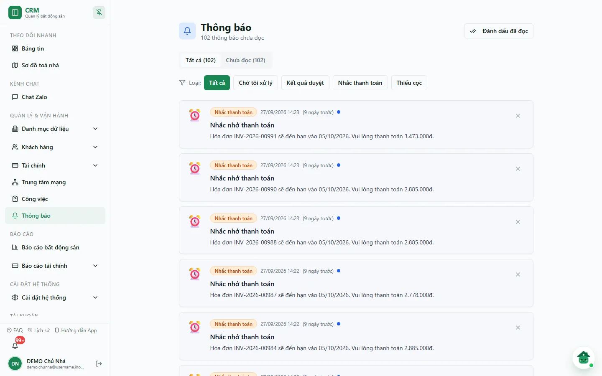

# Thông báo

Màn **Thông báo** gom mọi thông báo trong app gửi cho **chính bạn**: phiếu đang chờ bạn duyệt, kết quả duyệt phiếu của bạn, nhắc thanh toán, hoá đơn quá hạn, hợp đồng sắp hết hạn, thiếu cọc, thưởng/lương… Dùng màn này khi chuông báo có số chưa đọc và bạn muốn xem đầy đủ, lọc theo loại hoặc dọn các thông báo đã đọc. Mỗi người chỉ thấy hộp thư của mình — nhân viên không xem được thông báo của chủ nhà và ngược lại.

::: info Điều kiện tiên quyết
- Route `/notifications` yêu cầu đăng nhập và `notifications.view`. Trang lấy tối đa **200** thông báo trong app (kênh `IN_APP`) mới nhất của chính bạn; chuông và trang tự cập nhật theo thời gian thực.
- Đánh dấu đã đọc chỉ áp dụng cho thông báo của chính bạn. Xoá cần quyền/policy tương ứng (`notifications.delete`).
- Thông báo đẩy về máy (Web Push) cần trình duyệt hỗ trợ và bạn cho phép; trên iPhone thường phải thêm web app vào màn hình chính.
:::

## Hướng dẫn từng bước

**Bước 1**: Tại menu bên trái, mục **QUẢN LÝ & VẬN HÀNH**, ấn chọn **Thông báo** — hoặc ấn chuông ở chân menu rồi chọn **Xem tất cả thông báo**. Đầu trang ghi số thông báo chưa đọc; bên dưới là hai tab **Tất cả (n)** / **Chưa đọc (n)**, dãy chip **Loại** và danh sách thông báo.

**Bước 2**: Chọn tab **Tất cả** hoặc **Chưa đọc**, rồi chọn một chip loại. Chỉ chip của loại **đang có dữ liệu** mới hiện; khi loại đó phát sinh thông báo, chip tự hiện lại. Các chip hiện có: **Chờ tôi xử lý**, **Kết quả duyệt**, **Nhắc thanh toán**, **Quá hạn**, **HĐ hết hạn**, **Thiếu cọc**, **Thưởng/Lương**, **Hóa đơn mới**, **Công việc**, **Thông báo chung**, **Thông báo**.

**Bước 3**: Ấn một thông báo để đánh dấu đã đọc và mở màn liên quan. Đường dẫn trong thông báo được kiểm tra trước: nếu bạn không có quyền xem màn đích, hệ thống đưa bạn tới `/my-day` thay vì một trang bị chặn. Thông báo không có đường dẫn hợp lệ sẽ mở hoá đơn hoặc hợp đồng gắn kèm nếu có; không có gì để mở thì chỉ đánh dấu đã đọc.

**Bước 4**: Ấn **Đánh dấu đã đọc** (chỉ hiện khi còn thông báo chưa đọc) để chuyển toàn bộ thông báo chưa đọc của bạn sang đã đọc.

**Bước 5**: Ấn nút **X** trên một thông báo để xoá nó, hoặc **Xóa đã đọc** (chỉ hiện khi có thông báo đã đọc) để xoá hàng loạt các thông báo đã đọc. Xoá là vĩnh viễn và chỉ tác động thông báo của chính bạn.

::: tip Chọn loại thông báo muốn nhận
Vào **Tài khoản** => **Thông tin cá nhân**, khung **Thông báo tôi muốn nhận**: mỗi sự kiện (Phiếu chờ tôi duyệt, Phiếu của tôi được duyệt / bị từ chối, Việc được giao cho tôi, Bàn giao tiền mặt chờ tôi xác nhận, Chốt sổ quỹ…) có hai công tắc **Trong app** (chuông và trang này) và **Đẩy về máy**. Xem [Thông tin cá nhân](/06-tai-khoan/thong-tin-ca-nhan/).
:::

## Trên điện thoại

Trên điện thoại, cùng đường dẫn `/notifications` (biểu tượng chuông ở màn hình chính) mở bản tin dạng app: danh sách và chi tiết từng thông báo. Dữ liệu và quy tắc mở đích giống bản máy tính.

## Bộ sinh nhắc định kỳ

Các nhắc **Hợp đồng hết hạn**, **Nhắc thanh toán**, **Quá hạn** và **Thiếu cọc** được sinh khi người dùng mở **Bảng tin trên máy tính**: tối đa khoảng **một lần mỗi 20 giờ** cho mỗi tài khoản (ghi mốc trên trình duyệt), kèm lưới an toàn 6 giờ cho tab để mở qua ngày; từng loại nhắc còn tự chống trùng. Vì vậy không nên kỳ vọng cứ vài giờ lại có nhắc mới. Các thông báo "việc đến tay tôi" (phiếu chờ duyệt, kết quả duyệt, việc được giao…) thì do máy chủ tạo ngay khi sự kiện xảy ra.

## Tình huống & lỗi thường gặp

| Tình huống | Cách xử lý |
|---|---|
| Không thấy chip một loại thông báo | Loại đó đang không có dòng nào nên chip bị ẩn; về **Tất cả** và chờ dữ liệu phát sinh. Nếu chip đã chọn bị ẩn, trang tự đưa về **Tất cả**. |
| Ấn thông báo nhưng lại về `/my-day` | Bạn không có quyền xem màn đích; hệ thống chuyển về trang an toàn. |
| Ấn thông báo nhưng không chuyển trang | Đường dẫn trong thông báo không thuộc danh sách cho phép (hoặc là route cũ đã bỏ như `/issues/:id`) và thông báo không gắn hoá đơn/hợp đồng; thông báo vẫn được đánh dấu đã đọc. |
| Xoá bị từ chối | Kiểm tra quyền `notifications.delete` và policy dữ liệu; `notifications.view` không tự bao gồm quyền xoá. |
| Không thấy nhắc mới ngay | Bộ sinh nhắc chạy tối đa khoảng một lần/ngày/tài khoản khi mở Bảng tin máy tính và có chống trùng; kiểm tra điều kiện hợp đồng/hoá đơn thực tế. |
| Danh sách hiện khung "Chưa tải được…" | Truy vấn danh sách lỗi; bấm **Tải lại**. Trong lúc chưa có dữ liệu, số đếm và nút hàng loạt tạm ẩn. |
| Chuông không cập nhật | Kết nối thời gian thực có thể bị ngắt; tải lại trang. Web Push và chuông trong app là hai kênh khác nhau. |

## Thử trực tiếp trên sandbox

<SandboxTry account="demo.quanly" app-path="/notifications" app-label="Mở Thông báo" view-only>

Quan sát danh sách của chính `demo.quanly`, chuyển giữa **Tất cả**/**Chưa đọc** và các chip đang có dữ liệu. Không bấm **Đánh dấu đã đọc**, **Xóa đã đọc** hay nút **X** vì sandbox dùng chung.

</SandboxTry>

## Quy trình liên quan

- [Bảng tin](/02-theo-doi-nhanh/bang-tin/)
- [Việc của tôi](/02-theo-doi-nhanh/viec-cua-toi/)
- [Chờ duyệt](/03-quan-ly-van-hanh/cho-duyet/)
- [Thông tin cá nhân](/06-tai-khoan/thong-tin-ca-nhan/)
- [Thêm nhân viên & phân quyền](/01-bat-dau/them-nhan-vien/)
