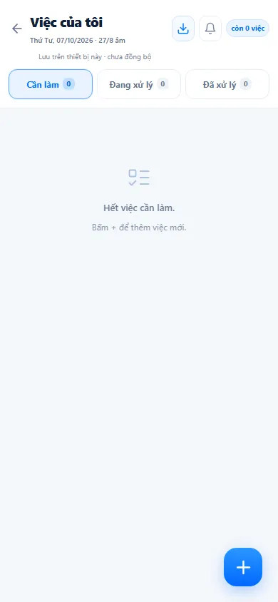
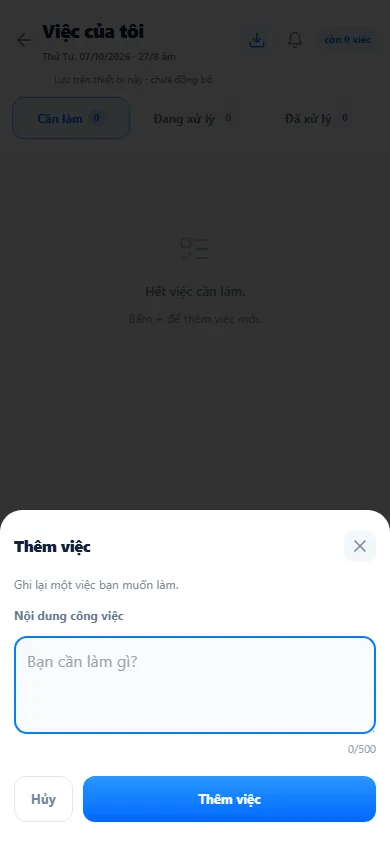
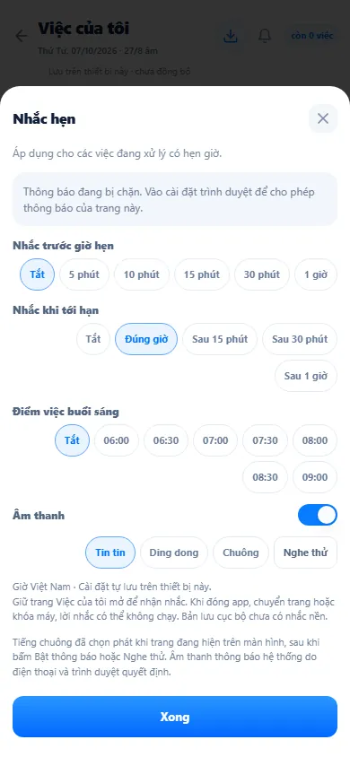

# Việc của tôi (việc cá nhân)

**Việc của tôi** là sổ ghi việc cá nhân trên điện thoại: ghi nhanh một việc cần làm, hẹn giờ hoàn thành, gạt sang **xong** khi làm xong và nhận chuông nhắc khi tới hạn. Dữ liệu **chỉ lưu trên thiết bị đang dùng**, theo từng tài khoản, và **không đồng bộ** lên hệ thống — nó không liên quan tới công việc vận hành được giao ở [Công việc](/03-quan-ly-van-hanh/cong-viec/) hay ngày công ở [Hôm nay](/02-theo-doi-nhanh/viec-cua-toi/).

::: info Điều kiện tiên quyết
- Đã đăng nhập. Route `/viec-cua-toi` không cần quyền riêng; mở bằng ô **Việc của tôi** trên màn hình chính điện thoại (nhóm **Vận hành**). Trên máy tính, menu không có mục này.
- Việc được lưu trong bộ nhớ trình duyệt của thiết bị. Đổi điện thoại, đổi trình duyệt hoặc xoá dữ liệu trang web là **mất danh sách** — dùng nút tải bản sao nếu cần giữ.
:::

## Hướng dẫn từng bước

**Bước 1**: Tại màn hình chính điện thoại, ấn ô **Việc của tôi**. Đầu trang có tiêu đề **Việc của tôi**, thứ – ngày dương lịch kèm ngày âm lịch, nút tải bản sao, nút chuông **Cài đặt nhắc hẹn**, nhãn **còn n việc** và dòng *Lưu trên thiết bị này · chưa đồng bộ*. Ba tab **Cần làm**, **Đang xử lý**, **Đã xử lý** kèm số đếm.

**Bước 2**: Ấn nút **+** ở góc dưới để mở **Thêm việc**, gõ **Nội dung công việc** (tối đa 500 ký tự) rồi ấn **Thêm việc**. Việc mới nằm ở tab **Cần làm**, gom theo ngày.

**Bước 3**: Thao tác trên từng dòng việc (gợi ý hiện ngay trên danh sách: *← hẹn giờ · xong → · giữ để xóa*):
- **Vuốt sang trái** hoặc nút **Hẹn giờ**: mở **Hẹn hoàn thành** — chọn ngày trên lịch và **Giờ hoàn thành**. Việc đã hẹn chuyển sang tab **Đang xử lý**, sắp theo giờ hẹn; quá giờ thì hiện **Quá hạn**. Trong bảng hẹn có **Xóa hẹn** để trả về Cần làm.
- **Vuốt sang phải** hoặc **Đánh dấu xong**: việc chuyển sang **Đã xử lý** (việc xong trong ngày vẫn hiện trong nhóm ngày ở Cần làm, kèm số "n xong", để bạn đối chiếu).
- **Giữ lâu** một dòng: hỏi **Xóa công việc này?** — ấn **Xóa việc** để xoá khỏi thiết bị.
- Ở tab **Đang xử lý**, nút **Trả lại Cần làm** bỏ hẹn giờ.

**Bước 4**: Ấn nút chuông để mở **Nhắc hẹn**: chọn **Nhắc trước giờ hẹn** (Tắt, 5 phút … 1 giờ), **Nhắc khi tới hạn** (Tắt, Đúng giờ, Sau 15 phút…), **Điểm việc buổi sáng** (Tắt hoặc một mốc giờ) và **Âm thanh** (Tin tin, Ding dong, Chuông, **Nghe thử**), rồi ấn **Xong**.

::: warning Nhắc hẹn chỉ chạy khi trang đang mở
Cài đặt nhắc hẹn lưu trên thiết bị, theo giờ Việt Nam. Phải **giữ trang Việc của tôi mở** để nhận nhắc; đóng app, chuyển trang hoặc khoá máy thì lời nhắc có thể không chạy — đây không phải nhắc nền. Nếu bảng báo *Thông báo đang bị chặn*, vào cài đặt trình duyệt để cho phép thông báo của trang.
:::

## Các tính năng khác trên màn hình

| Nút | Công dụng |
|---|---|
| Nút mũi tên trái | Về màn hình chính. |
| Nút tải xuống | Tải bản sao danh sách việc dạng tệp JSON (`viec-cua-toi-<ngày>.json`) để tự lưu giữ. |
| Nút chuông | Mở **Nhắc hẹn**; chuông đổi màu khi đã bật nhắc và được phép thông báo. |
| **còn n việc** | Tổng việc ở Cần làm + Đang xử lý. |

## Tình huống & lỗi thường gặp

| Tình huống | Cách xử lý |
|---|---|
| Mở trên máy khác không thấy việc đã ghi | Đúng thiết kế: việc chỉ lưu trên thiết bị đã ghi, không đồng bộ. |
| Đăng nhập tài khoản khác trên cùng máy | Mỗi tài khoản có danh sách riêng trên thiết bị đó. |
| Không nghe nhắc khi tới giờ | Kiểm tra trang còn mở, âm thanh đã bật và trình duyệt cho phép thông báo. |
| Báo lỗi đọc dữ liệu kèm nút **Thử lại** | Dữ liệu trên máy không đọc được; hệ thống **không** ghi đè bằng danh sách rỗng. Ấn **Thử lại**; nếu vẫn lỗi, báo hỗ trợ trước khi xoá dữ liệu trình duyệt. |
| Muốn giao việc cho nhân viên khác | Dùng [Công việc](/03-quan-ly-van-hanh/cong-viec/); Việc của tôi chỉ là sổ cá nhân. |

## Thử trực tiếp trên sandbox

<SandboxTry account="demo.chunha" app-path="/viec-cua-toi" app-label="Mở Việc của tôi" view-only>

Mở ở khổ điện thoại, ấn **+** để xem bảng **Thêm việc** rồi **Hủy**; ấn nút chuông để xem **Nhắc hẹn** rồi đóng. Việc bạn thêm (nếu có) chỉ nằm trên trình duyệt của bạn, không ảnh hưởng dữ liệu DEMO dùng chung.

</SandboxTry>

## Quy trình liên quan

- [Hôm nay — ngày công & việc trong ngày](/02-theo-doi-nhanh/viec-cua-toi/)
- [Công việc & sự cố](/03-quan-ly-van-hanh/cong-viec/)
- [Làm quen giao diện](/01-bat-dau/lam-quen-giao-dien/)
