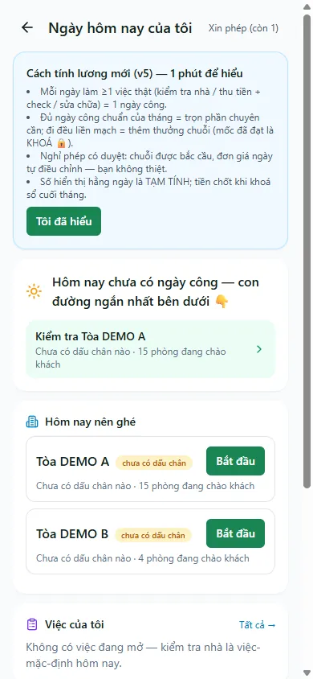

# Việc của tôi

Đây là màn hình trung tâm của nhân viên trên điện thoại: gom việc cần làm trong ngày, chốt **ngày công** bằng một lần check-in kiểm tra nhà, và cho bạn nhìn dấu chân chấm công tích luỹ trong tháng. Mở đầu ca làm để biết hôm nay nên ghé toà nào, cuối ngày mở lại để chắc chắn đã có ngày công.

Trang tối ưu cho khổ điện thoại (một cột). Mọi số tiền hiển thị là **TẠM TÍNH** — chốt khi khoá sổ cuối tháng.

::: info Điều kiện tiên quyết
- Route `/my-day` chỉ yêu cầu đăng nhập, không có route capability riêng; dữ liệu vẫn bị giới hạn theo chính user và các toà được giao.
- Điện thoại cho phép truy cập **camera** và **vị trí (GPS)** — cần khi check-in kiểm tra nhà.
- Toà nhà cần toạ độ để server xác nhận ảnh trong bán kính. Ít nhất một ảnh có vị trí hợp lệ là điều kiện chốt ngày công; nếu GPS/thiết bị lỗi, dùng luồng báo chủ duyệt thủ công.
:::

## Hướng dẫn từng bước

**Bước 1**: Tại trang chủ, ấn chọn **Theo dõi nhanh** => **Việc của tôi**. Đầu trang hiện tiêu đề **Ngày hôm nay của tôi** và nút **Xin phép** ở góc phải.

**Bước 2**: Nhìn khối trạng thái trên cùng. Nếu ghi **Hôm nay chưa có ngày công — con đường ngắn nhất bên dưới** nghĩa là bạn chưa chốt ngày công; nếu thẻ chuyển xanh **Hôm nay đã có ngày công** thì hôm nay đã xong.

**Bước 3**: Kéo tới mục **Hôm nay nên ghé**. Đây là các toà hệ thống gợi ý ưu tiên (kèm nhãn số ngày chưa có dấu chân). Ấn nút **Bắt đầu** ở toà bạn định đi để mở phiên **Kiểm tra nhà**.

**Bước 4**: Trong phiên kiểm tra, chụp từng mục bằng **camera trực tiếp**. Phiên FULL cần đủ checklist/ảnh, đủ thời gian tại toà và ít nhất một ảnh có GPS trong bán kính cấu hình. Ảnh ngoài bán kính hoặc không có GPS vẫn được lưu nhưng chưa đủ để chốt ngày công.

**Bước 5**: Xem mục **Việc của tôi** — danh sách việc đang làm được giao cho bạn. Ấn một dòng, hoặc ấn **Tất cả →** để mở trang **Công việc** đầy đủ.

**Bước 6**: Kéo xuống mục **Chuyên cần tháng này** để theo dõi dấu chân chấm công: thanh tiến trình số ngày công, **Chuỗi** ngày đi đều, và các mốc đã **KHOÁ 🔒**. Các con số ở đây là **TẠM TÍNH**.

::: tip Con đường ngắn nhất để có ngày công
Không cần chờ có việc được giao: **kiểm tra nhà là việc-mặc-định**. Chỉ cần một phiên kiểm tra đạt chuẩn ở một toà bạn phụ trách là đã đủ một ngày công cho hôm nay.
:::

::: warning Ảnh check-in phải chụp tại chỗ
Ảnh chỉ nhận khi **chụp trực tiếp qua camera**. Không thể chọn ảnh cũ trong thư viện, và ảnh đã nộp trong ngày không dùng lại được cho phiên khác. Server yêu cầu **ít nhất một ảnh trong bán kính toà**; ảnh ngoài phạm vi chỉ cảnh báo ngay lúc chụp nhưng khi bấm Hoàn tất, phiên sẽ ở trạng thái ghi nhận có mặt/chưa đạt cho tới khi bổ sung ảnh hợp lệ hoặc được duyệt sự cố thiết bị.
:::

## Các tính năng khác trên màn hình

| Nút / Bộ lọc | Công dụng |
|---|---|
| **Xin phép** (góc phải, kèm số còn lại) | Mở ô xin **nghỉ phép có lương** 1 chạm: chọn ngày rồi ấn **Gửi**. Ngày phép là ngày trung tính — chuỗi được bắc cầu, bạn không thiệt |
| **Kiểm tra <toà>** (trong khối trạng thái) | Lối tắt mở luôn phiên kiểm tra nhà cho toà được gợi ý đầu tiên |
| **check nhanh 3–5 phút** (khối *Check nhà sau khi thu tiền*) | Mở phiên **Check nhanh** sau khi vừa thu tiền tại toà — nhẹ hơn kiểm tra đầy đủ, cũng chốt ngày công |
| **Tất cả →** | Mở trang **Công việc** để xem và thao tác toàn bộ việc được giao |
| **Tôi đã hiểu** | Xác nhận đã đọc bảng tóm tắt cách tính lương mới (hiện một lần khi hệ lương mới bật) |
| Mục **Chuỗi ... ngày** | Xem chuỗi ngày công liên tiếp và số ngày còn lại tới mốc thưởng kế tiếp |

## Tình huống & lỗi thường gặp

| Tình huống | Cách xử lý |
|---|---|
| Vẫn báo *Hôm nay chưa có ngày công* dù đã đi làm | Ngày công chỉ chốt khi **hoàn tất một phiên kiểm tra đạt chuẩn** (đủ ảnh + đủ thời gian tại toà) hoặc hoàn thành một việc có ảnh. Mở **Hôm nay nên ghé** và ấn **Bắt đầu** |
| Chụp xong nhưng ảnh không được nhận | Ảnh phải **chụp trực tiếp** qua camera trong phiên, không lấy từ thư viện; ảnh đã nộp trong ngày không nhận lại |
| Hiện *Đã ghi nhận có mặt tại toà* nhưng chưa đủ | Bạn mới có mặt chứ chưa đủ mục. **Bổ sung mục ảnh còn thiếu trước 23:59** cùng ngày để chốt ngày công |
| Cảnh báo khoảng cách / chip đỏ khi chụp | Ảnh đó chưa tính là bằng chứng tại toà. Chụp thêm ít nhất một ảnh có GPS hợp lệ; nếu thiết bị lỗi, dùng **GPS trục trặc — báo chủ duyệt**. |
| GPS/thiết bị hỏng không chụp được | Trong phiên kiểm tra, chọn **báo sự cố thiết bị** để chủ duyệt tay ngày công cho bạn |
| Danh sách toà hoặc việc trống | Bạn chưa được phân công toà, hoặc các toà đều mới được ghé gần đây. Nếu cần thêm việc, hỏi quản lý để được phân công |
| Số tiền thay đổi mỗi ngày | Mọi con số trên trang là **TẠM TÍNH**; tiền thật chốt khi khoá sổ cuối tháng |

## Thử trực tiếp trên sandbox

<SandboxTry account="demo.kythuat" app-path="/my-day" app-label="Mở Việc của tôi" view-only>

Mở trên điện thoại (hoặc thu nhỏ cửa sổ trình duyệt về khổ điện thoại), rồi:

- Hãy nhìn thấy khối trạng thái ngày ở trên cùng (*chưa có ngày công* hoặc *đã có ngày công*).
- Hãy nhìn thấy mục **Hôm nay nên ghé** liệt kê các toà gợi ý và mục **Việc của tôi** liệt kê việc đang làm.
- Hãy nhìn thấy thanh **Chuyên cần tháng này** và **Chuỗi ... ngày** ở cuối trang.

</SandboxTry>

## Quy trình liên quan

- [Bảng tin](/02-theo-doi-nhanh/bang-tin/)
- [Sơ đồ toà nhà](/02-theo-doi-nhanh/so-do-toa-nha/)
- [Thông báo](/02-theo-doi-nhanh/thong-bao/)
