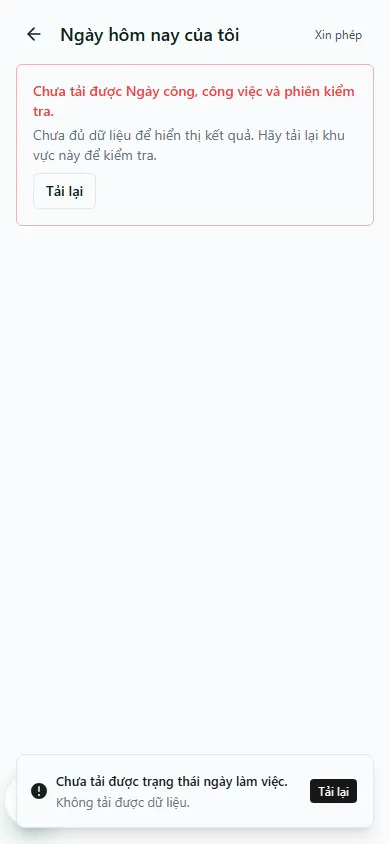

# Hôm nay — ngày công & việc trong ngày

Đây là màn hình trung tâm của nhân viên trên điện thoại, tiêu đề **Ngày hôm nay của tôi**: gom việc cần làm trong ngày, chốt **ngày công** bằng một phiên kiểm tra nhà đạt chuẩn, gợi ý toà nên ghé và cho bạn theo dõi chuyên cần tích luỹ trong tháng. Mở đầu ca để biết hôm nay nên ghé toà nào, cuối ngày mở lại để chắc chắn đã có ngày công.

Trên màn hình chính điện thoại, màn này là ô **Hôm nay** (nhóm **Vận hành**). Ô **Việc của tôi** đứng cạnh là danh sách việc cá nhân lưu trên máy — xem [Việc của tôi (việc cá nhân)](/02-theo-doi-nhanh/viec-ca-nhan/). Trên máy tính, menu không có mục cho màn này; mở thẳng `/my-day`. Mọi số tiền hiển thị là **TẠM TÍNH** — chốt khi khoá sổ cuối tháng.

::: info Điều kiện tiên quyết
- Route `/my-day` chỉ yêu cầu đăng nhập, không có route capability riêng; dữ liệu vẫn giới hạn theo chính bạn và các toà được giao.
- Tài khoản đã được đưa vào chế độ chấm ngày công/lương mới (v5). Tài khoản chưa có thì màn báo lỗi tải — xem mục *Tình huống* bên dưới.
- Điện thoại cho phép **camera** và **vị trí (GPS)** — cần khi kiểm tra nhà. Toà cần có toạ độ để máy chủ xác nhận ảnh trong bán kính.
:::

## Hướng dẫn từng bước

**Bước 1**: Tại màn hình chính điện thoại, ấn ô **Hôm nay**. Đầu trang có nút quay lại, tiêu đề **Ngày hôm nay của tôi** và nút **Xin phép (còn n)** ở góc phải. Lần đầu khi chế độ lương mới bật, trang hiện khung **Cách tính lương mới (v5) — 1 phút để hiểu**; đọc rồi ấn **Tôi đã hiểu**.

**Bước 2**: Đọc khối trạng thái trên cùng:
- **Hôm nay chưa có ngày công — con đường ngắn nhất bên dưới 👇** kèm lối tắt **Kiểm tra <toà>** tới toà được gợi ý đầu tiên;
- **Hôm nay đã có ngày công ✅ (nguồn)** kèm số tiền ngày TẠM TÍNH và chuỗi ngày;
- ngày nghỉ phép, đơn nghỉ đang chờ duyệt, hoặc Chủ nhật (ngày nghỉ của bạn) có câu riêng.

Nếu bạn đang có phiên kiểm tra làm dở, khung **Đang kiểm tra dở — bấm để làm tiếp (lưu tới 23:59)** hiện ngay dưới; nếu vừa thu tiền tại toà, khung **Check nhà sau khi thu tiền — để chốt ngày công** đưa lối **check nhanh 3–5 phút**.

**Bước 3**: Kéo tới **Hôm nay nên ghé**. Các toà được chia nhóm **Đến nhịp kiểm tra FULL** (ưu tiên ghé trước), **Nên ghé hôm nay**, **Sắp đến nhịp** và **Đã ghé hôm nay**; mỗi dòng ghi số ngày từ lần FULL/lần ghé gần nhất. Ấn **Bắt đầu** ở toà bạn định đi để mở phiên **Kiểm tra nhà**.

**Bước 4** *(tuỳ chọn)*: Ấn **Xếp tuyến** để mở **Xếp tuyến hôm nay**: kéo-thả hoặc dùng nút mũi tên đổi thứ tự, **Tối ưu từ vị trí này** (gần nhất + giữ ưu tiên, cần cho phép vị trí), và **Mở Google Maps theo chặng** (tối đa 4 toà/chặng). Toà thiếu GPS được giữ cuối nhóm và mở riêng. Tuyến được lưu trên tài khoản của bạn.

**Bước 5**: Trong phiên kiểm tra, chụp từng mục bằng camera trong app. Thời gian có mặt tại toà được tính theo giờ thật; cần ít nhất **một ảnh có vị trí trong bán kính toà**. Thiếu ảnh có vị trí, phiên báo **Còn thiếu 1 ảnh có vị trí tại toà** — ra chỗ thoáng chụp thêm một tấm. Ấn **Hoàn tất** khi xong; nếu chưa đủ mục, hệ thống ghi nhận *có mặt* và bạn bổ sung được tới **23:59** cùng ngày (tắt app cũng không mất phiên).

**Bước 6**: Xem khối **Việc của tôi** — các công việc **đang làm** được giao cho bạn. Ấn một dòng, hoặc **Tất cả →** để mở trang [Công việc](/03-quan-ly-van-hanh/cong-viec/).

**Bước 7**: Kéo xuống **Chuyên cần tháng này**: số tiền đã tích / ngân sách tháng, **Chuỗi n ngày** và số ngày tới mốc kế tiếp, số khiên (miễn phí · tháng-hoàn-hảo · điểm Chủ nhật) và các mốc đã **KHOÁ 🔒**. Tất cả là **TẠM TÍNH**.

::: tip Con đường ngắn nhất để có ngày công
Không cần chờ được giao việc: **kiểm tra nhà là việc mặc định**. Mỗi ngày làm ít nhất một việc thật (kiểm tra nhà / thu tiền kèm check nhà / sửa chữa) là có một ngày công.
:::

::: warning GPS/thiết bị trục trặc
Nếu điện thoại không bắt được vị trí dù đã ra chỗ thoáng, trong phiên kiểm tra ấn nút **GPS/máy trục trặc** (biểu tượng khiên cạnh **Hoàn tất**). Báo cáo được gửi đi và ngày công **chờ người có quyền xem xét** — chưa phải đã được tính.
:::

## Các tính năng khác trên màn hình

| Nút / Khối | Công dụng |
|---|---|
| **Xin phép (còn n)** | Mở ô **Xin phép có lương (1 chạm)**: chọn ngày rồi ấn **Gửi**. Ngày phép được duyệt là ngày trung tính — chuỗi được bắc cầu. |
| **Kiểm tra <toà>** | Lối tắt mở phiên kiểm tra nhà cho toà được gợi ý đầu tiên. |
| **check nhanh 3–5 phút** | Phiên **check nhanh** sau khi vừa thu tiền tại toà — nhẹ hơn kiểm tra đầy đủ. |
| **Xếp tuyến** | Sắp thứ tự ghé các toà, tối ưu theo vị trí và mở Google Maps theo chặng. |
| **Tất cả →** | Mở trang **Công việc** để xem toàn bộ việc được giao. |
| **Tôi đã hiểu** | Xác nhận đã đọc tóm tắt cách tính lương mới (hiện một lần). |

## Tình huống & lỗi thường gặp

| Tình huống | Cách xử lý |
|---|---|
| Màn chỉ hiện khung **Chưa tải được Ngày công, công việc và phiên kiểm tra** | Bấm **Tải lại**. Nếu vẫn lỗi, tài khoản có thể chưa được đưa vào chế độ chấm ngày công (máy chủ trả về chưa có giai đoạn/ngân sách) — báo quản lý kiểm tra. |
| Vẫn báo *Hôm nay chưa có ngày công* dù đã đi làm | Ngày công chỉ chốt khi hoàn tất một phiên kiểm tra đạt chuẩn hoặc hoàn thành một việc thật. Mở **Hôm nay nên ghé** và ấn **Bắt đầu**. |
| Đã hoàn tất nhưng chỉ *ghi nhận có mặt* | Phiên còn thiếu mục; bổ sung trước 23:59 cùng ngày từ khung **Đang kiểm tra dở**. |
| Báo thiếu ảnh có vị trí | Ảnh chưa bắt được GPS (thường khi đứng trong nhà/hầm). Chụp thêm một ảnh ở chỗ thoáng; thiết bị hỏng thì dùng **GPS/máy trục trặc**. |
| **Hôm nay nên ghé** trống | Bạn chưa được giao toà, hoặc các toà đều mới được ghé gần đây. Chủ nhật danh sách tạm thu gọn. |
| Số tiền thay đổi mỗi ngày | Mọi con số là **TẠM TÍNH**; tiền thật chốt khi khoá sổ cuối tháng. |

::: info Ảnh chụp ngày 07/10/2026
Các tài khoản DEMO (`demo.chunha`, `demo.quanly`) hiện chưa được đưa vào chế độ chấm ngày công nên màn này chỉ hiện khung lỗi như trên; vì vậy trang chưa có ảnh trạng thái bình thường. Nội dung các bước được đối chiếu với mã nguồn bản đang chạy.
:::

## Thử trực tiếp trên sandbox

<SandboxTry account="demo.quanly" app-path="/my-day" app-label="Mở Hôm nay" view-only>

Mở trên điện thoại (hoặc thu nhỏ trình duyệt về khổ điện thoại). Với tài khoản DEMO hiện tại, bạn sẽ thấy khung **Chưa tải được…** và nút **Tải lại** — đó là tình huống "tài khoản chưa vào chế độ chấm ngày công" mô tả ở trên. Không bấm **Xin phép**, **Bắt đầu** hay **Hoàn tất**.

</SandboxTry>

## Quy trình liên quan

- [Việc của tôi (việc cá nhân)](/02-theo-doi-nhanh/viec-ca-nhan/)
- [Công việc & sự cố](/03-quan-ly-van-hanh/cong-viec/)
- [Lương của tôi](/03-quan-ly-van-hanh/luong-cua-toi/)
- [Bảng tin](/02-theo-doi-nhanh/bang-tin/)
- [Thông báo](/02-theo-doi-nhanh/thong-bao/)
