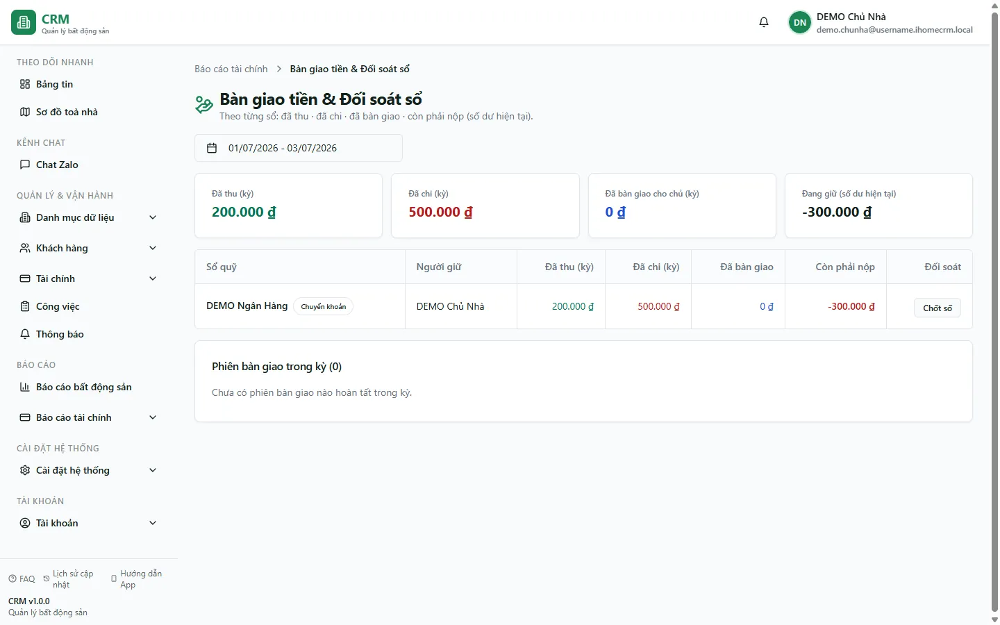

# Bàn giao tiền & đối soát chốt sổ

Màn **Bàn giao & đối soát** giúp bạn — chủ nhà hoặc kế toán — nhìn từng **sổ quỹ** để biết trong một khoảng thời gian đã thu bao nhiêu, chi bao nhiêu, đã bàn giao cho chủ bao nhiêu và **còn phải nộp** bao nhiêu. Con số **Còn phải nộp** chính là **số dư hiện tại của sổ thu** — tức là tiền đã thu nhưng chưa bàn giao lên. Ngoài ra bạn còn **chốt số (đối soát)** từng sổ tại một ngày cụ thể để đối chiếu số hệ thống với số đếm thực. Việc bàn giao tiền diễn ra 2 phía (người giao chọn phiếu, người nhận đếm và xác nhận); màn này là nơi **theo dõi và chốt sổ**, không phải nơi bấm bàn giao.

::: info Điều kiện tiên quyết
- Quyền **Báo cáo tài chính => Xem** (module `reports_finance`, action `view`) để mở màn báo cáo.
- Quyền **Báo cáo tài chính => Chốt số** (`reports_finance.reconcile`) mới thấy và bấm được nút **Chốt số** trên từng sổ.
- Đã có ít nhất một **sổ quỹ** và các **phiếu thu/chi** trong kỳ; muốn thấy dòng "đã bàn giao" thì phải có **phiên bàn giao** đã xác nhận (tạo ở màn [Thu tiền mặt](/03-quan-ly-van-hanh/thu-tien-mobile/)).
- Chỉ **chủ sổ** hoặc **super admin** mới tự chốt số một mình; đồng đội không phải chủ sổ thì chỉ **đề xuất** rồi chờ chủ sổ xác nhận.
:::

## Hướng dẫn từng bước

**Bước 1**: Vào menu **Báo cáo** => nhóm **Tài chính** => **Bàn giao & đối soát**. Màn mở ra với **bộ chọn khoảng thời gian** ở đầu trang và danh sách **từng sổ quỹ** bên dưới. Mỗi thẻ sổ cho biết Thu thực / Chi thực trong kỳ, Đã bàn giao cho chủ, và ô nổi bật **Còn phải nộp**.

**Bước 2**: Chọn **khoảng thời gian** cần soi (từ ngày — đến ngày). Báo cáo tính lại Thu thực và Chi thực của mỗi sổ trong đúng khoảng này. Lưu ý: các con số **Thu thực / Chi thực đã loại bỏ phiếu chuyển bàn giao** (cặp phiếu CHI/THU nội bộ sinh ra khi xác nhận bàn giao), nên doanh thu không bị đếm hai lần.

**Bước 3**: Đọc ô **Còn phải nộp** của mỗi sổ — đây là **số dư hiện tại của sổ**, tức tiền đã thu nhưng chưa bàn giao lên chủ. Với sổ thu tiền mặt của người đi thu, con số này cho bạn biết **họ đang cầm bao nhiêu tiền cần nộp**. Khi tiền được bàn giao và người nhận xác nhận, số dư sổ nguồn về gần 0 và **Còn phải nộp** giảm tương ứng.

::: tip Các con số đã "sạch" sẵn, đừng cộng trừ tay
- **Tiền thối** trả lại khách đã được **net (trừ sẵn) trong tổng thu** — sổ "Thối" chỉ là ledger ghi nhận, không trừ tiền thật lần nữa. Nên **Còn phải nộp** đã là số ròng.
- **Làm tròn tiền thiếu** (khoản thiếu **dưới 10.000đ** được "tha" để hoá đơn vẫn Đã thu) chỉ ghi vào sổ "Làm tròn tiền thiếu", không phồng số dư sổ thu.
- **Tiền cọc** khách nộp vẫn nằm trong số dư sổ thật (nên **có mặt trong Còn phải nộp**), dù phần cọc `is_deposit` không tính vào kết quả kinh doanh (KQKD). "Còn phải nộp" là tiền mặt phải nộp, khác với doanh thu.
:::

**Bước 4**: Mở phần **danh sách phiên bàn giao trong kỳ** của một sổ để đối chiếu. Mỗi phiên hiện số **thực nộp = tiền thu − tiền chi** của đợt đó (một phiên có thể gộp cả phiếu thu lẫn phiếu chi mà quản lý phát sinh, nên tiền thực cầm là **số ròng**). Đây là bằng chứng cho phần "Đã bàn giao" ở thẻ sổ.

**Bước 5**: Đối chiếu và **chốt số** một sổ tại một ngày — bấm **Chốt số** trên thẻ sổ (cần quyền `reports_finance.reconcile`). Hệ thống hiển thị **số dư hệ thống tính đến ngày `as-of`** (chỉ cộng các phiếu có ngày chứng từ **nhỏ hơn hoặc bằng** ngày bạn chọn — **không phải** số dư của hôm nay). Bạn nhập **số đếm thực** (số tiền/số dư thực tế đối chiếu được); hệ thống tính **chênh lệch = đếm thực − hệ thống**. Xác nhận để chốt.

::: danger Chốt số ảnh hưởng con số as-of và phải đúng người
- Bản chốt số ghi lại **số dư hệ thống tại ngày `as-of`** làm mốc đối soát — chọn **sai ngày** sẽ so với sai số dư. Với sổ chuyển khoản của chủ, "chốt số" là **đối soát**, hệ thống **không dịch chuyển tiền** giữa các sổ.
- **Đồng đội không phải chủ sổ KHÔNG tự chốt hộ**: nếu bạn không phải chủ sổ (và không phải super admin), thao tác của bạn chỉ là **đề xuất chốt số** và **bắt buộc chờ chủ sổ xác nhận** mới có hiệu lực. Chỉ chủ sổ hoặc super admin mới chốt một mình.
:::

::: warning Huỷ một bản chốt số / phiên bàn giao cần cả hai phía
Giống như bàn giao tiền, việc huỷ một phiên bàn giao đã xác nhận cần **một bên yêu cầu và bên kia xác nhận** — không tự đảo một mình. Hãy đối chiếu kỹ trước khi xác nhận để tránh phải hoàn tác.
:::

## Các tính năng khác trên màn hình

| Nút / Bộ lọc | Công dụng |
| --- | --- |
| Bộ chọn **khoảng thời gian** | Chọn từ ngày — đến ngày; báo cáo tính lại Thu thực / Chi thực của mọi sổ trong kỳ. |
| Thẻ **từng sổ quỹ** | Hiện Thu thực / Chi thực trong kỳ, Đã bàn giao cho chủ, và ô **Còn phải nộp** (= số dư hiện tại của sổ). |
| **Còn phải nộp** | Tiền đã thu chưa bàn giao lên chủ — số ròng, đã trừ tiền thối và không gồm làm tròn. |
| Danh sách **phiên bàn giao trong kỳ** | Từng đợt bàn giao với số **thực nộp = thu − chi**; bằng chứng cho phần Đã bàn giao. |
| **Lần chốt số gần nhất** | Hiển thị mốc đối soát gần nhất của sổ (ngày `as-of`, số hệ thống, số đếm, chênh lệch). |
| **Chốt số** | Mở hộp đối soát: nhập số đếm thực, so với số dư hệ thống tại ngày `as-of` (cần quyền `reports_finance.reconcile`). |

Báo cáo này là màn **theo dõi và chốt sổ**. Muốn thực sự **bàn giao tiền** (người giao chọn phiếu → người nhận đếm và xác nhận), bạn làm ở màn [Thu tiền mặt](/03-quan-ly-van-hanh/thu-tien-mobile/), khối **Bàn giao tiền mặt**.

## Tình huống & lỗi thường gặp

| Tình huống | Cách xử lý |
| --- | --- |
| **Còn phải nộp** khác với Thu thực trong kỳ | Đúng thiết kế: **Còn phải nộp** là **số dư tích luỹ** của sổ (gồm cả tiền kỳ trước chưa nộp), còn Thu thực chỉ là tiền thu trong khoảng đã chọn. Đã bàn giao thì số dư giảm. |
| Không thấy nút **Chốt số** | Bạn thiếu quyền **Báo cáo tài chính => Chốt số** (`reports_finance.reconcile`). Nhờ chủ nhà cấp quyền hoặc để chủ sổ tự chốt. |
| Đã đề xuất chốt số nhưng **chưa có hiệu lực** | Bạn không phải chủ sổ nên đề xuất **đang chờ chủ sổ xác nhận**. Chỉ chủ sổ / super admin mới chốt một mình. |
| Số dư hệ thống khi chốt **khác** số dư hôm nay | Đúng: bản chốt lấy số dư **tính đến ngày `as-of`** (chỉ phiếu có ngày ≤ ngày chọn), không phải số dư hiện tại. Đổi ngày `as-of` sẽ đổi con số. |
| Tổng thu trên báo cáo **lệch** số dư sổ quỹ | Thường do có phiếu **nháp (chưa duyệt)** hoặc phiếu chuyển bàn giao nội bộ. Số dư chỉ tính phiếu **đã duyệt**; Thu/Chi thực đã loại phiếu chuyển bàn giao. |
| Bàn giao rồi mà sổ nguồn **vẫn còn số dư lớn** | Kiểm tra phiên bàn giao đã được **người nhận xác nhận** chưa. Phiên còn ở trạng thái chờ thì tiền chưa chuyển sổ, **Còn phải nộp** chưa giảm. |
| Đổi tên sổ "…Thu" / "Làm tròn tiền thiếu" xong báo cáo sai | Nhiều nơi nhận diện sổ **theo tên**. Tránh đổi tên các sổ hệ thống này; nếu buộc phải đổi, rà lại toàn bộ cấu hình trước. |

## Thử trực tiếp trên sandbox

<SandboxTry account="demo.ketoan" app-path="/reports/finance/ban-giao" app-label="Mở Bàn giao & đối soát" fixtures="3 sổ quỹ demo; hoá đơn tháng 7 đã thu một phần (Tòa A) và chưa thu (Tòa B)" view-only>

Bài này **chỉ xem** — bạn quan sát số cần nộp và hiểu quy trình, không ghi tiền:

1. Chọn khoảng thời gian phủ **tháng 7/2026** để báo cáo tính Thu thực / Chi thực của kỳ.
2. Trên thẻ mỗi **sổ quỹ**, đọc ô **Còn phải nộp** — đối chiếu với việc Tòa DEMO A đã thu A101 (**4.070.000đ**), A103 (thu đủ) và thu một phần A102 (còn nợ **2.570.000đ**), trong khi B101 chưa thu.
3. Mở **danh sách phiên bàn giao trong kỳ** của một sổ và để ý mỗi phiên hiện **thực nộp = thu − chi**.
4. Mở hộp **Chốt số** (nếu tài khoản có quyền) để thấy hệ thống hiển thị **số dư tại ngày `as-of`** — thử đổi ngày và quan sát số hệ thống thay đổi. Không cần xác nhận.

Kết quả mong đợi: bạn hiểu **Còn phải nộp = số dư sổ thu** (tiền đã thu chưa nộp), nắm quy trình bàn giao 2 phía (giao → nhận đếm → xác nhận) và biết rằng chốt số dựa trên **số dư theo ngày `as-of`**, do chủ sổ chốt.

</SandboxTry>

## Quy trình liên quan

- [Thu tiền mặt](/03-quan-ly-van-hanh/thu-tien-mobile/) — nơi thực hiện bàn giao tiền mặt 2 phía (khối Bàn giao tiền mặt).
- [Sổ quỹ](/03-quan-ly-van-hanh/so-quy/) — quản lý từng sổ, số dư, khoá sổ; nguồn của con số "Còn phải nộp".
- [Thu chi](/03-quan-ly-van-hanh/thu-chi/) — danh sách phiếu thu/chi tạo nên số dư và thu/chi thực trong kỳ.
- [Thu tiền hoá đơn](/03-quan-ly-van-hanh/thu-tien-hoa-don/) — ghi nhận thanh toán hoá đơn (TM/TK/TT) sinh ra phiếu thu.
- [Quy trình bàn giao](/01-bat-dau/quy-trinh-ban-giao/) — bức tranh tổng quát về thu → bàn giao → chốt sổ.
- [Sổ quỹ & loại thu chi](/01-bat-dau/so-quy-loai-thu-chi/) — cấu hình sổ thu, sổ thối, sổ làm tròn.
