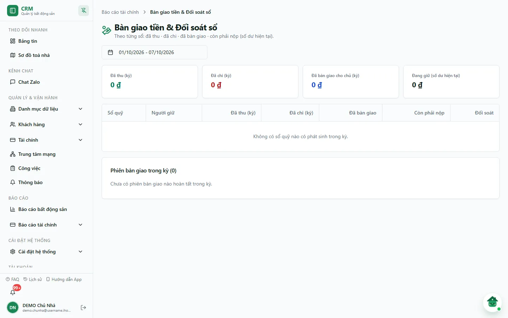

# Bàn giao tiền & đối soát

Màn **Bàn giao tiền & Đối soát sổ** giúp chủ theo dõi tiền đang nằm ở đâu: với từng sổ quỹ thu tiền, bạn thấy trong kỳ đã thu bao nhiêu, đã chi bao nhiêu, đã bàn giao cho chủ bao nhiêu và sổ đang giữ bao nhiêu. Bên dưới là danh sách các phiên bàn giao đã hoàn tất trong kỳ. Khi cần ghi lại một lần đối chiếu số dư (đếm két, khớp sao kê), dùng nút **Chốt số** — thao tác này chỉ ghi nhận con số, không khoá sổ và không chuyển tiền.

::: info Điều kiện tiên quyết
- Có quyền `reports_finance.handover_report` để mở trang; nút **Chốt số** chỉ hiện khi có thêm quyền `reports_finance.reconcile`.
- Bảng chỉ liệt kê sổ thu tiền **thật** (không phải sổ ảo) mà bạn được xem: sổ có tên kết thúc bằng "Thu", sổ chuyển khoản (tên bắt đầu "tk" hoặc có khai ngân hàng), hoặc sổ đã từng là nguồn của một phiên bàn giao.
- Phiên bàn giao được tạo ở luồng thu tiền/bàn giao; xem [Thu tiền tại phòng](/03-quan-ly-van-hanh/thu-tien-mobile/) và [Chu kỳ Thu → Bàn giao](/04-bao-cao/thu-ban-giao/).
:::

## Hướng dẫn từng bước

**Bước 1**: Mở **Báo cáo tài chính** (`/reports/finance`) và chọn thẻ **Bàn giao tiền & Đối soát sổ**. Trang này không có mục riêng ở thanh menu bên trái.

**Bước 2**: Chọn khoảng ngày ở ô chọn kỳ (mặc định từ đầu tháng tới hôm nay; lựa chọn được nhớ cho lần sau). Bốn ô tổng phía trên cộng cho mọi sổ đang hiện: **Đã thu (kỳ)**, **Đã chi (kỳ)**, **Đã bàn giao cho chủ (kỳ)** và **Đang giữ (số dư hiện tại)**.

**Bước 3**: Đọc bảng theo sổ. Mỗi dòng gồm **Sổ quỹ** (sổ chuyển khoản có nhãn **Chuyển khoản**), **Người giữ**, **Đã thu (kỳ)**, **Đã chi (kỳ)**, **Đã bàn giao**, **Còn phải nộp** (chính là số dư hiện tại của sổ, tô đỏ khi âm) và cột **Đối soát** (ngày đối soát gần nhất, kèm số lệch nếu có).

**Bước 4**: Xem **Phiên bàn giao trong kỳ (N)**: **Mã**, **Người giao → nhận** (kèm sổ nguồn), **Đã thu**, **Đã chi**, **Thực nộp** và **Nhận lúc**. Chỉ phiên đã được bên nhận xác nhận mới hiện; bạn chỉ thấy phiên mình là người giao hoặc người nhận.

**Bước 5**: Ghi nhận đối soát một sổ (cần quyền `reconcile`). Bấm **Chốt số** ở cột Đối soát. Hộp **Chốt số / đối soát — <tên sổ>** hiện **Số dư hệ thống** tại hôm nay; nhập **Số đếm/đối chiếu thực tế** (nhập 0 nếu sổ đã hết tiền), xem dòng **Lệch** (đếm − hệ thống), tuỳ chọn **Người xác nhận cùng** và **Ghi chú**, rồi bấm:

- **Chốt số** — khi để trống người xác nhận (chốt một mình): con số được ghi nhận ngay.
- **Gửi đối soát** — khi chọn người xác nhận cùng: bản đối soát chờ người đó xác nhận.

::: warning Chốt số không phải đóng sổ
**Chốt số** chỉ lưu một mốc so sánh giữa số hệ thống và số đếm tại hôm nay. Giao dịch sau đó vẫn phát sinh bình thường và không có gì bị khoá. Muốn **chốt sổ & bàn giao quỹ** (khoá kỳ vĩnh viễn, cần hai bên ký) thì làm ở [Sổ quỹ](/03-quan-ly-van-hanh/so-quy/). Báo cáo lợi nhuận tháng cũng nhắc những sổ chưa chốt ở đó, không phải ở trang này.
:::

## Cách đọc số trên trang

- **Đã thu (kỳ)** / **Đã chi (kỳ)** cộng các phiếu thu/chi **đã duyệt** có ngày phiếu trong kỳ, bỏ qua phiếu chuyển tiền của phiên bàn giao. Đây là số theo trạng thái duyệt, chưa phải phép đo tiền đã ghi sổ: chỉ phiếu **Đã Thu/Đã Chi** (`posting_status = POSTED`) mới là tiền thật vào/ra sổ.
- **Đã bàn giao** cộng các phiên bàn giao đã xác nhận trong kỳ, tính theo ngày xác nhận.
- **Còn phải nộp** là số dư hiện tại của sổ, không phụ thuộc kỳ đang chọn.

Vì vậy "đã thu − đã chi − đã bàn giao" của một kỳ thường **không** bằng số đang giữ (còn số dư đầu kỳ, chuyển nội bộ, phiếu chưa ghi sổ…). Khi cần tồn chính xác của một sổ theo ngày, dùng [Sổ quỹ theo ngày](/04-bao-cao/so-quy-ngay/).

## Tình huống & lỗi thường gặp

| Tình huống | Nguyên nhân & cách xử lý |
|---|---|
| Bảng báo **Không có sổ quỹ nào có phát sinh trong kỳ** | Bạn không có sổ thu tiền nào thuộc phạm vi xem (tên không kết thúc "Thu", không phải sổ chuyển khoản, chưa từng bàn giao) — đây là trạng thái của DEMO ngày 07/10/2026 |
| Không thấy nút **Chốt số** | Thiếu quyền `reports_finance.reconcile` |
| Báo **Nhập số dư thực tế bằng số** | Ô số đếm phải là số nguyên; nhập 0 nếu sổ đã hết tiền |
| Báo **Lần đối soát trước chưa xác nhận** | Lần gửi trước chưa rõ kết quả; tải lại trang để xem đối soát đã ghi chưa trước khi tạo tiếp |
| Đã chốt số nhưng vẫn sửa được phiếu cũ | Đúng thiết kế; khoá sổ làm ở [Sổ quỹ](/03-quan-ly-van-hanh/so-quy/) |
| Không thấy một phiên bàn giao | Phiên chưa được xác nhận, nằm ngoài kỳ đang chọn, hoặc bạn không phải người giao/nhận |

## Thử trực tiếp trên sandbox

<SandboxTry account="demo.chunha" app-path="/reports/finance/ban-giao" app-label="Mở Bàn giao tiền & Đối soát sổ" fixtures="DEMO 07/10/2026: không có sổ thu tiền trong phạm vi, chưa có phiên bàn giao" view-only>

**Bài tập chỉ xem**

1. Mở trang, đổi khoảng ngày và quan sát bốn ô tổng, bảng theo sổ, danh sách phiên bàn giao.
2. Nếu tài khoản của bạn có nút **Chốt số**, chỉ mở hộp để xem các trường rồi bấm **Đóng**; không bấm **Chốt số**/**Gửi đối soát**.

**Kết quả mong đợi**

- Giao diện khớp nhãn và cột như bài mô tả.
- Không có đối soát nào được ghi.

</SandboxTry>

## Quy trình liên quan

- [Chu kỳ Thu → Bàn giao](/04-bao-cao/thu-ban-giao/)
- [Sổ quỹ](/03-quan-ly-van-hanh/so-quy/) — chốt sổ hai bên ký và bàn giao quỹ.
- [Sổ quỹ theo ngày](/04-bao-cao/so-quy-ngay/)
- [Thu tiền tại phòng](/03-quan-ly-van-hanh/thu-tien-mobile/)
- [Báo cáo tài chính](/04-bao-cao/hub-tai-chinh/)
