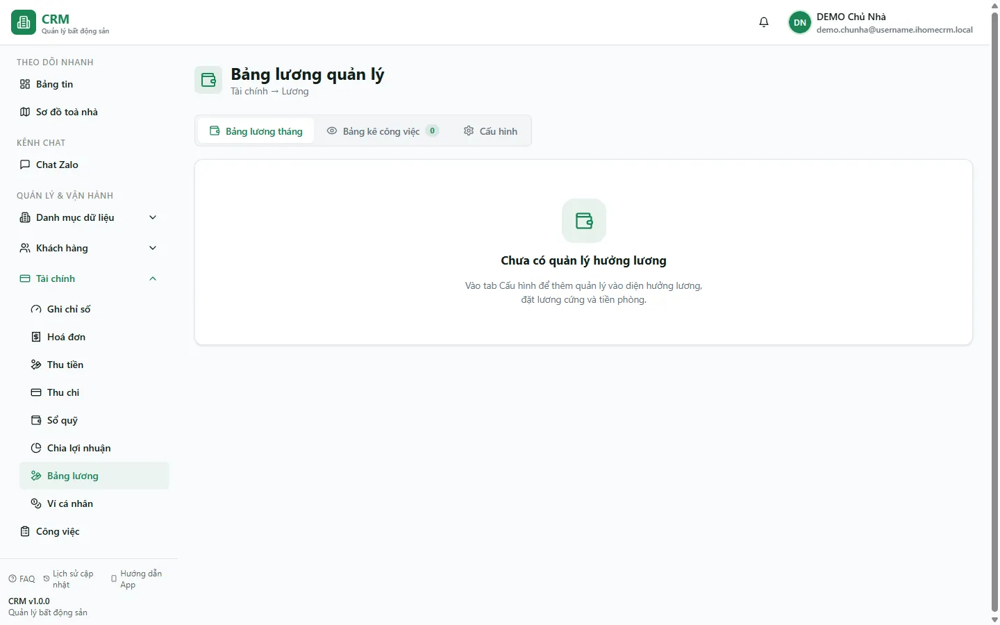

# Bảng lương quản lý

Màn **Bảng lương** là nơi bạn — chủ nhà — tính công cho các nhân viên quản lý vận hành. Điểm cốt lõi: lương ở đây **tính từ dữ liệu vận hành thật** (việc đã hoàn thành, hoa hồng bán phòng, lợi nhuận đầu tư, các khoản ứng…), chứ không gõ tổng bằng tay. Bạn chỉ khai báo **ai hưởng lương** và **quy tắc thưởng** một lần ở tab Cấu hình; hệ thống cộng lương cứng, thưởng việc, hoa hồng, đầu tư rồi trừ ứng và tiền phòng để ra **thực nhận**. Cuối tháng bạn **chốt** để đóng băng con số, rồi **trả lương** — thao tác này ghi một phiếu chi thật vào sổ quỹ. Trang này hướng dẫn bạn đi từ cấu hình → đọc bảng kê → chốt → trả.

::: info Điều kiện tiên quyết
- Quyền **Bảng lương => Xem** (module `salary`, action `view`) để mở màn; **Cấu hình** (`manage_salary`) để khai báo người hưởng lương và quy tắc; **Chốt** (`lock`) / **Mở khoá** (`unlock`) để đóng/mở tháng; **Trả lương** (`distribute`) để ghi phiếu chi.
- Đã **thêm nhân viên** quản lý vào hệ thống — xem [Thêm nhân viên](/01-bat-dau/them-nhan-vien/). Chỉ nhân viên được khai báo ở tab Cấu hình mới xuất hiện trong bảng lương.
- Đã có **sổ quỹ** và bộ **loại thu chi** để phiếu trả lương chảy ra — xem [Sổ quỹ & loại thu chi](/01-bat-dau/so-quy-loai-thu-chi/).
- **Dữ liệu demo CHƯA cấu hình lương**: chưa có ai được khai báo hưởng lương, nên tab **Bảng lương tháng** sẽ **trống** hoặc hiện thông điệp hướng dẫn. Bạn bắt đầu ở tab **Cấu hình** (Bước 2).
:::

## Hướng dẫn từng bước

**Bước 1**: Vào menu **Tài chính => Bảng lương**. Màn mở ra với **3 tab** — **Bảng lương tháng**, **Bảng kê công việc**, **Cấu hình** — cùng bộ điều hướng **tháng ±** ở đầu (lựa chọn tháng được giữ lại khi bạn tải lại trang F5). Với dữ liệu demo chưa cấu hình, tab Bảng lương tháng chưa có card quản lý nào; đó là bình thường.

**Bước 2**: Mở tab **Cấu hình** (cần quyền `manage_salary`) và khai báo **ai hưởng lương**. Thêm một quản lý, điền:
- **Lương cứng** — mức cố định mỗi tháng (ví dụ **1.000.000đ**).
- **Phòng ở ưu đãi** (tuỳ chọn): nếu nhân viên ở một phòng giá ưu đãi, chọn **Phòng** đó — hệ thống lấy đúng **hoá đơn phòng** làm khoản khấu trừ tiền phòng; không set thì dùng **Tiền phòng mặc định**.
- **Biệt danh (alias)** — dùng để **khớp phiếu hoa hồng (HH Sale)** theo tên người nhận; đặt đúng biệt danh nhân viên hay ghi trên phiếu chi hoa hồng.
- **Chức danh**, **Mục tiêu thu**, và **Hiệu lực từ** — cấu hình theo mốc hiệu lực, nên đổi lương giữa chừng không làm sai các tháng cũ.

Cùng tab này bạn cấu hình **Quy tắc thưởng** (thưởng ngày Chủ nhật/Lễ có việc sửa chữa hoặc ký hợp đồng — mặc định **20.000đ**/ngày; **+50.000đ** cho việc ký hợp đồng hoàn thành **sau 18:00 hoặc Chủ nhật/Lễ**; bật **yêu cầu ảnh** để việc thiếu ảnh không được thưởng), danh sách **Ngày lễ** (có nút thêm nhanh bộ lễ Việt Nam), và **Tháng hiển thị cho nhân viên** (bật/tắt cho nhân viên xem từng tháng).

**Bước 3**: Hiểu lương được cộng từ đâu — bạn **không gõ tổng**, hệ thống tự tính theo công thức:

> **Thực nhận** = Lương cứng + Thưởng (thưởng việc tự động + thưởng/trừ tay) + Đầu tư + Hoa hồng − Ứng lương − Tiền phòng.

Trong đó: **Thưởng việc tự động** gộp 3 nhóm — thưởng theo loại việc đã hoàn thành, phụ cấp Chủ nhật/Lễ, và +50.000đ ký hợp đồng ngoài giờ; **Đầu tư** chỉ có khi quản lý đồng thời là **cổ đông** (cộng phần lợi nhuận đã chốt); **Hoa hồng** là các phiếu chi HH Sale khớp biệt danh trong tháng; **Tiền phòng** khấu trừ theo hoá đơn phòng của **tháng kế** (lương tháng này trả vào tháng sau).

**Bước 4**: Mở tab **Bảng kê công việc** để soi **bằng chứng** đằng sau mỗi con số thưởng. Bảng liệt kê từng dòng việc đã **hoàn thành** được tính lương (kèm ngày, loại việc, số tiền), có thể **lọc theo người** và **theo toà**; nếu quy tắc bật "yêu cầu ảnh" thì dòng thiếu ảnh được gắn cờ và **không cộng thưởng**. Đây là nơi bạn giải thích cho nhân viên "vì sao được bấy nhiêu".

**Bước 5**: Quay lại tab **Bảng lương tháng**. Mỗi quản lý là một **card** với breakdown Lương cứng / Thưởng tự động / Hoa hồng / Đầu tư / Ứng / Tiền phòng và **Thực nhận**. Tại đây bạn:
- **Thêm / Sửa / Xoá adjustment** — dòng **thưởng** hoặc **trừ** thủ công (có dấu), ví dụ thưởng nóng hay phạt.
- Điều hướng **tháng ±** để xem tháng khác.
- Dùng thanh **Xem dưới vai trò** để xem trước đúng màn hình mà nhân viên đó nhìn thấy (self-view).

**Bước 6**: **Chốt tháng (Lock)** khi số đã đúng (cần quyền `lock`). Khi chốt, hệ thống **tự duyệt** các phiếu hoa hồng còn nháp đang tính vào lương, **đóng băng** toàn bộ con số vào bản lương tháng, và lưu **ảnh chụp bảng kê** tại thời điểm đó. Tháng đã chốt **không tính lại** dù sau này bạn đổi quy tắc hay thêm việc.

::: warning Mở khoá tháng đã chốt cần cân nhắc
Mở khoá (quyền `unlock`) sẽ xoá bản ảnh chụp và đưa tháng về **nháp** để tính lại theo dữ liệu hiện hành — con số có thể đổi so với lúc bạn đã chốt. Chỉ mở khoá khi thực sự cần sửa, và **chốt lại** ngay sau khi sửa xong.
:::

**Bước 7**: **Trả lương** (cần quyền `distribute`). Bấm trả cho từng người hoặc hàng loạt, **chọn sổ quỹ** chi tiền. Hệ thống ghi một **phiếu chi "Lương quản lý"** (vào toà ảo **Chung**, không tính vào Kết quả kinh doanh) bằng đúng số thực nhận. Nếu nhân viên còn nợ **tiền phòng** ở tháng kế, phiếu chi tách 2 dòng (thực nhận + tiền phòng khấu trừ) và hệ thống **tự gạch nợ** hoá đơn phòng đó, để sổ quỹ chỉ giảm đúng phần tiền mặt thực đưa.

::: danger Trả lương là thao tác ghi tiền thật
Bấm **Trả lương** lập tức tạo **phiếu chi** trong **sổ quỹ** bạn chọn và đánh dấu tháng đã trả — đây là tiền thật ra khỏi quỹ, không phải bản nháp. Hãy kiểm tra kỹ **đúng người, đúng số thực nhận và đúng sổ quỹ** trước khi xác nhận. Nên **chốt tháng** trước rồi mới trả để số không còn dao động.
:::

## Các tính năng khác trên màn hình

| Nút / Khu vực | Công dụng |
| --- | --- |
| Tab **Bảng lương tháng** | Card từng quản lý với breakdown lương cứng / thưởng / hoa hồng / đầu tư / ứng / tiền phòng và thực nhận. |
| Tab **Bảng kê công việc** | Từng dòng việc hoàn thành được tính lương; lọc theo người / toà; cờ ảnh khi bật "yêu cầu ảnh". |
| Tab **Cấu hình** | Khai báo người hưởng lương (lương cứng, phòng ở, biệt danh, mục tiêu, hiệu lực), quy tắc thưởng, ngày lễ, tháng hiển thị cho nhân viên. |
| Điều hướng **tháng ±** | Chuyển qua lại giữa các tháng; lựa chọn được giữ khi tải lại trang (F5). |
| **Thêm / Sửa / Xoá adjustment** | Ghi dòng thưởng hoặc trừ thủ công (có dấu) cho một quản lý trong tháng. |
| **Xem dưới vai trò** | Xem trước màn "Lương của tôi" đúng như nhân viên nhìn thấy. |
| **Chốt tháng** / **Mở khoá** | Đóng băng số vào bản lương tháng (Lock) hoặc mở lại để tính lại (Unlock). |
| **Trả lương** (từng người / hàng loạt) | Ghi phiếu chi "Lương quản lý" vào sổ quỹ chọn; tự gạch nợ tiền phòng nếu có. |
| **Ngày lễ** (trong Cấu hình) | Danh sách ngày lễ của bạn, có nút thêm nhanh bộ lễ Việt Nam; ảnh hưởng thưởng Chủ nhật/Lễ. |

## Tình huống & lỗi thường gặp

| Tình huống | Cách xử lý |
| --- | --- |
| Tab **Bảng lương tháng trống** hoàn toàn | Chưa khai báo ai hưởng lương. Vào tab **Cấu hình** thêm quản lý (lương cứng, hiệu lực từ) — đây chính là trạng thái của dữ liệu demo. |
| Nhân viên đã hoàn thành nhiều việc nhưng **không thấy thưởng** | Loại việc đó chưa bật "tính lương" hoặc chưa có mức thưởng; hoặc quy tắc bật **yêu cầu ảnh** mà việc thiếu ảnh. Kiểm tra ở tab **Bảng kê công việc** và cấu hình loại việc. |
| **Hoa hồng (HH Sale)** không cộng vào lương | Phiếu chi hoa hồng phải có **tên người nhận khớp biệt danh (alias)** của quản lý và kỳ phân bổ rơi trong tháng. Sửa alias ở tab Cấu hình cho khớp. |
| Cột **Đầu tư** trống dù quản lý là cổ đông | Đầu tư chỉ cộng khi lợi nhuận toà đã **chốt (LOCKED)**; tháng còn nháp sẽ hiện "chờ chốt". Xem [Chia lợi nhuận](/03-quan-ly-van-hanh/chia-loi-nhuan/). |
| Sửa quy tắc/loại việc nhưng **tháng cũ không đổi** | Đúng thiết kế: tháng đã **chốt** đóng băng số, không tính lại. Muốn áp lại phải **Mở khoá** rồi chốt lại (cân nhắc kỹ). |
| Đã trả lương nhưng **tiền phòng** nhân viên vẫn còn nợ | Tiền phòng chỉ tự gạch khi nhân viên có **hoá đơn phòng** ở tháng kế và bạn đã gán **Phòng ở** trong Cấu hình; không gán thì chỉ khấu trừ theo "tiền phòng mặc định", không đụng hoá đơn. |
| Không thấy nút **Chốt / Trả lương** | Thiếu quyền tương ứng (`lock` / `distribute`). Nhờ chủ hệ thống cấp quyền trong Phân quyền. |
| Nhân viên báo **xem tháng bị lùi** | Đúng chính sách: self-view mặc định hiển thị tháng trước cho tới khi tháng đó được **chốt**. Bật hiển thị sớm ở **Tháng hiển thị cho nhân viên** (tab Cấu hình). |

## Thử trực tiếp trên sandbox

<SandboxTry account="demo.chunha" app-path="/finance/salary" app-label="Mở màn Bảng lương" fixtures="Tài khoản chủ nhà demo; bảng lương CHƯA cấu hình người hưởng lương" view-only>

Bài này **chỉ xem** — bạn quan sát cấu trúc màn và hình dung luồng, không ghi tiền:

1. Mở màn **Bảng lương**. Vì demo **chưa cấu hình** người hưởng lương, tab **Bảng lương tháng** sẽ trống hoặc hiện thông điệp hướng dẫn — đây đúng là điểm cần nhận ra.
2. Bấm sang tab **Cấu hình** để thấy **nơi khai báo** ai hưởng lương: lương cứng, phòng ở ưu đãi, biệt danh khớp hoa hồng, mục tiêu, cùng khu **Quy tắc thưởng** và **Ngày lễ**.
3. Bấm sang tab **Bảng kê công việc** để hình dung bảng **bằng chứng** — từng dòng việc hoàn thành sẽ là nguồn thưởng, lọc theo người/toà.
4. Ở đầu màn, thử đổi **tháng ±** để thấy bảng lương gắn theo từng tháng. Không cần chốt hay trả (bài chỉ xem).

Kết quả mong đợi: bạn hiểu rằng lương ở đây **cộng từ việc thật + hoa hồng + đầu tư** rồi trừ ứng/tiền phòng; muốn bảng có số thì phải **cấu hình người hưởng lương trước** ở tab Cấu hình, và **trả lương** là bước ghi phiếu chi thật (không thao tác trong bài này).

</SandboxTry>

## Quy trình liên quan

- [Lương của tôi](/03-quan-ly-van-hanh/luong-cua-toi/) — màn self-view của nhân viên; số họ thấy đúng bằng số bạn thấy ở đây.
- [Thêm nhân viên](/01-bat-dau/them-nhan-vien/) — thêm quản lý vào hệ thống trước khi khai báo hưởng lương.
- [Việc của tôi](/02-theo-doi-nhanh/viec-cua-toi/) — việc hoàn thành là nguồn thưởng chảy vào bảng kê công việc.
- [Thu chi](/03-quan-ly-van-hanh/thu-chi/) — phiếu chi "Lương quản lý"/"Ứng lương" và phiếu hoa hồng HH Sale được đối chiếu vào lương.
- [Sổ quỹ](/03-quan-ly-van-hanh/so-quy/) — sổ quỹ mà phiếu trả lương chi ra.
- [Chia lợi nhuận](/03-quan-ly-van-hanh/chia-loi-nhuan/) — nguồn cột "Đầu tư" (lợi nhuận cổ đông đã chốt) trên bảng lương.
- [Hoá đơn](/03-quan-ly-van-hanh/hoa-don/) — hoá đơn phòng ở của nhân viên, dùng để khấu trừ tiền phòng khi trả lương.
