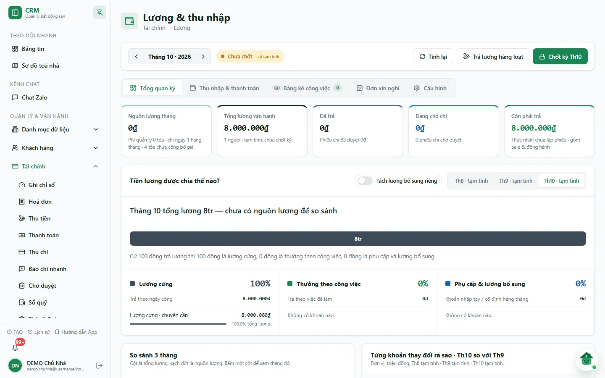
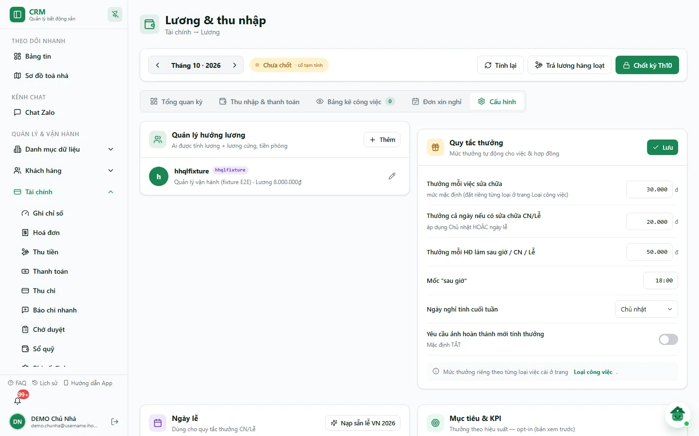
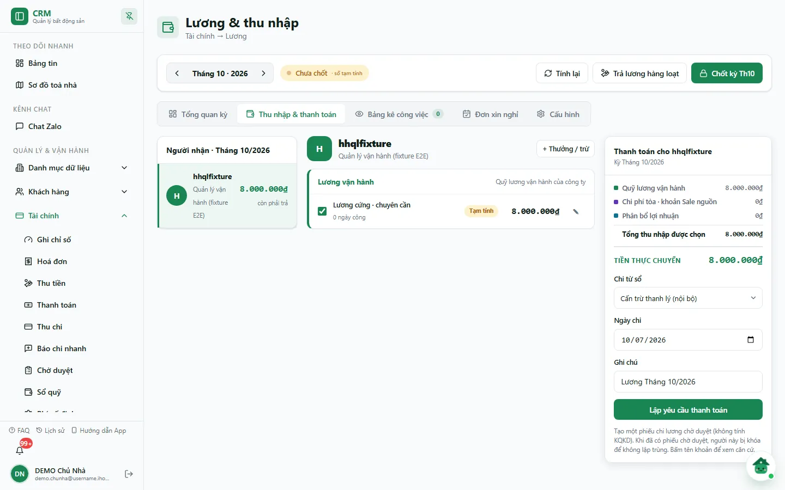
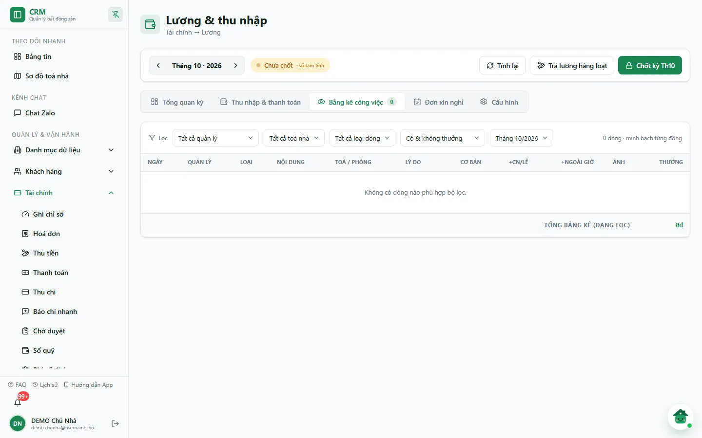

# Bảng lương quản lý

Màn **Lương & thu nhập** là nơi chủ nhà tính và trả lương cho nhân viên quản lý vận hành. Số liệu lấy từ dữ liệu thật — ngày công, việc đã hoàn thành, phiếu hoa hồng, lợi nhuận đã chốt, ứng lương và tiền phòng — chứ không gõ tổng tay. Cuối kỳ bạn chốt để đóng băng số, rồi lập yêu cầu thanh toán; phiếu chi lương đi qua luồng duyệt như mọi phiếu chi khác.

::: info Điều kiện tiên quyết
- Mục menu **Tài chính => Bảng lương** hiện khi có quyền `salary.view`. Route `/finance/salary` tự rẽ theo quyền: superadmin hoặc tài khoản có ít nhất một trong `salary.manage_salary`, `salary.lock`, `salary.distribute` thấy màn quản trị; nhân viên đã được cấu hình hưởng lương mà không có các quyền này thấy [Lương của tôi](/03-quan-ly-van-hanh/luong-cua-toi/).
- Từng thao tác kiểm quyền riêng: tab **Cấu hình** (`manage_salary`), **Chốt kỳ** (`lock`), **Mở khoá** (`unlock`), **Trả lương hàng loạt** và **Lập yêu cầu thanh toán** (`distribute`). Sửa số tiền từng khoản và khoản định kỳ chỉ dành cho chủ công ty/quản trị hệ thống.
- Nhân viên đã có tài khoản — xem [Thêm nhân viên](/01-bat-dau/them-nhan-vien/); đã có sổ quỹ để chi lương — xem [Sổ quỹ & loại thu chi](/01-bat-dau/so-quy-loai-thu-chi/).
- Trên điện thoại, màn tự chuyển sang giao diện tối dạng thẻ dành cho máy nhỏ; hướng dẫn dưới đây theo bản máy tính.
:::

## Hướng dẫn từng bước

**Bước 1**: Vào **Tài chính => Bảng lương**. Thanh đầu trang có bộ chọn **Tháng · Năm** (‹ ›, được nhớ khi tải lại), nhãn trạng thái **Chưa chốt · số tạm tính** hoặc **Đã chốt**, và các nút **Tính lại**, **Trả lương hàng loạt**, **Chốt kỳ ThN** (hoặc **Mở khoá ThN** khi kỳ đã chốt). Bên dưới là năm tab: **Tổng quan kỳ**, **Thu nhập & thanh toán**, **Bảng kê công việc**, **Đơn xin nghỉ**, **Cấu hình**. Khi có từ hai người hưởng lương trở lên, thanh **Xem dưới vai trò** cho phép xem trước đúng màn một nhân viên nhìn thấy.

Tab **Tổng quan kỳ** gồm:

- Năm ô số: **Nguồn lương tháng** (phí Quản lý đã công bố giá của các toà, cộng phần chủ cấp thêm), **Tổng lương vận hành**, **Đã trả** (phiếu chi lương đã duyệt, cộng ứng), **Đang chờ chi** (phiếu chi lương chờ duyệt) và **Còn phải trả**. Bấm ô **Nguồn lương tháng** để mở hộp **Nguồn lương & khoản định kỳ**.
- **Tiền lương được chia thế nào?** — câu tóm tắt tổng lương so với nguồn lương (vượt hay còn dư), thanh ba nhóm **Lương cứng**, **Thưởng theo công việc**, **Phụ cấp & lương bổ sung**, câu "Cứ 100 đồng trả lương thì…", công tắc **Tách lương bổ sung riêng** và chọn kỳ so sánh.
- **So sánh 3 tháng**, **Từng khoản thay đổi ra sao**, **Mỗi người nhận bao nhiêu** (bấm tên để sang tab Thu nhập).
- **Cần xử lý trước khi chốt** (bấm **Xem ▾**): toà chưa công bố giá phí Quản lý, phiếu hoa hồng đã tính vào lương người khác, phiếu hoa hồng chờ duyệt còn ở sổ thật (**Chưa gán QL**), lợi nhuận kỳ chưa chốt, lương QL bổ sung đang nhập tay, phiếu chi lương đang chờ duyệt.

**Bước 2**: Khai báo người hưởng lương ở tab **Cấu hình** (cần `manage_salary`).

- Thẻ **Quản lý hưởng lương** → **+ Thêm**: chọn **Nhân viên**, nhập **Biệt danh nội bộ** (dùng khớp tên người nhận trên phiếu hoa hồng), **Chức vụ**, **Lương tháng**, **Phòng nhân viên ở (giá ưu đãi)** (không gán thì dùng số cố định) và **Mục tiêu thu nhập tháng (tuỳ chọn)**.
- Thẻ **Quy tắc thưởng**: **Thưởng mỗi việc sửa chữa** (mức mặc định; mức riêng theo loại việc đặt ở trang Loại công việc), **Thưởng cả ngày nếu có sửa chữa CN/Lễ**, **Thưởng mỗi HĐ làm sau giờ / CN / Lễ**, **Mốc "sau giờ"**, **Ngày nghỉ tính cuối tuần** (Chủ nhật hoặc Thứ 7 + CN), công tắc **Yêu cầu ảnh hoàn thành mới tính thưởng**; bấm **Lưu**.
- Thẻ **Ngày lễ** (**Nạp sẵn lễ VN 2026**, **Thêm ngày**), **Tháng hiển thị cho nhân viên** (bật/tắt từng tháng nhân viên được xem) và **Mục tiêu & KPI** (bản xem trước, chưa cộng vào lương).

**Bước 3**: Kiểm thu nhập từng người ở tab **Thu nhập & thanh toán**. Cột trái là **Người nhận** với số **còn phải trả**. Ở giữa, các khoản của người đang chọn chia theo nguồn chịu tiền:

- **Lương vận hành** (quỹ lương vận hành của công ty): lương cứng, thưởng theo việc, khoản định kỳ, thưởng/trừ nhập tay.
- **Hoa hồng & thưởng Sale** (chi phí của toà phát sinh giao dịch): phiếu hoa hồng đã gán cho quản lý.
- **Thu nhập đồng hành** (phần lợi nhuận được phân bổ theo toà): chỉ có khi lợi nhuận toà đã chốt; chưa chốt thì hiện **Lợi nhuận kỳ chưa chốt · Chưa đủ cơ sở** (không phải bằng 0).
- **Ứng & cấn trừ**: các khoản ứng và tiền phòng, trừ vào tiền thực chuyển.

Mỗi khoản có nhãn trạng thái (**Tạm tính**, **Nhập tay**, **Định kỳ**, **Sửa tay**, **Đã chốt**, **Trả qua lương**, **Đã chi từ sổ**, **Chưa gán QL**…). Bấm tên khoản để mở ngăn **Truy ngược căn cứ**; từ đó có thể **Xem bảng kê công việc**, **Sửa khoản**/**Xoá khoản** (khoản nhập tay), **Sửa số tiền** (chủ công ty, bắt buộc lý do) hoặc **Chuyển sang trả qua lương** cho phiếu hoa hồng chờ duyệt đang nằm ở sổ thật. Nút **+ Thưởng / trừ** thêm một dòng thưởng hoặc trừ tay.

**Bước 4**: Soi bằng chứng ở tab **Bảng kê công việc**. Lọc theo quản lý, toà, loại dòng (**Việc (sửa chữa)**, **Hợp đồng**, **Thu tiền**, **Ngày CN/Lễ**) và có/không thưởng. Cột gồm Ngày, Quản lý, Loại, Nội dung, Toà / Phòng, Lý do, Cơ bản, +CN/Lễ, +Ngoài giờ, Ảnh, Thưởng; cuối bảng là **Tổng bảng kê (đang lọc)**. Khi kỳ chưa chốt, dòng việc có nút **Không tính** để loại khỏi thưởng (dòng vẫn còn, thưởng về 0đ) và **Tính lại** để đưa lại.

**Bước 5**: Duyệt đơn nghỉ ở tab **Đơn xin nghỉ** (**Đơn xin nghỉ có lương**): duyệt hoặc từ chối, nhân viên nhận thông báo kết quả.

**Bước 6**: Chốt kỳ (cần `lock`). Bấm **Chốt kỳ ThN** → hộp **Chốt tháng?** → **Chốt tháng**. Hệ thống tính lần cuối, tự duyệt các phiếu hoa hồng còn chờ duyệt đang tính vào lương, rồi đóng băng toàn bộ bảng lương và bảng kê. Sau khi chốt, sửa hay đóng việc cũ không còn ảnh hưởng kỳ này; thanh toán trả đúng số đã chốt, không chọn từng khoản.

::: warning Mở khoá kỳ đã chốt cần cân nhắc
**Mở khoá ThN** (quyền `unlock`) đưa kỳ về tạm tính để sửa; mọi thay đổi việc/HĐ cũ lại ảnh hưởng kỳ này. Nếu đã có phiếu trả lương, hãy kiểm tra lại rồi chốt lại ngay sau khi sửa.
:::

**Bước 7**: Trả lương (cần `distribute`). Ở khung **Thanh toán cho <tên>** bên phải tab Thu nhập & thanh toán, kiểm các dòng **Quỹ lương vận hành**, **Chi phí tòa · khoản Sale nguồn**, **Phân bổ lợi nhuận**, **Tổng thu nhập được chọn**, các khoản trừ (**Đã ứng**, **Hoa hồng chi từ sổ thật**, **Đã trả trước đó**, tiền phòng) và **Tiền thực chuyển**. Chọn **Chi từ sổ**, **Ngày chi**, **Ghi chú** rồi bấm **Lập yêu cầu thanh toán**. Muốn trả nhiều người một lượt, dùng **Trả lương hàng loạt** → chọn **Chi từ sổ quỹ** → **Ghi N phiếu chi**.

- Mỗi lần lập tạo **một phiếu chi lương chờ duyệt**, không tính KQKD. Người đang có phiếu chờ duyệt bị khoá lập phiếu mới (kể cả trong trả hàng loạt) và có thẻ **Đang chờ chi** kèm nút **Mở duyệt chi**.
- Tiền phòng: nếu đã gán phòng và có hoá đơn phòng tháng kế, phần tiền phòng được trừ thẳng vào hoá đơn, không chuyển khoản; nếu chưa có hoá đơn thì trừ theo mức cố định trong cấu hình.

::: danger Lập yêu cầu, duyệt và tiền ra khỏi quỹ là ba việc khác nhau
**Lập yêu cầu thanh toán** chỉ tạo phiếu chờ duyệt. Ô **Đã trả** tăng khi phiếu được **duyệt**. Tiền chỉ thật sự ra khỏi sổ quỹ khi phiếu ở trạng thái **Đã Chi** (`posting_status = POSTED`); kiểm tra ở [Chờ duyệt](/03-quan-ly-van-hanh/cho-duyet/) và [Thu chi](/03-quan-ly-van-hanh/thu-chi/) trước khi báo nhân viên đã nhận lương.
:::

::: info Hai cách tính lương theo kỳ
Hệ thống có cách tính cũ và cách tính v5 (lương cứng theo chuyên cần, thưởng chuỗi cộng song song với thưởng việc). Khi v5 được bật, nó chỉ áp cho các kỳ từ mốc hiệu lực trở đi; kỳ trước mốc vẫn tính theo cách cũ, và kỳ đã chốt luôn giữ số đã đóng băng. Vì vậy nhãn khoản (ví dụ **Lương cứng · chuyên cần**) có thể khác nhau giữa các tháng.
:::

## Các tính năng khác trên màn hình

| Nút / Khu vực | Công dụng |
| --- | --- |
| **Tính lại** | Đọc lại số tạm tính của kỳ chưa chốt |
| Hộp **Nguồn lương & khoản định kỳ** | Tab **Nguồn lương**: phí Quản lý theo giá công bố từng toà, **+ Công bố giá phí Quản lý** (mở màn **Phí cố định**), phần **Chủ công ty cấp thêm** (chỉ chủ công ty/quản trị xem chi tiết). Tab **Khoản định kỳ**: khoản tự vào lương mỗi kỳ theo phiên bản, sửa mức/ngừng phải ghi lý do |
| **Xem dưới vai trò** | Xem trước màn tự xem của từng nhân viên |
| Ô **Đang chờ chi** / thẻ **Đang chờ chi** | Phiếu chi lương đã lập, chờ người duyệt ký |
| **Cần xử lý trước khi chốt** | Danh sách việc nên xử lý trước khi chốt kỳ, mỗi dòng có nút dẫn tới nơi xử lý |
| **Sửa số tiền** | Chủ công ty ghi đè số máy tính của một khoản, bắt buộc lý do; có **Bỏ sửa tay** |

## Tình huống & lỗi thường gặp

| Tình huống | Nguyên nhân & cách xử lý |
| --- | --- |
| Hiện **Chưa có quản lý hưởng lương** | Chưa khai người hưởng lương; vào tab **Cấu hình** → **+ Thêm** |
| Ô **Nguồn lương tháng** bằng 0, câu tóm tắt "chưa có nguồn lương để so sánh" | Các toà chưa công bố giá phí Quản lý cho tháng; mở ô Nguồn lương tháng để xem toà nào thiếu |
| Nhân viên làm nhiều việc nhưng không thấy thưởng | Kiểm loại việc, mức thưởng, ảnh (nếu bật yêu cầu ảnh) và cờ **Không tính** ở Bảng kê |
| **Hoa hồng** không cộng vào lương | Phiếu hoa hồng phải được gán quản lý (ô QL trên phiếu) hoặc tên người nhận khớp biệt danh; phiếu chờ duyệt ở sổ thật cần **Chuyển sang trả qua lương** nếu muốn trả qua lương |
| Khoản hoa hồng hiện gạch ngang **Đã tính cho người khác** | Phiếu đó đã vào lương kỳ này của quản lý khác; nếu sai người thì mở chốt lương người kia rồi chốt lại |
| **Thu nhập đồng hành** "Chưa đủ cơ sở" | Lợi nhuận toà chưa chốt; xem [Chia lợi nhuận](/03-quan-ly-van-hanh/chia-loi-nhuan/) |
| Nút thanh toán ghi **Đang có phiếu chờ duyệt** | Người này đã có phiếu chi lương chờ duyệt; duyệt hoặc huỷ phiếu đó trước |
| Nút ghi **Không còn tiền phải chuyển** | Thực nhận đã được trả đủ hoặc các khoản đã chọn bằng 0 |
| Đã lập yêu cầu nhưng quỹ chưa giảm | Phiếu còn chờ duyệt hoặc chưa **Đã Chi**; theo dõi ở [Chờ duyệt](/03-quan-ly-van-hanh/cho-duyet/) |
| Không thấy nút **Chốt kỳ** / **Trả lương hàng loạt** / tab **Cấu hình** | Thiếu quyền `lock` / `distribute` / `manage_salary` |

## Thử trực tiếp trên sandbox

<SandboxTry account="demo.chunha" app-path="/finance/salary" app-label="Mở màn Lương & thu nhập" fixtures="DEMO 07/10/2026: 1 quản lý fixture lương 8.000.000đ, kỳ 10/2026 chưa chốt, bảng kê trống, chưa có phí Quản lý công bố giá" view-only>

**Bài tập chỉ xem**

1. Mở màn, đọc năm ô số và báo cáo **Tiền lương được chia thế nào?** ở tab **Tổng quan kỳ**.
2. Sang **Thu nhập & thanh toán**, bấm tên một khoản để xem **Truy ngược căn cứ** rồi đóng. **Không** bấm **Lập yêu cầu thanh toán**.
3. Sang **Bảng kê công việc** và **Cấu hình** để xem bộ lọc, quy tắc thưởng. **Không** bấm **Lưu**, **Chốt kỳ** hay **Trả lương hàng loạt**.

**Kết quả mong đợi**

- Giao diện khớp các tab, nhãn và nút như bài mô tả.
- Không có phiếu chi lương, cấu hình hay trạng thái chốt nào bị tạo/đổi.

</SandboxTry>

## Quy trình liên quan

- [Lương của tôi](/03-quan-ly-van-hanh/luong-cua-toi/) — màn tự xem của nhân viên, cùng nguồn số với màn này.
- [Thêm nhân viên](/01-bat-dau/them-nhan-vien/) — tạo tài khoản trước khi khai hưởng lương.
- [Việc của tôi](/02-theo-doi-nhanh/viec-cua-toi/) — việc hoàn thành là nguồn thưởng trong bảng kê.
- [Chờ duyệt](/03-quan-ly-van-hanh/cho-duyet/) — duyệt phiếu chi lương.
- [Thu chi](/03-quan-ly-van-hanh/thu-chi/) — phiếu chi lương, ứng lương, phiếu hoa hồng.
- [Sổ quỹ](/03-quan-ly-van-hanh/so-quy/) — sổ chi lương.
- [Chia lợi nhuận](/03-quan-ly-van-hanh/chia-loi-nhuan/) — nguồn của Thu nhập đồng hành.
- [Hoá đơn](/03-quan-ly-van-hanh/hoa-don/) — hoá đơn phòng ở của nhân viên dùng để cấn trừ.
