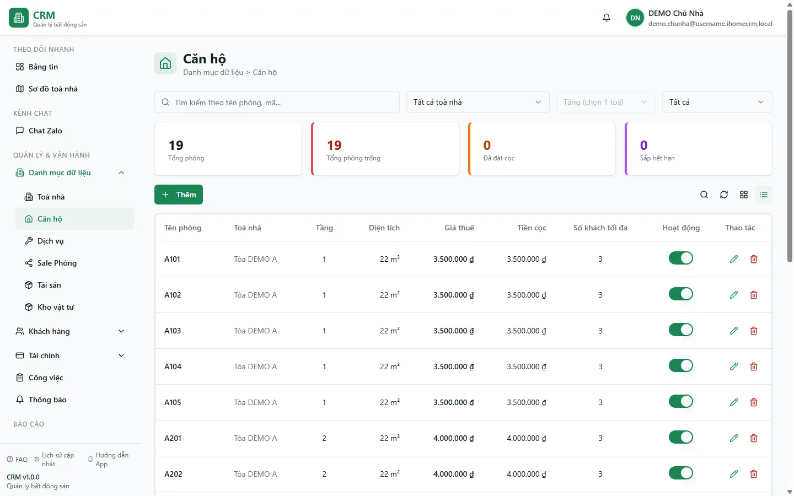

# Căn hộ / Phòng

Màn **Căn hộ / Phòng** là nơi bạn tra cứu và quản lý toàn bộ phòng đang cho thuê: lọc nhanh theo toà, tầng và trạng thái, xem giá thuê và tiền cọc của từng phòng, mở chi tiết để biết ai đang ở và hợp đồng nào đang chạy. Dùng màn này mỗi khi cần nắm "phòng nào còn trống, phòng nào sắp hết hạn" hoặc khi cần đi tới đúng một phòng để xử lý nghiệp vụ.

Điểm quan trọng: **trạng thái phòng tự đổi theo hợp đồng và tiền cọc** — bạn hầu như không phải chỉnh tay. Khi có hợp đồng hiệu lực, phòng thành **Đang thuê**; khi có cọc giữ chỗ, phòng thành **Đã đặt cọc**; khi hợp đồng kết thúc và không còn cọc, phòng tự về **Trống**.

::: info Điều kiện tiên quyết
- Quyền **Căn hộ => Xem** (module `rooms`, action `view`) để mở màn danh sách.
- Cần quyền **Sửa** trên phòng nếu muốn đổi thông tin, bật/tắt hoặc xoá phòng.
- Đã có ít nhất một **toà nhà** (đang hoạt động) và **tầng** trong hệ thống. Nếu chưa, tạo trước theo trang [Tạo tầng & phòng](/01-bat-dau/tao-tang-phong/).
- Là nhân viên, bạn chỉ thấy phòng thuộc các toà được gán phạm vi cho mình.
:::

## Hướng dẫn từng bước

**Bước 1**: Tại menu bên trái, ấn chọn **Căn hộ / Phòng**. Màn hiện danh sách phòng (sắp theo toà rồi tới tên phòng) kèm 4 thẻ thống kê ở đầu trang (**Tổng phòng** / **Tổng phòng trống** / **Đã đặt cọc** / **Sắp hết hạn**), ô tìm kiếm và các bộ lọc.

**Bước 2**: Tại ô lọc toà (danh sách phẳng A→Z, gõ để tìm), ấn chọn đúng **1 toà** hoặc **Tất cả toà nhà**. Danh sách lọc ngay theo toà; các thẻ thống kê cũng tính lại theo phạm vi đang lọc.

**Bước 3**: Khi đã chọn đúng 1 toà, ô **Tầng** mới bật lên. Chọn tầng để thu hẹp danh sách; nếu chưa chọn toà, ô Tầng hiện mờ với nhắc "Tầng (chọn 1 toà)".

**Bước 4**: Tại ô **Trạng thái**, chọn **Đang hoạt động** (phòng trống) / **Đã đặt cọc** / **Ngừng hoạt động** để lọc theo tình trạng. Kết hợp thêm ô tìm kiếm ở trên để tìm theo tên phòng. Các bộ lọc được giữ lại khi bạn tải lại trang (F5).

**Bước 5**: Ấn vào một phòng để mở trang **chi tiết**. Tại đây bạn xem được giá thuê, tiền cọc, trạng thái và các tab **Hợp đồng**, **Hoá đơn**, **Khách thuê**, **Tài sản** của phòng.

**Bước 6**: Muốn thêm phòng mới, ấn **Thêm** để mở form. Điền **Toà nhà** (chỉ liệt kê toà đang hoạt động), **Tầng** (đổ theo toà đã chọn), **Tên phòng**, **Giá thuê**, **Tiền cọc**, rồi ấn **Lưu**. Nếu chưa có toà/tầng phù hợp, dùng mục **+ Thêm toà nhà** hoặc **+ Thêm tầng** ngay trong hai ô đó để tạo nhanh.

**Bước 7**: Cần sửa, ấn **Sửa** trên dòng phòng (hoặc trong trang chi tiết), chỉnh xong ấn **Lưu**. Muốn bỏ một phòng, ấn **Xoá** — phòng được ẩn khỏi danh sách và số phòng của toà tự trừ đi.

::: tip Trạng thái phòng do hệ thống tự tính
Nhãn **Đang thuê / Sắp trống / Trống / Đã đặt cọc** hiển thị trên danh sách được suy ra từ **hợp đồng đang hiệu lực** và **cọc giữ chỗ**, không phải từ một ô bạn tự đặt. Hợp đồng còn 1–30 ngày hết hạn thì phòng hiện **Sắp trống**; còn hạn dài hơn thì **Đang thuê**; có cọc chưa gắn hợp đồng thì **Đã đặt cọc**. Bạn không cần chỉnh tay các trạng thái này.
:::

::: warning Công tắc bật/tắt chỉ dùng cho phòng trống
Công tắc trạng thái nhanh trên dòng phòng chỉ nên dùng để chuyển giữa **Trống** và **Ngừng hoạt động**. Với phòng **Đang thuê** hoặc **Đã đặt cọc**, công tắc hiển thị ở trạng thái tắt; nếu bạn bật ON, hệ thống đặt thẳng phòng về **Trống** và có thể "mở bán" nhầm phòng đang có khách. Muốn ngừng nhận khách một phòng đang trống, hãy chuyển sang **Ngừng hoạt động** thay vì xoá.
:::

## Các tính năng khác trên màn hình

| Nút / Bộ lọc | Công dụng |
| --- | --- |
| Ô tìm kiếm | Tìm nhanh phòng theo tên; áp ngay vào danh sách và các thẻ thống kê. |
| Ô lọc toà nhà | Chọn đúng **1 toà** hoặc **Tất cả toà nhà** (danh sách phẳng A→Z, gõ để tìm). Là cửa mở khoá ô Tầng. |
| Bộ lọc **Tầng** | Chỉ bật khi đã chọn đúng 1 toà; lọc phòng theo tầng của toà đó. |
| Bộ lọc **Trạng thái** | Lọc **Đang hoạt động** (trống) / **Đã đặt cọc** / **Ngừng hoạt động**. |
| Thẻ **Tổng phòng / Tổng phòng trống / Đã đặt cọc / Sắp hết hạn** | Thống kê nhanh theo danh sách đang lọc. |
| Công tắc bật/tắt | Chuyển nhanh một phòng giữa **Trống** và **Ngừng hoạt động** ngay trên bảng (xem cảnh báo ở trên). |
| **Thêm** | Mở form tạo phòng mới (toà, tầng, tên, giá thuê, tiền cọc). |
| **+ Thêm toà nhà** / **+ Thêm tầng** | Tạo nhanh toà/tầng ngay trong form phòng khi chưa có sẵn. |
| **Sửa** | Mở form chỉnh thông tin phòng. |
| **Xoá** | Ẩn phòng khỏi danh sách (xoá mềm); số phòng của toà tự trừ. |

## Tình huống & lỗi thường gặp

| Tình huống | Cách xử lý |
| --- | --- |
| Danh sách trống dù chắc chắn có phòng | Thường do quyền: nhân viên chỉ thấy phòng thuộc toà được gán phạm vi. Kiểm tra lại phân quyền, hoặc kiểm tra ô tìm kiếm/bộ lọc còn dính giá trị cũ (bộ lọc giữ qua F5). |
| Ô **Tầng** bị mờ, không chọn được | Ô Tầng chỉ bật khi đã chọn đúng **1 toà**. Chọn một toà cụ thể ở ô lọc toà trước, ô Tầng sẽ hiện danh sách tầng của toà đó. |
| Lưu phòng báo lỗi trùng tên | Tên phòng phải **duy nhất trong cùng một toà**. Đổi tên khác (mã phòng thì không bắt buộc duy nhất). |
| Không chọn được toà trong form thêm phòng | Ô Toà chỉ liệt kê toà **đang hoạt động**. Bật lại hoạt động cho toà ở màn [Toà nhà](/03-quan-ly-van-hanh/toa-nha/), hoặc dùng **+ Thêm toà nhà** để tạo nhanh. |
| Phòng vẫn hiện **Đang thuê** dù đã kết thúc hợp đồng | Trạng thái tự tính theo hợp đồng còn hiệu lực. Kiểm tra lại hợp đồng của phòng ở tab chi tiết — nếu còn một hợp đồng đang chạy trên phòng thì phòng vẫn là Đang thuê. |
| Phòng tự chuyển sang **Đã đặt cọc** mà không ai đặt tay | Đúng thiết kế: khi có phiếu cọc giữ chỗ chưa gắn hợp đồng (kể cả phiếu chưa duyệt), hệ thống tự đưa phòng trống về **Đã đặt cọc**. Huỷ/duyệt xong phiếu cọc sẽ tự cập nhật lại. |
| Số phòng của toà sai sau khi chuyển phòng sang toà khác | Con số tự đếm lại khi có thay đổi phòng kế tiếp của chính toà đó. Đừng sửa tay; chỉnh/thêm/xoá một phòng của toà để hệ thống đếm lại. |

## Thử trực tiếp trên sandbox

<SandboxTry account="demo.quanly" app-path="/apartments" app-label="Mở màn Căn hộ / Phòng" fixtures="A101..B104">

Thực hành lọc và đọc thông tin phòng:

1. Tại ô lọc toà, chọn **Tòa DEMO A** và kiểm tra danh sách chỉ còn các phòng A101, A102... của toà này.
2. Chọn thêm **Trạng thái = Đang hoạt động** để xem những phòng còn trống; để ý 4 thẻ thống kê cập nhật lại theo kết quả lọc.
3. Ấn vào một phòng (ví dụ **A101**) để mở chi tiết, đọc **giá thuê**, **tiền cọc** và **trạng thái** của phòng ở đó.

Kết quả mong đợi: bạn lọc được phòng theo toà và trạng thái, rồi đọc được trạng thái cùng thông tin cơ bản của một phòng.

</SandboxTry>

## Quy trình liên quan

- [Toà nhà](/03-quan-ly-van-hanh/toa-nha/) — quản lý danh sách toà, mở nhanh danh sách phòng của từng toà.
- [Tạo tầng & phòng](/01-bat-dau/tao-tang-phong/) — tạo mới tầng và phòng khi khởi tạo dữ liệu.
- [Sơ đồ toà nhà](/02-theo-doi-nhanh/so-do-toa-nha/) — xem trực quan tình trạng phòng theo toà và tầng.
- [Dịch vụ](/03-quan-ly-van-hanh/dich-vu/) — cấu hình dịch vụ và đơn giá áp cho từng toà, dùng khi lập hoá đơn phòng.
