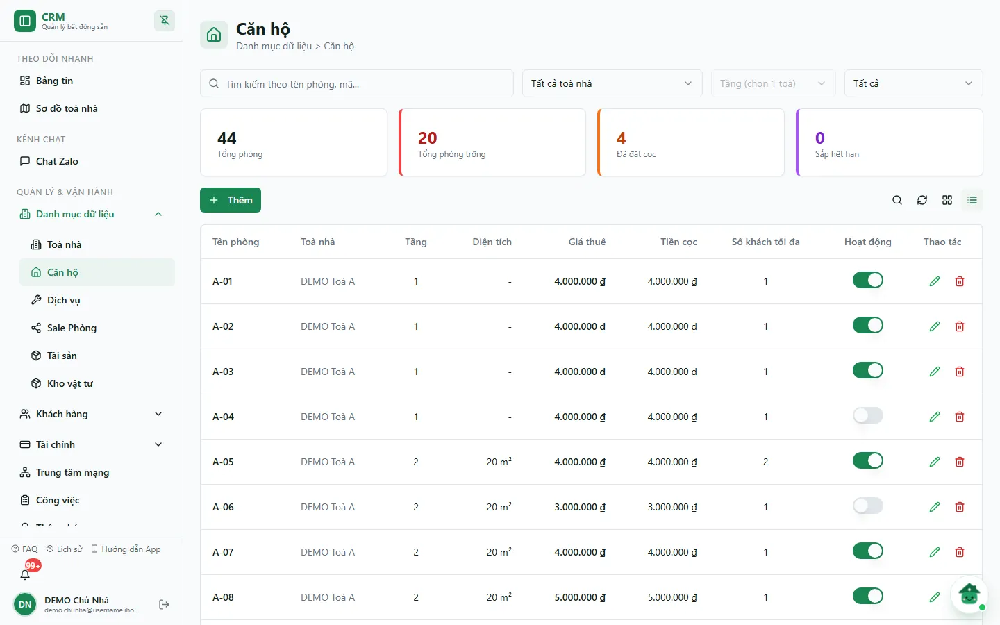
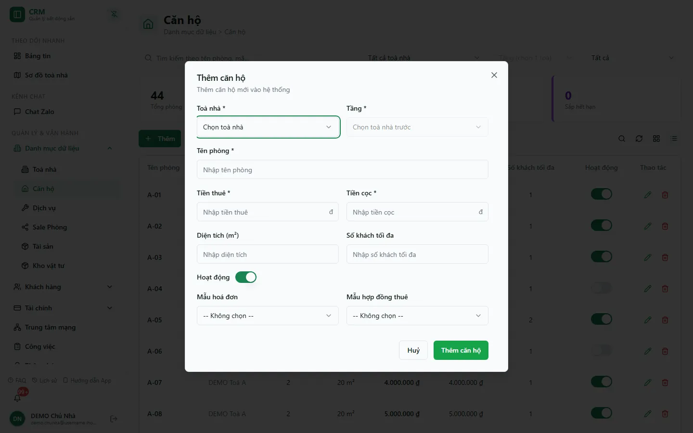

# Căn hộ / Phòng

Màn **Căn hộ** là nơi bạn tra cứu và quản lý toàn bộ phòng: lọc nhanh theo toà, tầng và trạng thái, xem giá thuê và tiền cọc niêm yết của từng phòng, cập nhật việc dọn/sửa phòng sau khi khách trả, thêm/sửa/xoá phòng. Dùng màn này khi cần nắm "phòng nào còn trống, phòng nào sắp hết hạn" hoặc khi cần chỉnh thông tin một phòng.

Điểm quan trọng: **trạng thái phòng tự đổi theo hợp đồng và tiền cọc** — bạn hầu như không phải chỉnh tay. Khi có hợp đồng hiệu lực, phòng thành **Đang thuê**; khi có giữ chỗ/cọc chưa ký hợp đồng, phòng thành **Đã đặt cọc**; khi hợp đồng kết thúc và không còn cọc, phòng tự về **Trống**.

::: info Điều kiện tiên quyết
- Quyền **Căn hộ => Xem** (module `rooms`, action `view`) để mở màn danh sách.
- Cần quyền **Sửa** trên phòng nếu muốn đổi thông tin, bật/tắt hoặc xoá phòng.
- Đã có ít nhất một **toà nhà** (đang hoạt động) và **tầng** trong hệ thống. Nếu chưa, tạo trước theo trang [Tạo tầng & phòng](/01-bat-dau/tao-tang-phong/).
- Là nhân viên, bạn chỉ thấy phòng thuộc các toà được gán phạm vi cho mình.
:::

## Hướng dẫn từng bước

**Bước 1**: Tại menu bên trái, ấn chọn **Danh mục dữ liệu** => **Căn hộ**. Màn hiện hàng bộ lọc, 4 thẻ thống kê (**Tổng phòng** / **Tổng phòng trống** / **Đã đặt cọc** / **Sắp hết hạn**) và bảng phòng (sắp theo toà rồi tới tên phòng) với các cột **Tên phòng**, **Toà nhà**, **Tầng**, **Diện tích**, **Giá thuê**, **Tiền cọc**, **Số khách tối đa**, **Hoạt động**, **Thao tác**.

::: tip Giá trên bảng là giá niêm yết
Cột **Giá thuê** / **Tiền cọc** ở bảng này là giá **niêm yết** của phòng. Phòng đang thuê có thể ký hợp đồng với giá khác — giá đang thu xem ở [hợp đồng](/03-quan-ly-van-hanh/hop-dong-chi-tiet/) hoặc [Sơ đồ toà nhà](/02-theo-doi-nhanh/so-do-toa-nha/) (số đậm là giá hợp đồng, số mờ bên cạnh là giá niêm yết khi hai số lệch).
:::

**Bước 2**: Tại ô **Tất cả toà nhà** (danh sách phẳng A→Z, gõ để tìm), chọn đúng **1 toà** hoặc giữ tất cả. Danh sách và 4 thẻ thống kê tính lại theo phạm vi đang lọc.

**Bước 3**: Khi đã chọn đúng 1 toà, ô **Tầng** mới bật lên. Chọn **Tầng N** để thu hẹp danh sách; nếu chưa chọn toà, ô hiện mờ với chữ "Tầng (chọn 1 toà)".

**Bước 4**: Tại ô trạng thái (mặc định **Tất cả**), chọn **Đang hoạt động** (phòng trống) / **Đã đặt cọc** / **Ngừng hoạt động**. Kết hợp ô **Tìm kiếm theo tên phòng, mã...** để tìm đúng phòng.

**Bước 5**: Muốn thêm phòng mới, ấn **Thêm** để mở hộp thoại **Thêm căn hộ**. Điền **Toà nhà \*** (chỉ liệt kê toà đang hoạt động), **Tầng \*** (đổ theo toà đã chọn), **Tên phòng \***, **Tiền thuê \***, **Tiền cọc \***, và tuỳ chọn **Diện tích (m²)**, **Số khách tối đa**, công tắc **Hoạt động**, **Mẫu hoá đơn**, **Mẫu hợp đồng thuê**, rồi ấn **Thêm căn hộ**. Nếu chưa có toà/tầng phù hợp, dùng mục **Thêm toà nhà** hoặc **Thêm tầng** ngay trong hai ô đó để tạo nhanh.

**Bước 6**: Cần sửa, ấn biểu tượng bút chì ở cột **Thao tác** để mở hộp thoại **Sửa căn hộ**, chỉnh xong ấn **Cập nhật**. Cuối form có mục **Lịch sử giá** — ghi tự động mỗi lần giá phòng đổi hoặc hợp đồng ký lệch giá niêm yết. Muốn bỏ một phòng, ấn biểu tượng thùng rác — phòng được ẩn khỏi danh sách và số phòng của toà tự trừ đi.

**Bước 7**: Khi có phòng vừa trả cần dọn/sửa, đầu màn hiện khối **Dọn/sửa cần cập nhật (n)** liệt kê từng phòng kèm ngày dự kiến xong (hoặc "Quá ngày dự kiến xong" / "Chưa hẹn ngày xong"). Ấn **Cập nhật dọn/sửa** để chọn **Tình trạng** (**Đang dọn/sửa** / **Đã sẵn sàng nhận khách**), **Ngày dự kiến xong**, **Người phụ trách**, **Lý do / ghi chú**, rồi ấn **Lưu theo dõi**. Khi danh sách trống, khối này không hiện.

::: tip Trạng thái phòng do hệ thống tự tính
4 thẻ thống kê suy ra từ **hợp đồng đang hiệu lực** và **giữ chỗ/cọc**, không phải từ một ô bạn tự đặt. Hợp đồng còn 1–30 ngày hết hạn thì phòng được đếm vào **Sắp hết hạn**; có giữ chỗ/cọc chưa ký hợp đồng thì vào **Đã đặt cọc**.
:::

::: warning Công tắc Hoạt động chỉ dùng cho phòng trống
Công tắc **Hoạt động** trên dòng phòng bật khi phòng đang **Trống** và tắt với mọi trạng thái khác (đang thuê, đã đặt cọc, ngừng hoạt động). Chỉ dùng nó để chuyển giữa **Trống** và **Ngừng hoạt động**. Nếu bật ON một phòng đang có khách, hệ thống đặt thẳng phòng về **Trống** và có thể "mở bán" nhầm. Muốn ngừng nhận khách một phòng trống, hãy tắt công tắc thay vì xoá phòng.
:::

## Trang chi tiết căn hộ

Trang **chi tiết căn hộ** (`/apartments/<mã phòng>`) mở từ danh sách **phòng trống** trên [Bảng tin](/02-theo-doi-nhanh/bang-tin/). Đầu trang có khối **Theo dõi dọn/sửa** và khối **Giữ chỗ / Cọc trước hợp đồng** của phòng; bên dưới là các tab **Thông tin chung** (thông tin căn hộ, thông tin tài chính, tiện ích, **Thông tin tòa nhà** — ấn tên toà để mở trang chi tiết toà, **Hợp đồng hiện tại**), **Khách hàng (n)**, **Hợp đồng (n)**, **Tài sản (n)**, **Hóa đơn (n)**. Trên [Sơ đồ toà nhà](/02-theo-doi-nhanh/so-do-toa-nha/), bấm vào ô phòng sẽ mở hộp chi tiết phòng có cùng các khối này.

## Các tính năng khác trên màn hình

| Nút / Bộ lọc | Công dụng |
| --- | --- |
| Ô tìm kiếm | Tìm nhanh phòng theo tên hoặc mã; áp ngay vào danh sách và các thẻ thống kê. |
| Ô **Tất cả toà nhà** | Chọn đúng **1 toà** hoặc tất cả. Là cửa mở khoá ô Tầng; đổi toà thì ô Tầng tự về **Tất cả tầng**. |
| Ô **Tầng** | Chỉ bật khi đã chọn đúng 1 toà; lọc phòng theo tầng của toà đó. |
| Ô trạng thái | **Tất cả** / **Đang hoạt động** (trống) / **Đã đặt cọc** / **Ngừng hoạt động**. |
| Thẻ **Tổng phòng / Tổng phòng trống / Đã đặt cọc / Sắp hết hạn** | Thống kê nhanh theo danh sách đang lọc. |
| **Thêm** | Mở hộp thoại **Thêm căn hộ**. |
| Biểu tượng **Làm mới** / **Dạng lưới** / **Dạng danh sách** | Tải lại danh sách và đổi kiểu hiển thị. |
| Công tắc **Hoạt động** | Chuyển nhanh một phòng giữa **Trống** và **Ngừng hoạt động** (xem cảnh báo ở trên). |
| Bút chì / thùng rác | Sửa phòng / xoá mềm phòng (số phòng của toà tự trừ). |
| **Cập nhật dọn/sửa** | Ghi tiến độ dọn/sửa phòng sau trả phòng (khối chỉ hiện khi có việc). |

## Tình huống & lỗi thường gặp

| Tình huống | Cách xử lý |
| --- | --- |
| Danh sách trống dù chắc chắn có phòng | Thường do quyền: nhân viên chỉ thấy phòng thuộc toà được gán phạm vi. Kiểm tra lại phân quyền, hoặc kiểm tra ô tìm kiếm/bộ lọc còn dính giá trị cũ. |
| Ô **Tầng** bị mờ, không chọn được | Ô Tầng chỉ bật khi đã chọn đúng **1 toà**. Chọn một toà cụ thể trước. |
| Lưu phòng báo "Tên căn hộ đã có trong tòa nhà này." | Tên phòng phải **duy nhất trong cùng một toà**. Đổi tên khác (mã phòng thì không bắt buộc duy nhất). |
| Không chọn được toà trong form thêm phòng | Ô Toà chỉ liệt kê toà **đang hoạt động**. Bật lại hoạt động cho toà ở màn [Toà nhà](/03-quan-ly-van-hanh/toa-nha/), hoặc dùng **Thêm toà nhà** để tạo nhanh. |
| Giá trên bảng khác giá khách đang trả | Bảng hiện giá niêm yết; giá hợp đồng có thể khác (ký lại, giảm giá giữ khách, tăng khi gia hạn). Xem giá ở chi tiết hợp đồng. |
| Phòng vẫn tính **Đang thuê** dù đã kết thúc hợp đồng | Trạng thái tự tính theo hợp đồng còn hiệu lực. Kiểm tra lại hợp đồng của phòng — nếu còn một hợp đồng đang chạy hoặc ca thanh lý chưa xong thì phòng chưa về Trống. |
| Phòng tự chuyển sang **Đã đặt cọc** mà không ai đặt tay | Kiểm tra giữ chỗ/phiếu cọc chưa gắn hợp đồng ở [Đặt cọc](/03-quan-ly-van-hanh/dat-coc/). Phiếu cọc chờ duyệt không đồng nghĩa đã thu tiền; chỉ trạng thái ghi sổ **POSTED** mới chứng minh tiền đã vào sổ quỹ. |

## Thử trực tiếp trên sandbox

<SandboxTry account="demo.chunha" app-path="/apartments" app-label="Mở màn Căn hộ" fixtures="Snapshot 07/10/2026: 44 phòng ở 4 toà DEMO, 20 phòng trống, 4 đã đặt cọc, 0 sắp hết hạn." view-only>

Thực hành lọc và đọc thông tin phòng:

1. Tại ô **Tất cả toà nhà**, chọn **DEMO Toà A** và kiểm tra danh sách chỉ còn các phòng A-xx; ô **Tầng** bật lên.
2. Chọn thêm trạng thái **Đang hoạt động** để xem những phòng còn trống; để ý 4 thẻ thống kê cập nhật lại.
3. Ấn **Thêm** để xem các ô của hộp thoại **Thêm căn hộ**, rồi ấn **Huỷ** — không bấm **Thêm căn hộ**.

Kết quả mong đợi: bạn lọc được phòng theo toà, tầng, trạng thái và nắm được các trường khi tạo phòng.

</SandboxTry>

## Quy trình liên quan

- [Toà nhà](/03-quan-ly-van-hanh/toa-nha/) — quản lý danh sách toà, mở nhanh danh sách phòng của từng toà.
- [Tạo tầng & phòng](/01-bat-dau/tao-tang-phong/) — tạo mới tầng và phòng khi khởi tạo dữ liệu.
- [Sơ đồ toà nhà](/02-theo-doi-nhanh/so-do-toa-nha/) — xem trực quan tình trạng phòng và giá đang thu theo toà, tầng.
- [Dịch vụ](/03-quan-ly-van-hanh/dich-vu/) — cấu hình dịch vụ và đơn giá áp cho từng toà, dùng khi lập hoá đơn phòng.
- [Đặt cọc](/03-quan-ly-van-hanh/dat-coc/) — giữ chỗ và cọc trước hợp đồng làm phòng thành **Đã đặt cọc**.
