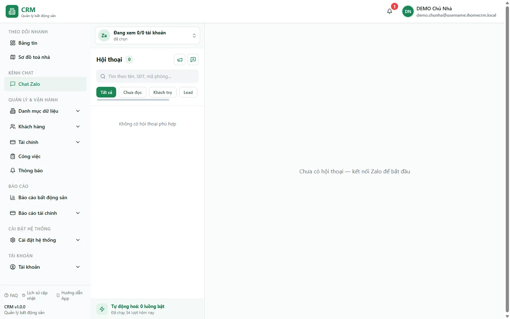

# Chat Zalo — hội thoại

Màn **Chat Zalo** đưa kênh Zalo vào thẳng CRM: bạn nhắn tin 2 chiều với khách trọ, khách tiềm năng (lead) hay môi giới ngay trong web, không phải mở app Zalo riêng. Khi có và chọn một hội thoại, màn hình mở thành **workspace 3 cột** — **danh sách hội thoại** bên trái, **khung chat** ở giữa, **panel thông tin** bên phải — cùng với gửi tin theo **nhãn phân loại** hàng loạt và **thông báo đẩy (Web Push)** mỗi khi có tin mới. Dùng trang này để chăm sóc khách, tư vấn lead và nhắc nhở mà vẫn giữ toàn bộ lịch sử trong hệ thống.

Trang `/chat-zalo` là hệ **Chat Zalo hiện hành** dùng nhóm quyền `chat_zalo.*`. (Hệ OpenClaw Zalo từng chạy song song đã bị xóa toàn bộ 30/08/2026.)

Điểm cần nắm trước: web **không** nói chuyện trực tiếp với Zalo. Một **tài khoản Zalo** phải được kết nối vào hệ thống (quét mã QR) và một tiến trình nền giữ phiên đăng nhập; web chỉ đọc/ghi dữ liệu qua hệ thống rồi được đẩy tin về theo thời gian thực. Vì vậy **nếu chưa kết nối tài khoản Zalo nào thì danh sách hội thoại sẽ trống** — kể cả trên tài khoản demo (xem phần Thử trực tiếp).

::: info Điều kiện tiên quyết
- Quyền **Chat Zalo => Xem** (module `chat_zalo`, action `view`) để mở trang `/chat-zalo`. Không có quyền này thì mục **Chat Zalo** bị ẩn khỏi menu nhóm **Kênh chat**.
- Quyền **Gửi** (`send`) để nhắn tin, thả cảm xúc, thu hồi và gửi hàng loạt; **Quản lý mẫu tin** (`manage_templates`) để thêm/sửa/xoá thư viện mẫu; **Quản lý tự động hoá** (`manage_automation`) để bật/tắt hai công tắc tự động hoá.
- Một **tài khoản Zalo đã kết nối** và tiến trình nền đang chạy — đây là thứ thực sự gửi/nhận tin với Zalo. Chưa kết nối thì danh sách trống, gửi tin sẽ nằm chờ chứ không đi.
- Nên dùng một **tài khoản Zalo phụ riêng** cho việc kết nối (không dùng nick chính), vì đây là kênh Zalo cá nhân — mở cùng nick đó ở nơi khác có thể làm rớt phần nhận tin. Kênh **Zalo OA / ZNS** được chừa sẵn cho giai đoạn sau, hiện chưa dùng.
:::

## Hướng dẫn từng bước

**Bước 1**: Mở **Kênh chat** => **Chat Zalo**. Khi đã chọn một hội thoại, workspace có thể mở đủ 3 cột: **danh sách hội thoại** (bên trái), **khung chat** (giữa) và **panel thông tin** (phải). Snapshot production ngày 13/08/2026 của `demo.chunha` không có hội thoại, nên ảnh chỉ thể hiện danh sách/empty state và vùng chọn hội thoại; **panel thông tin chưa xuất hiện**. Trên điện thoại, các vùng chuyển thành từng màn thay vì đứng cạnh nhau.

**Bước 2**: Kết nối một tài khoản Zalo. Ở đầu danh sách hội thoại có ô **chọn tài khoản**; bấm **Kết nối Zalo cá nhân**. Một hộp thoại hiện **mã QR** — mở app Zalo trên điện thoại (tài khoản phụ), vào quét mã. Kết nối xong, trạng thái tài khoản chuyển sang **đã kết nối** và hệ thống bắt đầu **đồng bộ danh bạ, nhóm và các tin gần đây** vào danh sách hội thoại. Nếu mã QR hết hạn, bấm kết nối lại để lấy mã mới. Cùng ô này còn có thao tác **kết nối lại** / **ngắt kết nối** cho từng tài khoản.

::: warning Đây là kênh Zalo cá nhân — dùng nick phụ
Kết nối chạy qua Zalo cá nhân nên có rủi ro bị Zalo hạn chế nếu gửi quá nhiều như spam. Hãy dùng **một tài khoản Zalo phụ dành riêng**, đừng dùng nick cá nhân chính. Mỗi tài khoản chỉ nên có **một nơi nhận tin** — nếu bạn đăng nhập cùng nick đó trên Zalo Web ở máy khác, phần nhận tin của CRM có thể bị đá rớt (hệ thống sẽ tự đăng nhập lại từ phiên đã lưu).
:::

**Bước 3**: Tìm và mở hội thoại. Danh sách sắp theo tin mới nhất. Gõ vào **ô tìm kiếm** để lọc theo **tên**, **số điện thoại**, hoặc **mã phòng**; dùng các chip **Tất cả · Chưa đọc · Khách trọ · Lead** để thu hẹp, hoặc bấm **bộ lọc nhãn** để chỉ xem hội thoại thuộc một **nhãn phân loại**. Bấm vào một hội thoại để mở **khung chat** — hệ thống tự **đánh dấu đã đọc** (số chưa đọc về 0).

**Bước 4**: Nhắn tin. Ở ô soạn dưới khung chat, gõ nội dung rồi nhấn **Enter** để gửi. Bong bóng tin của bạn hiện lên ngay (nếu gửi lỗi sẽ tự thu lại), và có dấu tick chuyển từ **đã gửi** sang **đã xem** khi đối phương đọc. Bấm **mẫu tin** để chèn nhanh một câu soạn sẵn vào ô. Muốn trả lời trích dẫn một tin cụ thể, dùng thao tác **trả lời** trên tin đó.

Nếu có quyền `chat_zalo.manage_templates`, bấm biểu tượng **Quản lý mẫu tin** trong thư viện mẫu để mở hộp thoại thêm, sửa, bật/tắt hoặc xoá mẫu dùng chung cho công ty. Nội dung mẫu được chèn vào ô soạn để bạn kiểm tra trước khi gửi.

::: tip Gửi ảnh/file từ web đang được hoàn thiện
Bốn nút **biểu tượng cảm xúc / gửi ảnh / đính kèm / ghi âm** cạnh ô soạn hiện là chỗ dành sẵn — **gửi media từ web chưa bật**. Trước mắt bạn gửi **văn bản** và **trả lời (reply)**; còn ảnh/video từ phía khách gửi tới vẫn hiển thị và xem được bình thường.
:::

**Bước 5**: Thao tác trên từng tin. Trỏ vào một bong bóng để hiện menu: **thả cảm xúc** (emoji), **thu hồi** (chỉ với tin **do bạn gửi đi**), và **Chia sẻ** (chuyển nội dung tin sang hộp thoại gửi hàng loạt). Với hội thoại **nhóm**, đầu khung chat có nút **Tải thêm tin cũ** để kéo về lịch sử cũ hơn.

::: warning Thu hồi và tải tin cũ chạy nền, chờ vài giây
**Thu hồi** chỉ áp dụng cho tin bạn đã gửi đi và **không lấy lại được** sau khi đối phương đã đọc — cân nhắc trước khi bấm. Cả **thu hồi**, **thả cảm xúc** và **tải thêm tin cũ** đều được đẩy xuống tiến trình nền xử lý, nên có thể mất vài giây mới thấy kết quả cập nhật trong khung chat.
:::

**Bước 6**: Gửi tin hàng loạt (broadcast). Bấm nút **loa** ở đầu danh sách để mở hộp thoại gửi hàng loạt: lọc người nhận theo **nhãn phân loại** + **tìm kiếm**, dùng **Chọn tất cả** (chỉ chọn trong tập đang lọc), soạn nội dung rồi gửi. Hệ thống báo **đã gửi tới N hội thoại**; tiến trình nền gửi **tuần tự, có giãn nhịp** để tránh bị Zalo coi là spam.

::: warning Gửi hàng loạt khó thu hồi
Một lần broadcast gửi đi cho **nhiều người cùng lúc** và **không có nút hoàn tác cả lô**. Hãy kiểm tra kỹ tập người nhận (đúng nhãn, đã bỏ những hội thoại không phù hợp) và nội dung trước khi bấm gửi.
:::

**Bước 7**: Xem thông tin & tự động hoá. **Panel thông tin** bên phải có 2 tab. Tab **Thông tin** hiển thị hồ sơ liên hệ / thành viên nhóm / mô tả của hội thoại đang mở. Tab **Tự động hoá** có hai công tắc **Gửi ảnh phòng trống** và **Tự động trả lời**.

Bấm **Cài đặt chi tiết** trong tab đó để mở màn cài đặt đầy đủ.

### Gửi ảnh phòng trống định kỳ

Máy tự gửi danh sách phòng trống cho nhóm Zalo môi giới và các sale bạn chọn. Hai chế độ:

| Chế độ | Máy gửi gì |
|---|---|
| **Gọn** | Lời mở đầu kèm link tổng + **ảnh bảng danh sách** (đúng bảng Excel bạn vẫn gửi tay) |
| **Đầy đủ** | Như trên, **cộng thêm** chi tiết và ảnh của từng phòng — mỗi phòng một tin |

Bạn chọn chế độ **cho từng thứ trong tuần**, rồi hai quy tắc dưới đây tự điều chỉnh theo tình hình thật:

- **Có phòng trống mới** so với lần gửi trước → máy tự nâng ngày "Gọn" thành "Đầy đủ", vì hôm đó thật sự có thứ đáng khoe.
- **Danh sách y hệt lần trước** → máy **bỏ lượt**, không gửi. Nhận một bảng giống hệt nhau mỗi sáng là cách nhanh nhất khiến cả nhóm tắt thông báo, và nhóm đã tắt thông báo thì mọi tin sau đó đều vô ích.
- **Phòng vừa trống trong ngày** → máy gom lại vài chục phút rồi gửi bổ sung riêng phòng đó, thay vì bắn từng cái một.

::: warning Ai nhận tin — phải tự chọn, máy không đoán
Máy **chỉ** gửi cho những hội thoại bạn tick trong mục **Người nhận**, và danh sách đó chỉ hiện **nhóm Zalo** cùng những hội thoại bạn đã **đánh dấu là Sale**. Muốn thêm một môi giới: mở hội thoại của họ ▸ tab **Thông tin** ▸ bật **Sale / Môi giới**. Đây là chủ ý — máy không tự đoán ai là môi giới, để không có chuyện bắn bảng giá vào mặt một khách đang khiếu nại.
:::

### Tự động trả lời sale

Khi một sale/môi giới nhắn đến và tin **khớp từ khoá** bạn cài (mặc định: *phòng, giá, trống, còn ko, xem phòng*), máy trả lời ngay bằng danh sách phòng trống mới nhất — kể cả ngoài giờ làm việc.

Ba giới hạn có sẵn, nên biết để không bất ngờ:

- **Chỉ hội thoại đã đánh dấu Sale** mới được trả lời. Khách thuê nhắn tin thì máy im lặng.
- **Tin nhắc đến tiền, cọc, hợp đồng, thanh toán, khiếu nại → máy KHÔNG trả lời**, để người thật xử lý. Chuyện tiền bạc và hợp đồng trả lời sai là chuyện pháp lý, không phải chuyện chăm sóc khách hàng.
- **Chống lặp**: đã trả lời một hội thoại thì im lặng trong khoảng thời gian bạn cài (mặc định 30 phút), dù họ hỏi thêm mấy lần.

### Các phanh an toàn (đừng tắt nếu chưa hiểu)

Kênh này chạy trên **tài khoản Zalo cá nhân**, mà Zalo có cơ chế phát hiện hành vi máy. Vì vậy màn cài đặt có sẵn: **khung giờ được phép gửi**, **giãn nhịp giữa từng người nhận**, **giãn nhịp giữa các tin phòng**, **số phòng tối đa gửi chi tiết mỗi lượt**, và **trần tổng số tin máy gửi mỗi ngày**. Nới rộng các con số này làm tin đi nhanh hơn, đổi lại tăng rủi ro **khoá nick Zalo của công ty**.

### Nút Dừng khẩn cấp — khi cần chặn ngay

Nút đỏ **Dừng khẩn cấp** nằm trong tab Tự động hoá, ngay trên "Cài đặt chi tiết", và **luôn hiện** kể cả khi hai công tắc đang tắt.

::: warning Vì sao gạt công tắc là chưa đủ
Khi tới lượt, máy xếp **cả lô tin** vào hàng chờ với giờ gửi rải sẵn — một lượt đầy đủ có thể là vài chục tin trải ra hàng chục phút. Gạt công tắc chỉ ngăn **lượt sau**; lô đang bay vẫn lần lượt đi ra. Muốn chặn lô đang bay thì phải bấm **Dừng khẩn cấp**.
:::

Bấm nút này sẽ: huỷ mọi tin tự động đang chờ, đánh dấu chúng là không gửi được trong khung chat, và tắt cả hai công tắc.

Ba điều cần biết trước khi bấm:

- **Tin bạn tự gõ tay không bị ảnh hưởng** — nút chỉ đụng tin do máy tạo.
- **Nếu có một tin đang được gửi dở thì nó vẫn đi ra.** Không chặn được giữa chừng một lời gọi tới Zalo; hộp xác nhận sẽ cho bạn biết còn bao nhiêu tin ở tình trạng đó.
- **Tin đã huỷ không dựng lại được.** Muốn gửi thì bật lại và chờ lượt sau.

Mỗi lần bấm đều được ghi vào Nhật ký với nhãn riêng, kèm số tin đã huỷ.

### Nhật ký — cách biết máy còn sống

Mục **Nhật ký** ghi mọi lượt máy chạy, **kể cả lượt quyết định không gửi**, kèm lý do bằng tiếng Việt ("Danh sách không đổi so với lần gửi trước — bỏ lượt…"). Đây là chỗ để kiểm tra: nếu tài khoản Zalo rớt phiên, tự động hoá sẽ ngừng **im lặng** — không có tin nào gửi đi mà cũng không có lỗi nào hiện lên. Nhật ký trống nhiều ngày là dấu hiệu cần kiểm tra kết nối Zalo.

## Các tính năng khác trên màn hình

| Nút / Bộ lọc | Công dụng |
| --- | --- |
| Ô **chọn tài khoản** (đầu danh sách) | Xem **nhiều tài khoản Zalo cùng lúc** (bật/tắt từng nick hoặc xem tất cả); kèm nút **Kết nối Zalo cá nhân**, **kết nối lại**, **ngắt kết nối**. |
| **Ô tìm kiếm** | Lọc hội thoại theo tên, số điện thoại hoặc mã phòng (chạy trên danh sách đã tải). |
| Chip **Tất cả / Chưa đọc / Khách trọ / Lead** | Lọc nhanh; **Chưa đọc** chỉ hiện hội thoại còn tin chưa đọc. |
| **Bộ lọc nhãn** | Chỉ hiện hội thoại thuộc một **nhãn phân loại** (nhãn đồng bộ từ Zalo). |
| Nút **loa** (broadcast) | Gửi cùng một tin tới nhiều hội thoại theo nhãn + tìm kiếm. |
| **Mẫu tin** (trong ô soạn) | Chèn nhanh một câu soạn sẵn vào nội dung. |
| Thao tác trên tin | **Thả cảm xúc**, **Thu hồi** (tin mình gửi), **Chia sẻ / chuyển tiếp** sang hộp thoại gửi hàng loạt. |
| **Tải thêm tin cũ** | Kéo về lịch sử cũ hơn — chỉ có với hội thoại **nhóm**. |
| Tab **Thông tin / Tự động hoá** (panel phải) | Xem hồ sơ liên hệ/nhóm; bật/tắt hai công tắc tự động hoá. |

## Tình huống & lỗi thường gặp

| Tình huống | Cách xử lý |
| --- | --- |
| Vào trang nhưng **danh sách hội thoại trống** | Chưa có **tài khoản Zalo nào được kết nối** (hoặc tiến trình nền chưa chạy). Bấm **Kết nối Zalo cá nhân** và quét QR; sau khi kết nối, danh bạ và tin gần đây sẽ được đồng bộ vào danh sách. |
| Gõ tin, bấm gửi nhưng **tin không đi** (bong bóng đứng ở "đang gửi") | Tài khoản Zalo đang **mất kết nối** hoặc tiến trình nền dừng. Kiểm tra trạng thái tài khoản ở ô chọn tài khoản, bấm **kết nối lại**; tin đang chờ sẽ được gửi khi kết nối trở lại. |
| Bấm chip **Khách trọ** / **Lead** mà **không thấy hội thoại nào** | Hai bộ lọc này lọc theo phân loại hồ sơ CRM, nhưng việc **gắn hội thoại với hồ sơ khách/lead chưa được bật** — nên hiện chưa khớp gì. Dùng **bộ lọc nhãn** hoặc **ô tìm kiếm** để lọc thay thế. |
| Không thấy nút **thu hồi** trên một tin | Thu hồi **chỉ áp dụng cho tin do bạn gửi đi**. Tin của khách gửi tới không thu hồi được. |
| Không có nút **Tải thêm tin cũ** ở một hội thoại 1–1 | Tính năng tải lịch sử cũ hiện **chỉ hỗ trợ hội thoại nhóm**. Với chat 1–1, hệ thống giữ các tin gần đây đã đồng bộ. |
| Bật công tắc tự động hoá mà **không thấy tin tự gửi** | Mở **Nhật ký** trong tab Tự động hoá — nó ghi cả những lượt máy **cố ý không gửi** kèm lý do. Ba lý do hay gặp: chưa chọn người nhận nào; danh sách phòng không đổi so lần trước (máy bỏ lượt); ngoài khung giờ cho phép. Nhật ký hoàn toàn trống nhiều ngày = tài khoản Zalo đã rớt phiên, cần kết nối lại. |
| **Tự động trả lời** không phản hồi tin của một người | Kiểm ba điều: hội thoại đó đã bật **Sale / Môi giới** chưa; tin có khớp từ khoá nào không; tin có nhắc đến tiền/cọc/hợp đồng không (những tin đó máy cố ý không trả lời). |
| **Nhóm Zalo vừa lập không thấy trong CRM** | Danh sách nhóm chỉ được quét **một lần lúc kết nối tài khoản Zalo**. Nhóm lập sau đó chỉ xuất hiện khi có **tin nhắn đầu tiên** đi qua — nhắn đại một chữ vào nhóm là nó hiện ra sau vài giây. Cách khác: khởi động lại tiến trình nền, nó quét lại toàn bộ danh sách nhóm. |
| Không thấy nút **Quản lý mẫu tin** | Tài khoản thiếu quyền `chat_zalo.manage_templates`. Bạn vẫn có thể chèn các mẫu đang hoạt động, nhưng không thêm/sửa/xoá thư viện. |
| **Không nhận Web Push** khi có tin Zalo mới | Cần **cho phép thông báo** cho trang trên trình duyệt (trên iPhone phải "Thêm vào màn hình chính" trước). Xem thêm ở [Thông báo](/02-theo-doi-nhanh/thong-bao/). |
| Danh sách có quá nhiều dòng, tìm chậm | Danh sách gộp cả danh bạ và nhóm nên có thể rất dài; hãy **gõ tìm kiếm** theo tên/số điện thoại/mã phòng để lọc nhanh thay vì cuộn. |

## Thử trực tiếp trên sandbox

<SandboxTry account="demo.chunha" app-path="/chat-zalo" app-label="Mở màn Chat Zalo" fixtures="Snapshot 13/08/2026: 0 tài khoản, 0 hội thoại." view-only>

Đăng nhập và mở màn **Chat Zalo**. Đây là bài **chỉ xem giao diện** — snapshot DEMO chưa có hội thoại nên danh sách trống. Bạn nên nhìn thấy:

- Danh sách hội thoại/empty state và vùng yêu cầu chọn hội thoại. Panel thông tin bên phải chỉ xuất hiện sau khi có và chọn một hội thoại, nên ảnh hiện tại chưa thể hiện đủ ba vùng.
- Ô **chọn tài khoản** với nút **Kết nối Zalo cá nhân**, cùng **ô tìm kiếm**, các chip lọc **Tất cả · Chưa đọc · Khách trọ · Lead** và **bộ lọc nhãn**.
- Nút **loa** (gửi hàng loạt) ở đầu danh sách và panel thông tin bên phải với hai tab **Thông tin** / **Tự động hoá**.

Mục tiêu: làm quen chỗ đứng của từng khu vực trên màn hình để khi kết nối tài khoản Zalo thật, bạn biết ngay tìm và mở hội thoại, soạn tin và gửi hàng loạt ở đâu.

</SandboxTry>

## Quy trình liên quan

- [Thông báo](/02-theo-doi-nhanh/thong-bao/) — kênh Web Push đẩy tin Zalo mới lên thanh trạng thái điện thoại; bật cho phép thông báo tại đây.
- [Sale phòng](/03-quan-ly-van-hanh/sale-phong/) — nơi quản lý phòng trống mà công tắc **Gửi ảnh phòng trống** hướng tới khi tính năng tự động hoá được bật.
- [Nhân viên & đội ngũ](/05-cai-dat/nhan-vien-doi-ngu/) — phân công nhân viên và tổ chức đội ngũ chăm sóc khách.
- [Phân quyền](/05-cai-dat/phan-quyen/) — cấp các quyền **Chat Zalo** (Xem / Gửi / Quản lý mẫu tin / Quản lý tự động hoá) cho nhân viên.
