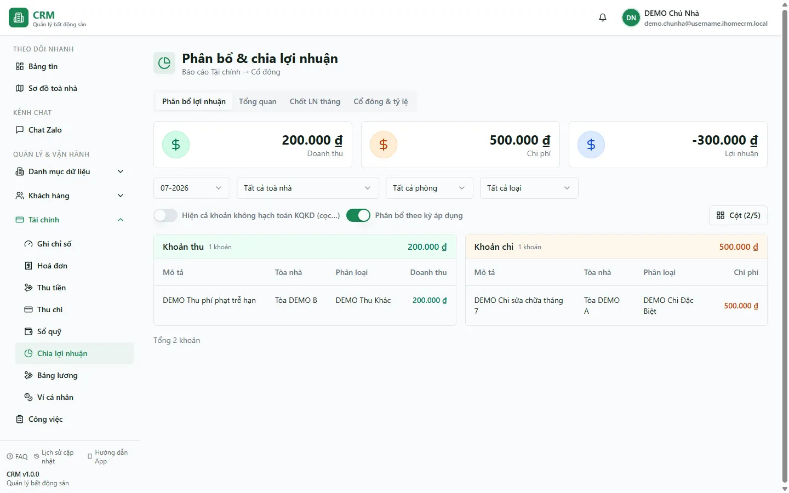

# Chia lợi nhuận cổ đông

Trang **Phân bổ & chia lợi nhuận** giúp bạn khai tỷ lệ góp vốn theo toà, xem lợi nhuận nguồn của tháng, trừ lương điều hành, chốt phần được chia và theo dõi số đã chi/còn lại.

Đây là route chuẩn `/reports/finance/profit-distribution`. Hai địa chỉ cũ `/finance/shareholder-profit` và `/reports/finance/shareholder-profit` chỉ chuyển hướng về trang này.

::: warning Tab quản trị đang ẩn trên giao diện
Trên **desktop**, nhấp nhanh **3 lần vào icon xanh bên trái tiêu đề "Báo cáo Lợi Nhuận"** để hiện các tab **Chốt LN tháng**, **Cổ đông & tỷ lệ** và **Lương của tôi** nếu tài khoản có quyền. Bản mobile hiện không có các tab chốt/cấu hình; hãy mở bằng máy tính hoặc bật chế độ trang desktop.
:::

Nguyên tắc chính:

**Phần được chia = (LN tự tính + Điều chỉnh − Lương điều hành) × tỷ lệ cổ đông.**

Lần chốt hiện hành do server tính và ghi trong một giao dịch có source hash, idempotency và revision. Bạn không còn mở khoá từng toà rồi xoá snapshot bằng tay như flow cũ.

::: info Điều kiện tiên quyết
- Có quyền `shareholder_profit.view`; thao tác chốt cần `lock`, đặt lại cần `unlock`, chi lợi nhuận cần `distribute`, và **Chi lương điều hành** cần `pay_manager`. Quyền `shareholder_profit.pay_manager` đã có trong danh mục Phân quyền và được cấp độc lập với quyền chi lợi nhuận cổ đông.
- Dùng desktop cho thao tác chốt/cấu hình và mở nhóm tab ẩn bằng 3 lần nhấp icon tiêu đề.
- Đã khai cổ đông, tỷ lệ theo toà và quản lý điều hành nếu có.
- Thu/chi của tháng đã được rà soát; xem [Quy trình chốt tháng](/01-bat-dau/quy-trinh-chot-thang/).
- Cấu hình active phải thuộc đúng tổ chức. Cổ đông/quản lý đã tắt hoạt động hoặc xoá mềm không nhận phần mới.
:::

## Hướng dẫn từng bước

**Bước 1: Mở trang và hiện tab quản trị.** Vào **Báo cáo tài chính => Báo cáo Lợi Nhuận** trên desktop. Nhấp nhanh 3 lần vào icon xanh bên trái tiêu đề; nếu có quyền, các tab **Chốt LN tháng**, **Cổ đông & tỷ lệ** và **Lương của tôi** sẽ hiện. Tài khoản có quyền ở nhiều tổ chức phải chọn đúng tổ chức trước khi thao tác.

**Bước 2: Kiểm tra cổ đông và tỷ lệ.** Ở tab **Cổ đông & tỷ lệ**, rà tên, trạng thái hoạt động, tài khoản đăng nhập và phần trăm theo từng toà. Tổng tỷ lệ active của một toà không được vượt 100%.

**Bước 3: Xem preview canonical.** Mở tab **Chốt LN tháng**. Bảng hiển thị:

- **Doanh thu / Chi phí / LN tự tính** từ nguồn accrual server;
- **Điều chỉnh có dấu**: nhập số dương hoặc âm;
- **Lý do điều chỉnh**: bắt buộc khi điều chỉnh khác 0;
- **Lương điều hành** do server tính theo quy tắc active;
- **LN chia cổ đông** và preview phần của từng người;
- source hash, trạng thái snapshot và cảnh báo **Cũ/Đã lệch nguồn** nếu dữ liệu đã thay đổi.

::: danger Không chốt khi preview chưa ổn định
Nếu preview đang tải lại, có lỗi nguồn, tỷ lệ vượt 100%, cấu hình sai tổ chức hoặc source hash đổi, hãy sửa dữ liệu rồi tải lại. Server sẽ từ chối ghi nếu nguồn đổi sau lúc bạn xem preview.
:::

**Bước 4: Chọn nhà rồi chốt.** Mỗi dòng trong bảng có một ô tick ở đầu. Mặc định hệ thống tick sẵn mọi nhà chưa chốt; bỏ tick những nhà chưa muốn chốt rồi bấm **Chốt N nhà đã chọn**. Sau xác nhận, chỉ những nhà đó có snapshot `LOCKED` và revision kiểm toán — các nhà còn lại giữ nguyên, **phiếu thu-chi của chúng vẫn sửa được bình thường**.

Dùng cách này khi muốn trả phần lợi nhuận của vài nhà trước (ví dụ nhà có nhân viên góp vốn) mà sổ sách các nhà khác chưa xong. Số nào đã chốt thì chảy ngay vào cột **Đầu tư** của bảng lương tháng đó.

::: warning Nhà dùng chung một quy tắc lương điều hành phải chốt cùng lúc
Quy tắc lương `TOTAL_GROUP` chia một khoản cho **cả nhóm nhà** theo lợi nhuận từng nhà. Tick một nhà trong nhóm thì hệ thống tự tick nốt các nhà còn lại và báo cho bạn biết vì sao (bỏ tick cũng bỏ cả nhóm). Đừng cố lách: chốt nửa nhóm sẽ dồn phần lớn khoản lương đó vào nhà đã chốt và làm sai số đã chia cho cổ đông của chính nhà đó — server chặn bằng thông báo **"Lương điều hành … phải chốt cùng lúc"**.
:::

**Bước 5: Chốt lại khi nguồn thay đổi.** Nếu nhà đã chốt nhưng thu/chi, tỷ lệ hoặc cấu hình lương thay đổi, màn hình đánh dấu snapshot **Cũ**. Tick đúng những nhà đó rồi bấm **Chốt lại N nhà đã chọn**, nhập lý do bắt buộc và xem preview mới. Chốt lại tạo revision mới; lịch sử cũ vẫn được giữ.

Vùng chọn **không được lẫn** nhà đã chốt với nhà chưa chốt: chốt và chốt lại là hai thao tác khác nhau, làm hai lượt.

**Bước 6: Mở khoá / Đặt lại theo nhà.** Nhà đã chốt xen nhà chưa chốt là **bình thường** — đó chính là cái bạn vừa làm ở Bước 4. Hai nút này cũng chạy trên đúng vùng đang tick:

- **Mở khoá N nhà đã chọn** — gỡ khoá để sửa phiếu của những nhà đó. Phần đã phân bổ cho cổ đông và quản lý của chúng **bị xoá**, snapshot về Nháp, sửa xong phải chốt lại.
- **Đặt lại N nhà đã chọn** — bỏ hẳn snapshot của những nhà đó để chốt mới từ đầu, cần nhập lý do.

Riêng khi tháng còn snapshot nằm trên **toà ảo hoặc toà đã xoá**, màn hình báo đỏ và bạn phải đặt lại các dòng đó trước khi chốt tiếp. Reset được bảo vệ bằng state hash và danh sách snapshot của **cả tháng**; nếu ai đó vừa chốt hoặc mở khoá nhà khác thì thao tác bị từ chối để bạn tải lại.

::: warning Đặt lại không xoá lịch sử kiểm toán
Thao tác bỏ snapshot hiện tại của những nhà đang chọn, nhưng revision trước đó vẫn tồn tại. Chỉ dùng khi màn hình yêu cầu hoặc khi trạng thái nhà đó thực sự không thể reclose an toàn.
:::

**Bước 7: Gửi yêu cầu chi lợi nhuận.** Ở tab **Tổng quan**, chọn cổ đông, số tiền, sổ quỹ, ngày và ghi chú rồi bấm **Chi lợi nhuận**. Hệ thống tạo request canonical có idempotency; nút **Chi lương điều hành** dùng writer tương tự và cần quyền `shareholder_profit.pay_manager`.

Việc **chốt/phân bổ** hoặc request được **duyệt** chưa chứng minh cổ đông hay quản lý đã nhận tiền. Chỉ request `POSTED` mới tạo biến động trên sổ quỹ thật; phiếu sau khi post nằm trên toà ảo **Chung**, gắn đúng cổ đông/quản lý và không tính lại vào KQKD, tránh trừ lợi nhuận hai lần.

## Thành phần trên màn hình

| Khu vực | Công dụng |
|---|---|
| **Phân bổ lợi nhuận** | Đối chiếu doanh thu, chi phí và lợi nhuận theo kỳ trước khi chốt |
| **Tổng quan** | Xem Được chia, Đã ứng/đã chi và Còn lại theo cổ đông/quản lý |
| **Chốt LN tháng** | Preview nguồn, điều chỉnh, close/reclose/reset và xem trạng thái revision |
| **Cổ đông & tỷ lệ** | Quản lý cổ đông, tỷ lệ theo toà, tài khoản và quản lý điều hành |
| Badge **Cũ / Đã lệch nguồn** | Snapshot hiện tại không còn khớp dữ liệu/cấu hình mới |
| **Source hash** | Mã nguồn preview dùng để chống chốt trên dữ liệu đã đổi |
| **Chốt lại tháng** | Tạo revision mới và thay snapshot đã chốt sau khi nhập lý do |
| **Đặt lại tháng** | Bỏ toàn bộ snapshot hiện tại của tháng khi state hỗn hợp/legacy |

## Tình huống thường gặp

| Tình huống | Cách xử lý |
|---|---|
| Không thấy tab quản trị | Dùng desktop và nhấp nhanh 3 lần icon xanh bên trái tiêu đề. Nếu vẫn không hiện, tài khoản thiếu quyền `lock`/`unlock`/`manage_shareholders`; cổ đông thuần chỉ xem phần của mình |
| Preview báo tỷ lệ vượt 100% | Sửa tỷ lệ active ở tab Cổ đông & tỷ lệ rồi tải lại |
| Snapshot hiện badge **Cũ** | Xem preview mới và dùng **Chốt lại tháng** với lý do |
| Báo trạng thái tháng không đồng nhất | Dùng **Đặt lại tháng**, sau đó chốt lại toàn bộ |
| Bấm chốt báo source conflict | Dữ liệu đổi sau preview; tải lại, kiểm số rồi xác nhận lại |
| Điều chỉnh bị từ chối | Số khác 0 phải có lý do 8–500 ký tự |
| Cổ đông inactive không có allocation mới | Đây là hành vi đúng; bật lại trước khi chốt nếu họ vẫn phải nhận phần |
| Bấm Chi nhưng chưa thấy giảm quỹ | Request còn chờ duyệt hoặc đã duyệt nhưng chưa `POSTED`; mở [Chờ duyệt](/03-quan-ly-van-hanh/cho-duyet/) để theo dõi. Nếu **Chi lương điều hành** bị từ chối quyền, kiểm tra tài khoản đã được cấp `shareholder_profit.pay_manager`. |
| Còn lại âm | Rà các phiếu chi đã post cho cổ đông ở [Thu chi](/03-quan-ly-van-hanh/thu-chi/) |

## Thử trực tiếp trên sandbox

<SandboxTry account="demo.chunha" app-path="/reports/finance/profit-distribution" app-label="Mở màn Chia lợi nhuận" fixtures="Dữ liệu demo có cổ đông và tỷ lệ" view-only>

1. Trên desktop, nhấp nhanh 3 lần icon xanh bên trái tiêu đề để hiện tab quản trị; mở **Cổ đông & tỷ lệ**, xem tỷ lệ theo toà và trạng thái active.
2. Sang **Chốt LN tháng**, chọn tháng và đọc preview: LN nguồn, điều chỉnh, lương điều hành, LN chia cổ đông, source hash. Tick đúng những nhà muốn chốt.
3. Quan sát badge trạng thái và nút **Chốt / Chốt lại / Đặt lại** tương ứng. Không xác nhận thao tác ghi trong bài xem thử.
4. Sang **Tổng quan** để đối chiếu Được chia, Đã ứng và Còn lại.

</SandboxTry>

## Quy trình liên quan

- [Quy trình chốt tháng](/01-bat-dau/quy-trinh-chot-thang/) — rà số vận hành trước Profit Close.
- [Chờ duyệt](/03-quan-ly-van-hanh/cho-duyet/) — duyệt request chi lợi nhuận/lương điều hành.
- [Thu chi](/03-quan-ly-van-hanh/thu-chi/) — xem phiếu chi đã được post.
- [Sổ quỹ](/03-quan-ly-van-hanh/so-quy/) — nguồn tiền của khoản chi sau duyệt.
- [Ví cá nhân](/03-quan-ly-van-hanh/vi-ca-nhan/) — sổ cá nhân, tách hoàn toàn khỏi lợi nhuận doanh nghiệp.
- [Bảng lương](/03-quan-ly-van-hanh/bang-luong/) — lương nhân viên vận hành, khác lương điều hành bị trừ trước khi chia.
