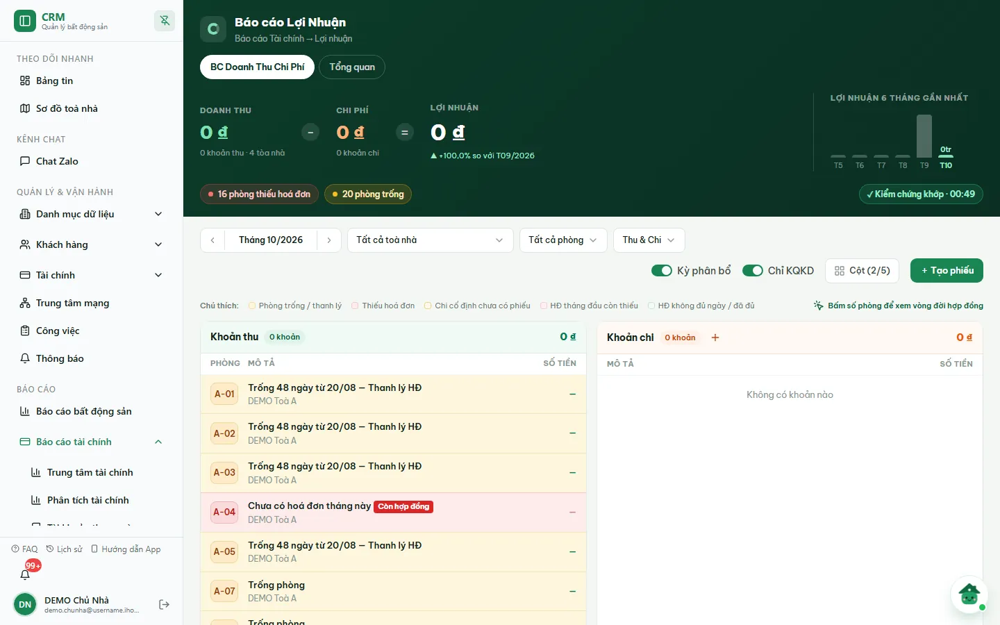
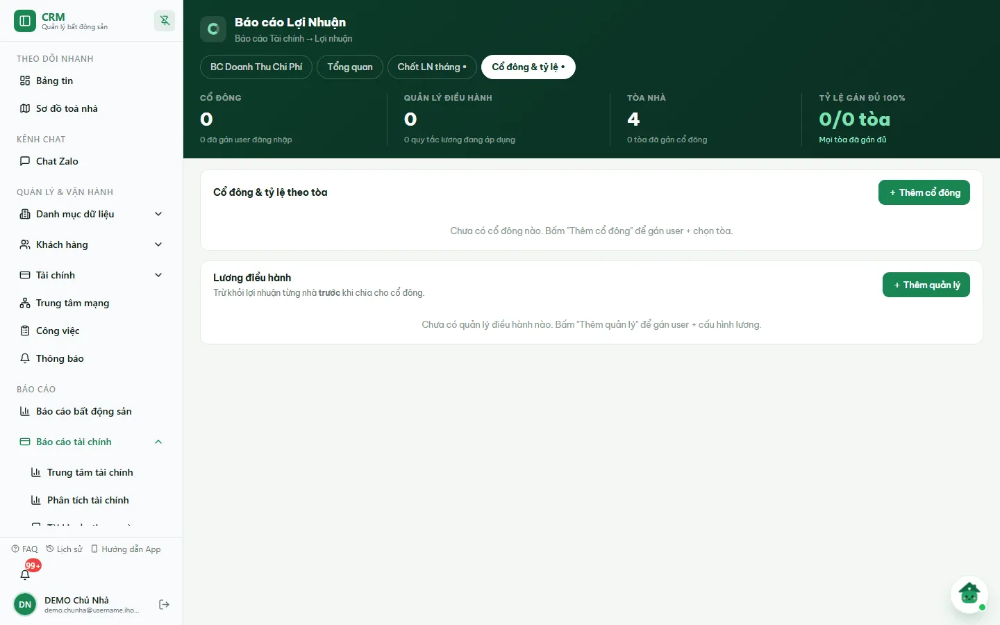
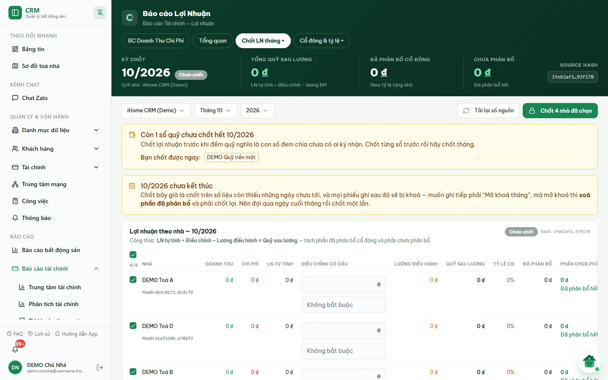
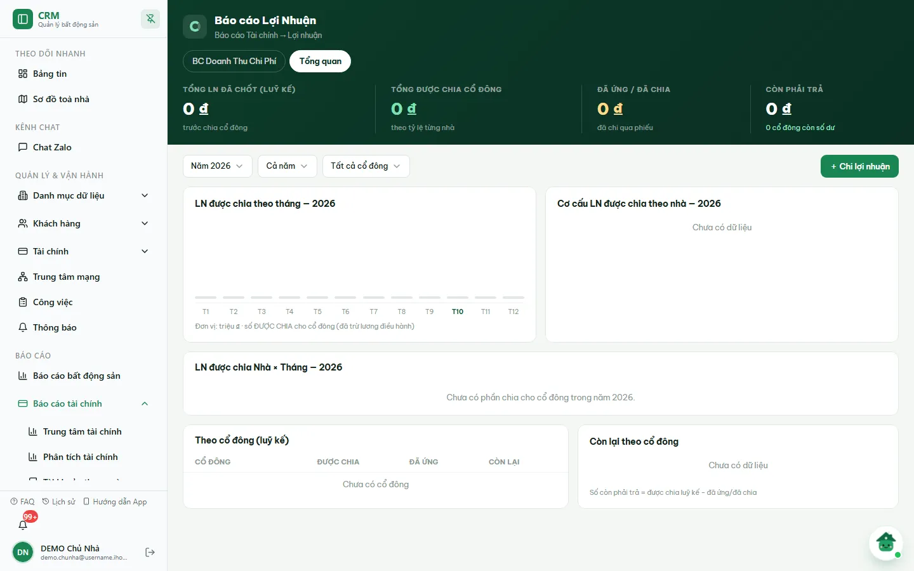

# Chia lợi nhuận cổ đông

Trang **Báo cáo Lợi Nhuận** gom báo cáo doanh thu – chi phí và toàn bộ nghiệp vụ chia lợi nhuận cổ đông vào một chỗ: khai tỷ lệ góp vốn theo toà, chốt lợi nhuận tháng theo từng nhà, trừ lương điều hành, quyết định phần chưa phân bổ và theo dõi số đã chi/còn phải trả cho từng cổ đông.

Route chuẩn là `/reports/finance/profit-distribution`. Các địa chỉ cũ `/finance/shareholder-profit`, `/reports/finance/shareholder-profit` và `/report/finance-by-month` **chỉ chuyển hướng** về trang này, không còn màn riêng.

::: info Điều kiện tiên quyết
- Mục menu **Báo cáo tài chính => Báo cáo Lợi Nhuận** (và ô **BC Lợi Nhuận** ở màn hình chính) hiện khi tài khoản có quyền `reports_finance.profit_distribution`.
- Tab **Tổng quan** (quản lý) cần `shareholder_profit.view`; **Chốt LN tháng** cần quyền chốt (`lock`) hoặc mở khoá (`unlock`) ở đúng tổ chức; **Cổ đông & tỷ lệ** cần `manage_shareholders`; **Chi lợi nhuận** cần `distribute`; **Chi lương điều hành** cần `pay_manager`.
- Thu/chi của tháng đã được rà soát và các sổ quỹ đã chốt hết tháng ở [Sổ quỹ](/03-quan-ly-van-hanh/so-quy/); xem [Quy trình chốt tháng](/01-bat-dau/quy-trinh-chot-thang/).
- Dùng **máy tính**: bản điện thoại chỉ có các tab **BC Thu Chi**, **Tổng quan**, **Của tôi**, không có tab chốt và cấu hình.
:::

## Hướng dẫn từng bước

**Bước 1**: Vào **Báo cáo tài chính => Báo cáo Lợi Nhuận**. Dải xanh đầu trang hiện các tab theo quyền của bạn: **BC Doanh Thu Chi Phí** (doanh thu, chi phí, lợi nhuận theo phòng/khoản trong tháng) và **Tổng quan**.

**Bước 2**: Hiện các tab quản trị. Các tab **Chốt LN tháng**, **Cổ đông & tỷ lệ** và **Lương của tôi** mặc định ẩn. Nhấp nhanh **3 lần** vào biểu tượng tròn bên trái tiêu đề **Báo cáo Lợi Nhuận**; tab ẩn hiện ra, có dấu **•** sau tên. Nhấp 3 lần nữa để ẩn lại.

**Bước 3**: Mở tab **Cổ đông & tỷ lệ** để kiểm tra cổ đông, tỷ lệ theo toà và quản lý điều hành. Dải trên cùng đếm **Cổ đông**, **Quản lý điều hành**, **Tòa nhà** và **Tỷ lệ gán đủ 100%**. Dùng **+ Thêm cổ đông** để gán tài khoản đăng nhập và chọn toà kèm tỷ lệ; dùng **+ Thêm quản lý** để khai quy tắc **Lương điều hành** — khoản này bị trừ khỏi lợi nhuận từng nhà **trước** khi chia cho cổ đông.

**Bước 4**: Mở tab **Chốt LN tháng**. Chọn **tổ chức**, **tháng**, **năm**; bấm **Tải lại số nguồn** nếu vừa sửa phiếu. Dải KPI hiện **Kỳ chốt** (Chưa chốt / Chốt một phần / Đã chốt toàn bộ, kèm số nhà đã chốt), **Tổng quỹ sau lương**, **Đã phân bổ cổ đông**, **Chưa phân bổ** và **Source hash**. Bảng **Lợi nhuận theo nhà** có các cột **Doanh thu**, **Chi phí**, **LN tự tính**, **Điều chỉnh có dấu** (kèm ô lý do), **Lương điều hành**, **Quỹ sau lương**, **Tỷ lệ CĐ**, **Đã phân bổ**, **Phần chưa phân bổ** và **Snapshot hiện tại**.

**Quỹ sau lương = LN tự tính + Điều chỉnh − Lương điều hành**; phần cổ đông nhận = Quỹ sau lương × tỷ lệ của họ ở nhà đó.

Trên bảng có thể xuất hiện các cảnh báo:

- **Còn N sổ quỹ chưa chốt hết tháng** — chỉ nhắc, không chặn. Hộp chia sổ theo việc của ai: **Bạn chốt được ngay** (bấm tên sổ để sang Sổ quỹ), **Chờ BẠN ký**, **Chờ người khác ký**, **Chờ người giữ sổ đề nghị**, **Chưa có người ký** (gán một người vai trò Kế toán toàn tổ chức).
- **Tháng chưa kết thúc** — chốt giữa tháng thì mọi phiếu ghi sau đó của nhà đã chốt bị khoá; nên đợi qua ngày cuối tháng.
- **Số đã chốt không còn khớp nguồn hiện tại** / nhãn **Đã lệch nguồn**, **Cũ** — dữ liệu thu chi, hạng mục, tỷ lệ hoặc cấu hình lương đã đổi sau lần chốt.

**Bước 5**: Xử lý **Phần chưa phân bổ**. Nhà có tổng tỷ lệ cổ đông dưới 100% sẽ còn phần dư. Với mỗi nhà đang chọn còn dư từ 0,01đ, chọn **Giữ lại lợi nhuận** (phần đó ở lại công ty) hoặc **Chuyển kỳ sau** (trở thành phần phải chia ở kỳ sau), và nhập lý do 8–500 ký tự. Thiếu lựa chọn hoặc lý do thì nút xác nhận chốt bị khoá.

::: tip Phần chưa chia thuộc về công ty
Phần % chưa gán cổ đông là phần của chính công ty. Thông thường chọn **Giữ lại lợi nhuận**; chỉ chọn **Chuyển kỳ sau** khi thật sự có cam kết chia phần đó ở kỳ sau.
:::

**Bước 6**: Chọn nhà rồi chốt. Mỗi dòng có ô tick; mặc định hệ thống tick sẵn mọi nhà chưa chốt (ô đầu bảng ghi số đã chọn, ví dụ `4/4`). Bỏ tick nhà chưa muốn chốt, bấm **Chốt N nhà đã chọn**, đọc hộp **Chốt N nhà của MM/YYYY?** rồi xác nhận **Chốt N nhà**.

- Server tính lại trên **toàn tháng** nhưng chỉ ghi những nhà đang chọn; nhà khác giữ nguyên và phiếu của chúng vẫn sửa được.
- Sau khi chốt, **mọi phiếu có ngày trong tháng** của các nhà đó bị khoá với mọi người, kể cả chủ công ty — gồm cả phiếu thu tiền của hoá đơn tháng đó dù phiếu mang ngày tháng sau.
- Nhà còn phiếu **Chờ duyệt** trong tháng thì server không cho chốt; lỗi nêu rõ mã phiếu cần duyệt hoặc huỷ trước.
- Nếu source hash đổi giữa lúc xem và lúc ghi, server từ chối để bạn tải preview mới.

::: warning Nhà dùng chung một quy tắc lương điều hành phải chốt cùng lúc
Quy tắc lương kiểu `TOTAL_GROUP` chia một khoản cho cả nhóm nhà theo lợi nhuận từng nhà. Tick một nhà trong nhóm thì hệ thống tự tick các nhà còn lại (bỏ tick cũng bỏ cả nhóm). Server chặn chốt nửa nhóm bằng thông báo **"Lương điều hành … phải chốt cùng lúc"**.
:::

**Bước 7**: Chốt lại khi nguồn thay đổi. Tick đúng những nhà đã chốt đang báo **Cũ/Đã lệch nguồn**, bấm **Chốt lại N nhà đã chọn**, nhập **Lý do chốt lại** rồi xác nhận. Chốt lại tạo revision mới; lịch sử cũ vẫn giữ. Vùng chọn **không được lẫn** nhà đã chốt với nhà chưa chốt — chốt và chốt lại phải làm hai lượt.

**Bước 8**: Mở khoá hoặc đặt lại khi cần sửa phiếu (cần quyền `unlock`). Hai nút chạy trên đúng những nhà đang tick:

- **Mở khoá N nhà đã chọn** — mở để sửa, lập hoặc huỷ phiếu có ngày trong tháng của những nhà đó. Bắt buộc ghi **Lý do mở khoá** 8–1000 ký tự; lý do được lưu cùng người mở. Phần đã phân bổ cho cổ đông và lương điều hành của những nhà này **bị xoá**, bản chốt về Nháp — sửa xong phải chốt lại.
- **Đặt lại N nhà đã chọn** — bỏ snapshot hiện tại để chốt mới từ đầu, cần lý do 8–1000 ký tự. Khi tháng còn snapshot trên **toà ảo hoặc toà đã xoá**, màn hình báo đỏ và nút đổi thành **Đặt lại cả tháng (gồm dòng legacy)**.

::: danger Mở khoá xoá phần đã phân bổ
Mở khoá không chỉ "cho sửa phiếu": nó xoá phân bổ cổ đông và lương điều hành của các nhà đó. Đặt lại vẫn giữ lịch sử revision để kiểm toán, nhưng server kiểm trạng thái **toàn tháng** trước khi ghi — nếu ai đó vừa chốt hoặc mở khoá nhà khác, thao tác bị từ chối để bạn tải lại.
:::

**Bước 9**: Chi lợi nhuận cho cổ đông. Mở tab **Tổng quan**: dải KPI hiện **Tổng LN đã chốt (luỹ kế)**, **Tổng được chia cổ đông**, **Đã ứng / đã chia**, **Còn phải trả**; bên dưới là biểu đồ theo tháng, theo nhà và bảng **Theo cổ đông (luỹ kế)** (Được chia / Đã ứng / Còn lại). Bấm **+ Chi lợi nhuận** (hoặc nút **Chi** trên dòng cổ đông), điền cổ đông, số tiền, sổ quỹ, ngày, ghi chú rồi **Ghi phiếu chi**. Nút **+ Chi lương điều hành** ở thẻ **Lương điều hành (luỹ kế)** dùng hộp tương tự và cần quyền `pay_manager`.

::: danger Đã chốt, đã duyệt chưa phải là đã chi tiền
Chốt/phân bổ chỉ xác định phần **được chia**. **Ghi phiếu chi** tạo một phiếu chi lợi nhuận; thông báo sau khi ghi cho biết phiếu đang chờ duyệt hay đã duyệt. Cột **Đã ứng / đã chia** cộng các phiếu đã **duyệt**. Tiền chỉ thật sự ra khỏi sổ quỹ khi phiếu ở trạng thái **Đã Chi** (`posting_status = POSTED`) — kiểm tra ở [Thu chi](/03-quan-ly-van-hanh/thu-chi/) hoặc [Sổ quỹ](/03-quan-ly-van-hanh/so-quy/). Phiếu chi lợi nhuận nằm trên toà ảo **Chung** và không tính lại vào KQKD, tránh trừ lợi nhuận hai lần.
:::

## Các tính năng khác trên màn hình

| Khu vực / Nút | Công dụng |
|---|---|
| Tab **BC Doanh Thu Chi Phí** | Doanh thu, chi phí, lợi nhuận theo tháng; lọc toà, phòng, Thu & Chi; công tắc **Kỳ phân bổ**, **Chỉ KQKD**; chip cảnh báo phòng thiếu hoá đơn/phòng trống; bấm số phòng để xem vòng đời hợp đồng trong năm |
| Tab **Tổng quan** | Số luỹ kế đã chốt, được chia, đã ứng/đã chia, còn phải trả theo cổ đông và lương điều hành |
| Tab **Chốt LN tháng** • | Preview nguồn, điều chỉnh có dấu, phần chưa phân bổ, chốt/chốt lại/mở khoá/đặt lại theo nhà |
| Tab **Cổ đông & tỷ lệ** • | Thêm/sửa/xoá cổ đông, tỷ lệ theo toà, quản lý điều hành và quy tắc lương điều hành |
| Tab **Lương của tôi** • | Quản lý điều hành đang đăng nhập tự xem phần lương điều hành của mình |
| Tab **Tổng quan** (cổ đông) | Cổ đông có quyền báo cáo nhưng không quản trị chỉ thấy phần lợi nhuận của chính mình |
| **Tải lại số nguồn** | Đọc lại preview và trạng thái chốt của tháng |
| **Bỏ chỉnh sửa** | Bỏ vùng chọn và điều chỉnh đang nhập, quay về gợi ý mặc định |
| **Source hash** | Mã nguồn của preview, dùng để chặn chốt trên dữ liệu đã đổi |

## Tình huống & lỗi thường gặp

| Tình huống | Nguyên nhân & cách xử lý |
|---|---|
| Không thấy tab Chốt LN tháng / Cổ đông & tỷ lệ | Dùng máy tính và nhấp nhanh 3 lần biểu tượng bên trái tiêu đề. Vẫn không hiện thì tài khoản thiếu quyền `lock`/`unlock`/`manage_shareholders` |
| Không thấy mục Báo cáo Lợi Nhuận ở menu | Thiếu `reports_finance.profit_distribution`; vẫn có thể mở trực tiếp route nếu có quyền `shareholder_profit` |
| Báo **Chọn tổ chức cần thao tác** | Tài khoản có quyền ở nhiều tổ chức; chọn đúng tổ chức ở ô đầu thanh công cụ |
| Nút xác nhận chốt bị khoá, báo **Chưa có cách xử lý phần lợi nhuận còn dư** | Chọn Giữ lại lợi nhuận/Chuyển kỳ sau và nhập lý do 8–500 ký tự cho từng nhà còn dư, hoặc bỏ tick các nhà đó |
| Báo **Còn N phiếu chờ duyệt trong tháng … của toà …** | Duyệt hoặc huỷ các phiếu được liệt kê ở [Chờ duyệt](/03-quan-ly-van-hanh/cho-duyet/) rồi chốt lại |
| Nút Chốt báo vùng chọn đang lẫn | Đang tick cả nhà đã chốt lẫn chưa chốt; tách thành hai lượt |
| Sau khi chốt không sửa được phiếu của tháng | Đúng thiết kế; dùng **Mở khoá N nhà đã chọn** (mất phần đã phân bổ, phải chốt lại) |
| Báo **Tháng còn snapshot của toà đã xoá hoặc toà ảo** | Bấm **Đặt lại cả tháng (gồm dòng legacy)** rồi chốt lại |
| Điều chỉnh bị từ chối | Số khác 0 phải có lý do |
| Bấm Chi nhưng sổ quỹ chưa giảm | Phiếu còn chờ duyệt hoặc chưa **Đã Chi**; theo dõi ở [Chờ duyệt](/03-quan-ly-van-hanh/cho-duyet/) |
| **Còn phải trả** âm | Đã chi cho cổ đông nhiều hơn phần được chia luỹ kế; rà phiếu chi ở [Thu chi](/03-quan-ly-van-hanh/thu-chi/) |

## Thử trực tiếp trên sandbox

<SandboxTry account="demo.chunha" app-path="/reports/finance/profit-distribution" app-label="Mở Báo cáo Lợi Nhuận" fixtures="DEMO 07/10/2026: 4 toà, chưa có cổ đông và quản lý điều hành; tháng 10/2026 chưa chốt, còn 1 sổ quỹ chưa chốt" view-only>

**Bài tập chỉ xem**

1. Mở trang, đọc tab **BC Doanh Thu Chi Phí** và **Tổng quan**.
2. Nhấp nhanh 3 lần biểu tượng bên trái tiêu đề để hiện **Chốt LN tháng** và **Cổ đông & tỷ lệ**.
3. Ở **Chốt LN tháng**, xem dải KPI, cảnh báo sổ quỹ/tháng chưa kết thúc và các cột của bảng. **Không** bấm **Chốt N nhà đã chọn**, **Mở khoá** hay **Đặt lại**.
4. Ở **Cổ đông & tỷ lệ**, xem nơi thêm cổ đông và quản lý điều hành rồi đóng, không lưu.

**Kết quả mong đợi**

- Thấy đúng các tab, nhãn KPI và cột như bài mô tả.
- Không có dữ liệu DEMO nào bị chốt, sửa hoặc ghi phiếu.

</SandboxTry>

## Quy trình liên quan

- [Quy trình chốt tháng](/01-bat-dau/quy-trinh-chot-thang/) — rà số vận hành trước khi chốt lợi nhuận.
- [Sổ quỹ](/03-quan-ly-van-hanh/so-quy/) — chốt sổ từng tháng trước khi chốt lợi nhuận.
- [Chờ duyệt](/03-quan-ly-van-hanh/cho-duyet/) — duyệt phiếu chờ trong tháng và phiếu chi lợi nhuận/lương điều hành.
- [Thu chi](/03-quan-ly-van-hanh/thu-chi/) — xem phiếu chi đã **Đã Chi**.
- [Bảng lương](/03-quan-ly-van-hanh/bang-luong/) — cột **Thu nhập đồng hành** lấy phần lợi nhuận đã chốt.
- [Ví cá nhân](/03-quan-ly-van-hanh/vi-ca-nhan/) — sổ cá nhân, tách khỏi lợi nhuận doanh nghiệp.
