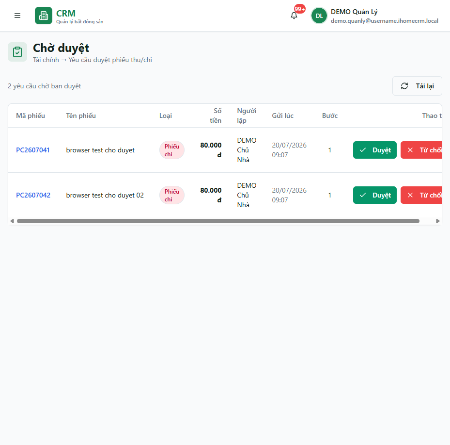
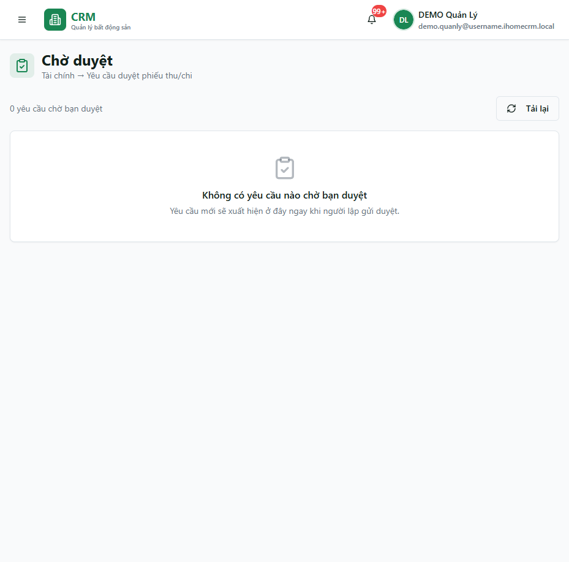

# Chờ duyệt

Route `/approvals` chỉ yêu cầu đăng nhập. Máy chủ chỉ trả các yêu cầu đang được giao cho người dùng hiện tại, nên mỗi người có thể thấy danh sách khác nhau.

## Duyệt hoặc từ chối

**Bước 1**: Mở yêu cầu và kiểm tra người tạo, loại phiếu, sổ quỹ, item, số tiền và chứng từ đính kèm.

**Bước 2**: Chọn đúng hành động:

- **Duyệt**: trong tổ chức dùng Finance V2 chuẩn, hành động này có thể chỉ phê duyệt và **chưa đổi số dư**.
- **Duyệt và Thu/Chi**: duyệt và post nguyên tử, chỉ xuất hiện khi yêu cầu có posting route và bạn có quyền/nghiệp vụ giữ sổ phù hợp.
- **Từ chối**: bắt buộc nhập lý do để người tạo biết cần sửa gì.

**Bước 3**: Sau thao tác, kiểm tra trạng thái phiếu. Nếu chỉ được duyệt, chứng từ còn cần công đoạn post trước khi số dư thay đổi.

::: warning Không suy đoán theo ngưỡng tiền
Tài liệu hiện không có bằng chứng cho một ngưỡng do chủ tự cấu hình quyết định mọi yêu cầu. Hãy dựa vào request thực tế, người được giao và các nút server cho phép.
:::

## Khi danh sách rỗng

Danh sách rỗng nghĩa là máy chủ không trả request đang giao cho bạn. Nó không chứng minh toàn tổ chức không có phiếu chờ; có thể yêu cầu đang được giao cho người khác hoặc đã đổi trạng thái.

## Quy trình liên quan

- [Thu chi](/03-quan-ly-van-hanh/thu-chi/)
- [Chi tiết hóa đơn và hoàn tiền](/03-quan-ly-van-hanh/hoa-don-chi-tiet/)
- [Sổ quỹ](/03-quan-ly-van-hanh/so-quy/)
