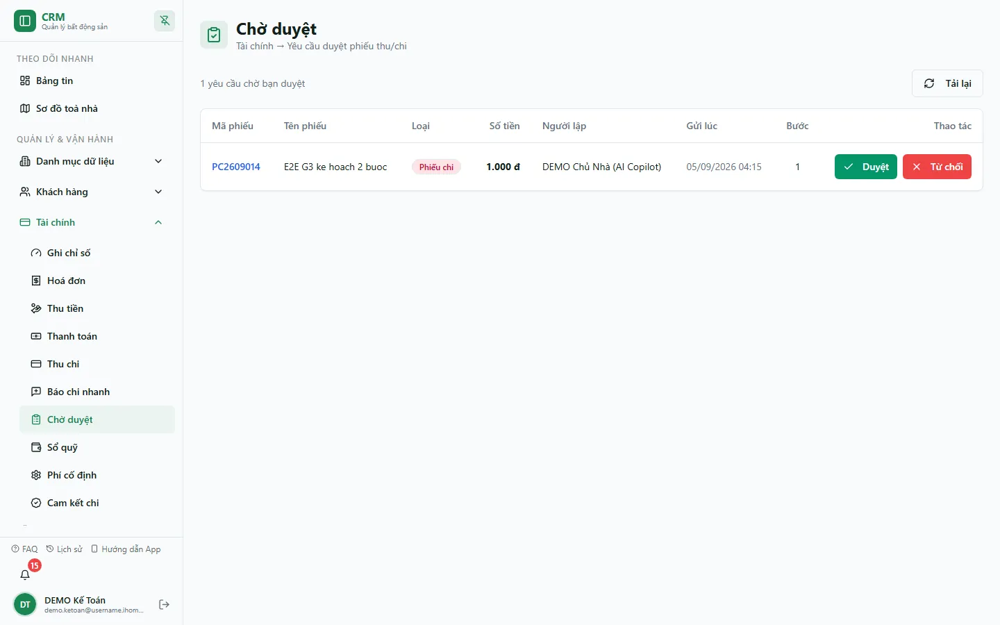
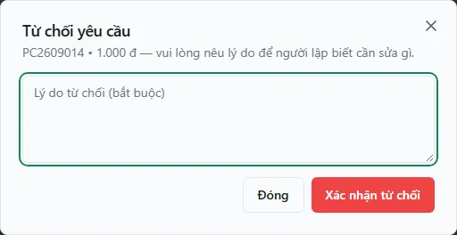
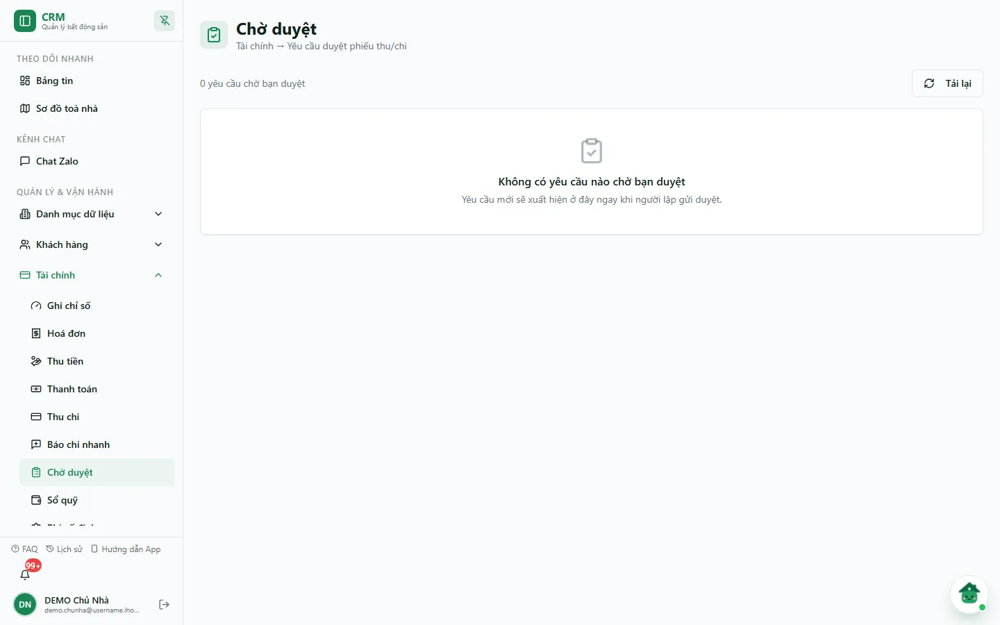

# Chờ duyệt

Màn **Chờ duyệt** là hộp thư các yêu cầu duyệt phiếu thu/chi **đang chờ chính bạn**. Mở từ menu **Tài chính → Chờ duyệt** (đường dẫn `/approvals`). Màn chỉ cần đăng nhập, không cần quyền riêng: máy chủ tự lọc theo người đang đăng nhập, nên mỗi người thấy một danh sách khác nhau, và người không phải người duyệt thì thấy danh sách rỗng.

::: info Chờ duyệt khác tab "Chờ xử lý" ở Thu chi
Màn này chỉ liệt kê các **yêu cầu duyệt đã giao cho bạn** (luồng người lập – người duyệt). Muốn xem mọi phiếu của công ty đang chờ duyệt hoặc chưa chọn sổ quỹ, mở [Thu chi](/03-quan-ly-van-hanh/thu-chi/) và chọn tab **Chờ xử lý**.
:::

## Hướng dẫn từng bước

**Bước 1**: Vào **Tài chính → Chờ duyệt**. Dòng đầu trang cho biết số yêu cầu đang chờ bạn, ví dụ **1 yêu cầu chờ bạn duyệt**. Bấm **Tải lại** nếu vừa có người gửi duyệt.

Bảng có các cột **Mã phiếu**, **Tên phiếu**, **Loại** (Phiếu thu/Phiếu chi), **Số tiền**, **Người lập**, **Gửi lúc**, **Bước** (bậc duyệt hiện tại) và **Thao tác**. Bấm mã phiếu để mở phiếu và kiểm tra hạng mục, sổ quỹ, chứng từ trước khi quyết.

**Bước 2**: Chọn đúng hành động:

- **Duyệt**: phê duyệt yêu cầu. Ở công ty đã chạy kế toán chuẩn, duyệt **chỉ đổi trạng thái phê duyệt**; phiếu thành **Đã Duyệt - Chưa Chi** (hoặc **Chưa Thu**) và **chưa đổi tồn quỹ**.
- **Duyệt và Chi…** / **Duyệt và Thu…**: chỉ hiện khi bạn đang **giữ sổ quỹ** của phiếu và công ty đã bật ghi sổ chuẩn. Nút này mở hộp thu/chi để duyệt và ghi tiền vào sổ trong cùng một lần. Phiếu chỉ là **Đã Chi/Đã Thu** (tiền thật ra/vào sổ) sau khi bước ghi sổ này thành công.
- **Từ chối**: mở hộp **Từ chối yêu cầu**; phải nhập lý do rồi bấm **Xác nhận từ chối**, để người lập biết cần sửa gì.

**Bước 3**: Sau thao tác, kiểm tra trạng thái phiếu ở [Thu chi](/03-quan-ly-van-hanh/thu-chi/). Nếu phiếu mới chỉ **Đã Duyệt - Chưa Chi/Chưa Thu**, người giữ sổ còn phải bấm Thu/Chi thì tồn quỹ mới đổi.

::: warning Đã duyệt chưa phải đã chi
Nhãn **Đã duyệt** chỉ nói phiếu đã qua bước phê duyệt. Chỉ phiếu mang nhãn **Đã Chi** hoặc **Đã Thu** (đã ghi sổ) mới là tiền thật đã ra/vào sổ quỹ.
:::

## Khi danh sách rỗng

**Không có yêu cầu nào chờ bạn duyệt** nghĩa là máy chủ không có yêu cầu đang giao cho bạn. Câu này không có nghĩa cả công ty hết phiếu chờ: yêu cầu có thể đang chờ người khác hoặc đã đổi trạng thái.

## Thử trực tiếp trên sandbox

<SandboxTry account="demo.ketoan" app-path="/approvals" app-label="Mở Chờ duyệt" fixtures="Ngày 07/10/2026: demo.ketoan có 1 yêu cầu (PC2609014, phiếu chi 1.000 đ); demo.chunha và demo.quanly không có yêu cầu nào." view-only>

**Bài tập chỉ xem**

1. Mở **Chờ duyệt** và đối chiếu các cột, số yêu cầu và nút **Duyệt**/**Từ chối**.
2. Bấm **Từ chối** chỉ để xem ô lý do, rồi đóng hộp; không bấm xác nhận.

**Kết quả mong đợi**

- Thấy đúng các yêu cầu đang chờ chính tài khoản này.
- Không có yêu cầu nào bị duyệt, từ chối hay ghi sổ.

</SandboxTry>

## Tình huống & lỗi thường gặp

| Tình huống | Nguyên nhân & cách xử lý |
|---|---|
| Không thấy nút **Duyệt và Chi…** | Bạn không giữ sổ quỹ của phiếu, hoặc công ty chưa bật ghi sổ chuẩn. Duyệt bình thường rồi chuyển người giữ sổ thu/chi. |
| Biết có phiếu chờ nhưng danh sách rỗng | Yêu cầu đang giao cho người khác. Xem tab **Chờ xử lý** ở Thu chi để biết toàn cảnh. |
| Báo **Chưa cập nhật được yêu cầu chờ duyệt** | Mạng hoặc máy chủ lỗi; bấm **Tải lại**. |

## Quy trình liên quan

- [Thu chi](/03-quan-ly-van-hanh/thu-chi/)
- [Sổ quỹ](/03-quan-ly-van-hanh/so-quy/)
- [Chi tiết hóa đơn và hoàn tiền](/03-quan-ly-van-hanh/hoa-don-chi-tiet/)
