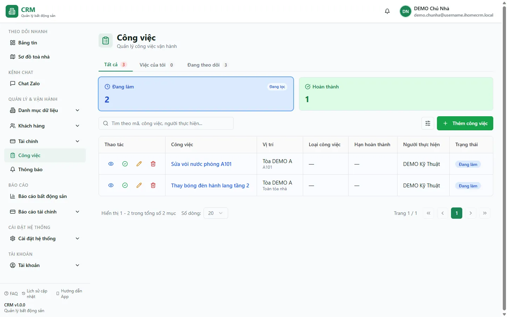

# Công việc & sự cố

Màn **Công việc** là nơi bạn giao và theo dõi mọi việc vận hành toà nhà — từ một yêu cầu nhỏ ("phòng A101 sửa vòi nước") tới việc định kỳ ("vệ sinh hành lang tầng 2"). Mỗi phiếu việc gắn với một **toà / phòng**, được giao cho một **nhân viên**, có **độ ưu tiên** và **hạn hoàn thành**. Khi làm xong, người thực hiện **chụp ảnh nghiệm thu ngay tại chỗ** (chụp trực tiếp, đóng dấu ngày/giờ và địa chỉ GPS) để hoàn thành việc — và nếu loại việc có cấu hình thưởng, họ nhận **thưởng nóng** liền.

Trang này quản lý hệ **Công việc** (jobs) với vòng đời gọn hai trạng thái: **đang làm** rồi **hoàn thành**. Bên cạnh đó hệ thống còn có khái niệm **Sự cố** (ticket có nhiều giai đoạn xử lý và SLA) — hiện chưa có trang quản trị riêng, thống kê sự cố mới xuất hiện ở màn Tổng quan (Dashboard). Vì vậy phần lớn hướng dẫn dưới đây xoay quanh **phiếu Công việc**.

::: info Điều kiện tiên quyết
- Quyền **Công việc => Xem** (module `tasks`, action `view`) để mở trang `/tasks`. Không có quyền này thì mục **Công việc** bị ẩn khỏi menu.
- Quyền **Thêm** (`create`) để tạo phiếu việc; quyền **Hoàn thành công việc** (`complete`, mặc định đi kèm quyền `edit`) để chụp ảnh nghiệm thu và đóng việc.
- Phạm vi dữ liệu đi theo **toà nhà**: bạn thấy và thao tác trên phiếu của những toà mình được phân công (qua Nhân viên & đội ngũ). Chủ nhà / quản trị thấy tất cả.
- Muốn dùng **thưởng nóng** khi hoàn thành, loại việc phải được đặt **tiền thưởng** ở danh mục Loại công việc, và người bấm hoàn thành phải chính là người được giao việc.
:::

## Hướng dẫn từng bước

**Bước 1**: Vào menu **Công việc** (nhóm Vận hành). Màn hiện danh sách phiếu việc, mỗi dòng có **Mã** (dạng `JOB-YYYYMMDD-NNNN`, hệ thống tự cấp), **Tiêu đề** (loại việc + mô tả), **Toà / Phòng**, **Người thực hiện**, **Độ ưu tiên**, **Hạn hoàn thành** và **Trạng thái**. Mặc định trang chỉ lọc **Đang làm**, nên bạn thấy ngay việc còn dang dở. Trong dữ liệu demo có ba phiếu: **Sửa vòi A101** (đang làm, Khẩn cấp), **Thay đèn tầng 2** (đang làm, Bình thường) và **Vệ sinh A303** (đã hoàn thành).

**Bước 2**: Lọc và tìm việc. Dùng thanh **tab** ở đầu bảng để chuyển giữa **Tất cả**, **Của tôi** (việc được giao cho bạn) và **Đang theo dõi** (việc giao cho người khác). Bấm các thẻ **thống kê trạng thái** để lọc nhanh **Đang làm** / **Hoàn thành**. Mở **bộ lọc** để lọc theo **Căn hộ** (toà), **Phòng**, **Loại công việc**, **Độ ưu tiên**, **Người thực hiện**, **Trạng thái** và **khoảng ngày**. Gõ vào **ô tìm kiếm** để lọc theo tiêu đề, mã hoặc tên người thực hiện. Mọi lựa chọn lọc được **giữ lại khi tải lại trang (F5)**.

**Bước 3**: Tạo một phiếu việc mới. Ấn nút **Tạo công việc**. Ở ô nhập nhanh một dòng, gõ theo thứ tự **phòng → toà → loại việc → mô tả → [hạn]**, ví dụ: `A101 DEMO A sửa vòi nước rò rỉ 1`. Hệ thống phân tích ngay và tô **xanh** phần nhận đúng, **đỏ** phần chưa khớp:

- **Phòng**: gõ số/tên phòng; gõ **`tn`** thay cho phòng nghĩa là **việc toàn toà** (không gắn phòng cụ thể).
- **Toà**: khớp theo tên toà (ví dụ `DEMO A`).
- **Loại việc**: khớp với danh mục Loại công việc; nếu loại chưa có, bấm nút **Tạo "&lt;tên loại&gt;"** để tạo nhanh.
- **Mô tả**: phần chữ còn lại.
- **Hạn**: số cuối câu = số **ngày** kể từ hôm nay (ví dụ `1` = hạn ngày mai); dạng `17/5` = **ngày cụ thể**; bỏ trống = **cuối ngày mai**.

**Bước 4**: Chọn **Người thực hiện**. Mặc định phiếu được giao cho **chính bạn**. Bạn có thể chọn một **nhân viên** đã có tài khoản (khớp theo tên), hoặc gõ **tên tự do** cho người chưa có tài khoản. (Tuỳ chọn) thêm **vật tư** dùng cho việc và **ảnh đính kèm**. Khi đủ tối thiểu **toà + phòng (hoặc toàn toà) + loại + mô tả**, nút lưu bật lên — ấn để tạo phiếu. Phiếu vào thẳng trạng thái **Đang làm** và được cấp mã tự động.

::: warning Gắn vật tư khi tạo việc sẽ trừ kho ngay
Nếu bạn thêm vật tư vào phiếu, hệ thống tạo một **phiếu xuất kho** gắn với việc và **trừ tồn kho** liền (mỗi việc tối đa một phiếu xuất). Bước tạo việc và bước trừ kho **không cùng một giao dịch**: nếu trừ kho lỗi, phiếu việc vẫn được tạo (chỉ báo cảnh báo), bạn cần mở lại việc để bổ sung vật tư. Khi **xoá** một phiếu việc, phiếu xuất kho gắn theo cũng bị xoá và tồn kho được tính lại.
:::

**Bước 5**: Đổi độ ưu tiên hoặc sửa thông tin. Phiếu mới luôn mang ưu tiên **Bình thường**. Muốn nâng lên **Khẩn cấp** (hoặc hạ xuống **Thấp**), mở **Sửa** phiếu và chọn lại **Mức độ ưu tiên**; tại đây cũng đổi được tiêu đề, người thực hiện, hạn, mô tả. Ba mức ưu tiên của Công việc là **Khẩn cấp / Bình thường / Thấp**.

**Bước 6**: Hoàn thành việc bằng ảnh nghiệm thu. Mở phiếu đang làm, bấm **Hoàn thành**. Chọn **thời điểm hoàn thành** (mặc định là bây giờ) rồi bấm **Chụp ảnh & hoàn thành**. Màn camera mở toàn màn hình:

1. Hệ thống bật **camera** (ưu tiên camera sau) và đọc **vị trí GPS** của bạn. Đây là bước **bắt buộc chụp trực tiếp** — không có tuỳ chọn chọn ảnh từ thư viện.
2. Bấm chụp. Ảnh được **đóng dấu (watermark)**: giờ cỡ lớn + ngày + thứ + **địa chỉ lấy từ toạ độ GPS thực tế** + một dòng GPS cho biết **khoảng cách tới toà nhà**.
3. Xem trước: **Chụp lại** nếu chưa ưng, hoặc **Dùng ảnh này** để tải ảnh lên và **hoàn thành việc luôn**. Trạng thái chuyển sang **Hoàn thành**, ảnh nghiệm thu được lưu kèm phiếu.

**Bước 7**: (Tuỳ chọn) ghi nhận đánh giá. Với việc đã hoàn thành, dùng **Ghi chú** để viết nhận xét nghiệm thu; nội dung này hiển thị ở màn **Chi tiết** của phiếu. Bạn cũng xem lại **ảnh nghiệm thu** (mở lớn được) trong màn Chi tiết.

::: tip Thưởng nóng khi hoàn thành việc
Nếu **loại việc** được đặt **tiền thưởng** trong danh mục Loại công việc, và **người bấm hoàn thành chính là người được giao việc**, thì ngay sau khi đóng việc thành công, một **popup thưởng** hiện lên (kèm thông báo đẩy về điện thoại). Hoàn thành từ hai khoản trở lên (ví dụ thưởng việc + phụ cấp ngày Chủ nhật/Lễ cho việc sửa chữa) sẽ gộp thành thẻ **combo**. Lưu ý: nếu **chủ / quản lý làm hộ** (bấm hoàn thành thay cho người khác) thì **không phát sinh thưởng** — thưởng chỉ về đúng người được giao. Chi tiết cách thưởng chảy vào lương xem [Bảng lương quản lý](/03-quan-ly-van-hanh/bang-luong/) và [Lương của tôi](/03-quan-ly-van-hanh/luong-cua-toi/).
:::

::: warning Định vị GPS chỉ để đối chiếu — không chặn hoàn thành
Việc so khoảng cách tới toà nhà (geo-fence) chỉ là **audit**: nếu bạn đứng ngoài bán kính cho phép, hệ thống hiện **chip đỏ cảnh báo** nhưng **vẫn cho hoàn thành** — toạ độ, khoảng cách và địa chỉ được ghi lại kèm phiếu. Muốn geo-fence so đúng, **toà nhà phải có toạ độ** (nhập ở form toà, dán link Google Maps — xem [Toà nhà](/03-quan-ly-van-hanh/toa-nha/)). Chủ nhà bật/tắt kiểm tra GPS và đặt **bán kính cho phép** (mặc định bật, 70m) ở **Cài đặt chung**. Dù tắt geo-fence, việc **vẫn bắt buộc chụp ảnh trực tiếp** và vẫn ghi vị trí/địa chỉ.
:::

## Các tính năng khác trên màn hình

| Nút / Bộ lọc | Công dụng |
| --- | --- |
| Tab **Tất cả / Của tôi / Đang theo dõi** | Lọc nhanh: tất cả việc, việc giao cho bạn, hoặc việc giao cho người khác trong phạm vi bạn thấy. |
| Thẻ **thống kê trạng thái** | Đếm và lọc nhanh theo **Đang làm** / **Hoàn thành**. |
| **Ô tìm kiếm** | Lọc theo tiêu đề, mã việc hoặc tên người thực hiện (chạy trên dữ liệu đã tải). |
| Bộ lọc **Căn hộ** (toà) | Chọn một toà theo phạm vi được cấp; combobox gõ-để-tìm. |
| Bộ lọc **Phòng** | Gộp các phòng **cùng tên ở mọi toà** thành một lựa chọn. |
| Bộ lọc **Loại công việc / Độ ưu tiên / Người thực hiện / Trạng thái / khoảng ngày** | Thu hẹp danh sách theo từng tiêu chí; giữ qua F5. |
| **Tạo công việc** | Mở form nhập nhanh (phòng → toà → loại → mô tả → hạn), kèm vật tư và ảnh đính kèm. |
| **Xem chi tiết** | Xem đầy đủ phiếu, ảnh nghiệm thu (mở lớn), ghi chú đánh giá. |
| **Sửa** | Đổi tiêu đề, người thực hiện, **độ ưu tiên**, hạn, mô tả. |
| **Ghi chú** | Ghi nhận xét nghiệm thu cho việc đã hoàn thành. |
| **Hoàn thành** | Mở camera chụp ảnh nghiệm thu và đóng việc (bắt buộc có ảnh). |
| **Xoá** | Xoá phiếu việc (kèm xác nhận); xoá cả phiếu xuất vật tư gắn theo. |

::: tip Trên điện thoại là một màn riêng
Mở `/tasks` trên màn hình hẹp (điện thoại) sẽ chuyển sang **giao diện app toàn màn hình** với cùng dữ liệu và cùng các thao tác (Chi tiết / Tạo / Sửa / Ghi chú / Hoàn thành). Danh sách hiển thị theo lô, có nút **Xem thêm** để tải tiếp.
:::

## Tình huống & lỗi thường gặp

| Tình huống | Cách xử lý |
| --- | --- |
| Vào trang không thấy việc đã hoàn thành | Bình thường: trang mặc định lọc **Đang làm**. Bấm thẻ **Hoàn thành** hoặc chọn Trạng thái phù hợp trong bộ lọc. |
| Không tạo được việc — nút lưu mờ | Ô nhập nhanh còn thiếu: cần đủ **toà**, **phòng (hoặc `tn` cho toàn toà)**, **loại** và **mô tả**. Nhìn phần **đỏ** trong preview để biết chỗ chưa khớp. |
| Gõ loại việc nhưng báo chưa có | Loại chưa nằm trong danh mục. Bấm **Tạo "&lt;tên loại&gt;"** để tạo nhanh, rồi tiếp tục. |
| Camera không mở / không hoàn thành được | Trình duyệt cần **quyền truy cập camera** (và nên có **định vị**). Cấp quyền cho trang rồi thử lại; nếu từ chối định vị, việc vẫn hoàn thành được nhưng dòng GPS ghi là "từ chối". |
| Đứng đúng toà mà vẫn báo ngoài phạm vi | **Toà chưa có toạ độ**, hoặc bán kính đặt quá hẹp. Nhập toạ độ toà ở [Toà nhà](/03-quan-ly-van-hanh/toa-nha/) và chỉnh bán kính ở **Cài đặt chung**. Đây chỉ là cảnh báo, không chặn hoàn thành. |
| Hoàn thành xong không thấy popup thưởng | Thưởng chỉ về khi **loại việc có tiền thưởng** và **bạn là người được giao** đang tự hoàn thành. Chủ/quản lý làm hộ sẽ không phát sinh thưởng. |
| Sửa một việc thấy người thực hiện là "-- Chọn --" | Việc đang giao cho **tên tự do** (người chưa có tài khoản); form Sửa chỉ chọn được nhân viên có tài khoản. Chọn một người có tài khoản, hoặc để nguyên và sửa qua tạo lại nếu cần. |
| Lọc "Đến ngày" bị thiếu việc tạo trong chính ngày đó | Bộ lọc theo ngày kết thúc tính tới **đầu ngày**; nếu cần bao trọn ngày cuối, chọn **hôm sau** làm mốc "Đến ngày". |
| "Trễ hẹn" hiện đỏ nhưng trạng thái vẫn Đang làm | "Trễ hẹn" chỉ là **nhãn tính theo hạn** (hạn đã qua mà chưa hoàn thành), không phải một trạng thái riêng. Hoàn thành việc là nhãn tự mất. |
| Danh sách trống dù chắc chắn có việc | Thường do **phạm vi toà**: bạn chỉ thấy việc của toà được phân công. Nhờ quản trị phân công toà, hoặc kiểm tra quyền **Công việc => Xem**. Nếu gặp màn báo lỗi, bấm **Thử lại**. |

## Thử trực tiếp trên sandbox

<SandboxTry account="demo.kythuat" app-path="/tasks" app-label="Mở màn Công việc" fixtures="Sửa vòi A101 (đang làm), Thay đèn tầng 2 (đang làm), Vệ sinh A303 (hoàn thành)">

Bạn đăng nhập bằng tài khoản kỹ thuật demo, được giao hai toà DEMO A/B. Hãy thử trọn một vòng tạo và hoàn thành việc:

1. Ở màn **Công việc**, xem ba phiếu demo. Bấm thẻ **Hoàn thành** để thấy **Vệ sinh A303**, rồi quay lại thẻ **Đang làm** để thấy **Sửa vòi A101** (Khẩn cấp) và **Thay đèn tầng 2**.
2. Ấn **Tạo công việc**. Gõ nhanh một dòng, ví dụ `A101 DEMO A kiểm tra ổ điện 1`, để ý preview tô **xanh** phần khớp. Để **Người thực hiện** là chính bạn, rồi lưu — phiếu mới vào trạng thái **Đang làm** và được cấp mã `JOB-...`.
3. Mở một việc **đang làm**, bấm **Hoàn thành** → **Chụp ảnh & hoàn thành**. Cho phép trình duyệt dùng camera, chụp một ảnh và bấm **Dùng ảnh này**. Quan sát trạng thái chuyển sang **Hoàn thành** và ảnh nghiệm thu (có đóng dấu ngày/giờ) được lưu kèm phiếu.
4. Mở **Chi tiết** việc vừa hoàn thành để xem lại ảnh; thử **Ghi chú** để viết một dòng nhận xét nghiệm thu.

Kết quả mong đợi: bạn nắm được cách giao việc bằng ô nhập nhanh, hiểu vòng đời **đang làm → hoàn thành**, và thấy vì sao mỗi việc hoàn thành đều đi kèm **ảnh chụp trực tiếp có định vị**. Xong bài, bấm **Reset** để trả sandbox về ba phiếu demo ban đầu.

</SandboxTry>

## Quy trình liên quan

- [Căn hộ / Phòng](/03-quan-ly-van-hanh/can-ho-phong/) — nơi phiếu việc gắn phòng cụ thể; mở phòng để xem việc liên quan.
- [Toà nhà](/03-quan-ly-van-hanh/toa-nha/) — nhập toạ độ toà để geo-fence khi hoàn thành so đúng khoảng cách.
- [Bảng lương quản lý](/03-quan-ly-van-hanh/bang-luong/) — cấu hình tiền thưởng theo loại việc và cách việc đã hoàn thành chảy vào lương.
- [Lương của tôi](/03-quan-ly-van-hanh/luong-cua-toi/) — nhân viên tự xem thưởng nóng và ngày công phát sinh từ việc đã hoàn thành.
