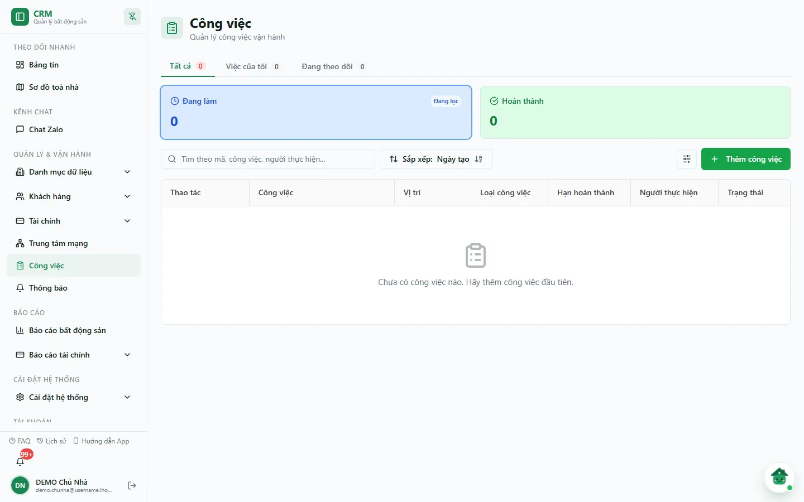
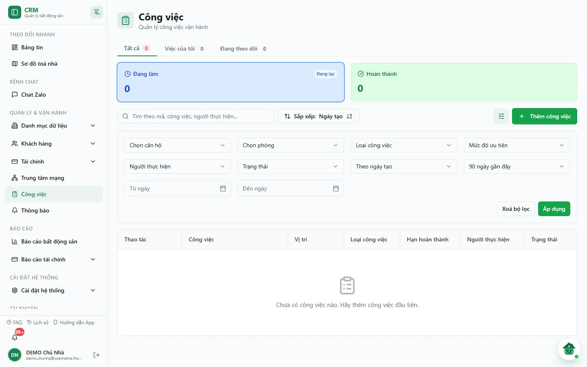
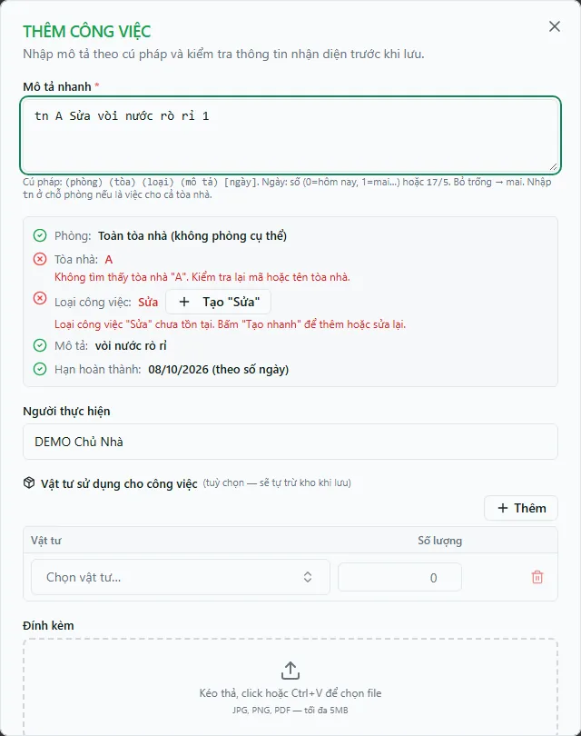

# Công việc & sự cố

Màn **Công việc** là nơi bạn giao và theo dõi mọi việc vận hành toà nhà — từ một yêu cầu nhỏ ở một phòng cụ thể tới việc chung cho cả toà. Mỗi phiếu việc gắn với một **toà / phòng** và một **loại công việc**, được giao cho một **người thực hiện** và có **hạn hoàn thành**. Khi làm xong, người thực hiện **chụp ảnh nghiệm thu ngay tại chỗ** (chụp trực tiếp, đóng dấu ngày/giờ và địa chỉ GPS) để hoàn thành việc — và nếu loại việc có cấu hình thưởng, họ nhận **thưởng nóng** liền.

Trang này quản lý hệ **Công việc** (jobs) với vòng đời gọn hai trạng thái: **Đang làm** rồi **Hoàn thành**. Bên cạnh đó hệ thống còn có khái niệm **Sự cố** (ticket có nhiều giai đoạn xử lý và SLA) — hiện chưa có trang quản trị riêng, thống kê sự cố chỉ xuất hiện ở màn Tổng quan (Dashboard). Vì vậy phần lớn hướng dẫn dưới đây xoay quanh **phiếu Công việc**.

::: info Điều kiện tiên quyết
- Quyền **Công việc => Xem** (module `tasks`, action `view`) để mở trang `/tasks`. Không có quyền này thì mục **Công việc** bị ẩn khỏi menu.
- Quyền **Thêm** (`create`) để tạo phiếu việc; quyền **Sửa** (`edit`) để chỉnh nội dung; quyền **Hoàn thành công việc** (`complete`) để chụp ảnh nghiệm thu và đóng việc. `complete` là quyền riêng, không được suy ra từ `edit`. Danh mục quyền còn có **Duyệt / nghiệm thu công việc** (`tasks.approve`), nhưng màn Công việc hiện chưa có bước/nút phê duyệt sau hoàn thành.
- Phạm vi dữ liệu đi theo **toà nhà**: bạn thấy và thao tác trên phiếu của những toà mình được phân công (qua Nhân viên & đội ngũ). Chủ nhà / quản trị thấy tất cả.
- Ô nhập nhanh khớp toà theo **tên hoặc mã toà gõ liền một từ**. Toà có tên nhiều chữ (ví dụ "DEMO Toà A") cần được đặt **Tên viết tắt/Mã toà** ở [Toà nhà](/03-quan-ly-van-hanh/toa-nha/) thì mới gõ nhanh được. Loại công việc lấy từ danh mục [Loại công việc](/05-cai-dat/loai-cong-viec/).
- Muốn dùng **thưởng nóng** khi hoàn thành, loại việc phải được đặt **tiền thưởng** ở danh mục Loại công việc, và người bấm hoàn thành phải chính là người được giao việc.
:::

## Hướng dẫn từng bước

**Bước 1**: Vào menu **Công việc** (nhóm **Quản lý & vận hành**). Đầu trang có ba tab **Tất cả / Việc của tôi / Đang theo dõi** (kèm số đếm), hai thẻ trạng thái **Đang làm** và **Hoàn thành**, ô tìm kiếm, nút **Sắp xếp**, nút bộ lọc và nút **Thêm công việc**. Bảng có các cột **Thao tác**, **Công việc** (tiêu đề = loại việc + mô tả, bấm để xem chi tiết), **Vị trí** (toà, bên dưới là phòng hoặc "Toàn tòa nhà"), **Loại công việc**, **Hạn hoàn thành**, **Người thực hiện** và **Trạng thái**. Mặc định trang lọc sẵn thẻ **Đang làm** (thẻ hiện nhãn "Đang lọc"). Ảnh chụp ngày 07/10/2026 của tài khoản DEMO đang trống: **0 đang làm, 0 hoàn thành**.

**Bước 2**: Lọc, tìm và sắp xếp.

- Tab **Việc của tôi** chỉ hiện việc giao cho bạn; **Đang theo dõi** hiện việc giao cho người khác trong phạm vi bạn thấy.
- Bấm thẻ **Đang làm** hoặc **Hoàn thành** để lọc theo trạng thái; bấm lại thẻ đang lọc để bỏ lọc.
- Gõ vào ô **Tìm theo mã, công việc, người thực hiện...** để lọc trên dữ liệu đã tải.
- Nút **Sắp xếp** có bốn lựa chọn: **Hạn hoàn thành · Gần hết hạn trước**, **Hạn hoàn thành · Xa hạn nhất trước**, **Ngày tạo · Mới nhất trước** (mặc định) và **Ngày tạo · Cũ nhất trước**. Việc không có hạn luôn nằm cuối.
- Bấm nút **bộ lọc** (biểu tượng thanh trượt) để mở bảng lọc: **Chọn căn hộ** (toà), **Chọn phòng**, **Loại công việc**, **Mức độ ưu tiên**, **Người thực hiện**, **Trạng thái**, trục ngày **Theo ngày tạo / Theo ngày hoàn thành**, khoảng **90 ngày gần đây / Toàn bộ lịch sử**, **Từ ngày** và **Đến ngày**. Chọn xong bấm **Áp dụng**; bấm **Xoá bộ lọc** để về mặc định.

Mặc định trang chỉ tải việc **tạo trong 90 ngày gần đây**, nhưng việc **đang làm** luôn hiện dù tạo lâu hơn. Muốn xem việc đã hoàn thành cũ hơn, chọn **Toàn bộ lịch sử** hoặc đặt **Từ/Đến ngày**. Khi đối chiếu với bảng lương, đổi trục sang **Theo ngày hoàn thành** (lương tính theo ngày hoàn thành); trục này không áp cửa sổ 90 ngày nên hãy giới hạn bằng Từ/Đến ngày. Ô tìm, tab, thẻ trạng thái, sắp xếp và bộ lọc được **giữ lại khi tải lại trang (F5)**.

Liên kết `/tasks?job=<mã phiếu>` (từ thông báo "việc mới được giao") tự mở phiếu nếu phiếu nằm trong danh sách đang tải; nếu không, trang báo "Không tìm thấy công việc trong danh sách đang xem" — hãy đổi khoảng thời gian/bộ lọc rồi tìm lại.

**Bước 3**: Tạo một phiếu việc mới. Ấn nút **Thêm công việc**, hộp thoại **THÊM CÔNG VIỆC** mở ra. Ở ô **Mô tả nhanh**, gõ một dòng theo cú pháp **(phòng) (tòa) (loại) (mô tả) [ngày]** — mỗi phần phòng, toà, loại là **một từ**, phần còn lại là mô tả. Ví dụ: `101 A SuaNuoc vòi nước rò rỉ 1`. Bên dưới hiện ngay bảng nhận diện: dấu **xanh** là phần đã khớp, dấu **đỏ** kèm lời giải thích là phần chưa khớp.

- **Phòng**: gõ tên phòng; gõ **`tn`** thay cho phòng nghĩa là **việc toàn toà** (không gắn phòng cụ thể).
- **Tòa nhà**: khớp theo **tên toà hoặc một trong các mã toà** (không phân biệt hoa thường).
- **Loại công việc**: khớp với danh mục Loại công việc; nếu loại chưa có, bấm nút **Tạo "&lt;tên loại&gt;"** ngay cạnh để tạo nhanh.
- **Mô tả**: phần chữ còn lại.
- **Hạn hoàn thành**: số cuối câu = số **ngày** kể từ hôm nay (`0` = hôm nay, `1` = ngày mai…); dạng `17/5` = **ngày cụ thể**; bỏ trống = **ngày mai**.

Trong ảnh, dòng `tn A Sửa vòi nước rò rỉ 1` nhận đúng **Toàn tòa nhà**, mô tả và hạn, nhưng báo đỏ ở **Tòa nhà** (toà DEMO chưa đặt mã "A") và **Loại công việc** (DEMO chưa có loại "Sửa", nên hiện nút **Tạo "Sửa"**).

**Bước 4**: Chọn **Người thực hiện**, thêm vật tư/ảnh nếu cần rồi lưu.

- **Người thực hiện** mặc định là **chính bạn**. Bạn có thể chọn một **nhân viên** có tài khoản (gợi ý theo tên) hoặc gõ **tên tự do** cho người chưa có tài khoản.
- (Tuỳ chọn) thêm dòng ở **Vật tư sử dụng cho công việc** (chọn vật tư + số lượng) và kéo thả/dán ảnh vào **Đính kèm** (JPG, PNG, PDF — tối đa 5MB).
- Bấm **Lưu**. Nếu ô Mô tả nhanh còn thiếu toà, phòng (hoặc `tn`), loại hoặc mô tả, hệ thống báo lỗi đỏ ngay dưới ô và không tạo phiếu. Phiếu hợp lệ vào thẳng trạng thái **Đang làm**, mức ưu tiên **Bình thường**, và được cấp mã tự động dạng `JOB-…`.

::: warning Gắn vật tư khi tạo việc sẽ trừ kho ngay
Nếu bạn thêm vật tư vào phiếu, hệ thống tạo một **phiếu xuất kho** gắn với việc và **trừ tồn kho** liền (mỗi việc tối đa một phiếu xuất). Bước tạo việc và bước lưu vật tư **không cùng một giao dịch**: nếu chưa xác nhận được phần vật tư, hộp thoại giữ lại khung cảnh báo vàng kèm **mã công việc** đã tạo — đừng tạo lại việc, hãy mở phiếu đó và kiểm tra/bổ sung vật tư trong **Chi tiết công việc**. Khi **xoá** một phiếu việc, phiếu xuất kho gắn theo cũng bị xoá và tồn kho được tính lại.
:::

**Bước 5**: Xem chi tiết, đổi độ ưu tiên hoặc sửa thông tin. Bấm tiêu đề việc hoặc biểu tượng **Xem chi tiết** để mở **Chi tiết công việc** (phòng – căn hộ, tiêu đề, trạng thái, ngày tạo, ngày hoàn thành, người thực hiện, ghi chú đánh giá, ảnh đính kèm và phần vật tư đã dùng). Bấm **Sửa phiếu** để đổi **Mô tả**, **Tòa nhà**, **Phòng** (hoặc "Toàn tòa nhà"), **Loại công việc**, **Mức độ ưu tiên** (**Gấp / Bình thường / Thấp**), **Người thực hiện**, **Hạn hoàn thành** và thêm/bớt **Ảnh đính kèm**.

**Bước 6**: Hoàn thành việc bằng ảnh nghiệm thu. Với việc đang làm, bấm **Hoàn thành** (trên dòng hoặc trong chi tiết). Hộp thoại **HOÀN THÀNH CÔNG VIỆC** hiện **Thời gian hoàn thành** là giờ hệ thống — mốc này do máy chủ ghi lúc bấm hoàn thành, dùng để tính lương, thưởng ngoài giờ và CN/Lễ; người dùng không chọn hay sửa. Bấm **Chụp ảnh & hoàn thành**, màn camera mở toàn màn hình:

1. Hệ thống bật **camera** (ưu tiên camera sau) và đọc **vị trí GPS** của bạn. Đây là bước **bắt buộc chụp trực tiếp** — không có tuỳ chọn chọn ảnh từ thư viện.
2. Bấm chụp. Ảnh được **đóng dấu (watermark)**: giờ cỡ lớn + ngày + thứ + **địa chỉ lấy từ toạ độ GPS thực tế** + một dòng GPS cho biết **khoảng cách tới toà nhà**.
3. Xem trước: **Chụp lại** nếu chưa ưng, hoặc **Dùng ảnh này** để tải ảnh lên và **hoàn thành việc luôn**. Trạng thái chuyển sang **Hoàn thành**, ảnh nghiệm thu được lưu kèm phiếu.

**Bước 7**: (Tuỳ chọn) ghi nhận đánh giá. Với việc đã hoàn thành, bấm **Ghi chú đánh giá** để viết nhận xét nghiệm thu rồi **Lưu**; nội dung hiển thị ở **Chi tiết công việc**, nơi bạn cũng xem lại **ảnh nghiệm thu** (bấm để xem lớn, dùng phím ← → để chuyển ảnh).

::: tip Thưởng nóng khi hoàn thành việc
Nếu **loại việc** được đặt **tiền thưởng** trong danh mục Loại công việc, và **người bấm hoàn thành chính là người được giao việc**, thì ngay sau khi đóng việc thành công, một **popup thưởng** hiện lên (kèm thông báo đẩy về điện thoại). Hoàn thành từ hai khoản trở lên (ví dụ thưởng việc + phụ cấp ngày Chủ nhật/Lễ cho việc sửa chữa) sẽ gộp thành thẻ **combo**. Lưu ý: nếu **chủ / quản lý làm hộ** (bấm hoàn thành thay cho người khác) thì **không phát sinh thưởng** — thưởng chỉ về đúng người được giao. Chi tiết cách thưởng chảy vào lương xem [Bảng lương quản lý](/03-quan-ly-van-hanh/bang-luong/) và [Lương của tôi](/03-quan-ly-van-hanh/luong-cua-toi/).
:::

::: warning Định vị GPS chỉ để đối chiếu — không chặn hoàn thành
Việc so khoảng cách tới toà nhà (geo-fence) chỉ là **audit**: nếu bạn đứng ngoài bán kính cho phép, hệ thống hiện **chip đỏ cảnh báo** nhưng **vẫn cho hoàn thành** — toạ độ, khoảng cách và địa chỉ được ghi lại kèm phiếu. Muốn geo-fence so đúng, **toà nhà phải có toạ độ** (nhập ở form toà, dán link Google Maps — xem [Toà nhà](/03-quan-ly-van-hanh/toa-nha/)). Chủ nhà bật/tắt kiểm tra GPS và đặt **bán kính cho phép** (mặc định bật, 70m) ở **Cài đặt chung**. Dù tắt geo-fence, việc **vẫn bắt buộc chụp ảnh trực tiếp** và vẫn ghi vị trí/địa chỉ.
:::

## Các tính năng khác trên màn hình

| Nút / Bộ lọc | Công dụng |
| --- | --- |
| Tab **Tất cả / Việc của tôi / Đang theo dõi** | Lọc nhanh: tất cả việc, việc giao cho bạn, hoặc việc giao cho người khác trong phạm vi bạn thấy; số đếm cạnh mỗi tab. |
| Thẻ **Đang làm / Hoàn thành** | Đếm và lọc nhanh theo trạng thái; thẻ đang lọc hiện nhãn "Đang lọc", bấm lại để bỏ lọc. |
| **Ô tìm kiếm** | Lọc theo tiêu đề, mã việc hoặc tên người thực hiện (chạy trên dữ liệu đã tải). |
| Nút **Sắp xếp** | Theo **hạn hoàn thành** (gần hết hạn trước / xa hạn nhất trước) hoặc **ngày tạo** (mới nhất / cũ nhất trước). |
| Bộ lọc **Chọn căn hộ** (toà) | Chọn một toà theo phạm vi được cấp; ô gõ-để-tìm. |
| Bộ lọc **Chọn phòng** | Gộp các phòng **cùng tên ở mọi toà** thành một lựa chọn. |
| Bộ lọc **Loại công việc / Mức độ ưu tiên / Người thực hiện / Trạng thái** | Thu hẹp danh sách theo từng tiêu chí. |
| **Theo ngày tạo / Theo ngày hoàn thành**, **90 ngày gần đây / Toàn bộ lịch sử**, **Từ ngày / Đến ngày** | Chọn trục ngày và khoảng thời gian cần tải; "Đến ngày" tính trọn cả ngày đó. |
| **Thêm công việc** | Mở hộp thoại nhập nhanh (phòng → toà → loại → mô tả → hạn), kèm vật tư và đính kèm. |
| **Xem chi tiết** | Xem đầy đủ phiếu, ảnh (mở lớn), ghi chú đánh giá và vật tư đã dùng. |
| **Sửa phiếu** | Đổi mô tả, toà, phòng, loại, **mức độ ưu tiên**, người thực hiện, hạn và ảnh đính kèm (chỉ hiện với việc đang làm). |
| **Ghi chú đánh giá** | Ghi nhận xét nghiệm thu cho việc đã hoàn thành. |
| **Hoàn thành** | Mở camera chụp ảnh nghiệm thu và đóng việc (bắt buộc có ảnh). |
| **Xoá** | Xoá phiếu việc sau hộp **Xác nhận xoá**; xoá cả phiếu xuất vật tư gắn theo. |

::: tip Trên điện thoại là một màn riêng
Mở `/tasks` trên màn hình hẹp (điện thoại) sẽ chuyển sang **giao diện app toàn màn hình** với cùng dữ liệu và cùng các thao tác (Chi tiết / Thêm / Sửa / Ghi chú / Hoàn thành). Nút sắp xếp là biểu tượng mở bảng chọn từ dưới lên, với cùng bốn lựa chọn như máy tính. Danh sách hiển thị theo lô, có nút **Tải thêm (N)** để tải tiếp.
:::

## Tình huống & lỗi thường gặp

| Tình huống | Cách xử lý |
| --- | --- |
| Vào trang không thấy việc đã hoàn thành | Trang mặc định lọc thẻ **Đang làm**. Bấm thẻ **Hoàn thành** (hoặc bấm lại thẻ Đang làm để bỏ lọc). Việc hoàn thành quá 90 ngày cần chọn **Toàn bộ lịch sử** trong bộ lọc. |
| Bấm **Lưu** mà báo lỗi đỏ dưới ô Mô tả nhanh | Ô nhập còn thiếu hoặc chưa khớp: cần đủ **phòng (hoặc `tn`)**, **toà**, **loại** và **mô tả**. Nhìn các dòng **đỏ** trong bảng nhận diện để biết chỗ chưa khớp. |
| Báo "Không tìm thấy tòa nhà" dù gõ đúng tên | Phần toà chỉ là **một từ**. Toà có tên nhiều chữ cần đặt **Tên viết tắt/Mã toà** (ví dụ `A`, `B`) ở [Toà nhà](/03-quan-ly-van-hanh/toa-nha/), rồi gõ mã đó. |
| Gõ loại việc nhưng báo chưa tồn tại | Loại chưa nằm trong danh mục. Bấm nút **Tạo "&lt;tên loại&gt;"** ngay cạnh để tạo nhanh, hoặc thêm ở [Loại công việc](/05-cai-dat/loai-cong-viec/). |
| Lưu xong thấy khung vàng "Chưa xác nhận được toàn bộ vật tư đã lưu" | Việc **đã được tạo** (khung ghi mã công việc), chỉ phần vật tư chưa chắc. **Không tạo lại** việc; mở phiếu đó và kiểm tra phần vật tư trong Chi tiết công việc. |
| Camera không mở / không hoàn thành được | Trình duyệt cần **quyền truy cập camera** (và nên có **định vị**). Cấp quyền cho trang rồi thử lại; nếu từ chối định vị, việc vẫn hoàn thành được nhưng dòng GPS ghi là "từ chối". |
| Đứng đúng toà mà vẫn báo ngoài phạm vi | **Toà chưa có toạ độ**, hoặc bán kính đặt quá hẹp. Nhập toạ độ toà ở [Toà nhà](/03-quan-ly-van-hanh/toa-nha/) và chỉnh bán kính ở **Cài đặt chung**. Đây chỉ là cảnh báo, không chặn hoàn thành. |
| Hoàn thành xong không thấy popup thưởng | Thưởng chỉ về khi **loại việc có tiền thưởng** và **bạn là người được giao** đang tự hoàn thành. Chủ/quản lý làm hộ sẽ không phát sinh thưởng. |
| Sửa một việc thấy người thực hiện là "-- Chọn --" | Việc đang giao cho **tên tự do** (người chưa có tài khoản); form Sửa chỉ chọn được nhân viên có tài khoản. Chọn một người có tài khoản, hoặc để nguyên nếu không cần đổi. |
| "Trễ hẹn" hiện đỏ nhưng trạng thái vẫn Đang làm | "Trễ hẹn" chỉ là **nhãn tính theo hạn** (hạn đã qua mà chưa hoàn thành), không phải một trạng thái riêng. Hoàn thành việc là nhãn tự mất. |
| Mở link thông báo báo "Không tìm thấy công việc trong danh sách đang xem" | Phiếu nằm ngoài cửa sổ 90 ngày hoặc bị bộ lọc đã lưu loại ra. Bấm **Xoá bộ lọc** hoặc chọn **Toàn bộ lịch sử** rồi tìm theo mã. |
| Danh sách trống dù chắc chắn có việc | Kiểm tra bộ lọc/tab còn lưu từ lần trước (giữ qua F5). Nếu vẫn trống, thường do **phạm vi toà**: bạn chỉ thấy việc của toà được phân công. Nếu gặp khung "Không tải được danh sách công việc", bấm **Thử lại**. |

## Thử trực tiếp trên sandbox

<SandboxTry account="demo.chunha" app-path="/tasks" app-label="Mở màn Công việc" fixtures="Ảnh chụp 07/10/2026: 0 việc đang làm, 0 việc hoàn thành; toà DEMO chưa đặt mã toà và chưa có loại công việc." view-only>

Đây là bài quan sát, không tạo hoặc hoàn thành phiếu:

1. Đọc hai thẻ **Đang làm** và **Hoàn thành**; ảnh chụp hiện tại đều bằng `0`.
2. Chuyển giữa các tab **Tất cả / Việc của tôi / Đang theo dõi** và mở nút **Sắp xếp** để xem bốn lựa chọn.
3. Mở **bộ lọc** để nhận diện các ô Toà, Phòng, Loại việc, Mức độ ưu tiên, Người thực hiện, Trạng thái, trục ngày và khoảng thời gian.
4. (Tuỳ chọn) Bấm **Thêm công việc**, gõ thử một dòng vào **Mô tả nhanh** để xem bảng nhận diện xanh/đỏ, rồi bấm **Huỷ** — không bấm **Lưu** và không bấm **Tạo "…"**.

Kết quả mong đợi: bạn nhận diện đúng trạng thái trống, cách lọc/sắp xếp và cách đọc bảng nhận diện của ô nhập nhanh. Quy trình tạo và hoàn thành chỉ thực hiện trong nghiệp vụ thật với quyền, camera và vị trí phù hợp.

</SandboxTry>

## Quy trình liên quan

- [Căn hộ / Phòng](/03-quan-ly-van-hanh/can-ho-phong/) — nơi phiếu việc gắn phòng cụ thể; mở phòng để xem việc liên quan.
- [Toà nhà](/03-quan-ly-van-hanh/toa-nha/) — đặt **mã toà** để gõ nhanh và nhập toạ độ toà để geo-fence so đúng khoảng cách.
- [Loại công việc](/05-cai-dat/loai-cong-viec/) — danh mục loại việc và tiền thưởng theo loại.
- [Kho vật tư](/03-quan-ly-van-hanh/kho-vat-tu/) — phiếu xuất vật tư sinh ra khi khai vật tư trong công việc.
- [Bảng lương quản lý](/03-quan-ly-van-hanh/bang-luong/) — cách việc đã hoàn thành và thưởng chảy vào lương.
- [Lương của tôi](/03-quan-ly-van-hanh/luong-cua-toi/) — nhân viên tự xem thưởng nóng và ngày công phát sinh từ việc đã hoàn thành.
