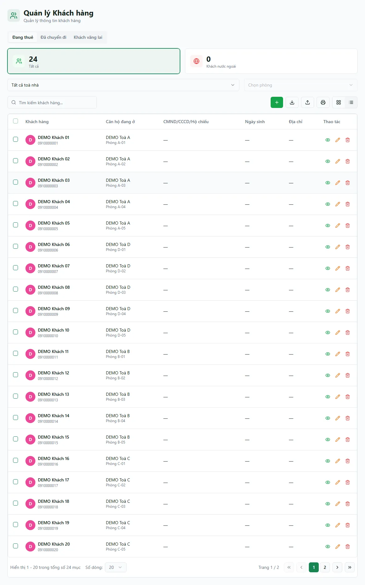

# Cư dân — danh sách & hồ sơ

Màn **Cư dân** là nơi lưu và tra cứu hồ sơ `customers`: thông tin cá nhân/tổ chức, giấy tờ, địa chỉ, liên hệ và phương tiện. Hệ thống vẫn còn bảng `tenants` legacy ở một số luồng cũ; hai nguồn này không tự đồng bộ hoàn toàn. Với hợp đồng/cọc mới, đối chiếu khách theo hồ sơ `customers` và không giả định một người-thuê legacy đã tự xuất hiện đúng ở đây.

::: tip Snapshot production DEMO (13/08/2026)
Với tài khoản `demo.chunha`, `/customers` tải xong ở tab **Đang thuê**, thẻ **Tổng** hiển thị **24** và thẻ **Nước ngoài** là **0**. Các dòng đang hiển thị dùng tên `DEMO Khách 01` trở đi; lượt xác minh không ghi dữ liệu và console không có lỗi. Con số này là ảnh chụp runtime tại thời điểm kiểm tra, không phải số lượng cố định cho mọi tổ chức.
:::

::: info Điều kiện tiên quyết
- Quyền **Cư dân => Xem** (module `customers`, action `view`) để mở màn danh sách.
- Cần quyền **Thêm** để tạo hồ sơ mới, **Nhập** để nhập từ Excel, **Xuất/In** cho các thao tác tương ứng.
- Quyền đọc `customers.view` hiện áp dụng **toàn tổ chức**. Bộ lọc toà/phòng được suy ra ở giao diện từ hợp đồng liên quan, không phải hàng rào RLS giới hạn bản ghi khách theo toà.
- Muốn quét QR CCCD tự điền hồ sơ thì cần ảnh mã QR mặt sau thẻ CCCD gắn chip (chỉ áp dụng cho khách **Cá nhân**).
:::

## Hướng dẫn từng bước

**Bước 1**: Tại menu bên trái, ấn chọn **Cư dân**. Snapshot hiện hành tải ở tab **Đang thuê** và chỉ hiển thị hai thẻ nhanh **24 Tất cả** / **0 Khách nước ngoài**, cùng ô tìm kiếm, bộ lọc vị trí và các nút thao tác. Việc chọn **Cá nhân/Tổ chức** nằm trong form hồ sơ, không phải hai thẻ thống kê riêng trên danh sách hiện tại.

**Bước 2**: Chọn tab trạng thái nếu cần — **Đang thuê** / **Đã chuyển đi** / **Khách vãng lai**. Trạng thái `MOVED_OUT` và `WALK_IN` hiện không được vòng đời hợp đồng cập nhật tự động đáng tin cậy, nên hai tab này có thể rỗng dù nghiệp vụ thực tế đã xảy ra. Thẻ **Khách nước ngoài** lọc riêng nhóm quốc tịch; danh sách hiện không có thẻ lọc **Cá nhân/Tổ chức**.

**Bước 3**: Tại ô tìm kiếm, gõ **tên**, **số điện thoại**, **email** hoặc **số CCCD** để lọc nhanh. Muốn thu hẹp theo vị trí, dùng ô lọc **Toà nhà** (danh sách phẳng A→Z, chọn 1 toà hoặc tất cả); chọn xong một toà thì ô **Phòng** mới bật lên. Các bộ lọc và ô tìm kiếm được giữ lại khi bạn tải lại trang (F5).

**Bước 4**: Muốn thêm khách mới, ấn nút **Thêm**. Hệ thống mở form tạo hồ sơ tại **/customers/new**. Ở đầu form, chọn **Loại khách hàng**: **Cá nhân** (điền **Họ và tên**) hoặc **Tổ chức** (điền **Tên công ty** và **Người đại diện**).

**Bước 5**: Điền các thông tin còn lại. Với khách **Cá nhân**, bạn có thể quét **QR CCCD** (kéo-thả ảnh QR, chọn file, dán Ctrl+V hoặc dùng camera) để hệ thống tự điền **Họ và tên**, **Số CCCD**, **Ngày sinh**, **Giới tính**, **ngày/nơi cấp** và **địa chỉ thường trú**. Số điện thoại là bắt buộc và phải là **10–11 chữ số**.

::: warning Không nhập dữ liệu thật
Trên bản demo/sandbox, **đừng nhập CCCD, số điện thoại hay ảnh giấy tờ thật** của khách. Hãy dùng dữ liệu giả (ví dụ SĐT `0900 000 098`, số CCCD bịa) để tránh lộ thông tin cá nhân.
:::

**Bước 6**: Tải ảnh giấy tờ ở khu **Ảnh giấy tờ** (kéo-thả hoặc dán clipboard, mỗi ảnh ≤ 10MB). Khách **Cá nhân** có 3 ô: **CCCD mặt trước**, **CCCD mặt sau**, **Hộ chiếu**. Khách **Tổ chức** dùng ô đầu làm **Đăng ký kinh doanh**. Ảnh được lưu vào kho riêng tư, chỉ hiển thị qua đường dẫn có chữ ký nên an toàn.

**Bước 7**: Kiểm tra lại toàn bộ rồi ấn **Lưu**. Hệ thống quay về danh sách **Cư dân**, hồ sơ mới nằm ở tab **Đang thuê**. Muốn mở lại hồ sơ, ấn nút **Xem** trên dòng khách để mở trang chi tiết (thông tin cá nhân, ảnh CCCD, địa chỉ, phương tiện, danh sách hợp đồng, liên hệ khẩn cấp).

::: tip Người ở cùng & người đại diện
Một hợp đồng có thể gắn **nhiều cư dân** (người ở cùng), trong đó **một người là đại diện** đứng tên. Việc gắn nhiều khách và chọn ai đại diện được thực hiện **khi ký hợp đồng** (xem [Hợp đồng](/03-quan-ly-van-hanh/hop-dong/)), không phải trên màn Cư dân. Ở trang chi tiết khách, cờ **Đại diện** cho biết khách đó có phải người đứng tên hợp đồng hay không.
:::

## Các tính năng khác trên màn hình

| Nút / Bộ lọc | Công dụng |
| --- | --- |
| Tab **Đang thuê / Đã chuyển đi / Khách vãng lai** | Lọc theo trường trạng thái hồ sơ; không suy ra tự động đầy đủ từ hợp đồng, nên `MOVED_OUT/WALK_IN` có thể thiếu. |
| Thẻ **Tất cả / Khách nước ngoài** | Thống kê nhanh theo phạm vi đang lọc; snapshot hiện tại lần lượt là 24 và 0. |
| Ô tìm kiếm | Lọc theo **tên / SĐT / email / số CCCD**. |
| Ô lọc **Toà nhà** | Bộ lọc giao diện theo toà được làm giàu từ hợp đồng; không giới hạn phạm vi đọc `customers.view` ở tầng dữ liệu. |
| Ô lọc **Phòng** | Combobox gõ-để-tìm, chỉ bật khi đã chọn đúng 1 toà. |
| Nút **Thêm** | Mở form tạo hồ sơ mới tại **/customers/new** (chỉ hiện khi có quyền **Thêm**). |
| Nút **Nhập Excel** | Nhập hàng loạt khách từ file Excel; đọc thêm được cả ảnh CCCD từ đường dẫn trong file. |
| Nút **Xuất Excel** | Xuất danh sách khách đang lọc ra file. |
| Nút **Xem** / **Sửa** / **Xoá** trên mỗi dòng | Mở chi tiết, sửa hồ sơ (**/customers/:id/edit**), hoặc xoá mềm hồ sơ. |
| **Mẫu CT01** (trong trang chi tiết) | Lập và in tờ khai thay đổi thông tin cư trú từ hồ sơ khách (xem [Hồ sơ CT01](/03-quan-ly-van-hanh/ho-so-ct01/)). |

## Tình huống & lỗi thường gặp

| Tình huống | Cách xử lý |
| --- | --- |
| Không thấy nút **Thêm** / **Nhập Excel** | Bạn thiếu quyền **Thêm/Nhập**. Nhờ quản trị cấp action tương ứng. |
| Lưu báo **"SĐT hoặc CCCD đã tồn tại"** | Trùng số điện thoại hoặc số CCCD với một hồ sơ khác. Tìm lại khách đó thay vì tạo trùng, hoặc kiểm tra số nhập vào. |
| Không lưu được vì lỗi số điện thoại | SĐT phải là **10–11 chữ số**, không dấu cách/ký tự. Nhập lại cho đúng định dạng. |
| Chọn **Phòng** ở bộ lọc nhưng ra 0 khách | Bộ lọc theo phòng hiện chưa có tác dụng lọc khách; hãy lọc bằng ô **Toà nhà** và ô tìm kiếm theo tên/SĐT. |
| Danh sách trống dù chắc chắn có khách | Kiểm tra tab/bộ lọc/từ khoá. Truy vấn lỗi hiện có thể bị biểu diễn như danh sách rỗng; tải lại và kiểm tra console/trạng thái mạng hoặc nhờ quản trị xác minh trước khi kết luận không có dữ liệu. |
| Tab **Đã chuyển đi** / **Khách vãng lai** luôn rỗng | Đúng hiện trạng: hệ thống chưa tự chuyển khách sang hai trạng thái này; hầu hết khách nằm ở **Đang thuê**. |
| Thấy khách thuộc toà ngoài phạm vi dự kiến | Đây phù hợp với quyền đọc hiện tại: `customers.view` là org-wide; bộ lọc toà chỉ là lọc giao diện. Quyền sửa/xoá vẫn cần action tương ứng. |
| Khách có ở luồng cũ nhưng không thấy/không khớp ở Cư dân | Một số luồng legacy ghi vào `tenants`; `tenants` và `customers` không tự đồng bộ hoàn toàn. Không tạo hồ sơ trùng ngay; đối chiếu SĐT/CCCD và nhờ quản trị hợp nhất đúng nguồn. |
| Quét QR CCCD không ra kết quả | QR phải là mã ở **mặt sau CCCD gắn chip**; ảnh mờ/nghiêng có thể đọc lỗi. Chụp lại rõ hoặc điền tay. |

::: warning Xoá khách là xoá mềm
Ấn **Xoá** chỉ ẩn hồ sơ khỏi danh sách chứ **không xoá hẳn** khỏi hệ thống — mọi liên kết hợp đồng, cọc và hoá đơn vẫn được giữ nguyên để không hỏng dữ liệu cũ. Tuy vậy giao diện không có nút khôi phục, nên hãy cân nhắc trước khi xoá.
:::

## Thử trực tiếp trên sandbox

<SandboxTry account="demo.chunha" app-path="/customers" app-label="Mở màn Cư dân" fixtures="24 khách DEMO đang thuê; 0 khách nước ngoài" view-only>

Bài tập **chỉ xem** trên snapshot đang hiển thị:

1. Quan sát tab **Đang thuê** và đối chiếu thẻ **Tổng = 24** cùng thẻ **Nước ngoài = 0**.
2. Dùng ô tìm kiếm với từ khoá `DEMO Khách`, rồi mở một dòng đang hiển thị để xem hồ sơ chi tiết, hợp đồng và phương tiện (nếu có).
3. Quay lại danh sách, bỏ từ khoá và xác nhận các dòng `DEMO Khách 01` trở đi vẫn thuộc tab **Đang thuê**. Không ấn **Thêm**, **Lưu**, **Sửa** hoặc **Xoá**.

Kết quả mong đợi: bạn đọc được snapshot khách DEMO hiện hành và biết đường mở hồ sơ mà không tạo hoặc thay đổi dữ liệu.

</SandboxTry>

## Quy trình liên quan

- [Quy trình khách thuê](/01-bat-dau/quy-trinh-khach-thue/) — vòng đời từ khách tiềm năng đến khi ký hợp đồng.
- [Khách hẹn](/03-quan-ly-van-hanh/khach-hen/) — theo dõi khách tiềm năng (lead) trước khi thành cư dân.
- [Hợp đồng](/03-quan-ly-van-hanh/hop-dong/) — gắn cư dân vào hợp đồng và chọn người đại diện.
- [Hồ sơ CT01](/03-quan-ly-van-hanh/ho-so-ct01/) — lập tờ khai thay đổi thông tin cư trú từ hồ sơ khách.
- [Phương tiện](/03-quan-ly-van-hanh/phuong-tien/) — quản lý xe của cư dân (biển số, phí gửi xe).
