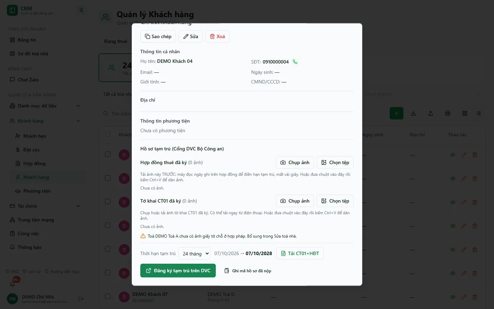

# Đăng ký tạm trú trên Cổng DVC Bộ Công an

Trước đây, mỗi lần đăng ký tạm trú cho một khách bạn phải chép tay từng ô (họ tên, ngày sinh, CCCD, địa chỉ) sang form của Cổng dịch vụ công `dichvucong.dancuquocgia.gov.vn`, rồi tải lên ba loại ảnh: hợp đồng thuê đã ký, tờ khai CT01 đã ký và giấy tờ chứng minh chỗ ở hợp pháp của toà. Nay CRM giữ sẵn ảnh, tự đọc thời hạn trên ảnh hợp đồng, và có nút **Đăng ký tạm trú trên DVC**: extension Chrome *iHome Tạm trú* mở cổng và điền toàn bộ form, bạn chỉ kiểm tra, tick "chịu trách nhiệm" và bấm **Nộp hồ sơ**. Khi cổng nhận hồ sơ, **mã hồ sơ** tự ghi về CRM.

::: info Điều kiện tiên quyết
- Quyền **Cư dân => In** (`customers.print`) để thấy khối **Hồ sơ tạm trú**, lưu ảnh và bấm nút; quyền **Toà nhà => Sửa** (`buildings.edit`) để lưu giấy tờ chỗ ở hợp pháp của toà.
- Khách có **hợp đồng đang ở**; hồ sơ khách đủ **họ tên, ngày sinh, giới tính, CCCD 12 số**. Toà nhà có **địa chỉ chi tiết chứa phường/xã mới** (ví dụ `950/65 Nguyễn Kiệm, Khu Phố 14, Phường Hạnh Thông, TP Hồ Chí Minh`) — cổng dùng đơn vị hành chính mới, không có quận.
- Toà nhà đã khai **Chủ sở hữu pháp lý (bên cho thuê)** nếu muốn tải bộ CT01 + hợp đồng (Word) từ CRM.
- Chrome đã cài extension **iHome Tạm trú** (một lần mỗi máy, xem cuối trang) và tài khoản VNeID của người nộp.
:::

::: danger Dữ liệu cá nhân nhạy cảm
Ảnh CT01, hợp đồng và giấy chủ quyền chứa CCCD, chữ ký, địa chỉ. Chỉ tải lên và mở khi có mục đích nghiệp vụ; ảnh lưu ở kho riêng tư, chỉ người có quyền trên toà đó mới xem được.
:::

## Hướng dẫn từng bước

**Bước 1 — Giấy tờ chỗ ở hợp pháp của toà (làm một lần)**: vào **Danh mục dữ liệu** => **Toà nhà**, bấm biểu tượng bút chì của toà, kéo xuống cuối hộp **TOÀ NHÀ** tới khối **Giấy tờ chứng minh chỗ ở hợp pháp**, bấm **Chọn tệp** (hoặc **Chụp ảnh** trên điện thoại, hoặc rê chuột vào khối rồi **Ctrl+V**) để tải ảnh sổ hồng/giấy tờ chủ quyền. Ảnh này được đính kèm cho mọi hồ sơ tạm trú của toà về sau. Cùng hộp đó có khối **Chủ sở hữu pháp lý (bên cho thuê)** dùng cho hợp đồng in ra.

**Bước 2 — Mở khối Hồ sơ tạm trú**: vào **Khách hàng** => **Khách hàng**, bấm biểu tượng mắt trên dòng khách để mở hộp **Chi tiết khách hàng**, kéo xuống khối **Hồ sơ tạm trú (Cổng DVC Bộ Công an)**. Khách ở nhiều phòng thì chọn phòng ở ô **Phòng kê khai** trước. Khách chưa có hợp đồng đang ở thì khối báo "Khách chưa có hợp đồng đang ở, chưa thể lập hồ sơ tạm trú."

**Bước 3 — In và ký giấy**: chọn **Thời hạn tạm trú** (12 hoặc 24 tháng, mặc định 24) rồi bấm **Tải CT01+HĐT** để tải file Word tờ khai CT01 và hợp đồng cho thuê, mượn, ở nhờ; in ra, đem cho khách và chủ nhà ký.

**Bước 4 — Lưu ảnh giấy đã ký** (thứ tự quan trọng):

1. **Hợp đồng thuê đã ký** — tải ảnh này **TRƯỚC**: máy đọc ngày ghi trên hợp đồng (mất vài giây, ngay trên máy bạn) để điền hạn tạm trú. Dòng kết quả ghi "Hợp đồng ghi: … đến …. Hạn tạm trú sẽ khai theo ngày này."; đọc sai thì sửa **Hợp đồng từ ngày** / **Hợp đồng đến ngày**, hoặc bấm đọc lại.
2. **Tờ khai CT01 đã ký**.

Mỗi hàng có **Chụp ảnh** (điện thoại chụp thẳng) và **Chọn tệp**; trên máy tính có thể rê chuột vào hàng rồi bấm **Ctrl+V** để dán ảnh. Dòng trạng thái bên dưới cho biết toà đã có ảnh chỗ ở hợp pháp chưa ("Giấy tờ chỗ ở hợp pháp của toà …: N ảnh." hoặc cảnh báo "chưa có ảnh… Bổ sung trong Sửa toà nhà.").

::: tip Thời hạn tạm trú lấy theo hợp đồng
Ngày bắt đầu tạm trú là **ngày ký hợp đồng**: đọc được trên ảnh thì dùng ngày đó, không thì lấy ngày tải ảnh hợp đồng lên, cuối cùng mới là hôm nay. Ngày kết thúc đọc thẳng từ giấy được ưu tiên; không đọc được thì tính bằng ngày bắt đầu + 12/24 tháng. Hàng **Thời hạn tạm trú** hiện "ngày bắt đầu → **ngày kết thúc**", và lựa chọn 12/24 tháng được lưu lại cho lần mở sau.
:::

::: tip Tên ảnh được đặt lại cho dễ đối chiếu
Hệ thống bỏ tên gốc của máy ảnh và đặt lại theo đối tượng: ảnh chủ quyền thành `chuquyen950nk1.jpg`, `chuquyen950nk2.jpg`; ảnh của khách thành `nguyengiabinhct011.jpg`, `nguyengiabinhhopdong1.jpg`. Chỉ nhận **JPG và PNG** (cổng từ chối WebP); ảnh được giữ nguyên byte gốc, không nén lại.
:::

**Bước 5 — Gửi sang Cổng DVC**: bấm **Đăng ký tạm trú trên DVC**. Nếu thiếu dữ liệu, CRM báo đúng thứ thiếu (ví dụ toà chưa có ảnh giấy tờ chỗ ở hợp pháp) và không mở cổng. Nếu chưa cài extension, CRM hiện hướng dẫn cài. Gửi được thì CRM báo "Đã mở Cổng DVC ở tab mới. Đăng nhập VNeID nếu cần, bấm "Điền ngay", kiểm tra rồi nộp."

**Bước 6 — Trên Cổng DVC**: tab mới mở form Đăng ký tạm trú. Cổng có thể yêu cầu đăng nhập VNeID (CCCD, mật khẩu, OTP) — đăng nhập xong form tự hiện. Bảng nổi **iHome Tạm trú** ở góc phải dưới tóm tắt khách, toà, phòng, hạn tạm trú và số ảnh, kèm **ảnh thu nhỏ từng tệp sắp đính kèm** (bấm để xem to); bấm **Điền ngay**. Extension lần lượt chọn tỉnh và phường (cơ quan Công an phường tự hiện), chọn thủ tục lập hộ mới và khai hộ, điền thông tin khách và địa chỉ, mở mục đính kèm "do thuê, mượn, ở nhờ", gắn ảnh hợp đồng, CT01 và ảnh giấy chỗ ở hợp pháp của toà.

**Bước 7 — Kiểm tra và nộp**: rà lại từng mục (đặc biệt giới tính, ngày sinh, địa chỉ, số ảnh), tick **Tôi xin chịu trách nhiệm trước pháp luật về lời khai trên**, bấm **Nộp hồ sơ** hoặc **Lưu nháp**. Extension không bao giờ tự bấm hai nút này.

**Bước 8 — Mã hồ sơ về CRM**: khi cổng nhận hồ sơ, extension ghi **mã hồ sơ** về CRM ngay (không cần mở lại hộp khách). Khối Hồ sơ tạm trú hiện dải xanh **Đã đăng ký tạm trú** kèm mã (bấm biểu tượng để **sao chép mã hồ sơ**), ngày nộp, thời hạn và cơ quan nhận; các lần nộp trước gấp lại thành "N lần nộp trước". Nếu nộp theo cách khác (extension không chứng kiến), bấm **Ghi mã hồ sơ đã nộp**, dán **Mã hồ sơ đã nộp** (dạng `G01.899.909-260916-890028`) rồi **Lưu**.

## Điều gì được điền, điều gì không

| Mục trên cổng | Nguồn từ CRM |
|---|---|
| Tỉnh/Thành phố, Xã/Phường, Cơ quan thực hiện | Tỉnh của toà; phường lấy từ địa chỉ chi tiết của toà |
| Thủ tục, Đăng ký tạm trú lập hộ mới, Trường hợp, Khai hộ | Cố định theo cách đang nộp (mỗi khách một hộ, khách là chủ hộ) |
| Họ tên, Định dạng ngày, Ngày sinh, Giới tính, CCCD, SĐT, Email | Hồ sơ khách |
| Địa chỉ đăng ký tạm trú | Phần số nhà, đường, khu phố đứng trước phường trong địa chỉ toà |
| Chủ hộ tạm trú, quan hệ, CCCD chủ hộ | Chính khách, quan hệ "Chủ hộ" |
| Thời hạn tạm trú | Theo hàng **Thời hạn tạm trú** (ngày ký hợp đồng → ngày kết thúc) |
| Đính kèm | Ảnh hợp đồng, CT01 của khách; ảnh chỗ ở hợp pháp của toà; hình thức "Bản gốc" |
| Bảng xin ý kiến VNeID, thành viên cùng thay đổi, ô chịu trách nhiệm, nút Nộp | **Không điền** — bạn tự làm nếu cần |

## Huỷ đăng ký tạm trú khi khách trả phòng

Ngay dưới khối đăng ký có khối **Huỷ đăng ký tạm trú (Cổng DVC Bộ Công an)**, mặc định thu gọn — bấm mũi tên để mở. Khối liệt kê cả hợp đồng đã thanh lý, hết hạn hoặc chuyển phòng (khách ở nhiều phòng thì chọn ở ô **Phòng huỷ tạm trú**) và không có ô thời hạn.

1. Bấm **Tải CT01+BBTL**: file Word gồm tờ khai CT01 ghi "Hủy tạm trú tại <địa chỉ toà>" và **biên bản thanh lý hợp đồng thuê nhà** (Bên A là chủ sở hữu pháp lý của toà, Bên B là khách). Ngày thanh lý do hệ thống lấy theo hợp đồng (ngày thanh lý thực tế, không có thì ngày dự kiến chuyển đi, không có nữa thì ngày tải giấy) — dòng trong khối ghi rõ ngày sẽ in. In ra, hai bên ký.
2. Tải ảnh hai giấy đã ký vào **Tờ khai CT01 huỷ tạm trú đã ký** và **Biên bản thanh lý đã ký** (Chụp ảnh / Chọn tệp / Ctrl+V như trên).
3. Đăng nhập Cổng DVC trước, rồi bấm **Huỷ đăng ký tạm trú trên DVC**. Extension mở trang Xoá đăng ký tạm trú; bảng nổi **iHome Tạm trú · Huỷ đăng ký** → **Điền ngay**. Extension chọn tỉnh, phường theo toà, thủ tục **Xóa đăng ký tạm trú**, trường hợp **Cả hộ do không còn chỗ ở hợp pháp** (cố định), khai hộ, điền người đề nghị và chủ hộ là chính khách, gắn CT01 huỷ vào dòng "Tờ khai thay đổi thông tin cư trú" và biên bản vào dòng "Giấy tờ chứng minh về việc không còn chỗ ở hợp pháp". Extension chỉ thao tác như người dùng trên các ô đang hiện, không đụng ô ẩn.
4. Bạn tự rà lại, tick **Tôi xin chịu trách nhiệm…** và bấm **Nộp hồ sơ**. Mã hồ sơ về CRM thành dải **Đã huỷ tạm trú**, tách riêng với lịch sử đăng ký; nộp theo cách khác thì dùng **Ghi mã hồ sơ đã nộp** trong chính khối này.

Cần extension **từ bản 1.1.0**; bản cũ chỉ biết đăng ký nên CRM hiện hướng dẫn bấm tải lại extension thay vì gửi.

## Cài extension iHome Tạm trú (một lần mỗi máy)

1. Mở Chrome, vào `chrome://extensions`, bật **Developer mode**.
2. Bấm **Load unpacked**, chọn thư mục `extensions/tam-tru` trong mã nguồn CRM.
3. Tải lại trang CRM. Khi cập nhật phiên bản, bấm nút tải lại ở thẻ extension.

Extension không giữ mật khẩu hay khoá CRM. Gói dữ liệu đi thẳng từ trang CRM sang đúng extension này, không phát ra cho phần mềm khác trên trang; extension chỉ nhận ảnh từ kho của CRM. Trang mở lại từ hồ sơ nháp (`?id=`) không tự điền.

## Lỗi thường gặp

| Tình huống | Cách xử lý |
| --- | --- |
| Không thấy khối **Hồ sơ tạm trú** | Thiếu quyền `customers.print`, hoặc đang xem trang hồ sơ đầy đủ — khối nằm trong **hộp Chi tiết khách hàng** mở từ danh sách khách (và trang chi tiết khách trên điện thoại). |
| "Không đọc được thời hạn trên ảnh hợp đồng." | Ảnh mờ/nghiêng. Sửa tay **Hợp đồng từ ngày / đến ngày**, hoặc chụp lại rõ hơn. |
| "Địa chỉ chi tiết của toà chưa có phường/xã mới" | Sửa toà nhà, ghi địa chỉ đầy đủ dạng `…, Phường X, TP Hồ Chí Minh`. |
| "Không thấy phường … trên cổng" | Tên phường trong địa chỉ toà không khớp danh sách cổng (sau sáp nhập). Sửa lại đúng tên phường mới. |
| "Extension iHome Tạm trú không phản hồi" | Extension chưa bật hoặc trang CRM chưa tải lại sau khi cài. |
| Bảng nổi không hiện trên cổng | Gói dữ liệu chỉ giữ 1 giờ; bấm lại nút trên CRM. Tab mở từ hồ sơ nháp không tự điền. |
| **Ghi mã hồ sơ đã nộp** báo "Mã hồ sơ trông không đúng dạng." | Dán đúng mã cổng cấp (dạng `G01.…-……-……`). |

## Thử trực tiếp trên sandbox

<SandboxTry account="demo.chunha" app-path="/customers" app-label="Mở màn Khách hàng" fixtures="Snapshot 07/10/2026: DEMO Khách 04 · DEMO Toà A · A-04; toà DEMO chưa có ảnh chỗ ở hợp pháp; chưa có ảnh hợp đồng/CT01." view-only>

**Bài tập chỉ xem**

1. Ở màn **Khách hàng**, bấm biểu tượng mắt của **DEMO Khách 04**.
2. Kéo xuống khối **Hồ sơ tạm trú**: đọc hai hàng **Hợp đồng thuê đã ký** / **Tờ khai CT01 đã ký**, cảnh báo toà chưa có ảnh chỗ ở hợp pháp và hàng **Thời hạn tạm trú**.
3. Đóng hộp. **Không** tải ảnh, không bấm **Tải CT01+HĐT**, **Đăng ký tạm trú trên DVC** hay **Ghi mã hồ sơ đã nộp**.

**Kết quả mong đợi**: bạn biết khối nằm ở đâu, cần chuẩn bị những gì trước khi gửi hồ sơ, và không có dữ liệu DEMO nào bị thay đổi.

</SandboxTry>

## Quy trình liên quan

- [Hồ sơ cư dân & CT01](/03-quan-ly-van-hanh/ho-so-ct01/) — lập tờ khai CT01 trên web và tải CT01+HĐT.
- [Cư dân](/03-quan-ly-van-hanh/cu-dan/) — danh sách khách và hộp Chi tiết khách hàng.
- [Toà nhà](/03-quan-ly-van-hanh/toa-nha/) — chủ sở hữu pháp lý và giấy tờ chỗ ở hợp pháp của toà.
- [Hợp đồng](/03-quan-ly-van-hanh/hop-dong/) — hợp đồng đang ở của khách.
