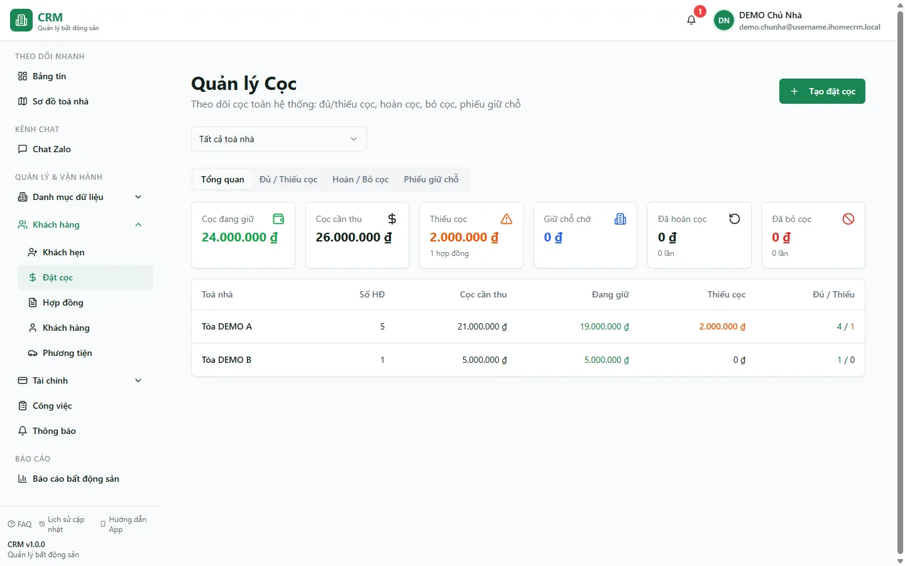

# Đặt cọc giữ chỗ

Màn **Đặt cọc** là trung tâm quản lý tiền cọc: bạn nhận cọc giữ chỗ khi khách chưa ký hợp đồng, theo dõi hợp đồng nào đã đủ hay còn thiếu cọc, xem các khoản đã hoàn/bỏ cọc và chuyển một phiếu cọc giữ chỗ thành hợp đồng. Điểm cốt lõi bạn cần nhớ: **ngay khi có phiếu cọc giữ chỗ cho một phòng, phòng đó tự chuyển sang "Đã cọc / Giữ chỗ" và biến khỏi danh sách phòng trống** — kể cả khi phiếu chưa được duyệt.

::: info Điều kiện tiên quyết
- Quyền **Đặt cọc => Xem** (module `deposits`, action `view`) để mở màn.
- Quyền **Đặt cọc => Tạo** (`deposits.create`) để bấm **Tạo đặt cọc**; quyền **Đặt cọc => Chuyển hợp đồng** (`deposits.convert`) để bấm **Tạo HĐ** từ phiếu giữ chỗ.
- Đã có **toà nhà** và **phòng** trong hệ thống, và ít nhất một **sổ quỹ thu** để tiền cọc chảy vào (xem [Sổ quỹ & loại thu chi](/01-bat-dau/so-quy-loai-thu-chi/)).
- Là nhân viên, bạn chỉ thấy và thao tác cọc của các toà được gán phạm vi cho mình.
:::

## Hướng dẫn từng bước

**Bước 1**: Tại menu bên trái, ấn chọn **Đặt cọc**. Màn mở ra với **4 tab** — **Tổng quan**, **Đủ / Thiếu cọc**, **Hoàn / Bỏ cọc**, **Phiếu giữ chỗ** — cùng ô lọc toà nhà dùng chung. Trong dữ liệu demo bạn thấy 2 phiếu cọc giữ chỗ: phòng **A301** (cọc đủ) và phòng **A302** (đã quá hạn giữ chỗ).

**Bước 2**: Ở tab **Tổng quan**, đọc các thẻ KPI nhanh: **Cọc đang giữ** (tổng cọc đã thu của các hợp đồng đang hiệu lực), **Cọc cần thu**, **Thiếu cọc**, **Giữ chỗ chờ** (tổng tiền các phiếu cọc giữ chỗ đã duyệt), **Đã hoàn cọc** và **Đã bỏ cọc**. Bảng bên dưới gộp số liệu theo từng toà nhà.

**Bước 3**: Sang tab **Phiếu giữ chỗ** để làm việc với cọc giữ chỗ trước hợp đồng. Ba thẻ đếm phiếu theo trạng thái: **Chờ duyệt** / **Đang giữ chỗ** / **Đã huỷ**. Bảng liệt kê Mã phiếu, Nội dung, Toà nhà, Phòng, Người nộp, Số tiền, Ngày và Trạng thái.

**Bước 4**: Nhận một cọc giữ chỗ mới — ấn **Tạo đặt cọc**. Tại form, chọn **Phòng** (bắt buộc, chỉ nên chọn phòng trống), điền **Số tiền cọc**, **Ngày đặt cọc**, và tuỳ chọn **Giữ phòng đến** (hạn giữ chỗ), **CTV**, **Ghi chú**. Có thể chọn sẵn hoặc tạo mới **Khách** để gắn tên người nộp. Ấn **Lưu**.

::: danger Tạo đặt cọc là thao tác ghi tiền vào sổ quỹ
Khi bạn lưu, hệ thống tạo **một phiếu thu cọc** cho phòng đó. Nếu số tiền lớn hơn 1đ, tiền vào **sổ thu mặc định của chính bạn** (sổ quỹ thật); nếu để trống/1đ hoặc bạn chưa có sổ thu, phiếu ghi vào **sổ ảo "CỌC (giữ hộ khách)"**. Hãy chọn đúng phòng và đúng số tiền trước khi lưu — đây là tiền thật đi vào sổ.
:::

::: tip Phòng tự chuyển "Đã cọc / Giữ chỗ" ngay khi có phiếu cọc
Ngay sau khi phiếu cọc được tạo cho một phòng trống, hệ thống tự đặt phòng sang trạng thái **Đã đặt cọc** (RESERVED) và **ẩn phòng khỏi danh sách phòng trống** ở khắp hệ thống (Căn hộ/Phòng, Sơ đồ toà nhà, trang công khai). Điều này xảy ra **kể cả khi phiếu chưa được duyệt** — bạn không cần chỉnh trạng thái phòng bằng tay. Khi phiếu bị **Huỷ**, phòng tự trả về **Trống**.
:::

**Bước 5**: Chuyển cọc giữ chỗ thành hợp đồng — với một phiếu **Đang giữ chỗ** (đã duyệt) có gắn phòng, ấn **Tạo HĐ**. Form hợp đồng mở sẵn đúng **toà** và **phòng** của phiếu. Khi hợp đồng lưu thành công, hệ thống **tự gắn phiếu cọc giữ chỗ vào hợp đồng**: phiếu rời khỏi tab Phiếu giữ chỗ và tiền cọc chảy vào phần **đã thu** của hợp đồng.

::: warning Cọc giữ chỗ tự gắn vào hợp đồng của phòng
Khi bạn tạo hợp đồng cho một phòng, mọi phiếu cọc giữ chỗ chưa gắn hợp đồng của **cùng phòng đó** (trong khoảng ngày phù hợp) sẽ **tự động gắn** vào hợp đồng mới. Vì vậy nếu khách cũ đã bỏ mà phiếu cọc giữ chỗ còn treo, hãy **Huỷ phiếu đó ở màn Thu chi trước** khi ký hợp đồng cho khách mới — tránh cộng nhầm tiền cọc của người này sang hợp đồng của người kia.
:::

**Bước 6**: Theo dõi đủ/thiếu cọc — sang tab **Đủ / Thiếu cọc**. Tab liệt kê các hợp đồng đang hiệu lực **chưa đủ cọc**, với **Cần thu / Đã thu / Còn thiếu**, badge trạng thái (**Thu ở HĐ đầu** nếu phần thiếu được gộp vào hoá đơn tháng đầu, hoặc **Nợ cọc**) và cột **Hẹn bổ sung**. Bật **Chỉ hiện thiếu cọc** để lọc gọn các trường hợp còn nợ cọc.

**Bước 7**: Xem các khoản đã tất toán — tab **Hoàn / Bỏ cọc** hiển thị lịch sử từ các lần thanh lý hợp đồng: **Bỏ cọc** (cọc thành doanh thu) hay **Hoàn cọc**, kèm **Cọc gốc**, **Tổng nợ tất toán** và cột **Còn nợ / Hoàn lại**. Cần thao tác hoàn/bỏ cọc chi tiết thì làm ở luồng [Hoàn / Bỏ cọc](/03-quan-ly-van-hanh/hoan-bo-coc/).

::: tip Nguồn sự thật của số cọc là phiếu thu, không phải trạng thái phiếu
Số cọc "đã thu" của một hợp đồng được tính lại từ **các phiếu thu có hạng mục "Tiền cọc"** đã duyệt và gắn vào hợp đồng (`deposit_remaining` = cần thu − đã thu). Bạn không sửa số này bằng tay: cứ ghi/sửa/duyệt phiếu thu cọc, hệ thống tự cập nhật con số đủ/thiếu.
:::

## Các tính năng khác trên màn hình

| Nút / Bộ lọc | Công dụng |
| --- | --- |
| Ô lọc toà nhà | Chọn đúng **1 toà** hoặc **Tất cả toà nhà** (danh sách phẳng A→Z, gõ để tìm); áp cho cả 4 tab. |
| Tab **Tổng quan** | Các thẻ KPI (Cọc đang giữ, Cọc cần thu, Thiếu cọc, Giữ chỗ chờ, Đã hoàn/Đã bỏ cọc) + bảng gộp theo toà. |
| Tab **Đủ / Thiếu cọc** | Danh sách hợp đồng chưa đủ cọc; toggle **Chỉ hiện thiếu cọc**; cột Hẹn bổ sung. |
| Tab **Hoàn / Bỏ cọc** | Lịch sử hoàn/bỏ cọc từ các lần thanh lý hợp đồng. |
| Tab **Phiếu giữ chỗ** | Cọc giữ chỗ trước hợp đồng; 3 thẻ Chờ duyệt / Đang giữ chỗ / Đã huỷ. |
| Ô tìm kiếm (tab Phiếu giữ chỗ) | Tìm theo mã, nội dung, người nộp, phòng. |
| Bộ lọc trạng thái (tab Phiếu giữ chỗ) | Lọc theo Chờ duyệt / Đang giữ chỗ / Đã huỷ. |
| **Tạo đặt cọc** | Mở form tạo phiếu cọc giữ chỗ mới (cần quyền `deposits.create`). |
| **Tạo HĐ** | Chuyển một phiếu giữ chỗ đã duyệt thành hợp đồng, mở sẵn toà/phòng (cần quyền `deposits.convert`). |

Bộ lọc và tab đang mở được **giữ lại khi bạn tải lại trang (F5)**.

## Tình huống & lỗi thường gặp

| Tình huống | Cách xử lý |
| --- | --- |
| Phòng tự thành **Đã đặt cọc** mà chưa duyệt phiếu | Đúng thiết kế: chỉ cần có phiếu cọc giữ chỗ (kể cả **Chờ duyệt**) là phòng đã khoá **Đã cọc** và rời danh sách phòng trống. Duyệt hoặc huỷ phiếu sẽ tự cập nhật lại. |
| Cọc giữ chỗ **quá hạn** (như A302) mà phòng vẫn **Đã đặt cọc** | Hệ thống **không tự nhả phòng khi hết hạn giữ chỗ** — "Giữ phòng đến" chỉ là ghi chú. Khi khách bỏ, hãy **Huỷ phiếu giữ chỗ ở màn Thu chi**; phòng sẽ tự trả về **Trống**. |
| Không thấy nút **Sửa / Duyệt / Huỷ** phiếu trong tab Phiếu giữ chỗ | Đúng: phiếu cọc là một phiếu thu, nên **sửa/duyệt/huỷ làm ở màn Thu chi** như mọi phiếu khác. Tab này chỉ để xem và bấm **Tạo HĐ**. |
| Tạo hợp đồng xong bị báo **thiếu cọc** dù khách đã đặt cọc | Kiểm tra phiếu cọc giữ chỗ đã **duyệt** chưa và có đúng **phòng** không — chỉ phiếu đã duyệt mới cộng vào phần đã thu. Phiếu chưa duyệt hiện dạng "chưa tính". |
| Tab **Tổng quan / Đủ-Thiếu cọc** trống dù có hợp đồng | Thường do phạm vi toà: nhân viên chỉ thấy cọc của toà được gán. Kiểm tra ô lọc toà còn dính giá trị cũ (giữ qua F5) và phân quyền toà. |
| Cọc còn **thiếu** của một hợp đồng | Có 2 cách xử lý lúc ký: **Nợ cọc** (theo dõi + nhắc bổ sung) hoặc **Thu ở HĐ đầu** (gộp phần thiếu thành hạng mục "Tiền cọc" trong hoá đơn tháng đầu). Badge ở tab Đủ/Thiếu cọc cho biết đang ở cách nào. |

## Thử trực tiếp trên sandbox

<SandboxTry account="demo.sale" app-path="/deposits" app-label="Mở màn Đặt cọc" fixtures="A301 cọc đủ, A302 cọc quá hạn">

Thực hành nhận cọc giữ chỗ và xem phòng tự khoá:

1. Ở tab **Phiếu giữ chỗ**, xem 2 cọc giữ chỗ sẵn có: phòng **A301** (cọc đủ) và **A302** (đã quá hạn giữ chỗ). Để ý A302 vẫn giữ phòng dù đã quá hạn.
2. Ấn **Tạo đặt cọc**, chọn phòng trống **A303**, điền số tiền **1.000.000đ** và **Ngày đặt cọc**, rồi ấn **Lưu**.
3. Mở màn [Căn hộ / Phòng](/03-quan-ly-van-hanh/can-ho-phong/) (hoặc [Sơ đồ toà nhà](/02-theo-doi-nhanh/so-do-toa-nha/)) và kiểm tra phòng **A303** đã tự chuyển sang **Đã cọc / Giữ chỗ**, không còn nằm trong danh sách phòng trống.

Kết quả mong đợi: bạn hiểu rằng chỉ cần tạo một phiếu cọc giữ chỗ là phòng tự chuyển sang **Đã đặt cọc** (RESERVED) và biến khỏi danh sách phòng trống — không cần chỉnh trạng thái phòng bằng tay.

</SandboxTry>

## Quy trình liên quan

- [Hoàn / Bỏ cọc](/03-quan-ly-van-hanh/hoan-bo-coc/) — xử lý hoàn cọc hoặc bỏ cọc khi thanh lý hợp đồng.
- [Hợp đồng](/03-quan-ly-van-hanh/hop-dong/) — ký hợp đồng cho phòng; cọc giữ chỗ tự gắn vào hợp đồng của phòng.
- [Căn hộ / Phòng](/03-quan-ly-van-hanh/can-ho-phong/) — xem trạng thái **Đã đặt cọc** của từng phòng do cọc giữ chỗ tạo ra.
- [Khách hẹn](/03-quan-ly-van-hanh/khach-hen/) — pipeline khách tiềm năng trước khi nhận cọc.
- [Sổ quỹ & loại thu chi](/01-bat-dau/so-quy-loai-thu-chi/) — nơi tiền cọc chảy vào; cấu hình sổ thu mặc định.
- [Quy trình khách thuê](/01-bat-dau/quy-trinh-khach-thue/) — vị trí bước đặt cọc trong toàn bộ vòng đời khách thuê.
