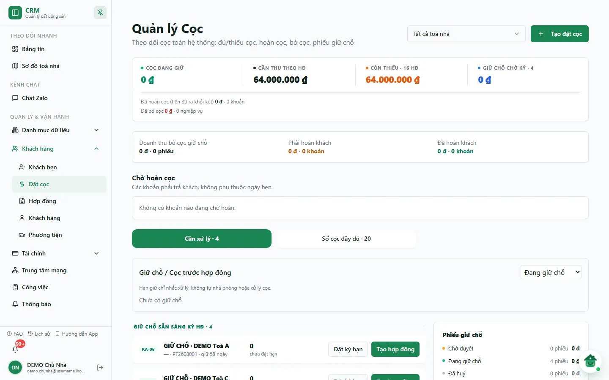
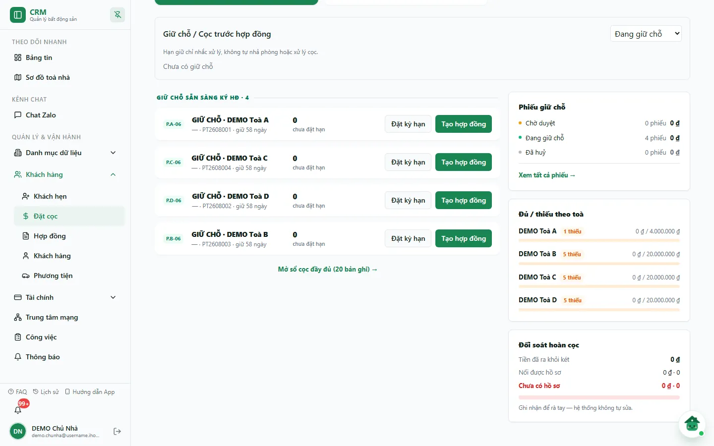
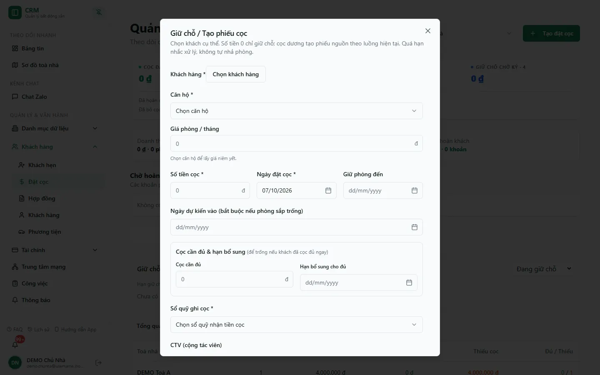
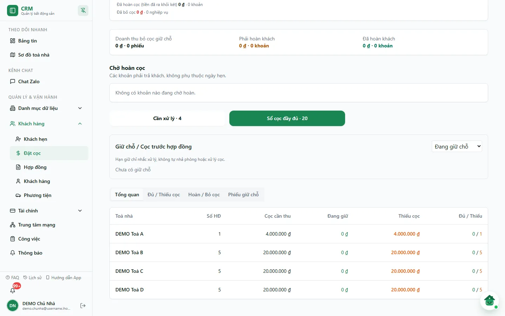

# Đặt cọc giữ chỗ

Màn **Quản lý Cọc** là trung tâm theo dõi tiền cọc toàn hệ thống: giữ chỗ phòng cho một khách cụ thể (có hoặc chưa có tiền), nhận cọc trước hợp đồng, xử lý các việc trễ hạn hoặc sắp đến hạn, theo dõi hợp đồng nào đủ hay còn thiếu cọc, xử lý bỏ cọc/hoàn cọc khi khách không ký, và chuyển giữ chỗ thành hợp đồng. Địa chỉ cũ `/reservations` và `/reservations/all` nay tự **chuyển hướng** về `/deposits`.

::: info Điều kiện tiên quyết
- Quyền **Đặt cọc => Xem** (module `deposits`, action `view`) để mở màn.
- **Tạo đặt cọc** cần `deposits.create`; **Tạo hợp đồng / Tạo HĐ** từ giữ chỗ cần `deposits.convert`; **Duyệt** phiếu cọc chờ duyệt và **Điều chỉnh hạn** cần `deposits.edit`; **Hủy giữ chỗ** cần `deposits.delete`.
- **Xử lý bỏ cọc** và **Hoàn tiền** cần đồng thời **Hoàn / bỏ cọc** (`deposits.refund`) và **Duyệt thu chi** (`income_expenses.approve`).
- Đã có **toà nhà**, **phòng**, **khách hàng** và ít nhất một **sổ quỹ** để ghi tiền cọc (xem [Sổ quỹ & loại thu chi](/01-bat-dau/so-quy-loai-thu-chi/)).
- Là nhân viên, bạn chỉ thấy và thao tác cọc của các toà được gán phạm vi cho mình.
:::

## Hướng dẫn từng bước

**Bước 1**: Tại menu bên trái, ấn chọn **Khách hàng** => **Đặt cọc**. Đầu màn **Quản lý Cọc** có ô lọc **Tất cả toà nhà** (chọn 1 toà hoặc tất cả, áp cho mọi khối bên dưới) và nút **Tạo đặt cọc**. Bên dưới là:

- **Dải số liệu**: **Cọc đang giữ**, **Cần thu theo HĐ**, **Còn thiếu · N HĐ**, **Giữ chỗ chờ ký · N**, kèm hai dòng **Đã hoàn cọc (tiền đã ra khỏi két)** và **Đã bỏ cọc**.
- **Khối giữ chỗ**: **Doanh thu bỏ cọc giữ chỗ**, **Phải hoàn khách**, **Đã hoàn khách**.
- **Chờ hoàn cọc**: các khoản phải trả lại khách (sau khi xử lý bỏ cọc chọn "Hoàn sau"), mỗi khoản có nút **Hoàn tiền**.
- Hai nút chuyển chế độ: **Cần xử lý · N** và **Sổ cọc đầy đủ · N**.

**Bước 2**: Ở chế độ **Cần xử lý**, đọc hàng việc. Trên cùng là khối **Giữ chỗ / Cọc trước hợp đồng** (danh sách hồ sơ giữ chỗ, lọc **Đang giữ chỗ / Đã ký hợp đồng / Đã hủy / Tất cả**). Bên dưới, việc được gom theo nhóm, nhóm khẩn nhất đứng đầu:

| Nhóm | Ý nghĩa |
| --- | --- |
| **QUÁ HẠN BỔ SUNG CỌC — NGUY CƠ MẤT CỌC** | Giữ chỗ đã cọc một phần, quá hạn khách phải nộp cho đủ. |
| **QUÁ HẠN LÀM HỢP ĐỒNG** | Quá **hạn phải làm hợp đồng** mà chưa ký. |
| **QUÁ HẠN HẸN BỔ SUNG CỌC** | Hợp đồng đã ký còn nợ cọc, quá ngày hẹn bổ sung. |
| **SẮP HẾT HẠN BỔ SUNG CỌC** / **SẮP ĐẾN HẠN** | Sắp tới các mốc trên. |
| **GIỮ CHỖ SẴN SÀNG KÝ HĐ** | Giữ chỗ đã duyệt, có thể ký hợp đồng. |
| **CHỜ DUYỆT** | Phiếu cọc chưa duyệt. |

Mỗi dòng có nút phù hợp: **Mở hợp đồng**, **Duyệt**, **Đặt kỳ hạn / Sửa kỳ hạn**, **Tạo hợp đồng**. Cột bên phải tóm tắt **Phiếu giữ chỗ** (Chờ duyệt / Đang giữ chỗ / Đã huỷ), **Đủ / thiếu theo toà** và **Đối soát hoàn cọc**. Khi không còn việc, màn báo **Hết việc cần xử lý hôm nay**.

**Bước 3**: Giữ chỗ hoặc nhận cọc mới — ấn **Tạo đặt cọc**. Hộp thoại **Giữ chỗ / Tạo phiếu cọc** mở ra:

- **Khách hàng \***: ấn **Chọn khách hàng** để chọn đúng một khách (giữ chỗ luôn gắn với một khách cụ thể).
- **Căn hộ \***, **Giá phòng / tháng** (tự lấy giá niêm yết; sửa nếu đã thoả thuận giá khác — phần chênh được ghi vào phiếu để người ký hợp đồng thấy).
- **Số tiền cọc \***: để **0** nếu chỉ giữ chỗ chưa nhận tiền; **Ngày đặt cọc \***; **Giữ phòng đến** (hạn phải làm hợp đồng).
- **Ngày dự kiến vào** — bắt buộc nếu phòng đang **sắp trống**.
- Khối **Cọc cần đủ & hạn bổ sung** (để trống nếu khách đã cọc đủ ngay): **Cọc cần đủ** (mặc định = giá phòng) và **Hạn bổ sung cho đủ**.
- **Sổ quỹ ghi cọc \***: bạn tự chọn sổ nhận tiền — hệ thống không tự đoán.
- **CTV (cộng tác viên)**, **Ghi chú**, **Ảnh chứng từ** (ảnh chuyển khoản, uỷ nhiệm chi…).
- Khối **Thưởng nóng Sale** (tuỳ chọn): số tiền thưởng, người nhận, STK, ngân hàng, sổ quỹ chi thưởng, ảnh chứng từ — tạo một phiếu thưởng **chờ duyệt** gắn với phiếu cọc.

Ấn **Giữ chỗ 0 đồng** (khi số tiền = 0) hoặc **Tạo cọc & giữ chỗ**.

::: danger Tạo phiếu cọc chưa phải là đã thu tiền
Giữ chỗ và phiếu cọc nguồn được tạo **trong cùng một lần ghi** ở máy chủ; phòng tự chuyển sang **Đã đặt cọc**. Nhưng phiếu cọc vẫn đi theo luồng duyệt hiện hành: thông báo sau khi lưu nói rõ "đã xác nhận khoản cọc đã thu" hay "Chưa xác nhận tiền vào quỹ". Phiếu **chờ duyệt** chưa tính là đã nhận; chỉ phiếu đã ghi sổ (**POSTED**) trên sổ quỹ thật mới chứng minh tiền đã vào quỹ. Kỳ hạn và thưởng Sale là các bước phụ chạy sau — nếu một bước phụ lỗi, hộp thoại báo phần nào chưa xong và cho mở hồ sơ đã tạo; **không tạo lại cọc**.
:::

::: warning Hạn chỉ để nhắc, không tự nhả phòng
**Giữ phòng đến** và **Hạn bổ sung cho đủ** chỉ đưa giữ chỗ vào các nhóm quá hạn ở **Cần xử lý**. Hệ thống **không** tự huỷ giữ chỗ, không tự nhả phòng, không tự tịch thu cọc. Bạn phải tự quyết: **Điều chỉnh hạn**, **Bổ sung cọc**, **Hủy giữ chỗ** hoặc **Xử lý bỏ cọc**.
:::

**Bước 4**: Quản lý một giữ chỗ đang giữ — trong khối **Giữ chỗ / Cọc trước hợp đồng**, mỗi hồ sơ hiện khách, phòng, hạn, số đã nhận theo phiếu nguồn và các nút:

- **Điều chỉnh hạn** → nhập **Hạn giữ chỗ** → **Lưu hạn**. (Ở hàng việc, **Đặt kỳ hạn / Sửa kỳ hạn** mở hộp **Kỳ hạn phiếu cọc giữ chỗ** với **Hạn bổ sung cọc cho đủ**, **Cọc cần đủ**, **Hạn phải làm hợp đồng** → **Lưu kỳ hạn**.)
- **Bổ sung cọc** → **Số tiền bổ sung**, **Sổ quỹ**, **Ngày phiếu** → **Tạo phiếu bổ sung cọc**.
- **Hủy giữ chỗ** — chỉ dùng được khi giữ chỗ chưa có tiền đang hiệu lực; đã nhận tiền thì phải xử lý cọc trước.
- **Xử lý cọc hiện tại** — với phiếu đã nhận tiền, mở hộp **Xử lý bỏ cọc** (Bước 6).

**Bước 5**: Chuyển giữ chỗ thành hợp đồng — ấn **Tạo hợp đồng** ở nhóm **GIỮ CHỖ SẴN SÀNG KÝ HĐ** (hoặc **Tạo HĐ** ở tab **Phiếu giữ chỗ**). Form hợp đồng mở sẵn đúng **toà** và **phòng** của giữ chỗ. Cọc đã nhận được chuyển sang hợp đồng theo hồ sơ giữ chỗ của đúng khách; sau khi lưu, hồ sơ chuyển sang **Đã ký hợp đồng** ("Nguồn cọc đã chuyển sang hợp đồng"). Kiểm tra lại số **đã thu** ở tab tiền cọc của [hợp đồng](/03-quan-ly-van-hanh/hop-dong-chi-tiet/).

**Bước 6**: Khách không ký — xử lý bỏ cọc/hoàn cọc giữ chỗ. Với phiếu đã nhận tiền, ấn **Xử lý bỏ cọc** (tab **Phiếu giữ chỗ**) hoặc **Xử lý cọc hiện tại** (khối giữ chỗ). Hộp **Xử lý bỏ cọc** hiện **Cọc thực nhận**, rồi bạn nhập:

- **Hoàn lại khách** (0 nếu giữ toàn bộ) — phần còn lại hiện ở dòng **Giữ lại → doanh thu**.
- **Cách hoàn** (khi có hoàn): **Hoàn ngay — tôi đã trả tiền cho khách** (chọn **Sổ quỹ đã chi**, đính ảnh chứng từ, tích xác nhận đã trả) hoặc **Hoàn sau — ghi nhận phải trả**.
- **Ngày xử lý**, **Lý do** (**Khách đổi ý** / **Không đến ký hợp đồng** / **Khác**).

Ấn **Xác nhận xử lý**. Khoản **Hoàn sau** xuất hiện ở khối **Chờ hoàn cọc**; khi đã trả khách, ấn **Hoàn tiền** → chọn **Sổ quỹ đã chi** (sổ bạn đang giữ), **Ngày chi**, ảnh chứng từ, tích xác nhận → **Ghi nhận hoàn tiền**.

::: danger Bỏ cọc ghi doanh thu, hoàn cọc ghi tiền ra quỹ
**Xác nhận xử lý** ghi phần giữ lại thành **doanh thu bỏ cọc giữ chỗ** và (nếu **Hoàn ngay**) ghi phiếu chi hoàn cọc. Chỉ dùng khi đã chốt với khách. Nếu phòng còn vướng (ví dụ còn hồ sơ khác), hệ thống báo "Phòng chưa thể trả trống vì …" — xử lý vướng mắc đó trước khi mở bán.
:::

**Bước 7**: Xem sổ cọc đầy đủ — ấn **Sổ cọc đầy đủ · N** để mở 4 tab:

- **Tổng quan**: bảng theo toà với **Số HĐ**, **Cọc cần thu**, **Đang giữ**, **Thiếu cọc**, **Đủ / Thiếu**. Có thể kèm dòng giải thích phần **không phải cọc** trong ô Đã hoàn cọc (tiền thừa, tiền phòng ngày không ở — tính vào lãi lỗ) và cảnh báo phiếu hoàn chưa nối hồ sơ thanh lý.
- **Đủ / Thiếu cọc**: hợp đồng chưa đủ cọc với **Cần thu / Đã thu / Còn thiếu**, trạng thái **Thu ở HĐ đầu** (gộp vào hoá đơn tháng đầu) hoặc **Nợ cọc**, cột **Hẹn bổ sung**; nút **Chỉ hiện thiếu cọc**.
- **Hoàn / Bỏ cọc**: lịch sử từ các lần thanh lý hợp đồng — **Loại** (**Bỏ cọc** / **Hoàn cọc**), **Cọc gốc**, **Tổng nợ tất toán** và cột **Tiền đã ra khỏi két** (chỉ coi là đã hoàn khi có phiếu chi hoàn cọc đã duyệt **và đã vào sổ**).
- **Phiếu giữ chỗ**: 3 thẻ **Chờ duyệt / Đang giữ chỗ / Đã huỷ**, ô **Tìm mã, nội dung, người nộp, phòng...**, lọc trạng thái, bảng Mã phiếu, Nội dung, Toà nhà, Phòng, Người nộp, Số tiền, Ngày, Trạng thái (hoặc **Đã bỏ cọc / Đã bỏ cọc một phần / Chờ hoàn cọc / Đã hoàn cọc** sau khi xử lý) và nút **Tạo HĐ**, **Xử lý bỏ cọc**.

::: tip Số "đã thu" của hợp đồng tính từ phiếu, không sửa tay
Số cọc **Đã thu** của hợp đồng được tính lại từ các phiếu hạng mục **Tiền cọc** gắn vào hợp đồng. Bạn không sửa số này bằng tay. Khi đối soát tiền thật vẫn phải kiểm phiếu đã ghi sổ (**POSTED**), đúng sổ quỹ và không bị đảo.
:::

## Các tính năng khác trên màn hình

| Nút / Bộ lọc | Công dụng |
| --- | --- |
| Ô **Tất cả toà nhà** | Chọn đúng **1 toà** hoặc tất cả; áp cho dải số liệu, hàng việc và sổ cọc. |
| **Tạo đặt cọc** | Mở hộp **Giữ chỗ / Tạo phiếu cọc** (cần `deposits.create`). |
| **Cần xử lý · N** / **Sổ cọc đầy đủ · N** | Đổi giữa bàn xử lý việc và 4 tab sổ cọc. |
| **Duyệt** (nhóm CHỜ DUYỆT) | Duyệt phiếu cọc ngay tại hàng việc (cần `deposits.edit`). |
| **Đặt kỳ hạn / Sửa kỳ hạn** | Đặt hạn bổ sung cọc, cọc cần đủ, hạn phải làm hợp đồng. |
| **Tạo hợp đồng** / **Tạo HĐ** | Mở form hợp đồng điền sẵn toà/phòng của giữ chỗ (cần `deposits.convert`). |
| **Mở hợp đồng** | Đi tới chi tiết hợp đồng còn nợ cọc. |
| **Xử lý bỏ cọc** / **Xử lý cọc hiện tại** | Chốt phần giữ lại thành doanh thu và phần hoàn khách. |
| **Hoàn tiền** (khối Chờ hoàn cọc) | Ghi nhận đã trả khoản hoàn còn treo. |
| **Xem tất cả phiếu →** (thẻ Phiếu giữ chỗ) | Mở thẳng tab **Phiếu giữ chỗ** của sổ cọc. |

## Tình huống & lỗi thường gặp

| Tình huống | Cách xử lý |
| --- | --- |
| Hộp **Giữ chỗ / Tạo phiếu cọc** báo "Chưa chọn sổ quỹ ghi cọc." | Cọc dương phải chọn **Sổ quỹ ghi cọc**. Giữ chỗ 0 đồng thì không cần sổ. |
| Báo "Ngày dự kiến vào" bắt buộc | Phòng đang **sắp trống** (khách cũ đã báo trả). Nhập ngày khách mới dự kiến vào, sau ngày phòng trống. |
| Hộp báo "Hồ sơ đã tạo. Kiểm tra trước khi bổ sung bước còn thiếu." | Giữ chỗ/phiếu cọc đã lưu nhưng kỳ hạn hoặc thưởng Sale chưa xong. Mở các liên kết trong hộp để kiểm tra, rồi đặt lại kỳ hạn bằng **Đặt kỳ hạn**; không tạo lại cọc. |
| Giữ chỗ **quá hạn** mà phòng vẫn **Đã đặt cọc** | Đúng thiết kế: hạn chỉ để nhắc. Liên hệ khách rồi **Điều chỉnh hạn**, **Hủy giữ chỗ** (chưa nhận tiền) hoặc **Xử lý bỏ cọc** (đã nhận tiền). |
| Nút **Hủy giữ chỗ** bị mờ | Giữ chỗ đang có phiếu tiền hiệu lực. Huỷ/đối soát phiếu cọc theo luồng hiện tại hoặc **Xử lý bỏ cọc** trước. |
| **Xử lý bỏ cọc** báo "Phiếu chưa có bằng chứng tiền đã vào quỹ." | Phiếu cọc chưa duyệt/chưa ghi sổ. Duyệt phiếu trước, hoặc nếu khách chưa trả tiền thì **Hủy giữ chỗ**. |
| Chỉ chọn được **Hoàn sau** | Bạn chưa có quyền thực chi (chưa là người giữ sổ quỹ nào). Ghi nhận **Hoàn sau**, người giữ sổ sẽ bấm **Hoàn tiền** khi trả khách. |
| Tạo hợp đồng xong bị báo **thiếu cọc** dù khách đã đặt cọc | Kiểm tra phiếu cọc đã **duyệt** chưa và đúng khách/phòng chưa. Phiếu chưa duyệt chưa được tính; khi đối soát tiền thật vẫn phải kiểm trạng thái ghi sổ **POSTED**. |
| Dải số liệu trống dù có hợp đồng | Thường do phạm vi toà: nhân viên chỉ thấy cọc của toà được gán. Kiểm tra ô lọc toà và phân quyền toà. |

## Thử trực tiếp trên sandbox

<SandboxTry account="demo.chunha" app-path="/deposits" app-label="Mở màn Quản lý Cọc" fixtures="Snapshot 07/10/2026: Cần thu theo HĐ 64.000.000 đ, đang giữ 0 đ, còn thiếu 64.000.000 đ trên 16 HĐ; 4 phiếu giữ chỗ cũ (P.A-06, P.B-06, P.C-06, P.D-06) ở nhóm GIỮ CHỖ SẴN SÀNG KÝ HĐ." view-only>

Quan sát cấu trúc màn hình mà không ghi tiền:

1. Đối chiếu dải số liệu: **Cọc đang giữ 0 đ**, **Cần thu theo HĐ 64.000.000 đ**, **Còn thiếu · 16 HĐ**.
2. Ở **Cần xử lý**, đọc nhóm **GIỮ CHỖ SẴN SÀNG KÝ HĐ · 4** và cột tóm tắt **Đủ / thiếu theo toà**; không bấm **Tạo hợp đồng**.
3. Ấn **Sổ cọc đầy đủ** và lần lượt mở 4 tab để phân biệt nghĩa vụ cọc theo hợp đồng với phiếu giữ chỗ.
4. Ấn **Tạo đặt cọc** để xem các ô của hộp **Giữ chỗ / Tạo phiếu cọc**, rồi ấn **Hủy**.

Kết quả mong đợi: bạn phân biệt được nghĩa vụ cọc theo hợp đồng với tiền đã thu, biết nơi xử lý từng loại việc cọc, và không có dữ liệu DEMO nào bị tạo.

</SandboxTry>

## Quy trình liên quan

- [Hoàn / Bỏ cọc](/03-quan-ly-van-hanh/hoan-bo-coc/) — xử lý hoàn cọc hoặc bỏ cọc khi thanh lý hợp đồng.
- [Hợp đồng](/03-quan-ly-van-hanh/hop-dong/) — ký hợp đồng từ giữ chỗ và đối chiếu cọc đã chuyển sang.
- [Căn hộ / Phòng](/03-quan-ly-van-hanh/can-ho-phong/) — trạng thái **Đã đặt cọc** của từng phòng do giữ chỗ tạo ra.
- [Trang phòng trống công khai](/03-quan-ly-van-hanh/trang-phong-trong/) — sale giữ chỗ / nhận cọc nhanh ngay trên link công khai.
- [Khách hẹn](/03-quan-ly-van-hanh/khach-hen/) — pipeline khách tiềm năng trước khi giữ chỗ.
- [Sổ quỹ & loại thu chi](/01-bat-dau/so-quy-loai-thu-chi/) — nơi tiền cọc chảy vào.
- [Quy trình khách thuê](/01-bat-dau/quy-trinh-khach-thue/) — vị trí bước đặt cọc trong toàn bộ vòng đời khách thuê.
