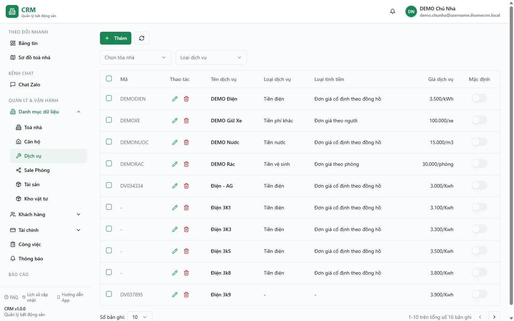

# Dịch vụ

Màn **Dịch vụ** là nơi bạn khai báo và tra cứu toàn bộ dịch vụ thu tiền của hệ thống — điện, nước, rác, giữ xe, wifi, vệ sinh... Mỗi dịch vụ định nghĩa **loại phí** (lên cột nào của hoá đơn), **cách tính tiền** (cố định theo tháng, theo đồng hồ, theo người, theo phòng...) và **đơn giá**. Bạn dùng màn này khi cần thêm một khoản thu định kỳ mới, chỉnh giá, hoặc gán/bật một dịch vụ cho từng toà với đơn giá riêng.

Đây là danh mục dùng chung ở cấp chủ nhà: một dịch vụ khai một lần rồi **bật cho từng toà** và có thể đặt **đơn giá riêng cho mỗi toà**. Việc khai lần đầu cho toàn hệ thống xem thêm ở trang [Dịch vụ & định mức](/01-bat-dau/dich-vu-dinh-muc/).

::: info Điều kiện tiên quyết
- Quyền **Dịch vụ => Xem** (module `services`, action `view`) để mở danh mục.
- Quyền **Thêm / Sửa / Xoá** trên dịch vụ nếu muốn tạo, chỉnh giá hoặc gỡ dịch vụ.
- Đã có ít nhất một toà nhà để gán dịch vụ vào (nếu chưa, tạo trước ở trang [Tạo khu vực & toà nhà](/01-bat-dau/tao-toa-nha/)).
- Nếu dịch vụ tính theo **bậc thang** (điện luỹ tiến...), tạo trước **định mức** ở trang Định mức dịch vụ rồi mới gắn vào dịch vụ.
:::

## Hướng dẫn từng bước

**Bước 1**: Tại menu bên trái, ấn chọn **Dịch vụ**. Màn hiện bảng danh mục với các cột **Mã**, **Tên**, **Loại phí**, **Loại tính tiền**, **Giá** (đơn giá kèm đơn vị) và **Mặc định**.

**Bước 2**: Muốn thu hẹp danh sách, chọn một **toà nhà** ở ô lọc toà (khi đó chỉ hiện các dịch vụ đang **bật** cho toà đó) hoặc chọn **Loại phí** để lọc theo nhóm (Tiền điện / Tiền nước / Tiền phí dịch vụ / Tiền vệ sinh / Tiền phí khác). Bộ lọc được giữ lại khi bạn tải lại trang (F5).

**Bước 3**: Đọc cột **Loại tính tiền** để hiểu cách một dịch vụ ra tiền trên hoá đơn. Đây là mô hình giá của hệ thống:

| Cách tính | Ý nghĩa | Ví dụ |
| --- | --- | --- |
| Cố định theo tháng | Một số tiền cố định mỗi tháng cho phòng, không phụ thuộc số người hay chỉ số | Rác, wifi, phí quản lý |
| Cố định theo đồng hồ | Đơn giá cố định nhân với **sản lượng đọc từ công tơ** tại phòng | Điện, nước theo đồng hồ |
| Đơn giá biến động | Đơn giá thay đổi theo bậc **định mức** (bậc thang luỹ tiến) | Điện luỹ tiến theo mức tiêu thụ |
| Theo người | Nhân đơn giá với **số người ở** trong phòng | Nước khoán đầu người |
| Theo phòng | Tính theo phòng (một mức chung cho phòng) | Phí dịch vụ chung |

::: tip Loại phí quyết định cột hoá đơn
Cột **Loại phí** (Tiền điện / Tiền nước / Tiền phí dịch vụ / Tiền vệ sinh / Tiền phí khác) quyết định khoản thu này rơi vào **cột nào** trên hoá đơn phòng. Đặt đúng loại phí giúp báo cáo tách bạch điện–nước–dịch vụ, đừng gộp mọi thứ vào "phí khác".
:::

**Bước 4**: Cần thêm dịch vụ mới, ấn nút **Thêm**. Trong form, điền **Tên** (ví dụ "Giữ xe"), **Mã** (tuỳ chọn), chọn **Loại phí** và **Loại tính tiền**, nhập **Đơn giá** và **Đơn vị** (Phòng / Người / Kwh / m³ / Tháng...). Nếu tính theo bậc thang, chọn **Định mức** đã tạo sẵn. Bên dưới, tick các **toà nhà** áp dụng dịch vụ này; với mỗi toà bạn có thể đặt **đơn giá riêng** (ghi đè đơn giá mặc định). Xong ấn **Lưu**.

**Bước 5**: Muốn xem đầy đủ các trường của một dịch vụ hoặc chỉnh giá, ấn **Sửa** trên dòng dịch vụ. Form mở ra đúng các trường ở Bước 4 kèm giá trị hiện tại: loại phí, cách tính, đơn giá mặc định, đơn vị, định mức, cờ **Mặc định** / **Bắt buộc** khi lập hợp đồng, và danh sách toà đang bật kèm đơn giá riêng từng toà. Chỉnh xong ấn **Lưu**.

::: tip Đơn giá riêng theo toà
Khi một toà được đặt **đơn giá riêng**, hoá đơn của toà đó dùng con số riêng thay cho đơn giá mặc định của dịch vụ. Nếu đổi đơn giá mặc định mà một toà vẫn ra giá cũ, gần như chắc chắn toà đó có đơn giá riêng — sửa lại trong form dịch vụ (hoặc trong form toà, phần **Dịch vụ toà**).
:::

**Bước 6**: Không dùng một dịch vụ nữa, ấn **Xoá** trên dòng của nó. Dịch vụ được ẩn khỏi danh mục nhưng **không xoá cứng** — các hoá đơn/hợp đồng cũ đã dùng dịch vụ này vẫn giữ nguyên số liệu.

::: warning Cân nhắc trước khi xoá dịch vụ
Xoá một dịch vụ đang được các toà sử dụng sẽ khiến nó không còn xuất hiện khi lập hoá đơn/hợp đồng mới. Nếu chỉ muốn tạm ngừng ở một toà, hãy **bỏ tick toà đó** (tắt dịch vụ cho toà) thay vì xoá hẳn dịch vụ khỏi hệ thống.
:::

## Các tính năng khác trên màn hình

| Nút / Bộ lọc | Công dụng |
| --- | --- |
| Ô lọc **toà nhà** | Chỉ hiện các dịch vụ đang **bật** cho toà được chọn; bỏ chọn để xem toàn bộ danh mục. |
| Bộ lọc **Loại phí** | Lọc theo nhóm phí (Tiền điện / Tiền nước / Tiền phí dịch vụ / Tiền vệ sinh / Tiền phí khác). |
| Cột **Mặc định** | Công tắc chỉ để xem, đánh dấu dịch vụ được **gợi ý sẵn** khi lập hợp đồng. Chỉnh trong form Sửa. |
| Nút **Thêm** | Mở form tạo dịch vụ mới kèm chọn toà áp dụng và đơn giá riêng. |
| Nút **Sửa** | Mở form chỉnh loại phí, cách tính, đơn giá, đơn vị, định mức và danh sách toà. |
| Nút **Xoá** | Ẩn dịch vụ khỏi danh mục (xoá mềm), giữ nguyên dữ liệu hoá đơn cũ. |
| Phân trang | Chia danh sách thành nhiều trang khi có nhiều dịch vụ. |

## Tình huống & lỗi thường gặp

| Tình huống | Cách xử lý |
| --- | --- |
| Chọn một toà ở ô lọc nhưng danh sách trống | Toà đó chưa được **bật** dịch vụ nào. Bỏ chọn toà để xem toàn bộ danh mục, rồi mở **Sửa** một dịch vụ và tick toà đó vào (hoặc bật trong form toà, phần Dịch vụ toà). |
| Đổi đơn giá dịch vụ nhưng một toà vẫn ra giá cũ trên hoá đơn | Toà đó có **đơn giá riêng** (ghi đè). Sửa lại đơn giá riêng của toà trong form dịch vụ hoặc form toà. |
| Dịch vụ theo đồng hồ nhưng hoá đơn không có sản lượng | Cách tính "cố định theo đồng hồ" cần **công tơ đặt tại phòng** và có ghi chỉ số. Xem trang [Công tơ điện nước](/01-bat-dau/cong-to/) để tạo công tơ và nhập chỉ số. |
| Dịch vụ tính bậc thang ra tiền sai hoặc bằng 0 | Kiểm tra dịch vụ đã gắn đúng **Định mức**, và định mức đó còn đủ các bậc giá. Nếu định mức bị mất bậc (do lưu lỗi trước đó), vào lại trang Định mức dịch vụ khai lại các bậc. |
| Nhập trùng **mã** dịch vụ mà vẫn lưu được | Mã dịch vụ không bắt buộc duy nhất; tự đặt mã dễ nhớ, không trùng để tiện tra cứu. |
| Danh mục trống dù chắc chắn đã khai dịch vụ | Thường do quyền: nhân viên chỉ thấy theo phạm vi được cấp. Kiểm tra lại quyền **Dịch vụ => Xem** hoặc nhờ quản lý cấp quyền. |

## Thử trực tiếp trên sandbox

<SandboxTry account="demo.quanly" app-path="/services" app-label="Mở màn Dịch vụ" fixtures="DEMO Điện/Nước/Rác/Giữ Xe">

Làm quen với mô hình giá dịch vụ:

1. Đọc cột **Loại tính tiền** của 4 dịch vụ mẫu: để ý **Điện/Nước** tính theo đồng hồ, **Rác** cố định theo tháng, **Giữ Xe** tính theo phòng hoặc theo người.
2. Đối chiếu cột **Loại phí** với **Loại tính tiền** để hiểu hai trường này khác nhau: loại phí quyết định cột hoá đơn, cách tính quyết định ra số tiền thế nào.
3. Ấn **Sửa** dịch vụ **Điện** (không cần Lưu) để xem đầy đủ các trường: loại phí, cách tính, đơn giá, đơn vị, định mức và danh sách toà được bật kèm đơn giá riêng.

Kết quả mong đợi: bạn phân biệt được loại phí và cách tính, hiểu vì sao một dịch vụ có thể có đơn giá khác nhau ở từng toà, và biết mỗi trường trong form dùng để làm gì.

</SandboxTry>

## Quy trình liên quan

- [Dịch vụ & định mức](/01-bat-dau/dich-vu-dinh-muc/) — khai lần đầu dịch vụ và tạo định mức bậc thang.
- [Toà nhà](/03-quan-ly-van-hanh/toa-nha/) — bật/tắt và đặt đơn giá riêng dịch vụ cho từng toà trong form toà.
- [Công tơ điện nước](/01-bat-dau/cong-to/) — tạo công tơ và nhập chỉ số cho các dịch vụ tính theo đồng hồ.
- [Căn hộ / Phòng](/03-quan-ly-van-hanh/can-ho-phong/) — nơi dịch vụ được áp vào hoá đơn của từng phòng.
