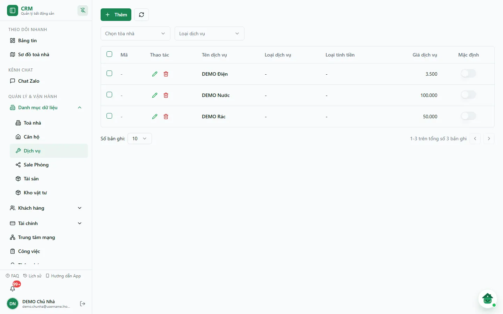
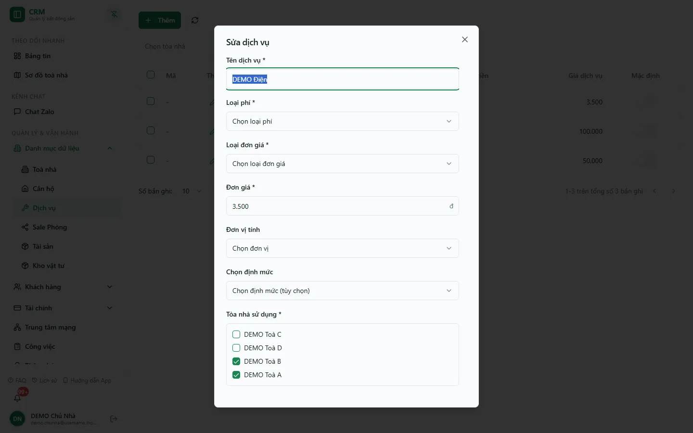

# Dịch vụ

Màn **Dịch vụ** là nơi bạn khai báo và tra cứu toàn bộ dịch vụ thu tiền của tổ chức — điện, nước, rác và các khoản dịch vụ khác. Mỗi dịch vụ định nghĩa **loại phí** (lên cột nào của hoá đơn), **loại đơn giá** (cố định theo tháng, theo đồng hồ, theo người, theo phòng…), **đơn giá** và **đơn vị tính**, cùng danh sách **toà nhà sử dụng**. Bạn dùng màn này khi cần thêm một khoản thu định kỳ mới, chỉnh giá hoặc bật/tắt dịch vụ cho từng toà.

::: tip Snapshot production DEMO (07/10/2026)
Với tài khoản `demo.chunha`, `/services` có đúng ba dòng: **DEMO Điện — 3.500**, **DEMO Nước — 100.000** và **DEMO Rác — 50.000**. Cả ba chưa khai **Loại dịch vụ**, **Loại tính tiền** và **Đơn vị** (các cột hiện "-"), công tắc **Mặc định** đều tắt.
:::

Đây là danh mục dùng chung cấp tổ chức: một dịch vụ khai một lần rồi **tích chọn các toà sử dụng**. Đơn giá riêng cho từng toà đặt ở form toà nhà (phần **Dịch vụ toà nhà**). Việc khai lần đầu cho toàn hệ thống xem thêm ở trang [Dịch vụ & định mức](/01-bat-dau/dich-vu-dinh-muc/).

::: info Điều kiện tiên quyết
- Quyền **Dịch vụ => Xem** (module `services`, action `view`) để mở danh mục.
- Quyền **Thêm / Sửa / Xoá** trên dịch vụ để lưu được thay đổi. Các nút luôn hiện trên màn; thiếu quyền thì lúc lưu hệ thống từ chối.
- Đã có ít nhất một toà nhà (nếu chưa, tạo trước ở [Tạo khu vực & toà nhà](/01-bat-dau/tao-toa-nha/)).
- Nếu dịch vụ tính theo **bậc thang** (điện luỹ tiến…), tạo trước **định mức** ở trang Định mức dịch vụ rồi mới gắn vào dịch vụ.
:::

## Hướng dẫn từng bước

**Bước 1**: Tại menu, ấn chọn **Danh mục dữ liệu** => **Dịch vụ**. Màn hiện nút **Thêm**, nút tải lại, hai ô lọc và bảng danh mục với các cột **Mã**, **Thao tác** (bút chì sửa, thùng rác xoá), **Tên dịch vụ**, **Loại dịch vụ**, **Loại tính tiền**, **Giá dịch vụ** (đơn giá kèm đơn vị) và **Mặc định**.

**Bước 2**: Muốn thu hẹp danh sách, chọn một toà ở ô **Chọn tòa nhà** (khi đó chỉ hiện các dịch vụ đang **bật** cho toà đó) hoặc chọn **Loại dịch vụ** (Tiền phí dịch vụ / Tiền điện / Tiền nước / Tiền phí khác / Tiền vệ sinh). Bộ lọc được giữ khi tải lại trang (F5) trong cùng tab.

**Bước 3**: Đọc cột **Loại tính tiền** để hiểu cách một dịch vụ ra tiền trên hoá đơn:

| Loại đơn giá | Ý nghĩa | Ví dụ |
| --- | --- | --- |
| Đơn giá cố định theo tháng | Một số tiền cố định mỗi tháng cho phòng, không phụ thuộc số người hay chỉ số | Rác, wifi, phí quản lý |
| Đơn giá cố định theo đồng hồ | Đơn giá cố định nhân với **sản lượng đọc từ công tơ** tại phòng | Điện, nước theo đồng hồ |
| Đơn giá biến động | Đơn giá thay đổi theo bậc **định mức** (bậc thang luỹ tiến) | Điện luỹ tiến theo mức tiêu thụ |
| Đơn giá theo người | Nhân đơn giá với **số người ở** trong phòng | Nước khoán đầu người |
| Đơn giá theo phòng | Một mức chung cho phòng | Phí dịch vụ chung |

::: tip Loại phí quyết định cột hoá đơn
**Loại phí** (Tiền điện / Tiền nước / Tiền phí dịch vụ / Tiền vệ sinh / Tiền phí khác) quyết định khoản thu rơi vào **cột nào** trên hoá đơn phòng. Đặt đúng loại phí giúp báo cáo tách bạch điện–nước–dịch vụ; đừng gộp mọi thứ vào "phí khác" hoặc để trống như dữ liệu DEMO.
:::

**Bước 4**: Thêm dịch vụ mới — ấn **Thêm**. Hộp **Thêm dịch vụ** gồm: **Tên dịch vụ** \*, **Loại phí** \*, **Loại đơn giá** \*, **Đơn giá** \*, **Đơn vị tính** (Phòng / Người / Kwh / m³ / Lượt / Tháng / Chiếc), **Chọn định mức** (tuỳ chọn, cho bậc thang), **Tòa nhà sử dụng** \* (tích ít nhất một toà) và **Mô tả**. Xong ấn **Lưu**.

**Bước 5**: Xem đầy đủ hoặc chỉnh một dịch vụ — ấn bút chì **Sửa** trên dòng. Hộp **Sửa dịch vụ** có đúng các trường ở Bước 4 kèm giá trị hiện tại; chỉnh rồi ấn **Cập nhật**.

::: tip Đơn giá riêng theo toà
Khi một toà được đặt **đơn giá riêng** trong form toà nhà (phần **Dịch vụ toà nhà**), hoá đơn của toà đó dùng con số riêng thay cho đơn giá mặc định. Nếu đổi đơn giá ở màn này mà một toà vẫn ra giá cũ, gần như chắc chắn toà đó có đơn giá riêng — sửa trong form toà.
:::

::: warning Lưu dịch vụ và liên kết toà là các bước riêng
Lưu bản ghi dịch vụ và đồng bộ danh sách toà sử dụng là các request riêng, không phải một giao dịch nguyên tử. Nếu mạng lỗi giữa chừng, dịch vụ có thể đã lưu nhưng liên kết toà chưa khớp; hãy mở lại form để kiểm tra. Bỏ tích một toà rồi lưu sẽ **gỡ hẳn liên kết**: nếu sau đó tích lại, đơn giá riêng cũ của toà đó mất và phải nhập lại trong form toà.
:::

**Bước 6**: Không dùng một dịch vụ nữa, ấn thùng rác **Xoá** trên dòng. Hộp **Xác nhận xóa dịch vụ** hiện mã, loại phí, đơn giá và câu "Hành động này không thể hoàn tác" — trên màn này không có nút khôi phục, nhưng về dữ liệu đây là **xoá mềm**: hoá đơn/hợp đồng cũ đã dùng dịch vụ vẫn giữ nguyên số liệu.

::: warning Cân nhắc trước khi xoá dịch vụ
Xoá một dịch vụ đang được các toà sử dụng sẽ khiến nó không còn xuất hiện khi lập hoá đơn/hợp đồng mới. Nếu chỉ muốn ngừng ở một toà, hãy **bỏ tích toà đó** trong **Tòa nhà sử dụng** thay vì xoá hẳn dịch vụ.
:::

## Các tính năng khác trên màn hình

| Nút / Bộ lọc | Công dụng |
| --- | --- |
| Ô lọc **Chọn tòa nhà** | Chỉ hiện các dịch vụ đang **bật** cho toà được chọn; chọn **Tất cả tòa nhà** để xem toàn bộ. |
| Ô lọc **Loại dịch vụ** | Lọc theo loại phí. |
| Nút tải lại (mũi tên vòng) | Tải lại danh mục. |
| Cột **Mặc định** | Công tắc chỉ để xem, đánh dấu dịch vụ được gợi ý sẵn khi lập hợp đồng; form Thêm/Sửa hiện không có ô chỉnh cờ này. |
| **Số bản ghi** + phân trang | Chọn 10/25/50 dòng mỗi trang và chuyển trang. |

## Tình huống & lỗi thường gặp

| Tình huống | Cách xử lý |
| --- | --- |
| Chọn một toà ở ô lọc nhưng danh sách trống | Toà đó chưa được **bật** dịch vụ nào. Chọn **Tất cả tòa nhà**, mở **Sửa** một dịch vụ và tích toà đó vào. |
| Đổi đơn giá dịch vụ nhưng một toà vẫn ra giá cũ trên hoá đơn | Toà đó có **đơn giá riêng**. Sửa trong form toà nhà, phần **Dịch vụ toà nhà**. |
| Dịch vụ theo đồng hồ nhưng hoá đơn không có sản lượng | Cần **công tơ đặt tại phòng** và có ghi chỉ số. Xem [Công tơ điện nước](/01-bat-dau/cong-to/) và [Ghi chỉ số điện nước](/03-quan-ly-van-hanh/ghi-chi-so/). |
| Dịch vụ tính bậc thang ra tiền sai hoặc bằng 0 | Kiểm tra dịch vụ đã gắn đúng **Định mức** và định mức còn đủ các bậc giá. |
| Không lưu được, báo **Chọn ít nhất một tòa nhà** | Tích ít nhất một toà trong **Tòa nhà sử dụng**. |
| Danh mục trống dù chắc chắn đã khai dịch vụ | Thường do quyền/phạm vi toà. Kiểm tra lại quyền **Dịch vụ => Xem** hoặc nhờ quản lý cấp quyền. |
| Bảng hiện khối xám | Đang tải dữ liệu; nếu tải lỗi, khung báo **Chưa tải được…** kèm nút tải lại. |

## Thử trực tiếp trên sandbox

<SandboxTry account="demo.chunha" app-path="/services" app-label="Mở màn Dịch vụ" fixtures="3 dòng DEMO: Điện 3.500, Nước 100.000, Rác 50.000; chưa khai loại phí, loại tính tiền, đơn vị" view-only>

**Bài tập chỉ xem**

1. Đối chiếu đúng ba dòng và đơn giá: **DEMO Điện — 3.500**, **DEMO Nước — 100.000**, **DEMO Rác — 50.000**.
2. Ấn bút chì trên **DEMO Điện** để xem các trường và toà đang sử dụng, rồi đóng hộp. Không ấn **Cập nhật**, **Lưu** hoặc **Xoá**.
3. Thử ô lọc toà, rồi chọn lại **Tất cả tòa nhà**.

**Kết quả mong đợi**

- Bạn đọc được mô hình giá và danh sách toà sử dụng mà không thay đổi dữ liệu.

</SandboxTry>

## Quy trình liên quan

- [Dịch vụ & định mức](/01-bat-dau/dich-vu-dinh-muc/) — khai lần đầu dịch vụ và tạo định mức bậc thang.
- [Toà nhà](/03-quan-ly-van-hanh/toa-nha/) — đặt đơn giá riêng dịch vụ cho từng toà trong form toà.
- [Công tơ điện nước](/01-bat-dau/cong-to/) — tạo công tơ cho các dịch vụ tính theo đồng hồ.
- [Căn hộ / Phòng](/03-quan-ly-van-hanh/can-ho-phong/) — nơi dịch vụ được áp vào hoá đơn của từng phòng.
