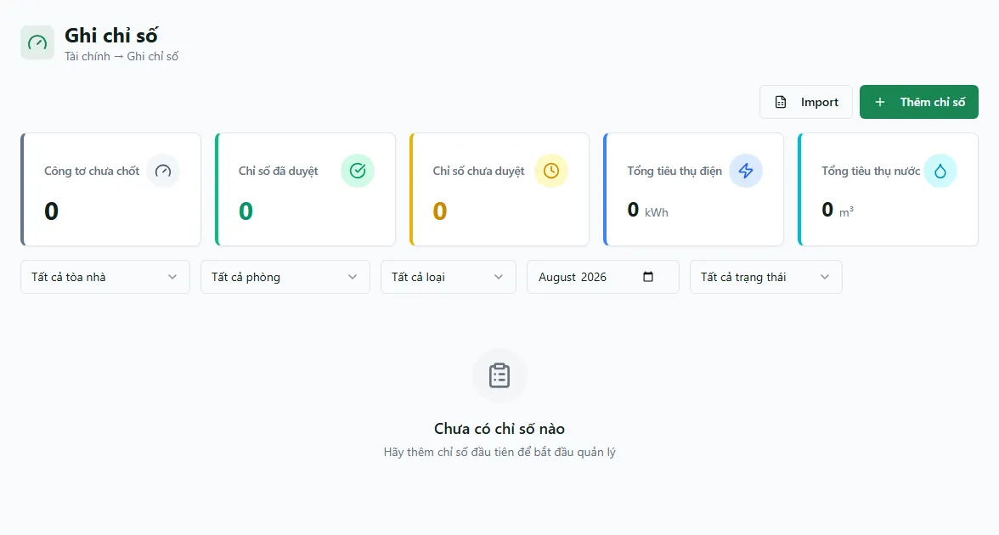

# Ghi chỉ số điện nước

Màn **Ghi chỉ số** là nơi mỗi tháng bạn đọc số đồng hồ điện, nước của từng phòng và lưu lại. Hệ thống tự lấy **chỉ số đầu** từ lần ghi trước (hoặc chỉ số ban đầu của công tơ), tự tính **số tiêu thụ = chỉ số mới − chỉ số đầu**, rồi chốt lại (duyệt) để làm dữ liệu đầu vào cho hoá đơn tiền điện, tiền nước. Bạn có thể ghi từng phòng bằng form, hoặc import cả loạt bằng file Excel. Điểm cốt lõi cần nhớ: **chỉ những chỉ số đã ở trạng thái "Đã duyệt" mới được hoá đơn lấy làm chỉ số điện — hãy ghi và chốt chỉ số trước khi lên hoá đơn tháng.**

::: info Điều kiện tiên quyết
- Quyền **Ghi chỉ số => Xem** (module `meter_readings`, action `view`) để mở màn; quyền **Ghi chỉ số => Tạo** để bấm **Thêm chỉ số** và **Import**.
- Đã khai báo **công tơ** cho các phòng — không có công tơ thì không ghi chỉ số được. Xem [Công tơ điện nước](/01-bat-dau/cong-to/).
- Đã có **dịch vụ** Điện/Nước kèm đơn giá để hoá đơn tính tiền theo mức tiêu thụ. Xem [Dịch vụ & định mức](/01-bat-dau/dich-vu-dinh-muc/).
- Là nhân viên, bạn chỉ ghi và thấy chỉ số của các toà được gán phạm vi cho mình.
:::

## Hướng dẫn từng bước

**Bước 1**: Tại thanh menu, ấn chọn **Tài chính** => **Ghi chỉ số**. Màn mở ra với hàng **thẻ thống kê** ở trên (chỉ số đã duyệt, chưa duyệt, tổng tiêu thụ điện theo kWh, nước theo m³), bên dưới là **danh sách các lần ghi chỉ số** theo tháng. Snapshot production ngày 13/08/2026 của tài khoản DEMO đang rỗng; đây là trạng thái hợp lệ khi kỳ/phạm vi chưa có lần ghi.

**Bước 2**: Đọc một dòng trong danh sách. Mỗi dòng gồm: **mã chỉ số** kèm badge trạng thái (**Đã duyệt** hoặc **Chưa duyệt**), tên **công tơ**, **chỉ số đầu**, **chỉ số cuối**, **số tiêu thụ** (chênh lệch, hệ thống tự tính — không sửa tay), **ngày chốt** và **người chốt**. Dùng ô lọc **Toà nhà**, **Loại công tơ** và **Tháng chốt** ở đầu bảng để thu hẹp danh sách.

**Bước 3**: Ghi chỉ số mới cho một tháng — ấn **Thêm chỉ số**. Trong form, chọn **Tòa nhà** (bắt buộc), **Phòng**, **Loại công tơ** (**Điện** hoặc **Nước**), **Tháng chốt** và **Ngày chốt**. Ngay khi đủ toà và tháng, form **tự nạp bảng các công tơ chưa chốt** của bộ lọc đó — mỗi dòng có sẵn cột **Chỉ số đầu** (lấy từ lần ghi trước hoặc chỉ số ban đầu của công tơ) và ô nhập **Chỉ số mới**.

::: tip Chỉ số đầu tự nối tiếp kỳ trước (carry-forward)
Bạn **không cần nhập chỉ số đầu**. Với lần ghi đầu tiên của một công tơ, hệ thống lấy **chỉ số ban đầu** khai lúc tạo công tơ; từ lần thứ hai trở đi, hệ thống tìm lần ghi trước để lấy chỉ số cuối làm đầu kỳ. Tuy nhiên cơ sở dữ liệu không chặn tuyệt đối các lần ghi trùng công tơ/ngày/tháng, nên hãy kiểm tra danh sách và thứ tự ngày chốt; dữ liệu trùng hoặc nhập lệch thứ tự có thể làm chuỗi carry-forward không còn liên tục.
:::

**Bước 4**: Nhập **Chỉ số mới** đọc được trên mặt đồng hồ cho từng dòng công tơ. Hệ thống tự lấy **Chỉ số mới − Chỉ số đầu** ra **số tiêu thụ**. Ấn **Thêm chỉ số** (nút lưu ở cuối form) để lưu. Các dòng bạn bỏ trống (không nhập) sẽ được bỏ qua.

::: warning Chỉ số mới không được nhỏ hơn chỉ số đầu
Nếu bạn nhập **chỉ số mới nhỏ hơn chỉ số đầu**, hệ thống báo lỗi đỏ ngay tại dòng đó và **chặn lưu** — vì số tiêu thụ không thể âm. Kiểm tra lại con số đọc trên đồng hồ; nếu đồng hồ thật sự đã quay vòng hoặc bị thay, hãy xử lý ở màn công tơ trước. Ngoài ra, khi chọn **Tất cả phòng**, form không cho lưu: hãy **chọn đúng một phòng cụ thể** rồi mới nhập và lưu.
:::

**Bước 5**: Kiểm tra trạng thái duyệt. Chỉ số vừa lưu xuất hiện trong danh sách với badge **Đã duyệt** — nghĩa là đã được chốt và **sẵn sàng làm chỉ số điện cho hoá đơn tháng**. Khi lập hoá đơn, hệ thống chỉ nhặt **chỉ số Đã duyệt gần nhất** của phòng làm chỉ số đầu tiền điện; chỉ số **Chưa duyệt** sẽ bị bỏ qua. Vì vậy hãy đảm bảo mọi phòng đã có chỉ số **Đã duyệt** của tháng **trước khi** [sinh hoá đơn](/03-quan-ly-van-hanh/sinh-hoa-don/).

::: warning Sửa hoặc xoá chỉ số đã lên hoá đơn dễ gây lệch số
Sau khi một chỉ số đã được dùng để tính tiền điện trên hoá đơn, việc **sửa hoặc xoá** nó **không tự cập nhật ngược lại hoá đơn** — hai nơi sẽ lệch nhau, và chuỗi carry-forward sang tháng sau cũng có thể sai. Nếu buộc phải chỉnh, hãy kiểm tra lại hoá đơn liên quan và số đầu kỳ của tháng kế tiếp.
:::

**Bước 6**: Ghi hàng loạt bằng Excel — ấn **Import**. Tải **file mẫu**, điền **mã công tơ**, **ngày chốt** và **chỉ số mới** cho từng dòng, rồi tải file lên. Import **định danh hoàn toàn bằng mã công tơ** (không cần chọn toà/phòng), nên hãy điền đúng mã như đã khai ở màn Công tơ. Import dùng luồng hàng loạt legacy: mỗi dòng thành công được lưu ở trạng thái **Chưa duyệt (`UNAPPROVED`)**, khác với form ghi trực tiếp tự tạo dòng **Đã duyệt (`APPROVED`)**. Đây là import **thành công một phần**: dòng đúng vẫn được ghi dù dòng khác lỗi, và màn báo tổng kết từng nhóm.

Màn hiện tại chưa nối nút **Duyệt / Duyệt hàng loạt** cho các dòng import. Vì vậy dòng `UNAPPROVED` không được hoá đơn sử dụng và không thể hoàn tất vòng chốt chỉ bằng luồng import trên màn này; với chỉ số cần lên hoá đơn ngay, hãy ghi bằng form trực tiếp hoặc nhờ quản trị xử lý các dòng đã import. Nếu sửa file rồi import lại, hãy rà dòng đã thành công trước đó để tránh tạo bản ghi trùng.

## Các tính năng khác trên màn hình

| Nút / Bộ lọc | Công dụng |
|---|---|
| Ô lọc **Toà nhà** | Lọc danh sách theo một toà; gõ để tìm nhanh. |
| Ô lọc **Loại công tơ** | Lọc theo **Điện** / **Nước**. |
| Ô lọc **Tháng chốt** | Xem chỉ số theo tháng (`YYYY-MM`). |
| **Thêm chỉ số** | Mở form ghi chỉ số theo toà + tháng, tự nạp danh sách công tơ chưa chốt. |
| **Import** | Nạp chỉ số hàng loạt từ file Excel theo mã công tơ; dòng thành công ban đầu ở trạng thái **Chưa duyệt**. |
| Badge **Đã duyệt / Chưa duyệt** | Trạng thái chốt của chỉ số; chỉ **Đã duyệt** mới được hoá đơn lấy làm chỉ số điện. |
| Menu **Cập nhật** trên từng dòng | Sửa **chỉ số mới**, ngày chốt, ghi chú, ảnh của một lần ghi (toà/phòng/loại/tháng khoá, không đổi được). |
| Menu **Xoá** trên từng dòng | Gỡ một lần ghi (xoá mềm). |
| **Xoá hàng loạt** | Chọn nhiều dòng rồi gỡ cùng lúc. |

Bộ lọc đang chọn được **giữ lại khi bạn tải lại trang (F5)**.

## Tình huống & lỗi thường gặp

| Tình huống | Cách xử lý |
|---|---|
| Bảng công tơ trong form **rỗng** | Chưa chọn đủ **Toà nhà** và **Tháng chốt**, hoặc mọi công tơ của toà đã chốt tháng đó rồi. Đổi tháng, hoặc kiểm tra công tơ đã khai chưa ở [Công tơ điện nước](/01-bat-dau/cong-to/). |
| Không lưu được, báo **"Vui lòng chọn phòng"** | Bạn đang để **Tất cả phòng**. Chọn đúng **một phòng cụ thể** rồi nhập chỉ số và lưu lại. |
| Lỗi đỏ **chỉ số mới nhỏ hơn chỉ số đầu** | Số tiêu thụ không thể âm. Đọc lại con số trên đồng hồ; nếu đồng hồ đã thay/quay vòng, xử lý ở màn Công tơ trước. |
| Phòng thiếu công tơ nên không hiện để ghi | Sang [Công tơ điện nước](/01-bat-dau/cong-to/) thêm đủ công tơ **Điện/Nước** cho phòng đó rồi quay lại ghi. |
| Chỉ số rơi **nhầm tháng** so với mong đợi | Tháng của lần ghi bám theo **Ngày chốt**, không phải ô Tháng chốt. Chọn ngày chốt nằm đúng trong tháng bạn muốn ghi. |
| Import báo có **dòng lỗi** | Thường do sai **mã công tơ** hoặc chỉ số mới nhỏ hơn chỉ số đầu ở dòng đó. Sửa đúng ô trong file mẫu rồi import lại — các dòng đúng vẫn được ghi. |
| Import thành công nhưng chỉ số vẫn **Chưa duyệt** | Đúng hiện trạng của luồng import legacy; màn chưa có nút duyệt các dòng này. Chỉ số `UNAPPROVED` không lên hoá đơn, nên dùng form trực tiếp cho kỳ cần chốt hoặc nhờ quản trị xử lý. |

## Thử trực tiếp trên sandbox

<SandboxTry account="demo.chunha" app-path="/meter-readings" app-label="Mở màn Ghi chỉ số" fixtures="Snapshot 13/08/2026: danh sách đang rỗng." view-only>

Quan sát màn hình mà không ghi dữ liệu:

1. Kiểm tra thẻ thống kê và bảng danh sách của kỳ/phạm vi hiện tại. Nếu rỗng, không kết luận hệ thống thiếu dữ liệu của kỳ khác.
2. Mở các bộ lọc Toà, tháng, loại Điện/Nước để hiểu cách thu hẹp danh sách; giữ nguyên giá trị, không lưu chỉ số.
3. Chỉ khi nghiệp vụ thật có công tơ và kỳ cần ghi, dùng **Thêm chỉ số** rồi đối chiếu số đầu, số mới và sản lượng trước khi lưu.

Kết quả mong đợi: bạn hiểu empty state và điều kiện **có công tơ + đúng kỳ + số mới hợp lệ** trước khi tạo chỉ số; chỉ số đã duyệt mới là đầu vào cho hoá đơn.

</SandboxTry>

## Quy trình liên quan

- [Công tơ điện nước](/01-bat-dau/cong-to/) — khai báo đồng hồ cho phòng trước khi ghi chỉ số.
- [Dịch vụ & định mức](/01-bat-dau/dich-vu-dinh-muc/) — đơn giá điện/nước dùng để tính tiền theo số tiêu thụ.
- [Sinh hoá đơn](/03-quan-ly-van-hanh/sinh-hoa-don/) — lên hoá đơn tháng, tự lấy chỉ số Đã duyệt gần nhất làm chỉ số điện.
- [Hoá đơn](/03-quan-ly-van-hanh/hoa-don/) — theo dõi và thu tiền các hoá đơn đã sinh.
- [Căn hộ / Phòng](/03-quan-ly-van-hanh/can-ho-phong/) — danh sách phòng mà công tơ gắn vào.
- [Quy trình thu tiền](/01-bat-dau/quy-trinh-thu-tien/) — vị trí của bước ghi chỉ số trong vòng đời thu tiền hằng tháng.
