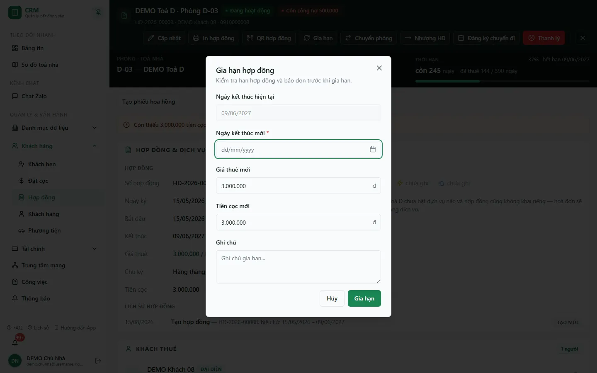
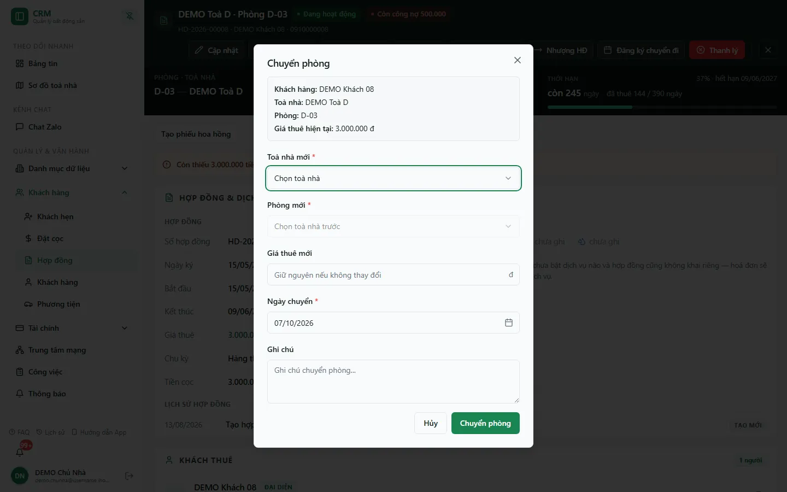
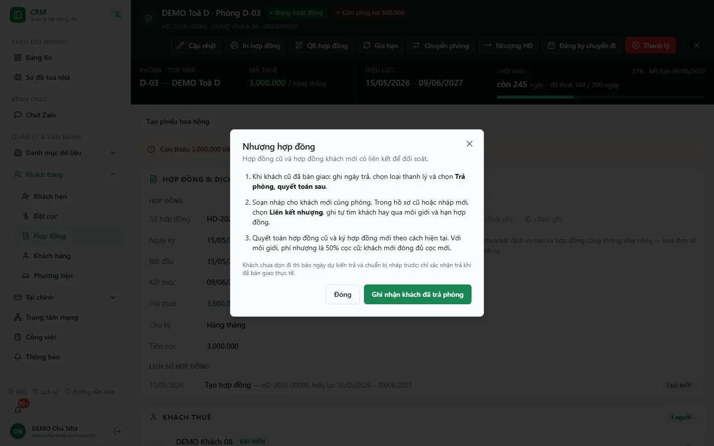

# Gia hạn, chuyển phòng & nhượng hợp đồng

Trang này hướng dẫn ba thao tác biến động hợp đồng thường gặp: **gia hạn** khi khách muốn ở tiếp, **chuyển phòng** khi khách đổi sang phòng khác, và **nhượng hợp đồng** khi khách cũ sang lại phòng cho khách mới. Gia hạn và chuyển phòng thay đổi trực tiếp hợp đồng hiện tại; nhượng thì **giữ nguyên hợp đồng cũ** (thanh lý như bình thường) và **ký hợp đồng mới** cho khách mới, hai bên được nối bằng một **liên kết nhượng** để đối soát.

::: info Điều kiện tiên quyết
- **Gia hạn** cần `contracts.renew`; **Chuyển phòng** và **Nhượng HĐ** cần `contracts.transfer`, cùng phạm vi toà của hợp đồng.
- Hợp đồng phải **đang hiệu lực** — ba nút chỉ hiện ở thanh đầu [trang chi tiết hợp đồng](/03-quan-ly-van-hanh/hop-dong-chi-tiet/) (và ở lưới **Thao tác** của danh sách) khi hợp đồng còn hiệu lực.
- Muốn chuyển phòng: phải có sẵn **phòng trống** ở toà đích (phòng đang có khách hoặc đang giữ cọc không hiện trong danh sách chọn).
- Muốn nhượng: cần quyền tạo/sửa hợp đồng nháp và quyền **Thanh lý** để ghi nhận khách cũ trả phòng.
:::

::: warning Gia hạn KHÔNG đổi trạng thái hợp đồng
Khi gia hạn, hợp đồng **giữ nguyên trạng thái đang hiệu lực** — hệ thống chỉ đẩy **ngày kết thúc** ra xa hơn và ghi một dòng **GIA HẠN** vào **Lịch sử hợp đồng**. Đừng tìm một trạng thái riêng cho hợp đồng đã gia hạn.
:::

## Hướng dẫn từng bước

**Bước 1**: Mở **trang chi tiết** hợp đồng cần xử lý (xem [Trang chi tiết hợp đồng](/03-quan-ly-van-hanh/hop-dong-chi-tiet/)). Trên thanh đầu trang có các nút **Gia hạn**, **Chuyển phòng**, **Nhượng HĐ**, **Đăng ký chuyển đi**, **Thanh lý**.

### Gia hạn hợp đồng

**Bước 2**: Ấn **Gia hạn**. Hộp thoại **Gia hạn hợp đồng** ("Kiểm tra hạn hợp đồng và báo dọn trước khi gia hạn") hiển thị **Ngày kết thúc hiện tại** (chỉ đọc).

**Bước 3**: Điền **Ngày kết thúc mới \*** — phải muộn hơn ngày kết thúc hiện tại. Ô **Giá thuê mới** và **Tiền cọc mới** được điền sẵn theo hợp đồng hiện tại; xem và xác nhận chúng thay vì giả định giữ nguyên. Không hạ nghĩa vụ cọc xuống dưới số khách đã thực nộp nếu chưa có quyết định rõ ràng về phần chênh. Thêm **Ghi chú** nếu cần.

**Bước 4**: Nếu khách **đã báo trả phòng** trước đó, hộp thoại hiện thêm dòng "Đã báo dọn ngày …" và ô **Khi gia hạn, bạn muốn giữ hay hủy báo dọn?** — bắt buộc chọn **Giữ ngày báo dọn hiện tại** hoặc **Hủy báo dọn · Khách tiếp tục ở** thì nút **Gia hạn** mới bấm được. Ấn **Gia hạn**.

**Bước 5**: Hệ thống cập nhật ngày kết thúc, giá thuê và nghĩa vụ cọc trên cùng hợp đồng, ghi dòng **GIA HẠN** vào lịch sử. Tải lại trang và đối chiếu giá/cọc/ngày cuối cùng.

::: tip Số tháng gia hạn được tính tự động
Bạn chỉ cần chọn **ngày kết thúc mới**; hệ thống tự suy ra số tháng gia hạn so với ngày kết thúc cũ và lưu vào lịch sử.
:::

### Chuyển phòng

**Bước 6**: Ấn **Chuyển phòng**. Hộp thoại **Chuyển phòng** hiện khung tóm tắt **Khách hàng**, **Toà nhà**, **Phòng**, **Giá thuê hiện tại**.

**Bước 7**: Chọn **Toà nhà mới \*** rồi **Phòng mới \*** (chỉ liệt kê phòng đang **Trống**; toà không còn phòng trống thì ô ghi "Không có phòng trống"). Nếu giá khác, điền **Giá thuê mới** (để trống thì giữ giá cũ). Chọn **Ngày chuyển \*** (mặc định hôm nay), thêm **Ghi chú** rồi ấn **Chuyển phòng**. Nếu phòng cũ đang có báo trả phòng, hộp thoại báo ngày báo dọn đó sẽ **được hủy** khi chuyển thành công; phòng mới chưa có báo dọn, bạn ghi nhận riêng sau nếu cần.

**Bước 8**: Hệ thống chuyển hợp đồng sang phòng mới, cập nhật giá (nếu nhập), ghi dòng **CHUYỂN PHÒNG** vào lịch sử. Hợp đồng vẫn đang hiệu lực; **phòng cũ về Trống**, **phòng mới thành Đang thuê**.

::: warning Chuyển phòng có hiệu lực ngay và không có nút hoàn tác
Nếu chuyển nhầm, phải mở lại **Chuyển phòng** và chuyển ngược về phòng cũ (khi phòng cũ vẫn còn trống). Kiểm tra kỹ toà và phòng đích trước khi xác nhận. Trường hợp cần chuyển sang **toà khác**, hãy xác nhận với quản trị trước — hệ thống có thể từ chối tuỳ phạm vi quyền.
:::

### Nhượng hợp đồng (sang phòng cho khách mới)

**Bước 9**: Ấn **Nhượng HĐ**. Hộp thoại **Nhượng hợp đồng** ("Hợp đồng cũ và hợp đồng khách mới có liên kết để đối soát") tóm tắt quy trình 3 bước:

1. Khi khách cũ đã bàn giao: ghi ngày trả, chọn loại thanh lý và chọn **Trả phòng, quyết toán sau**.
2. Soạn nháp cho khách mới cùng phòng. Trong hồ sơ cũ hoặc nháp mới, chọn **Liên kết nhượng**, ghi tự tìm khách hay qua môi giới và hạn hợp đồng.
3. Quyết toán hợp đồng cũ và ký hợp đồng mới theo cách hiện tại. Với môi giới, phí nhượng là **50% cọc cũ**; khách mới đóng đủ cọc mới.

Khách chưa dọn đi thì chỉ **báo ngày dự kiến trả** và chuẩn bị nháp trước; chỉ xác nhận trả khi đã bàn giao thực tế. Nút **Ghi nhận khách đã trả phòng** mở hộp **Thanh lý hợp đồng** (xem [Khách rời phòng](/03-quan-ly-van-hanh/thanh-ly-move-out/)); với hợp đồng đã thanh lý, nút thành **Mở hồ sơ cũ**.

**Bước 10**: Lập liên kết — từ khối liên kết nhượng của hồ sơ cũ, hoặc nút **Liên kết nhượng** trên bản nháp ở tab **Hợp đồng nháp**, ấn **Lập liên kết**. Hộp **Liên kết hai hợp đồng nhượng** yêu cầu:

- **Hồ sơ trả phòng cũ** (chọn hồ sơ chờ quyết toán) và **Nháp hợp đồng khách mới** (chọn nháp cùng phòng).
- **Nguồn khách mới**: **Khách tự tìm người nhận** hoặc **Qua môi giới** (nhập **Tên môi giới / người nhận hoa hồng**; phí nhượng = 50% cọc cũ, dùng chung liên kết này).
- **Cọc khách mới**: **Nộp cọc mới độc lập**. Lựa chọn **Dự kiến cấn cọc cũ** chỉ được lưu để đối soát — hệ thống **chưa hỗ trợ chuyển cọc giữa hai hợp đồng** và nháp theo nhánh này chưa ký được.
- **Hạn hợp đồng mới**: **Giữ hạn cũ** (nháp phải có đúng ngày kết thúc cũ) hoặc **Kỳ hạn mới theo ngày trong nháp**.

Ấn **Lưu liên kết nhượng**. Khối liên kết sau đó hiện trạng thái (ví dụ **Chờ quyết toán phí nhượng tại hồ sơ cũ**, **Phí đã quyết toán · Chờ ký / nối phiếu môi giới**, **Đã nối phiếu môi giới hiện hành**) và các nút **Đưa phí nhượng vào quyết toán**, **Ký hợp đồng mới**, **Nối phiếu môi giới**, **Hủy liên kết** (phải ghi lý do).

::: warning Nhượng không tự chuyển tiền giữa hai hợp đồng
Hợp đồng cũ quyết toán cọc, nợ, hoàn tiền theo đúng luồng thanh lý; hợp đồng mới thu cọc mới độc lập. Phí nhượng qua môi giới được cộng **một lần** vào khoản thu khi quyết toán hồ sơ cũ. Không tự cấn cọc cũ sang hợp đồng mới bằng phiếu tay.
:::

## Các tính năng khác trên màn hình

| Nút / Ô nhập | Công dụng |
| --- | --- |
| **Gia hạn** | Mở hộp **Gia hạn hợp đồng**; chỉ hiện khi hợp đồng đang hiệu lực. |
| Ô **Ngày kết thúc hiện tại** / **Ngày kết thúc mới** | Mốc đang áp (chỉ đọc) và mốc mới (bắt buộc, phải muộn hơn). |
| Ô **Giá thuê mới** / **Tiền cọc mới** | Điền sẵn khi gia hạn; giá trị lưu thay trực tiếp giá/cọc hiện hành. |
| Ô **Khi gia hạn, bạn muốn giữ hay hủy báo dọn?** | Chỉ hiện khi đã có báo trả phòng; bắt buộc chọn trước khi gia hạn. |
| **Chuyển phòng** | Mở hộp **Chuyển phòng**: Toà nhà mới, Phòng mới (chỉ phòng Trống), Giá thuê mới, Ngày chuyển, Ghi chú. |
| **Nhượng HĐ** | Mở hướng dẫn 3 bước nhượng và lối vào ghi nhận khách cũ trả phòng. |
| **Lập liên kết** / **Lưu liên kết nhượng** | Nối hồ sơ trả phòng cũ với nháp khách mới cùng phòng. |
| **Đưa phí nhượng vào quyết toán** / **Nối phiếu môi giới** / **Ký hợp đồng mới** / **Hủy liên kết** | Các bước tiếp theo của liên kết nhượng. |
| **Lịch sử hợp đồng** (trang chi tiết) | Dòng **GIA HẠN** / **CHUYỂN PHÒNG** / **NHƯỢNG HĐ** theo thời gian. |

## Tình huống & lỗi thường gặp

| Tình huống | Cách xử lý |
| --- | --- |
| Không thấy nút **Gia hạn** / **Chuyển phòng** / **Nhượng HĐ** | Nút chỉ hiện khi hợp đồng còn hiệu lực và bạn có quyền `renew` / `transfer`. Hợp đồng đã **Thanh lý** không còn các nút này. |
| Nút **Gia hạn** trong hộp bị mờ | Hợp đồng đang có báo trả phòng; chọn **Giữ ngày báo dọn hiện tại** hoặc **Hủy báo dọn · Khách tiếp tục ở** trước. |
| Gia hạn báo lỗi ngày kết thúc | **Ngày kết thúc mới** phải muộn hơn ngày kết thúc hiện tại. |
| Ô **Phòng mới** ghi "Không có phòng trống" | Toà đã chọn chưa có phòng **Trống**. Chọn toà khác hoặc giải phóng một phòng trước (phòng đang có khách/đang giữ cọc không hiện). |
| Chuyển nhầm phòng | Mở lại **Chuyển phòng** và chuyển ngược về phòng cũ (nếu còn trống). |
| Sau chuyển phòng, phòng cũ vẫn báo **Đang thuê** | Kiểm tra phòng cũ còn hợp đồng hiệu lực nào khác không. Với thao tác chuyển chuẩn, phòng cũ tự về **Trống**. |
| Liên kết nhượng báo **Cần xử lý tiền nhượng** | Bạn đã chọn **Dự kiến cấn cọc cũ** — nhánh này chưa hỗ trợ. **Hủy liên kết** (ghi lý do) rồi lập lại với **Nộp cọc mới độc lập**. |
| Quyết toán hồ sơ cũ báo "Chưa xác định được phí nhượng hợp lệ" | Kiểm tra liên kết nhượng (nguồn **Qua môi giới** phải có cọc cũ hợp lệ) trước khi quyết toán. |

## Thử trực tiếp trên sandbox

<SandboxTry account="demo.chunha" app-path="/contracts" app-label="Mở danh sách Hợp đồng" fixtures="Snapshot 07/10/2026: 20 hợp đồng, 3 quá hạn, không có liên kết nhượng nào." view-only>

Quan sát luồng mà không lưu thay đổi:

1. Ấn thẻ **Quá hạn**, mở một hợp đồng bằng **Xem chi tiết**. Ghi nhớ mã hợp đồng, phòng và ngày kết thúc.
2. Ấn **Gia hạn** để xem các ô; không nhập, bấm **Hủy**.
3. Ấn **Chuyển phòng**, chọn thử một toà để xem danh sách phòng trống; bấm **Hủy**.
4. Ấn **Nhượng HĐ** để đọc 3 bước; bấm **Đóng** — không bấm **Ghi nhận khách đã trả phòng**.

Kết quả mong đợi: bạn phân biệt được gia hạn (đổi ngày trên hợp đồng hiện tại), chuyển phòng (đổi phòng, giữ hợp đồng) và nhượng (thanh lý hợp đồng cũ + ký hợp đồng mới có liên kết).

</SandboxTry>

## Quy trình liên quan

- [Hợp đồng](/03-quan-ly-van-hanh/hop-dong/) — danh sách hợp đồng, tab **Hợp đồng nháp** nơi soạn nháp khách mới.
- [Trang chi tiết hợp đồng](/03-quan-ly-van-hanh/hop-dong-chi-tiet/) — gốc mở các thao tác và xem **Lịch sử hợp đồng**.
- [Thanh lý — Khách rời phòng](/03-quan-ly-van-hanh/thanh-ly-move-out/) — ghi nhận khách cũ trả phòng và quyết toán.
- [Hoàn / bỏ cọc](/03-quan-ly-van-hanh/hoan-bo-coc/) — xử lý tiền cọc khi kết thúc hợp đồng.
- [Căn hộ / Phòng](/03-quan-ly-van-hanh/can-ho-phong/) — trạng thái phòng tự đổi theo hợp đồng.
- [Quy trình khách thuê](/01-bat-dau/quy-trinh-khach-thue/) — vòng đời khách thuê từ đặt cọc, ký hợp đồng đến gia hạn và thanh lý.
