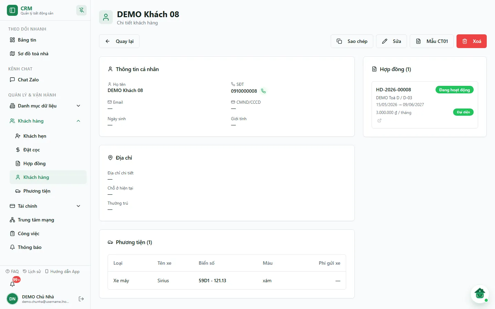
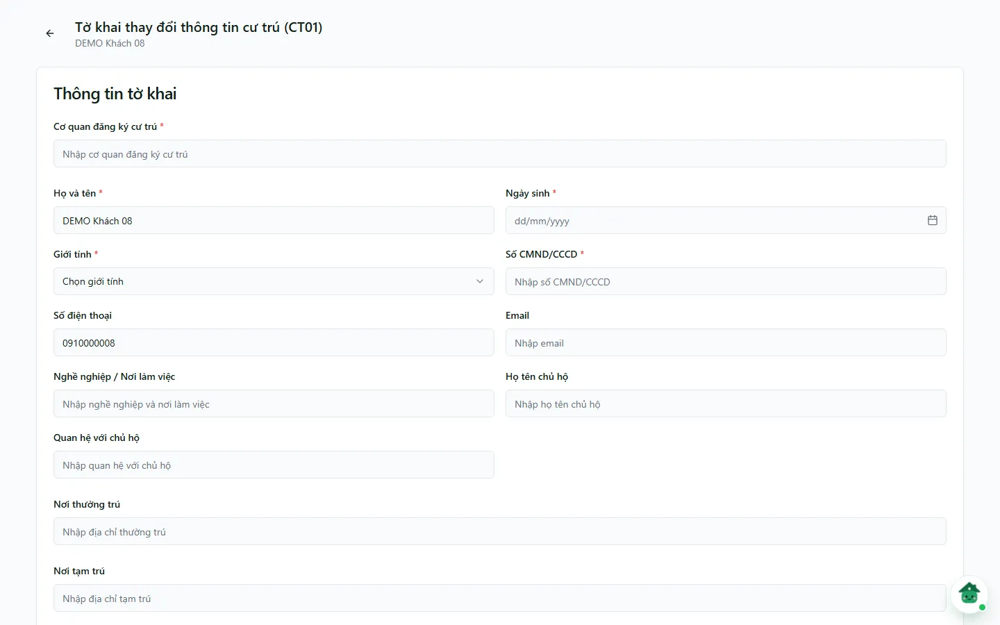

# Hồ sơ cư dân & khai báo cư trú CT01

Trang hồ sơ đầy đủ của cư dân gom toàn bộ thông tin nhân thân của một khách: họ tên, giấy tờ tuỳ thân, ngày sinh, giới tính, địa chỉ, phương tiện và các hợp đồng đang đứng tên. Từ đây bạn mở **Mẫu CT01** — tờ khai thay đổi thông tin cư trú — để lập nhanh cho khách rồi in ra nộp công an. Ngoài ra, khối **Hồ sơ tạm trú** có nút **Tải CT01+HĐT** tạo sẵn file Word gồm tờ khai CT01 và hợp đồng cho thuê, mượn, ở nhờ để in ra ký (dùng cho [Đăng ký tạm trú trên Cổng DVC](/03-quan-ly-van-hanh/dang-ky-tam-tru-dvc/)).

::: info Điều kiện tiên quyết
- Quyền **Cư dân => In** (module `customers`, action `print`) để mở trang CT01 và tải CT01+HĐT.
- Đã có **hồ sơ khách** trong hệ thống. Nếu chưa, tạo trước ở màn [Cư dân](/03-quan-ly-van-hanh/cu-dan/).
- Hồ sơ khách nên điền đủ **họ tên**, **ngày sinh**, **giới tính**, **số CCCD/hộ chiếu** và **địa chỉ** — CT01 đổ sẵn các trường này. Khách nước ngoài cần bật cờ **Khách nước ngoài** trong hồ sơ.
- Muốn **Tải CT01+HĐT**: khách phải có hợp đồng đang ở, và toà nhà phải có **Chủ sở hữu pháp lý (bên cho thuê)** khai trong form [Toà nhà](/03-quan-ly-van-hanh/toa-nha/).
:::

::: danger CT01 chứa dữ liệu cá nhân nhạy cảm
Tờ khai có CCCD/hộ chiếu, ngày sinh, địa chỉ, thông tin chủ hộ và thành viên. Chỉ mở/in khi có mục đích nghiệp vụ hợp lệ; tránh máy in dùng chung, không tải file lên kho công khai và xoá bản tải tạm theo chính sách lưu giữ của đơn vị.
:::

## Hướng dẫn từng bước

**Bước 1**: Mở **trang hồ sơ đầy đủ** của khách (`/customers/<mã>`). Cách nhanh nhất: mở [trang chi tiết hợp đồng](/03-quan-ly-van-hanh/hop-dong-chi-tiet/) của khách, ở khối **Khách thuê** bấm biểu tượng mắt (**Xem chi tiết khách thuê**). Trang hồ sơ có nút **Quay lại**, **Sao chép**, **Sửa**, **Mẫu CT01**, **Xoá** và các thẻ **Thông tin cá nhân**, **Ảnh CCCD/CMND**, **Địa chỉ**, **Phương tiện (n)**, **Hợp đồng (n)** (bấm để mở hợp đồng), **Liên hệ khẩn cấp**, **Ghi chú**. Kiểm tra họ tên, ngày sinh, số CCCD, địa chỉ trước khi lập tờ khai.

::: tip Hộp xem nhanh ở danh sách khách không có nút Mẫu CT01
Ở màn [Cư dân](/03-quan-ly-van-hanh/cu-dan/), biểu tượng mắt mở **hộp Chi tiết khách hàng** (có khối Hồ sơ tạm trú và nút **Tải CT01+HĐT**) chứ không mở trang hồ sơ đầy đủ. Muốn lập CT01 bằng form trên web, dùng trang hồ sơ đầy đủ như Bước 1.
:::

**Bước 2**: Ấn **Mẫu CT01**. Trang **Tờ khai thay đổi thông tin cư trú (CT01)** mở ra (tên khách ở dòng dưới tiêu đề) và **tự điền sẵn** họ tên, ngày sinh, giới tính, số CCCD, số điện thoại, email, địa chỉ từ hồ sơ.

**Bước 3**: Điền khối **Thông tin tờ khai**:

- **Cơ quan đăng ký cư trú \*** — tên công an phường/xã nơi nộp.
- Kiểm tra các trường bắt buộc đã đổ sẵn: **Họ và tên \***, **Ngày sinh \***, **Giới tính \***, **Số CMND/CCCD \***; bổ sung **Số điện thoại**, **Email**, **Nghề nghiệp / Nơi làm việc**.
- **Họ tên chủ hộ**, **Quan hệ với chủ hộ**.
- **Nơi thường trú**, **Nơi tạm trú**, **Nơi ở hiện tại**.
- **Nội dung đề nghị** — nội dung thay đổi thông tin cư trú cần khai.
- **Danh sách thành viên hộ gia đình** — thêm từng người nếu khai cùng nhiều người.

**Bước 4**: Ấn **Lưu phiếu CT01**. Hệ thống lưu tờ khai vào hồ sơ khách rồi tự mở hộp thoại in với bản CT01 đã định dạng sẵn. Chọn máy in (hoặc "Lưu thành PDF"). Sau đó nút **Chỉ in** xuất hiện để in lại bản vừa lập mà **không** tạo thêm bản ghi.

**Bước 5 (cách khác — file Word để ký)**: Ở khối **Hồ sơ tạm trú** (hộp **Chi tiết khách hàng** từ danh sách khách), chọn **Thời hạn tạm trú** (12 hoặc 24 tháng) rồi bấm **Tải CT01+HĐT**. Hệ thống tạo file Word tờ khai CT01 và hợp đồng cho thuê, mượn, ở nhờ (bên cho thuê lấy từ **Chủ sở hữu pháp lý** của toà) để in ra cho khách và chủ nhà ký. Khách ở nhiều phòng thì chọn phòng trước khi tải.

::: warning Tờ khai không có màn lịch sử — hãy in ngay
Mỗi lần **Lưu phiếu CT01**, hệ thống lưu dữ liệu tờ khai, nhưng chưa có màn "lịch sử tờ khai" để tra cứu/in lại bản đã lưu. Bạn chỉ in lại bản đang có trong phiên bằng **Chỉ in**. Nếu đóng trang, không tạo thêm tờ chỉ để dò bản cũ; nhờ quản trị trích xuất khi cần audit.
:::

## Các tính năng khác trên màn hình

| Nút / Thành phần | Công dụng |
| --- | --- |
| **Mẫu CT01** (trang hồ sơ đầy đủ) | Mở trang tờ khai CT01, đổ sẵn dữ liệu người khai từ hồ sơ. |
| **Sửa** (trang hồ sơ) | Mở trang **Chỉnh sửa khách hàng**; dữ liệu mới đổ vào CT01 lần lập kế tiếp. |
| **Sao chép** (trang hồ sơ) | Sao chép thông tin khách vào clipboard. |
| Thẻ **Hợp đồng (n)** | Danh sách hợp đồng khách đứng tên (trạng thái, phòng, thời hạn, giá, cờ **Đại diện**); bấm để mở hợp đồng. |
| **Danh sách thành viên hộ gia đình** | Thêm/bớt thành viên cùng khai trong một tờ CT01. |
| **Lưu phiếu CT01** | Lưu tờ khai rồi mở hộp thoại in. |
| **Chỉ in** | In lại bản CT01 hiện tại, không tạo thêm bản ghi (trong phiên đang mở). |
| **Tải CT01+HĐT** (khối Hồ sơ tạm trú) | Tải file Word tờ khai CT01 + hợp đồng cho thuê để in ký. |

## Tình huống & lỗi thường gặp

| Tình huống | Cách xử lý |
| --- | --- |
| Mở CT01 báo **"Không tìm thấy khách hàng."** | Hồ sơ không tồn tại hoặc đã bị xoá. Quay lại [Cư dân](/03-quan-ly-van-hanh/cu-dan/), mở đúng khách rồi ấn lại **Mẫu CT01**. |
| Trang CT01 báo **"Chưa tải được thông tin khách hàng."** | Lỗi tải tạm thời; bấm **Tải lại**. |
| Không lưu được — báo thiếu trường | Bắt buộc **Cơ quan đăng ký cư trú**, **Họ và tên**, **Ngày sinh**, **Giới tính**, **Số CMND/CCCD**. Nếu số CCCD/ngày sinh trống, bổ sung ở hồ sơ khách trước. |
| Hộp thoại in không tự mở | Trình duyệt chặn cửa sổ in. Cho phép in cho trang, hoặc ấn **Chỉ in**. |
| **Tải CT01+HĐT** báo "Tòa nhà chưa có thông tin người đứng tên chủ quyền" | Khai **Chủ sở hữu pháp lý (bên cho thuê)** trong form sửa toà ở [Toà nhà](/03-quan-ly-van-hanh/toa-nha/). |
| **Tải CT01+HĐT** báo khách chưa có tòa nhà từ hợp đồng đang ở | Khách chưa có hợp đồng đang hiệu lực; kiểm tra hợp đồng trước khi tải. |
| Khách nước ngoài in ra sai loại giấy tờ | Bật cờ **Khách nước ngoài** và nhập số hộ chiếu trong hồ sơ, sau đó mở lại **Mẫu CT01**. |
| Thông tin trên tờ khai bị sai/cũ | CT01 đổ theo hồ sơ tại thời điểm mở form. **Sửa** hồ sơ khách rồi lập lại tờ khai. |

## Thử trực tiếp trên sandbox

<SandboxTry account="demo.chunha" app-path="/deposits" app-label="Mở màn Đặt cọc để vào hợp đồng" fixtures="Snapshot 07/10/2026: DEMO Khách 08 · hợp đồng HD-2026-00008 phòng D-03 · hồ sơ chưa có CCCD, ngày sinh." view-only>

**Bài tập chỉ xem**

1. Ở **Đặt cọc** → **Sổ cọc đầy đủ** → tab **Đủ / Thiếu cọc**, bấm **DEMO Khách 08** để mở hợp đồng.
2. Ở khối **Khách thuê**, bấm biểu tượng mắt để mở trang hồ sơ khách.
3. Ấn **Mẫu CT01** để xem các trường đã đổ sẵn (DEMO chưa có ngày sinh, CCCD nên các ô đó trống).
4. Bấm mũi tên quay lại. **Không** ấn **Lưu phiếu CT01**, **Chỉ in** hay **Xoá**.

**Kết quả mong đợi**

- Bạn biết đường vào trang hồ sơ đầy đủ và trang CT01, nhận ra trường nào cần bổ sung ở hồ sơ trước khi khai.
- Không có dữ liệu DEMO nào bị tạo, sửa hoặc in.

</SandboxTry>

## Quy trình liên quan

- [Cư dân](/03-quan-ly-van-hanh/cu-dan/) — danh sách khách, hộp xem nhanh và khối Hồ sơ tạm trú.
- [Đăng ký tạm trú trên Cổng DVC](/03-quan-ly-van-hanh/dang-ky-tam-tru-dvc/) — lưu ảnh CT01/hợp đồng đã ký và gửi hồ sơ sang Cổng DVC.
- [Toà nhà](/03-quan-ly-van-hanh/toa-nha/) — khai chủ sở hữu pháp lý và giấy tờ chỗ ở hợp pháp của toà.
- [Phương tiện](/03-quan-ly-van-hanh/phuong-tien/) — xe gắn với khách/phòng.
- [Hợp đồng](/03-quan-ly-van-hanh/hop-dong/) — hợp đồng mà cư dân đứng tên đại diện.
- [Quy trình khách thuê](/01-bat-dau/quy-trinh-khach-thue/) — vòng đời từ khách tiềm năng tới người thuê chính thức.
