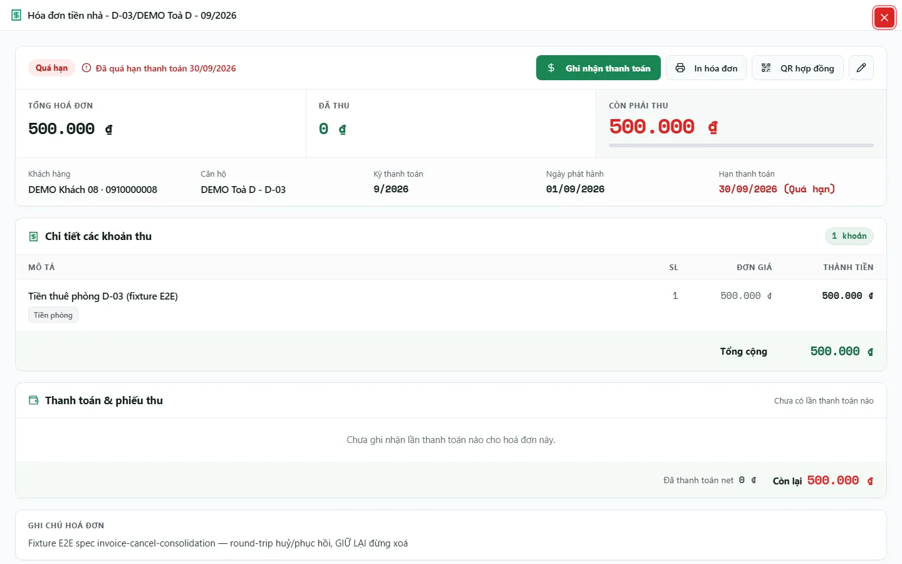
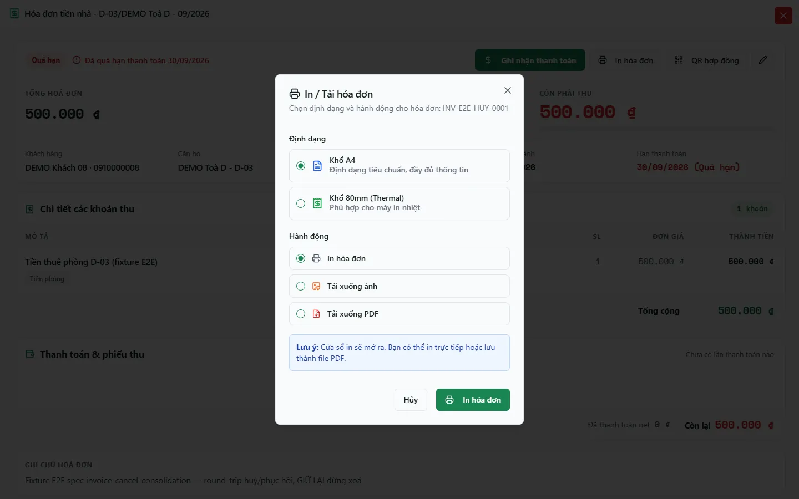

# Chi tiết, in hoá đơn & QR tra cứu

Trang chi tiết gom trạng thái, ba ô tiền (tổng – đã thu – còn phải thu), thông tin khách/căn hộ/kỳ, từng khoản thu và lịch sử thanh toán kèm phiếu thu của một hoá đơn. Từ đây bạn ghi nhận thanh toán, in/tải hoá đơn, mở QR hợp đồng cho khách hoặc điều chỉnh/huỷ hoá đơn khi được phép.

::: info Ba đường truy cập
- Từ danh sách [Hoá đơn](/03-quan-ly-van-hanh/hoa-don/), nút **Xem chi tiết** mở chi tiết toàn màn hình ngay trên trang (giữ nguyên bộ lọc). Đường dẫn riêng `/invoices/:id` (từ thông báo, hợp đồng, toà nhà…) hiện cùng nội dung; cần quyền `invoices.view`.
- `/invoices/print/:id` là trang in riêng, cần quyền `invoices.print`.
- `/c/:code` là trang công khai theo **QR hợp đồng**, khách không cần đăng nhập. Nếu mã không hợp lệ, trang báo **Mã QR không khả dụng**; khi chưa đọc được dữ liệu, trang báo **Tạm thời chưa xem được** hoặc **Không tải được hoá đơn** kèm nút **Thử lại**.
:::

## Hướng dẫn từng bước

**Bước 1**: Tại **Tài chính** => **Hoá đơn**, bấm **Xem chi tiết** (biểu tượng con mắt) trên dòng cần xem. Đầu trang là nhãn trạng thái (**Nháp**, **Đã duyệt**, **Trả 1 phần**, **Đã thanh toán**, **Quá hạn**, **Đã hủy**) kèm câu tóm tắt (ví dụ "Đã quá hạn thanh toán …", "Còn thiếu …", "Đã thu đủ").

**Bước 2**: Đối chiếu theo thứ tự:

1. **Tổng hoá đơn**, **Đã thu**, **Còn phải thu** (hoặc **Phải hoàn khách** khi khách trả dư/hoá đơn âm).
2. **Khách hàng**, **Căn hộ**, **Kỳ thanh toán**, **Ngày phát hành**, **Hạn thanh toán**.
3. Thẻ **Chi tiết các khoản thu**: từng dòng **Mô tả – SL – Đơn giá – Thành tiền**, dòng **Giảm trừ**, **Nợ cũ kỳ trước** và **Tổng cộng**.
4. Thẻ **Thanh toán & phiếu thu**: mỗi lần ghi nhận có ngày, hình thức (Tiền mặt / Chuyển khoản / Thanh toán / Cấn trừ), **Sổ quỹ**, **Người thu**, mã phiếu (bấm để mở phiếu trong sổ Thu/Chi) và ảnh chứng từ (bấm để xem lớn). Cuối thẻ là **Tổng thu (+)**, **Tổng thối (−)**, **Đã thanh toán net** và **Còn lại**.
5. **Ghi chú hoá đơn** (nếu có).

**Bước 3**: Bấm **In hóa đơn**. Hộp **In / Tải hóa đơn** cho chọn **Định dạng** (**Khổ A4**, **Khổ 80mm (Thermal)**; khi tổ chức đã cài mẫu hoá đơn thì có thêm ô **Mẫu hóa đơn** và lựa chọn **Theo mẫu**) và **Hành động** (**In hóa đơn**, **Tải xuống ảnh**, **Tải xuống PDF**). Muốn lưu PDF từ cửa sổ in, chọn "Lưu dưới dạng PDF".

**Bước 4**: Bấm **QR hợp đồng** (chỉ hiện khi hoá đơn gắn với hợp đồng chưa chấm dứt) để lấy mã QR/đường dẫn công khai cho khách quét xem hoá đơn mới nhất của hợp đồng. Thử đường dẫn trước khi gửi nếu hợp đồng vừa đổi trạng thái.

## Thu, hoàn tác và hoàn tiền

- Nút **Ghi nhận thanh toán** mở luồng [Thu tiền tại hoá đơn](/03-quan-ly-van-hanh/thu-tien-hoa-don/). Nút ẩn khi hoá đơn đã thu đủ hoặc bạn không có quyền.
- Khi một lần thu bị sai, mở **Các lần thanh toán** (nút **(Xem)** ở cột **Đã thanh toán** của danh sách) để **Hoàn tác** (bắt buộc ghi lý do) hoặc **Đổi hình thức thu**. Hệ thống giữ dấu vết kiểm toán; không xoá phiếu thu.
- Nút bút chì mở **Chỉnh sửa** (hoá đơn nháp) hoặc **Điều chỉnh hóa đơn** (hoá đơn đã phát hành/đã thu). Nút **Hủy hóa đơn** chỉ hiện khi hoá đơn chưa thu tiền; hoá đơn đã huỷ có nút **Phục hồi hoá đơn**.

::: danger Hoàn tiền chưa phải chi tiền ngay
Với hoá đơn âm hoặc khách đã trả dư, nút chính đổi thành **Hoàn trả khách**. Hộp này có ô **Ngày hoàn trả** và **Sổ quỹ chi**, nhưng luồng ghi hiện hành chưa dùng hai giá trị đó: bấm **Lập phiếu chi** chỉ tạo **phiếu chi hoàn trả ở trạng thái Chờ duyệt** gắn với hoá đơn, chưa có tiền ra khỏi quỹ. Sau đó phải duyệt theo [Chờ duyệt](/03-quan-ly-van-hanh/cho-duyet/); tiền chỉ thực sự ra khi phiếu chi ở trạng thái **Đã Chi**.
:::

## Khi số liệu chưa khớp

- Đối chiếu từng lần thu trong **Thanh toán & phiếu thu** thay vì chỉ nhìn nhãn trạng thái.
- Kiểm tra các lần thu đã hoàn tác hoặc phiếu thối tiền (dòng **−** màu đỏ).
- Phân biệt số còn phải thu của hoá đơn với số dư sổ quỹ và tiền khách gửi dư (credit) của hợp đồng.
- Lúc đang tải, các ô tiền và bảng hiện khối xám; nếu tải lỗi, khung báo **Chưa tải được…** kèm nút tải lại.

## Thử trực tiếp trên sandbox

<SandboxTry account="demo.chunha" app-path="/invoices" app-label="Mở danh sách Hoá đơn" fixtures="Snapshot 07/10/2026: hoá đơn DEMO Toà D - D-03 kỳ 09/2026, 500.000đ, Quá hạn, chưa có lần thanh toán (fixture E2E — không thu, không huỷ)." view-only>

**Bài tập chỉ xem**

1. Bấm **Xem chi tiết** trên dòng hoá đơn D-03, đối chiếu ba ô tiền, thông tin và **Chi tiết các khoản thu**.
2. Bấm **In hóa đơn** để xem các lựa chọn rồi **Hủy**.
3. Không bấm **Ghi nhận thanh toán**, bút chì điều chỉnh hoặc **Hủy hóa đơn**.

**Kết quả mong đợi**

- Bạn đọc đúng tổng, đã thu, còn phải thu và biết vị trí các thao tác in/QR.
- Không có dữ liệu DEMO nào bị thay đổi.

</SandboxTry>

## Quy trình liên quan

- [Hoá đơn — danh sách & tạo lẻ](/03-quan-ly-van-hanh/hoa-don/)
- [Thu tiền tại hoá đơn](/03-quan-ly-van-hanh/thu-tien-hoa-don/)
- [Chờ duyệt](/03-quan-ly-van-hanh/cho-duyet/)
- [Sổ quỹ](/03-quan-ly-van-hanh/so-quy/)
