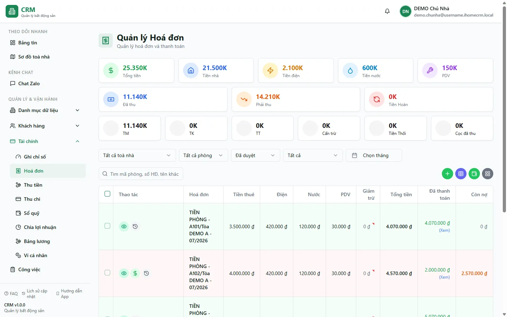

# Hoá đơn — danh sách & tạo lẻ

Màn **Hoá đơn** là nơi bạn nhìn thấy mọi hoá đơn đã phát hành cho từng hợp đồng theo kỳ (tháng): ai đã thu đủ, ai còn nợ, ai quá hạn. Từ đây bạn lọc theo toà/kỳ/trạng thái, đọc chi tiết từng khoản tiền (tiền phòng, điện, nước, phí dịch vụ), xem thống kê tổng, và **tạo một hoá đơn lẻ** cho một hợp đồng khi cần (khác với sinh hàng loạt cả toà). Điểm cốt lõi bạn cần nhớ: mỗi hợp đồng chỉ có **một hoá đơn còn hiệu lực cho mỗi kỳ**, và trong hệ thống này hoá đơn tạo ra là **Đã duyệt** ngay — sẵn sàng thu tiền, không cần bước duyệt tay.

::: info Điều kiện tiên quyết
- Quyền **Hoá đơn => Xem** (module `invoices`, action `view`) để mở màn và đọc danh sách.
- Quyền **Hoá đơn => Tạo** (`invoices.create`) để bấm tạo hoá đơn lẻ; quyền **Hoá đơn => Ghi nhận thanh toán** (`invoices.record_payment`) để thu tiền từng dòng.
- Đã có **hợp đồng đang hiệu lực** cho phòng, và nên đã **ghi chỉ số điện/nước** của kỳ (xem [Ghi chỉ số](/03-quan-ly-van-hanh/ghi-chi-so/)) để khoản điện/nước lên đúng.
- Là nhân viên, bạn chỉ thấy hoá đơn của các toà được gán phạm vi cho mình.
:::

## Hướng dẫn từng bước

**Bước 1**: Tại menu bên trái, ấn chọn **Hoá đơn**. Màn mở ra danh sách hoá đơn, mặc định sắp theo **kỳ mới nhất trước** rồi tới toà và phòng. Mỗi dòng là một hoá đơn với các cột tiền: **Tiền phòng**, **Điện**, **Nước**, **PDV** (phí dịch vụ), **Tổng**, **Đã thanh toán** và **Còn nợ**. Trong dữ liệu demo tháng 7, bạn thấy **A101** đã thu đủ **4.070.000đ**, **A102** mới thu một phần nên còn nợ **2.570.000đ**, **A105** đang **quá hạn**, và **B101** chưa thu **5.570.000đ**.

**Bước 2**: Đọc dải **thống kê** ở đầu trang. Các con số cộng theo đúng bộ lọc đang bật: **Tổng tiền** phải thu, **Đã thu**, tách theo phương thức **TM** / **TK** / **TT**, cùng **Tiền thối** và **Cọc đã thu**. Ba mã phương thức **TM** (tiền mặt), **TK** (chuyển khoản), **TT** (thanh toán) là mã chuẩn của hệ thống — bạn đọc nguyên mã, không cần dịch.

::: tip Tiền thối đã được trừ sẵn trong "Đã thu"
Cột **Đã thanh toán** và ô **Đã thu** là số **ròng** — nếu khách đưa dư và bạn thối lại, phần thối đã được trừ khỏi tổng thu. Bạn không phải tự trừ tiền thối lần nữa khi đối chiếu.
:::

**Bước 3**: Lọc để tìm đúng nhóm hoá đơn cần xem. Dùng ô **Toà nhà** (chọn nhiều toà, gõ để tìm), ô **Kỳ** (tháng), ô **Trạng thái** hoá đơn, ô **Trạng thái thanh toán** (đã thu / chưa thu / thu một phần), và **ô tìm kiếm** — gõ **số hoá đơn**, **tên khách**, hoặc **số tiền** để lọc nhanh. Bộ lọc được **giữ lại khi bạn tải lại trang (F5)**.

**Bước 4**: Đọc **trạng thái thanh toán** của từng hoá đơn qua badge trên mỗi dòng. Các nhãn tiếng Việt bạn sẽ gặp:

| Nhãn hiển thị | Ý nghĩa |
| --- | --- |
| **Nháp** / **Chờ duyệt** | Trạng thái cũ trong hệ thống — thực tế hiếm gặp vì hoá đơn tạo ra đã **Đã duyệt** ngay. |
| **Đã duyệt** | Đã phát hành, chưa thu đồng nào — sẵn sàng thu tiền. |
| **Thu một phần** | Đã thu được một phần, vẫn còn nợ (như A102 còn **2.570.000đ**). |
| **Đã thanh toán** | Đã thu đủ (như A101). |
| **Quá hạn** | Đã qua **hạn thanh toán** mà chưa thu đủ (như A105). |
| **Đã huỷ** | Hoá đơn đã huỷ — không còn hiệu lực, không chiếm chỗ kỳ đó nữa. |

::: tip Trạng thái tiền là do hệ thống tự tính
**Thu một phần / Đã thanh toán / Quá hạn** không đặt bằng tay — hệ thống tự suy ra từ tổng các phiếu thu và hạn thanh toán. Khi thu tiền, ô **Còn nợ** và badge tự cập nhật. Riêng nhãn **Quá hạn** được rà mỗi khi bạn mở màn **Hoá đơn**, nên hãy vào đây để trạng thái quá hạn được làm mới.
:::

**Bước 5**: Tạo một **hoá đơn lẻ** — ấn nút tạo hoá đơn, chọn **Hợp đồng** và **Kỳ** (billing_month). Hệ thống dựng sẵn các khoản: **Tiền phòng**, **Điện** và **Nước** (từ chỉ số đã ghi), **phí dịch vụ**. Bạn có thể **thêm khoản** tuỳ chỉnh, sửa đơn giá/số lượng, và với kỳ ở/lẻ tháng thì tiền phòng được **tính theo tỷ lệ ngày** (prorate). Nếu khách còn **nợ cũ kỳ trước**, khoản đó được **cộng dồn sang** hoá đơn kỳ này để thu gộp. Xem lại tổng rồi ấn lưu.

::: danger Tạo hoá đơn là ghi một khoản phải thu vào sổ
Khi bạn lưu, một hoá đơn **Đã duyệt** được phát hành và trở thành khoản khách phải trả — nó đi vào thống kê và báo cáo ngay. Hãy kiểm tra đúng **hợp đồng**, đúng **kỳ**, đúng chỉ số điện/nước và đúng các khoản trước khi lưu. Mỗi hợp đồng chỉ được **một hoá đơn còn hiệu lực / kỳ**; nếu kỳ đó đã có hoá đơn, hệ thống sẽ báo trùng thay vì tạo thêm.
:::

::: tip Tổng hoá đơn luôn tròn tới 1.000đ
Khi lập hoá đơn, phần lẻ dưới 1.000đ được **làm tròn ngay** về bội số 1.000 (dưới 900đ làm tròn xuống, từ 900đ làm tròn lên) để khách không phải trả tiền lẻ. Đây là làm tròn lúc **lập** hoá đơn, khác với "làm tròn tiền thiếu" lúc **thu**.
:::

**Bước 6**: Thu tiền cho một hoá đơn — ở dòng tương ứng, ấn ghi nhận thanh toán, nhập **số tiền**, chọn phương thức **TM/TK/TT**, ngày và ghi chú. Sau khi lưu, cột **Đã thanh toán** / **Còn nợ** và badge trạng thái tự cập nhật. Luồng thu chi tiết (thu hàng loạt, thu trên điện thoại) xem [Thu tiền hoá đơn](/03-quan-ly-van-hanh/thu-tien-hoa-don/).

::: danger Ghi nhận thanh toán là ghi tiền thật vào sổ quỹ
Mỗi lần thu tạo một **phiếu thu** trong sổ quỹ tương ứng với phương thức. Kiểm tra đúng số tiền và đúng phương thức trước khi lưu — sai sổ hoặc sai số sẽ lệch đối chiếu cuối ngày. Đây là thao tác ghi tiền, không phải bản nháp.
:::

::: warning Phần cọc trong hoá đơn tháng đầu được tách riêng khi thu
Với hợp đồng mới, **cọc còn thiếu được gộp vào hoá đơn tháng đầu** dưới khoản **"Tiền cọc"**. Khi khách trả, hệ thống **tự tách phần cọc thành phiếu thu riêng** (đánh dấu là cọc) — phần này **không tính vào kết quả kinh doanh** (không phải doanh thu), chỉ phần dịch vụ/tiền phòng mới vào doanh thu. Bạn không cần tách tay.
:::

::: tip Còn thiếu dưới 10.000đ được coi là đã đủ
Khi thu mà số **còn nợ chỉ còn dưới 10.000đ**, hệ thống ghi nhận **"làm tròn tiền thiếu"** và chuyển hoá đơn sang **Đã thanh toán** — số thực thu giữ nguyên, không bị đội lên. Nhờ vậy hoá đơn không kẹt ở trạng thái "thu một phần" chỉ vì vài nghìn lẻ.
:::

**Bước 7**: Huỷ một hoá đơn khi cần — hoá đơn tạo ra là **Đã duyệt** sẵn nên bình thường bạn không phải bấm duyệt. Nếu phát hành nhầm, dùng thao tác **huỷ**; hoá đơn chuyển **Đã huỷ** và không còn chiếm chỗ kỳ đó, nên bạn có thể tạo lại hoá đơn mới cho cùng hợp đồng + kỳ.

::: warning Huỷ hoá đơn khó hoàn tác — cẩn trọng với hoá đơn đã thu
Hoá đơn thường chỉ nên huỷ khi **chưa thu tiền**. Hoá đơn đã có phiếu thu chỉ **super admin** mới huỷ cưỡng chế được, và khi đó **các phiếu thu bị xoá và không tự khôi phục** dù bạn phục hồi lại hoá đơn. Trước khi huỷ, hãy chắc chắn không còn tiền đã thu gắn với hoá đơn đó.
:::

## Các tính năng khác trên màn hình

| Nút / Bộ lọc | Công dụng |
| --- | --- |
| Ô lọc **Toà nhà** | Chọn nhiều toà (nhóm theo khu, gõ để tìm); danh sách chỉ hiện toà bạn được gán phạm vi. |
| Ô lọc **Kỳ** | Lọc theo tháng (billing_month); mặc định ưu tiên kỳ mới nhất. |
| Ô lọc **Trạng thái** | Lọc theo Đã duyệt / Thu một phần / Đã thanh toán / Quá hạn / Đã huỷ. |
| Ô lọc **Trạng thái thanh toán** | Lọc nhanh **Chưa thu** (gồm cả chưa thu và thu một phần) / **Đã thu**. |
| Ô **tìm kiếm** | Gõ số hoá đơn, tên khách, hoặc số tiền để lọc. |
| Dải **Thống kê** | Tổng tiền, Đã thu, tách TM/TK/TT, Tiền thối, Cọc đã thu — cộng theo bộ lọc đang bật. |
| Cột tiền chi tiết | **Tiền phòng / Điện / Nước / PDV / Tổng / Đã thanh toán / Còn nợ** cho từng dòng. |
| Tạo hoá đơn lẻ | Phát hành một hoá đơn cho một hợp đồng theo kỳ (cần quyền `invoices.create`). |
| Ghi nhận thanh toán | Thu tiền cho một hoá đơn ngay trên dòng (cần quyền `invoices.record_payment`). |
| Xuất | Kết xuất danh sách hoá đơn đang lọc để đối chiếu ngoài. |
| Mở chi tiết | Bấm vào một dòng để xem đầy đủ khoản mục, lịch sử thu và in — xem [Hoá đơn — chi tiết](/03-quan-ly-van-hanh/hoa-don-chi-tiet/). |

## Tình huống & lỗi thường gặp

| Tình huống | Cách xử lý |
| --- | --- |
| Danh sách trống dù có hợp đồng | Thường do **bộ lọc còn dính giá trị cũ** (giữ qua F5) hoặc **phạm vi toà**: nhân viên chỉ thấy hoá đơn của toà được gán. Xoá bớt bộ lọc toà/kỳ rồi thử lại. |
| Điện/nước bằng 0 hoặc thiếu trên hoá đơn | Kỳ đó **chưa ghi chỉ số** điện/nước, hoặc chốt sau khi tạo hoá đơn. Ghi chỉ số ở [Ghi chỉ số](/03-quan-ly-van-hanh/ghi-chi-so/) rồi tạo/sửa lại hoá đơn. |
| Báo **trùng** khi tạo hoá đơn | Hợp đồng đó **đã có hoá đơn còn hiệu lực cho kỳ** này (chỉ 1 hoá đơn / kỳ). Sửa hoá đơn đang có, hoặc huỷ nó trước rồi mới tạo lại. |
| Hoá đơn "thu một phần" mãi không đủ dù khách đã trả gần hết | Nếu còn nợ **dưới 10.000đ**, hệ thống sẽ tự coi là **Đã thanh toán** khi bạn thu — cứ ghi nốt phần còn lại, đừng cố nhồi cho khớp từng đồng. |
| Trạng thái **Quá hạn** không cập nhật | Nhãn quá hạn được rà khi mở màn **Hoá đơn**. Nếu bạn chỉ đứng ở màn thu tiền, hãy quay về màn này để làm mới trạng thái. |
| Số cọc lẫn vào doanh thu | Cọc trong hoá đơn tháng đầu (khoản **"Tiền cọc"**) được **tự tách** khi thu và **không vào kết quả kinh doanh**. Nếu thấy cọc lọt vào doanh thu, kiểm tra lại khoản đó có đúng loại/tên "Tiền cọc" không. |
| Cần huỷ hoá đơn đã có tiền thu | Hoá đơn đã thu chỉ **super admin** huỷ cưỡng chế được, và phiếu thu sẽ bị xoá vĩnh viễn. Cân nhắc kỹ hoặc nhờ quản trị viên xử lý. |

## Thử trực tiếp trên sandbox

<SandboxTry account="demo.ketoan" app-path="/invoices" app-label="Mở màn Hoá đơn" fixtures="A101 đã thu, A102 còn nợ 2.570.000đ, A105 quá hạn, B101 chưa thu">

Thực hành đọc trạng thái thanh toán từng hoá đơn:

1. Mở màn **Hoá đơn** và nhìn danh sách kỳ tháng 7: để ý **A101** ở nhãn **Đã thanh toán**, **A102** ở **Thu một phần**, **B101** ở **Đã duyệt** (chưa thu), và **A105** ở **Quá hạn**.
2. Ở ô **Trạng thái thanh toán**, chọn **Chưa thu** để lọc ra các hoá đơn còn nợ — bạn sẽ thấy **B101** (chưa thu **5.570.000đ**) và **A102** (còn thu một phần) nổi lên.
3. Tìm dòng **A102**, đọc cột **Còn nợ**: đúng **2.570.000đ**. So với cột **Tổng** và **Đã thanh toán** để hiểu vì sao hoá đơn ở trạng thái **Thu một phần**.

Kết quả mong đợi: bạn đọc được **trạng thái thanh toán** của từng hoá đơn ngay trên danh sách và biết dùng bộ lọc trạng thái để khoanh vùng các hoá đơn còn nợ. (Toà A là dữ liệu triển lãm — chỉ xem, đừng thu lại; muốn thu thử thì dùng B101 ở luồng [Thu tiền hoá đơn](/03-quan-ly-van-hanh/thu-tien-hoa-don/).)

</SandboxTry>

## Quy trình liên quan

- [Sinh hoá đơn](/03-quan-ly-van-hanh/sinh-hoa-don/) — phát hành hoá đơn **hàng loạt** cho cả toà theo kỳ, thay vì tạo từng cái.
- [Hoá đơn — chi tiết](/03-quan-ly-van-hanh/hoa-don-chi-tiet/) — xem đầy đủ khoản mục, lịch sử thu/thối và in một hoá đơn.
- [Thu tiền hoá đơn](/03-quan-ly-van-hanh/thu-tien-hoa-don/) — luồng ghi nhận thanh toán, thu hàng loạt và tiền thối.
- [Thu tiền (điện thoại)](/03-quan-ly-van-hanh/thu-tien-mobile/) — thu nhanh trên màn hình điện thoại.
- [Ghi chỉ số](/03-quan-ly-van-hanh/ghi-chi-so/) — chốt chỉ số điện/nước để khoản điện/nước lên đúng hoá đơn.
- [Tiền thừa](/03-quan-ly-van-hanh/tien-thua/) — theo dõi khoản khách trả dư (credit) áp cho hoá đơn sau.
- [Hợp đồng](/03-quan-ly-van-hanh/hop-dong/) — nguồn của mỗi hoá đơn; giá phòng, dịch vụ và cọc.
- [Quy trình thu tiền](/01-bat-dau/quy-trinh-thu-tien/) — vị trí bước lập hoá đơn và thu tiền trong toàn bộ chu kỳ.
