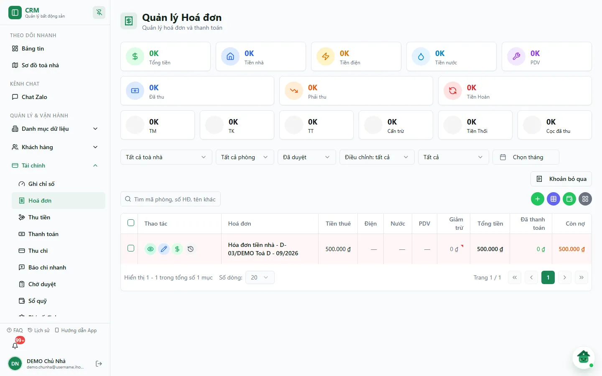
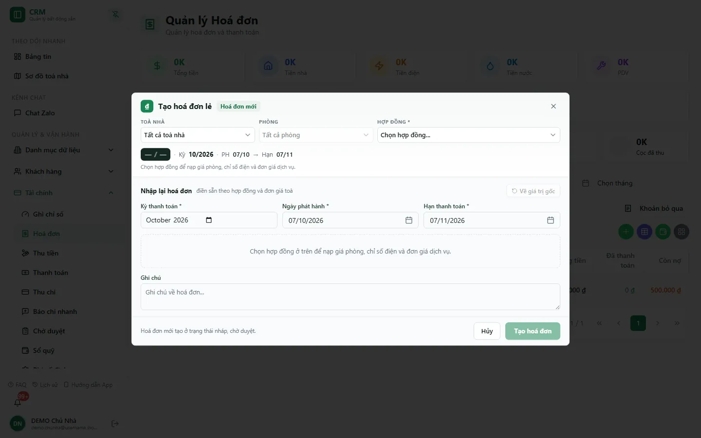

# Hoá đơn — danh sách & tạo lẻ

Màn **Quản lý Hoá đơn** là nơi tra cứu các khoản phải thu theo hợp đồng, phòng và kỳ. Từ danh sách bạn có thể xem chi tiết, thu tiền, điều chỉnh, huỷ/phục hồi hoá đơn, tạo hoá đơn lẻ hoặc mở chế độ tạo nhanh hàng loạt — nếu được cấp quyền tương ứng.

::: info Quyền truy cập
- Mở danh sách và chi tiết cần quyền **Hoá đơn => Xem** (`invoices.view`).
- Nút **Thêm** và **Mode Excel — Tạo nhanh** cần `invoices.create`; nút **Cập nhật / Điều chỉnh hóa đơn** cần `invoices.edit`; nút **Thu tiền** và **Thanh toán hàng loạt — Mode Excel** cần `invoices.record_payment`; nút **Huỷ** cần `invoices.cancel` (vai cũ chỉ có `invoices.delete` vẫn thấy nút Huỷ trong giai đoạn chuyển tiếp).
- Thấy danh sách không đồng nghĩa với được dùng mọi nút: nút nào thiếu quyền sẽ không hiện.
:::

## Hướng dẫn từng bước

**Bước 1**: Tại thanh menu, ấn chọn **Tài chính** => **Hoá đơn**. Màn mở ra với ba hàng thẻ thống kê (Tổng tiền, Tiền nhà, Tiền điện, Tiền nước, PDV; Đã thu, Phải thu, Tiền Hoàn; TM, TK, TT, Cấn trừ, Tiền Thối, Cọc đã thu), hàng bộ lọc và bảng hoá đơn.

**Bước 2**: Thu hẹp danh sách bằng hàng bộ lọc: **Tất cả toà nhà**, **Tất cả phòng** (gộp phòng cùng tên ở nhiều toà), trạng thái hoá đơn (**Đã duyệt** — mặc định, ẩn hoá đơn huỷ / **Đã huỷ** / **Tất cả**), **Điều chỉnh** (bản mới nhất chưa kiểm tra / đã kiểm tra), trạng thái thanh toán (**Đã thanh toán**, **TT 1 phần**, **Chưa thanh toán**) và **Chọn tháng**. Ô tìm kiếm nhận mã phòng, số HĐ, tên khách hoặc số tiền (sai lệch ±5.000đ). Bấm một thẻ **TM / TK / TT / Cấn trừ** để lọc bảng theo hình thức thu; bấm lại để bỏ lọc. Bộ lọc được giữ khi tải lại trang (F5) trong cùng tab.

**Bước 3**: Đọc các cột chính của bảng:

| Cột | Ý nghĩa |
| --- | --- |
| Thao tác | Nút tròn: **Xem chi tiết**, **Cập nhật / Điều chỉnh hóa đơn**, **Thu tiền**, **Lịch sử chỉnh sửa**, **Huỷ hoá đơn**, **Phục hồi hoá đơn** (chỉ hiện khi đủ quyền và đúng trạng thái). |
| Hoá đơn | Tên hoá đơn (loại – phòng/toà – kỳ). Hoá đơn huỷ bị gạch ngang và gắn nhãn **Đã huỷ**. |
| Tiền thuê, Điện, Nước, PDV, Giảm trừ | Tách các khoản trên hoá đơn. Ô **Điện** tô đỏ khi chỉ số điện đầu bị nhân viên sửa tay. |
| Tổng tiền | Tổng hoá đơn sau giảm trừ, cộng nợ cũ kéo sang. |
| Đã thanh toán | Số đã ghi nhận; bấm **(Xem)** để mở hộp **Các lần thanh toán**. Ô tô vàng khi hoá đơn vừa có TK vừa có TM/TT. |
| Còn nợ | Phần còn phải thu tại thời điểm xem. |

Dòng tô xanh nhạt là hoá đơn đã thu đủ; dòng tô đỏ nhạt là hoá đơn còn phải thu (kể cả quá hạn). Nút **Hiển thị cột** (biểu tượng lưới xám) bật thêm các cột **Nợ cộng dồn**, **Hạn TT** (kèm "Còn N ngày" / "Quá hạn N ngày") và **Người tạo**.

**Bước 4**: Bấm **Xem chi tiết** (biểu tượng con mắt) để mở chi tiết ngay trên trang, không mất bộ lọc đang dò. Xem [Chi tiết, in hoá đơn & QR tra cứu](/03-quan-ly-van-hanh/hoa-don-chi-tiet/).

**Bước 5**: Khi cần tạo một hoá đơn riêng, bấm nút tròn xanh **Thêm**. Hộp **Tạo hoá đơn lẻ** mở ra: chọn **Toà nhà**, **Phòng**, rồi **Hợp đồng** (bắt buộc). Khi chọn hợp đồng, form tự nạp giá phòng, chỉ số điện và đơn giá dịch vụ; bạn kiểm tra **Kỳ thanh toán**, **Ngày phát hành**, **Hạn thanh toán**, các dòng tiền, nợ cũ và ghi chú rồi bấm **Tạo hoá đơn**.

::: tip Một bộ nhập liệu cho cả Tạo lẻ và Sửa nháp
Hộp **Tạo hoá đơn lẻ** và hộp **Cập nhật** hoá đơn nháp dùng chung một bộ nhập liệu: cùng cách tính tổng, cùng cách chia tiền theo ngày thuê thực tế, và giữ nguyên số đã lưu ở ô bạn không đụng tới. Ô **Nợ cũ** chỉ do máy tính từ hoá đơn cũ (có nút tải lại), không gõ tay. Nếu kỳ đã có hoá đơn cho hợp đồng này, form báo trùng và khoá nút tạo.
:::

::: warning Trạng thái sau khi tạo phụ thuộc thiết lập tổ chức
Hoá đơn mới vào trạng thái **Đã duyệt** khi tổ chức bật **Tự động duyệt hóa đơn** (Cài đặt chung); nếu tắt, hoá đơn ở trạng thái **Nháp** chờ duyệt. "Đã duyệt" ở đây chỉ là trạng thái phát hành hoá đơn — chưa có đồng tiền nào vào sổ quỹ cho tới khi ghi nhận thu tiền.
:::

**Bước 6**: Sửa hoặc điều chỉnh. Bấm nút bút chì:

- Hoá đơn **nháp, chưa thu tiền** mở hộp **Cập nhật** (cùng bộ nhập liệu ở Bước 5).
- Hoá đơn **đã phát hành hoặc đã thu một phần/đủ** mở luồng **Điều chỉnh hóa đơn**: toà/phòng, hợp đồng, kỳ, ngày lập, hạn thanh toán và nguồn nợ được giữ cố định; mỗi lần lưu tạo một phiên bản điều chỉnh có lịch sử. Người có thẩm quyền đánh dấu **Xác nhận kiểm tra** cho bản mới nhất; dùng bộ lọc **Điều chỉnh** để tìm bản chưa kiểm tra.

**Bước 7**: Huỷ hoặc phục hồi. Màn chỉ còn nút **Huỷ** (nút Xoá cũ đã gỡ). Người dùng thường chỉ huỷ được hoá đơn **Nháp / Đã duyệt chưa thu tiền**; hoá đơn chuyển vào mục **Đã huỷ** và phục hồi được bằng nút **Phục hồi hoá đơn** (trả về **Đã duyệt**). Chọn nhiều hoá đơn chưa thu tiền bằng ô tích rồi bấm **Huỷ hàng loạt** để huỷ cùng lúc.

::: warning Huỷ hàng loạt không nguyên tử
Mỗi hoá đơn được huỷ riêng. Nếu có dòng lỗi, màn hiện danh sách kèm link **Mở hóa đơn** cho từng dòng; dòng chưa rõ kết quả bị khoá khỏi lần huỷ kế tiếp cho tới khi bạn kiểm tra lại.
:::

## Tạo lẻ hay tạo nhanh hàng loạt

- **Thêm (Tạo hoá đơn lẻ)** phù hợp khi bổ sung một hoá đơn riêng hoặc xử lý ngoại lệ.
- **Mode Excel — Tạo nhanh** (nút tròn tím) tạo hoá đơn cho nhiều phòng trong cùng toà/kỳ; xem [Sinh hoá đơn hàng loạt](/03-quan-ly-van-hanh/sinh-hoa-don/).
- **Thanh toán hàng loạt — Mode Excel** (nút tròn xanh có ví) ghi nhận TM/TT/TK/Thối cho nhiều phòng; xem [Thu tiền tại hoá đơn](/03-quan-ly-van-hanh/thu-tien-hoa-don/).
- Trước khi tạo lại, lọc đúng hợp đồng và kỳ để tránh trùng hoá đơn.

## Các tính năng khác trên màn hình

| Nút / Bộ lọc | Công dụng |
|---|---|
| **Khoản bỏ qua** | Báo cáo các khoản thiếu dưới 10.000đ đã được tính đóng đủ (khách đóng thiếu và thối thêm) theo kỳ, toà, người thu. |
| Thẻ **Tiền Thối** / **Cọc đã thu** | Mở bảng thống kê tiền thối hoặc cọc đã thu theo phạm vi lọc hiện tại. |
| **Lịch sử chỉnh sửa** | Xem từng phiên thao tác trên hoá đơn với cột **Trường / Trước / Sau**. |
| **Hiển thị cột** | Bật/tắt cột; **Đặt lại mặc định** để trả về bộ cột chuẩn. |
| Phân trang | Chọn số dòng mỗi trang và chuyển trang. |

## Lưu ý đối soát

- **Còn nợ** là số phải thu của hoá đơn, không phải số dư sổ quỹ.
- **Đã duyệt** (trạng thái hoá đơn) khác **Đã Thu** (phiếu thu đã ghi sổ — posting `POSTED`). Tiền chỉ coi là đã vào sổ quỹ khi phiếu thu của lần thu ở trạng thái **Đã Thu**; kiểm tra ở [Thu chi](/03-quan-ly-van-hanh/thu-chi/) hoặc [Sổ quỹ](/03-quan-ly-van-hanh/so-quy/).
- Nếu thu sai, dùng **Hoàn tác** lần thu hoặc **Đổi hình thức thu**; không huỷ hoá đơn để sửa lịch sử thu.

## Tình huống & lỗi thường gặp

| Tình huống | Nguyên nhân & cách xử lý |
|---|---|
| Bảng hiện **Không tải được danh sách hoá đơn** kèm nút **Thử lại** | Lỗi tải (mạng, quá thời gian, quyền). Bấm **Thử lại**; đây không phải trạng thái "chưa có hoá đơn". |
| Bảng hiện **Chưa có hoá đơn nào** | Bộ lọc hiện tại không có hoá đơn. Kiểm tra lại tháng, toà, trạng thái (mặc định ẩn hoá đơn **Đã huỷ**). |
| Không thấy nút **Huỷ** trên một hoá đơn | Hoá đơn đã có tiền thu hoặc không ở trạng thái Nháp/Đã duyệt. Hoàn tác các lần thu trước, hoặc dùng **Điều chỉnh hóa đơn**. |
| Báo lợi nhuận tháng **đã chốt** khi thu/hoàn tác/điều chỉnh | Tháng đó đã khoá lợi nhuận và chia cho cổ đông. Lập phiếu ở tháng hiện tại, hoặc nhờ chủ tổ chức mở khoá tháng. |
| Khi đang tải, bảng là các khối xám | Trạng thái chờ dữ liệu; số liệu hiện khi tải xong. |

## Thử trực tiếp trên sandbox

<SandboxTry account="demo.chunha" app-path="/invoices" app-label="Mở danh sách Hoá đơn" fixtures="Snapshot 07/10/2026: bộ lọc mặc định hiện một hoá đơn Quá hạn 500.000đ của DEMO Toà D - D-03, kỳ 09/2026 (fixture E2E, không được thu/huỷ)." view-only>

**Bài tập chỉ xem**

1. Mở màn, đối chiếu hàng thẻ thống kê, hàng bộ lọc và các cột của bảng.
2. Bấm **Xem chi tiết** trên dòng hoá đơn, đọc rồi đóng. Có thể bấm **Thêm** để xem hộp **Tạo hoá đơn lẻ** rồi bấm **Hủy**.
3. Không bấm **Tạo hoá đơn**, **Thu tiền**, **Huỷ**, **Phục hồi** hoặc lưu điều chỉnh.

**Kết quả mong đợi**

- Giao diện khớp nội dung hướng dẫn.
- Không có dữ liệu DEMO nào bị tạo, sửa, huỷ hoặc ghi sổ.

</SandboxTry>

## Quy trình liên quan

- [Chi tiết, in hoá đơn & QR tra cứu](/03-quan-ly-van-hanh/hoa-don-chi-tiet/)
- [Thu tiền tại hoá đơn](/03-quan-ly-van-hanh/thu-tien-hoa-don/)
- [Thu tiền tại phòng trên điện thoại](/03-quan-ly-van-hanh/thu-tien-mobile/)
- [Sinh hoá đơn hàng loạt](/03-quan-ly-van-hanh/sinh-hoa-don/)
- [Ghi chỉ số điện nước](/03-quan-ly-van-hanh/ghi-chi-so/)
