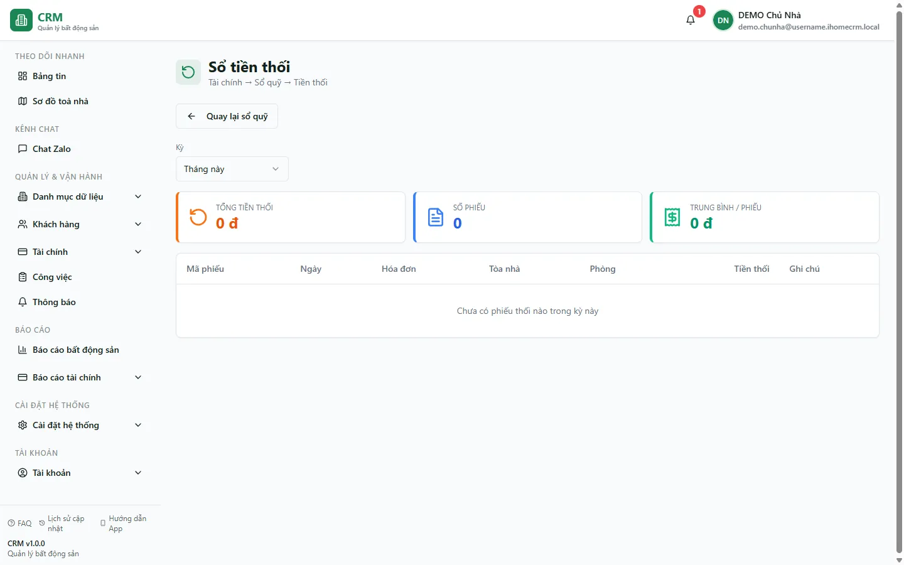

# Hoàn cọc, bỏ cọc & Sổ tiền thối

Khi một khách rời đi, phần tiền cọc phải được tất toán theo một trong hai cách: **hoàn cọc** (trả lại khách phần còn dư sau khấu trừ) hoặc **bỏ cọc** (khách mất phần cọc thực đóng, cọc chuyển thành doanh thu). Tab **Hoàn / Bỏ cọc** dùng để đối chiếu nghiệp vụ này. Đường dẫn `/finance/refund-log` hiện hiển thị **Sổ tiền thối**, không phải nhật ký hoàn cọc canonical; không dùng số ở đó để kết luận đã hoàn cọc.

::: info Điều kiện tiên quyết
- Quyền **Đặt cọc => Xem** (module `deposits`, action `view`) để mở tab **Hoàn / Bỏ cọc**; quyền tài chính phù hợp để mở **Sổ tiền thối**.
- Đã có ít nhất một **hợp đồng đã thanh lý** (hoàn hoặc bỏ cọc) để nhật ký có dữ liệu, và **sổ quỹ** nơi tiền cọc chảy vào (xem [Sổ quỹ & loại thu chi](/01-bat-dau/so-quy-loai-thu-chi/)).
- Là nhân viên, bạn chỉ thấy các khoản hoàn/bỏ cọc thuộc **những toà được gán phạm vi** cho mình.
:::

## Hướng dẫn từng bước

**Bước 1**: Nắm rõ hai cách tất toán cọc trước khi tra soát. Cả hai đều **phát sinh khi thanh lý hợp đồng**, không phải thao tác riêng trên trang này:

- **Hoàn cọc**: khách không thuê tiếp / huỷ giữ chỗ / thanh lý bình thường và còn cọc phải trả lại. Số hoàn = **Cọc gốc − Tổng nợ tất toán**, có thể xuống **âm** khi khách nợ nhiều hơn cọc (khi đó hiển thị "Khách nợ …").
- **Bỏ cọc** (forfeit): khách mất cọc, cọc **chuyển thành doanh thu**. Hệ thống chỉ chuyển thành doanh thu **phần cọc khách đã thực đóng** (không tính phần khách còn nợ), và huỷ mọi hoá đơn còn nợ của hợp đồng.

::: danger Hoàn cọc và bỏ cọc có bản chất dòng tiền khác nhau
**Hoàn cọc** tạo nghĩa vụ trả khách và chỉ là tiền thật đi ra khi phiếu đã được post vào đúng sổ quỹ. **Bỏ cọc** chuyển cọc đã giữ thành doanh thu qua cặp bút toán nội bộ tự duyệt trên sổ ảo (`NON_CASH/NOT_APPLICABLE`), tất toán bằng phương thức **Cấn trừ**; nó không tạo tiền mới vào/ra sổ quỹ thật. Cả hai đều khó hoàn tác về nghiệp vụ, nên chỉ thực hiện trong luồng thanh lý sau khi đối chiếu kỹ số cọc.
:::

**Bước 2**: Mở `/finance/refund-log`. Màn hiện tại có tiêu đề **Sổ tiền thối** và là bề mặt chỉ đọc theo kỳ. Snapshot ngày 13/08/2026 có **0 phiếu**. Dùng màn này để tra tiền thối theo đúng nhãn hiện tại, không diễn giải thành hoàn cọc.

**Bước 3**: Đọc một dòng trong nhật ký. Mỗi dòng gồm **Mã phiếu**, **Ngày**, **Hóa đơn** (ấn vào để mở hoá đơn liên quan), **Tòa nhà**, **Phòng**, **Số tiền** và **Ghi chú**. Dùng ô **Kỳ** ở đầu trang để đổi khoảng thời gian: **Tháng này**, **Tháng trước**, **Năm nay** hoặc **Tùy chỉnh** (chọn **Từ ngày** / **Đến ngày**). Nút **Quay lại sổ quỹ** đưa bạn trở về danh sách sổ.

**Bước 4**: Đối chiếu với tab **Hoàn / Bỏ cọc** ở màn **Đặt cọc**. Vào **Đặt cọc** => tab **Hoàn / Bỏ cọc** để xem bảng tổng hợp theo từng lần thanh lý: cột **Ngày**, **Toà / Phòng / Khách** (ấn vào mở hợp đồng), **Loại** (badge đỏ **Bỏ cọc** hay xám **Hoàn cọc**), **Cọc gốc**, **Tổng nợ tất toán** và **Còn nợ / Hoàn lại**. Đây là góc nhìn nghiệp vụ đầy đủ nhất của một khoản hoàn/bỏ cọc.

::: warning "Tổng nợ tất toán" KHÔNG bị trừ vào cọc
Cột **Tổng nợ tất toán** là **tổng khoản khách còn nợ** khi thanh lý (tiền phòng, phí phạt, thu thêm…), hiển thị để bạn hình dung bức tranh nợ — nó **không tự động trừ vào cọc**. Việc cấn nợ vào cọc được xử lý riêng trong luồng thanh lý hợp đồng. Đừng cộng/trừ thủ công hai con số này.
:::

**Bước 5**: Đối chiếu tổng số ở tab **Tổng quan**. Vẫn trong màn **Đặt cọc**, tab **Tổng quan** có hai thẻ **Đã hoàn cọc** (tổng số đã trả lại khách và số lần) và **Đã bỏ cọc** (tổng cọc đã chuyển thành doanh thu và số lần). Con số này khớp với các dòng bạn thấy trong tab Hoàn / Bỏ cọc, giúp bạn kiểm tra nhanh không sót khoản nào.

::: warning Một màn hình trống không chứng minh chưa hoàn cọc
Luồng thanh lý cũ và luồng hoàn cọc V2 hiện có thể cùng tồn tại; hàng đợi hoàn cọc còn có thể giữ dữ liệu cũ giữa các phiên. Đồng thời, một số hợp đồng đã kết thúc nhưng thiếu bản ghi `contract_terminations`, nên tab **Hoàn / Bỏ cọc** có thể không phản ánh đủ. Không tạo thêm khoản hoàn chỉ vì Nhật ký hoặc một tab đang trống. Trước khi xử lý, đối chiếu hợp đồng, bản ghi thanh lý, hoá đơn tất toán, phiếu thu/chi/chuyển và trạng thái duyệt/posting.
:::

::: danger Ngăn hoàn cọc trùng
Nếu đã thấy bất kỳ phiếu hoàn legacy, phiếu V2, phiếu chi hoặc cặp phiếu cấn trừ liên quan cùng hợp đồng, dừng thao tác hoàn mới cho đến khi kế toán xác nhận bộ bút toán nào là chính thức. Không dùng nút hoàn lần hai để "bù" một bản ghi thanh lý bị thiếu; đó là lỗi audit cần quản trị kỹ thuật xử lý.
:::

## Các tính năng khác trên màn hình

| Nút / Bộ lọc | Công dụng |
| --- | --- |
| Ô **Kỳ** (Sổ tiền thối) | Chọn khoảng thời gian: **Tháng này** / **Tháng trước** / **Năm nay** / **Tùy chỉnh**. |
| **Từ ngày** / **Đến ngày** | Hiện khi chọn **Tùy chỉnh** — giới hạn nhật ký theo khoảng ngày bạn nhập. |
| Thẻ thống kê (3 thẻ) | Tổng số tiền trong kỳ, tổng số phiếu và trung bình mỗi phiếu. |
| Cột **Hóa đơn** trong bảng | Ấn vào mã hoá đơn để mở chi tiết hoá đơn liên quan. |
| **Quay lại sổ quỹ** | Trở về danh sách sổ quỹ. |
| Tab **Hoàn / Bỏ cọc** (màn Đặt cọc) | Bảng nghiệp vụ đầy đủ: Cọc gốc, Tổng nợ tất toán, Còn nợ / Hoàn lại, loại **Hoàn cọc / Bỏ cọc**. |
| Thẻ **Đã hoàn cọc / Đã bỏ cọc** (tab Tổng quan) | Tổng số và số lần, để đối chiếu nhanh. |
| Ô lọc toà nhà (màn Đặt cọc) | Lọc theo **1 toà** hoặc **Tất cả toà nhà**; áp cho các tab. |

Bộ lọc **Kỳ** và khoảng ngày được **giữ lại khi bạn tải lại trang (F5)**.

## Tình huống & lỗi thường gặp

| Tình huống | Cách xử lý |
| --- | --- |
| Sổ tiền thối **trống** | Kỳ đang chọn chưa có phiếu tiền thối. Snapshot ngày 13/08/2026 ở kỳ hiện tại là `0`; đổi kỳ nếu cần nhưng không suy ra tình trạng hoàn cọc từ màn này. |
| Một màn trống nhưng màn khác có khoản hoàn | Không tạo thêm. Đối chiếu mã hợp đồng, hoá đơn tất toán, phiếu tiền ở mọi sổ, trạng thái duyệt/posting và bản ghi thanh lý; hàng đợi hoặc nguồn đọc giữa các màn có thể khác nhau. |
| Hợp đồng đã thanh lý nhưng không có dòng ở tab **Hoàn / Bỏ cọc** | Đây có thể là lỗi đã biết do bản ghi thanh lý không được ghi dù hợp đồng đã kết thúc. Báo quản trị kỹ thuật phục hồi audit trail; không thanh lý hoặc hoàn cọc lại. |
| Cột **Còn nợ / Hoàn lại** hiện **"Khách nợ …"** ở dòng Bỏ cọc | Đúng: khi tổng nợ tất toán lớn hơn cọc gốc, số hoàn xuống âm → khách vẫn còn nợ sau khi mất cọc. Cần thu thêm phần này qua hoá đơn/nợ, không phải lỗi. |
| Bỏ cọc nhưng **cọc thành doanh thu ít hơn** số cọc theo hợp đồng | Đúng thiết kế: bỏ cọc chỉ chuyển thành doanh thu **phần khách đã thực đóng**, không tính phần khách còn nợ cọc. |
| Số ở **Sổ tiền thối** không khớp tab **Hoàn / Bỏ cọc** | Đây là hai nghiệp vụ khác nhau. Đối chiếu hoàn/bỏ cọc theo hợp đồng, phiếu cọc và posting; không ép hai tổng phải bằng nhau. |
| Không thấy khoản hoàn/bỏ cọc của một toà | Thường do phạm vi toà: nhân viên chỉ thấy dữ liệu của toà được gán. Kiểm tra ô lọc toà (giữ qua F5) và phân quyền. |
| Muốn **thực hiện** hoàn/bỏ cọc nhưng không thấy nút trên trang này | Đúng: trang này chỉ **xem/đối chiếu**. Hoàn/bỏ cọc phát sinh khi **thanh lý hợp đồng** trong [Hợp đồng chi tiết](/03-quan-ly-van-hanh/hop-dong-chi-tiet/). |

## Thử trực tiếp trên sandbox

<SandboxTry account="demo.chunha" app-path="/finance/refund-log" app-label="Mở Sổ tiền thối" fixtures="Snapshot 13/08/2026: kỳ hiện tại 0 phiếu." view-only>

Bài quan sát (không ghi dữ liệu):

1. Ở **Sổ tiền thối**, đọc tiêu đề, kỳ, ba thẻ thống kê và empty state `0 phiếu` của snapshot hiện tại.
2. Mở [Đặt cọc](/03-quan-ly-van-hanh/dat-coc/) => tab **Hoàn / Bỏ cọc**. Nếu tab rỗng, ghi nhận chưa có bản ghi; khi có dòng, đọc badge **Hoàn cọc** / **Bỏ cọc** và các cột theo hợp đồng.
3. Sang tab **Phiếu giữ chỗ** và đọc đúng dữ liệu đang hiển thị; snapshot hiện tại không có fixture cọc giữ chỗ.

Kết quả mong đợi: bạn phân biệt được **hoàn cọc**, **bỏ cọc** và **tiền thối**, không dùng `/finance/refund-log` làm bằng chứng canonical cho hoàn cọc.

</SandboxTry>

## Quy trình liên quan

- [Đặt cọc giữ chỗ](/03-quan-ly-van-hanh/dat-coc/) — trung tâm quản lý cọc; tab **Hoàn / Bỏ cọc** và **Tổng quan** là góc nhìn nghiệp vụ đầy đủ.
- [Hợp đồng chi tiết](/03-quan-ly-van-hanh/hop-dong-chi-tiet/) — nơi **thanh lý hợp đồng** sinh ra khoản hoàn/bỏ cọc.
- [Hợp đồng](/03-quan-ly-van-hanh/hop-dong/) — danh sách hợp đồng, badge trạng thái cọc.
- [Sổ quỹ & loại thu chi](/01-bat-dau/so-quy-loai-thu-chi/) — sổ quỹ nơi mở Nhật ký và nơi doanh thu bỏ cọc được ghi nhận.
- [Quy trình khách thuê](/01-bat-dau/quy-trinh-khach-thue/) — vị trí bước tất toán cọc trong toàn bộ vòng đời khách thuê.
