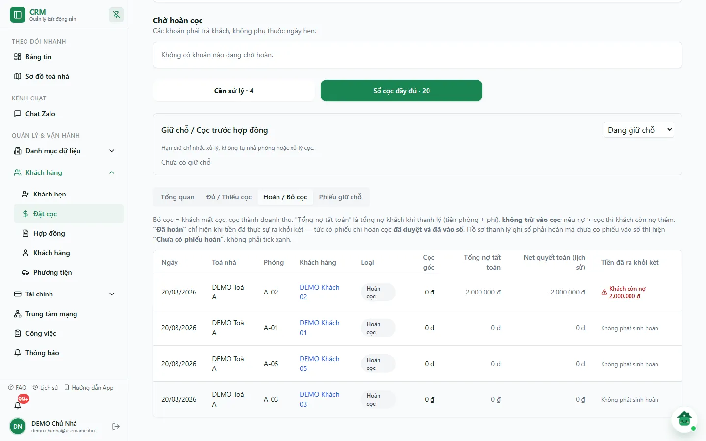

# Hoàn cọc, bỏ cọc & Sổ tiền thối

Khi khách rời đi hoặc không ký hợp đồng, tiền cọc phải được tất toán theo một trong hai cách: **hoàn cọc** (trả lại khách phần còn dư sau khấu trừ) hoặc **bỏ cọc** (khách mất phần cọc thực đóng, cọc chuyển thành doanh thu). Tất cả được theo dõi ở màn **Quản lý Cọc** (`/deposits`). Đường dẫn `/finance/refund-log` là **Sổ tiền thối / Sổ làm tròn** của một sổ quỹ — không phải nhật ký hoàn cọc; không dùng số ở đó để kết luận đã hoàn cọc.

::: info Điều kiện tiên quyết
- Quyền **Đặt cọc => Xem** (module `deposits`, action `view`) để mở màn Quản lý Cọc và Sổ tiền thối.
- Muốn **Xử lý bỏ cọc** giữ chỗ hoặc **Hoàn tiền** khoản chờ hoàn: cần đồng thời **Hoàn / bỏ cọc** (`deposits.refund`) và **Duyệt thu chi** (`income_expenses.approve`); muốn **hoàn ngay** phải là **người giữ** ít nhất một sổ quỹ.
- Là nhân viên, bạn chỉ thấy các khoản thuộc **những toà được gán phạm vi** cho mình.
:::

## Hướng dẫn từng bước

**Bước 1**: Nắm rõ các cách tất toán cọc:

- **Hợp đồng đã ký → thanh lý**: hoàn cọc hoặc bỏ cọc phát sinh **trong luồng thanh lý hợp đồng** — xem [Khách rời phòng](/03-quan-ly-van-hanh/thanh-ly-move-out/) (cọc cấn nợ + thu thêm, phần dư hoàn khách) và [Khách bỏ cọc](/03-quan-ly-van-hanh/thanh-ly-forfeit/) (cọc thực đóng thành doanh thu).
- **Giữ chỗ chưa ký hợp đồng**: khách đổi ý hoặc không đến ký thì dùng **Xử lý bỏ cọc** ngay trên màn [Đặt cọc](/03-quan-ly-van-hanh/dat-coc/) — nhập **Hoàn lại khách** (phần còn lại **Giữ lại → doanh thu**), chọn **Hoàn ngay** hoặc **Hoàn sau**, **Ngày xử lý**, **Lý do**.

::: danger Hoàn cọc và bỏ cọc có bản chất dòng tiền khác nhau
**Hoàn cọc** là trả lại tiền giữ hộ — chỉ là tiền thật đi ra khi phiếu chi đã **duyệt và ghi sổ (POSTED)** vào đúng sổ quỹ. **Bỏ cọc** chuyển cọc đã giữ thành **doanh thu** (vào KQKD), không tạo tiền mới vào/ra sổ quỹ thật. Cả hai đều khó hoàn tác, chỉ thực hiện sau khi đối chiếu kỹ số cọc đã thu.
:::

**Bước 2**: Mở **Khách hàng** => **Đặt cọc** (màn **Quản lý Cọc**). Đọc các số liên quan:

- Dải số liệu: dòng **Đã hoàn cọc (tiền đã ra khỏi két)** (số tiền · số khoản) và **Đã bỏ cọc** (số tiền · số nghiệp vụ); nếu có phiếu hoàn chưa nối hồ sơ, dòng đỏ "… phiếu hoàn (…) chưa nối hồ sơ — rà tay".
- Khối giữ chỗ: **Doanh thu bỏ cọc giữ chỗ**, **Phải hoàn khách**, **Đã hoàn khách**.
- Khối **Chờ hoàn cọc**: các khoản phải trả khách (từ **Hoàn sau**), mỗi dòng ghi mã phiếu, người nộp, toà/phòng, "Còn phải hoàn …" và nút **Hoàn tiền**.
- Ở chế độ **Cần xử lý**, thẻ **Đối soát hoàn cọc**: **Tiền đã ra khỏi két**, **Nối được hồ sơ**, **Chưa có hồ sơ** — "Ghi nhận để rà tay — hệ thống không tự sửa."

**Bước 3**: Trả khoản chờ hoàn — khi đã đưa tiền cho khách, ấn **Hoàn tiền** ở khối **Chờ hoàn cọc**. Hộp **Hoàn tiền cọc** ("Ghi sổ toàn bộ số còn phải hoàn") yêu cầu **Sổ quỹ đã chi** (sổ bạn đang giữ), **Ngày chi**, ảnh chứng từ, tích **Tôi xác nhận đã trả toàn bộ tiền hoàn cho khách** → **Ghi nhận hoàn tiền**.

**Bước 4**: Đối chiếu lịch sử thanh lý hợp đồng — ấn **Sổ cọc đầy đủ** rồi tab **Hoàn / Bỏ cọc**. Bảng có cột **Ngày**, **Toà nhà**, **Phòng**, **Khách hàng** (bấm mở hợp đồng), **Loại** (**Bỏ cọc** / **Hoàn cọc**), **Cọc gốc**, **Tổng nợ tất toán**, **Net quyết toán (lịch sử)** và **Tiền đã ra khỏi két**. Cột cuối chỉ hiện "đã hoàn" khi có phiếu chi hoàn cọc **đã duyệt và đã vào sổ**; hồ sơ ghi phải hoàn mà chưa có phiếu vào sổ hiện **Chưa có phiếu hoàn**; khách nợ nhiều hơn cọc hiện **Khách còn nợ …**; không phát sinh hoàn thì ghi **Không phát sinh hoàn**.

::: warning "Tổng nợ tất toán" KHÔNG bị trừ vào cọc trong bảng này
Cột **Tổng nợ tất toán** là tổng khoản khách còn nợ khi thanh lý (tiền phòng, phí…), hiển thị để bạn hình dung bức tranh nợ. Việc cấn nợ vào cọc đã xử lý trong luồng thanh lý; đừng cộng/trừ thủ công hai con số này.
:::

**Bước 5**: Tab **Tổng quan** của sổ cọc có thể hiện thêm dòng giải thích: trong ô **Đã hoàn cọc**, phần nào là **tiền cọc** và phần nào **không phải cọc** (tiền thừa khách trả dư · tiền phòng ngày khách không ở) — phần không phải cọc **tính vào lãi lỗ**. Tab **Phiếu giữ chỗ** hiện trạng thái sau xử lý: **Đã bỏ cọc**, **Đã bỏ cọc một phần**, **Chờ hoàn cọc**, **Đã hoàn cọc**.

**Bước 6 — Sổ tiền thối / Sổ làm tròn** (khác hoàn cọc): mở **Tài chính** => **Sổ quỹ**, mở một sổ tên kết thúc bằng "Thối" hoặc sổ "Làm tròn tiền thiếu", bấm **Xem thu chi** — hệ thống chuyển sang `/finance/refund-log?account_id=…`. Trang hiện tên sổ, nút **Quay lại sổ quỹ**, ô **Kỳ** (**Tháng này** / **Tháng trước** / **Năm nay** / **Tùy chỉnh** với **Từ ngày** / **Đến ngày**), thẻ tổng (**Tổng tiền thối** hoặc **Tổng làm tròn**, **Số phiếu**, **Trung bình / phiếu**) và bảng **Mã phiếu**, **Ngày**, **Hóa đơn**, **Tòa nhà**, **Phòng**, số tiền, **Ghi chú**. Mở thẳng `/finance/refund-log` không kèm sổ thì trang chỉ báo "Chọn sổ quỹ để xem lịch sử tiền thối."

::: danger Ngăn hoàn cọc trùng
Nếu đã thấy bất kỳ phiếu hoàn, phiếu chi "Trả khách thanh lý" hoặc khoản **Chờ hoàn cọc** cho cùng hợp đồng/giữ chỗ, dừng thao tác hoàn mới cho đến khi kế toán xác nhận bộ bút toán chính thức. Một màn trống không chứng minh chưa hoàn; không dùng nút hoàn lần hai để "bù" một bản ghi thiếu.
:::

## Các tính năng khác trên màn hình

| Nút / Bộ lọc | Công dụng |
| --- | --- |
| Ô **Tất cả toà nhà** (Quản lý Cọc) | Lọc theo **1 toà** hoặc tất cả; áp cho mọi khối. |
| Khối **Chờ hoàn cọc** → **Hoàn tiền** | Ghi nhận đã trả khoản hoàn còn treo (chọn sổ đã chi, ngày chi, chứng từ). |
| **Xử lý bỏ cọc** (giữ chỗ) | Chốt phần giữ lại thành doanh thu và phần hoàn khách. |
| Tab **Hoàn / Bỏ cọc** | Lịch sử hoàn/bỏ cọc từ các lần thanh lý hợp đồng. |
| Thẻ **Đối soát hoàn cọc** | Tiền đã ra khỏi két, phần nối được / chưa có hồ sơ thanh lý. |
| Ô **Kỳ** (Sổ tiền thối) | **Tháng này** / **Tháng trước** / **Năm nay** / **Tùy chỉnh**. |
| **Quay lại sổ quỹ** | Về màn Sổ quỹ. |

## Tình huống & lỗi thường gặp

| Tình huống | Cách xử lý |
| --- | --- |
| Tab **Hoàn / Bỏ cọc** có dòng **Chưa có phiếu hoàn** | Hồ sơ thanh lý ghi phải hoàn nhưng phiếu chi chưa duyệt/chưa vào sổ. Mở hợp đồng — dải cảnh báo nhắc phiếu "Trả khách thanh lý" cần chọn sổ quỹ chi tiền rồi **Duyệt**. |
| Dòng báo hồ sơ và phiếu đã vào sổ "nói hai số khác nhau" | Cần rà tay; hệ thống không tự sửa. Báo kế toán đối chiếu. |
| **Hoàn tiền** báo "Bạn cần là Người giữ ít nhất một sổ quỹ để hoàn tiền." | Nhờ người giữ sổ thực hiện, hoặc được gán làm người giữ sổ. |
| **Xử lý bỏ cọc** chỉ cho **Hoàn sau** | Bạn chưa có quyền thực chi. Ghi nhận hoàn sau; khoản vào **Chờ hoàn cọc** để người giữ sổ trả. |
| Hợp đồng đã thanh lý nhưng không có dòng ở tab **Hoàn / Bỏ cọc** | Có thể thiếu bản ghi thanh lý. Báo quản trị kỹ thuật; không thanh lý hoặc hoàn cọc lại. |
| Bỏ cọc nhưng **cọc thành doanh thu ít hơn** số cọc theo hợp đồng | Đúng thiết kế: chỉ chuyển thành doanh thu **phần khách đã thực đóng**. |
| Số ở **Sổ tiền thối** không khớp tab **Hoàn / Bỏ cọc** | Hai nghiệp vụ khác nhau (tiền thối/làm tròn khi thu tiền vs hoàn cọc). Không ép hai tổng phải bằng nhau. |

## Thử trực tiếp trên sandbox

<SandboxTry account="demo.chunha" app-path="/deposits" app-label="Mở màn Quản lý Cọc" fixtures="Snapshot 07/10/2026: Đã hoàn cọc 0 đ · 0 khoản; 4 hồ sơ Hoàn cọc ngày 20/08/2026 ở DEMO Toà A; không có khoản chờ hoàn." view-only>

Bài quan sát (không ghi dữ liệu):

1. Đọc dải số liệu (**Đã hoàn cọc**, **Đã bỏ cọc**), khối giữ chỗ và khối **Chờ hoàn cọc** ("Không có khoản nào đang chờ hoàn.").
2. Ấn **Sổ cọc đầy đủ** → tab **Hoàn / Bỏ cọc**; đọc dòng **Khách còn nợ 2.000.000 đ** và các dòng **Không phát sinh hoàn**.
3. Không bấm **Hoàn tiền**, **Xử lý bỏ cọc** hay **Tạo đặt cọc**.

Kết quả mong đợi: bạn phân biệt được **hoàn cọc**, **bỏ cọc** và **tiền thối**, biết đọc cột **Tiền đã ra khỏi két**.

</SandboxTry>

## Quy trình liên quan

- [Đặt cọc giữ chỗ](/03-quan-ly-van-hanh/dat-coc/) — màn Quản lý Cọc, nơi xử lý bỏ cọc giữ chỗ và khoản chờ hoàn.
- [Thanh lý — Khách rời phòng](/03-quan-ly-van-hanh/thanh-ly-move-out/) — hoàn cọc khi thanh lý hợp đồng.
- [Thanh lý — Khách bỏ cọc](/03-quan-ly-van-hanh/thanh-ly-forfeit/) — bỏ cọc khi thanh lý hợp đồng.
- [Trang chi tiết hợp đồng](/03-quan-ly-van-hanh/hop-dong-chi-tiet/) — nhóm Quyết toán trong bảng Tài chính.
- [Sổ quỹ](/03-quan-ly-van-hanh/so-quy/) — nơi mở Sổ tiền thối / Sổ làm tròn.
- [Quy trình khách thuê](/01-bat-dau/quy-trinh-khach-thue/) — vị trí bước tất toán cọc trong vòng đời khách thuê.
