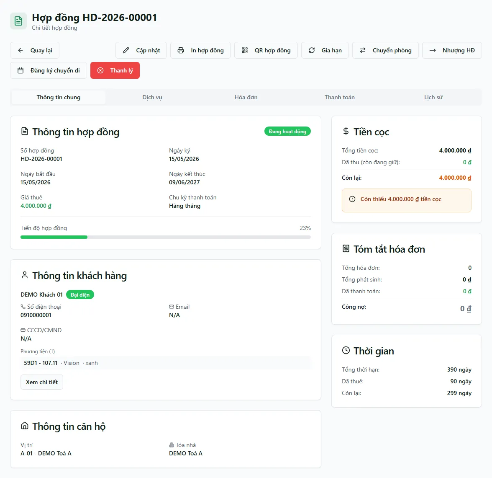

# Trang chi tiết hợp đồng

Trang chi tiết là nơi bạn xem toàn cảnh một hợp đồng thuê: thông tin hợp đồng, khách đại diện, phòng, tình hình tiền cọc, hoá đơn và lịch sử biến động — tất cả gom trong 5 tab. Từ đầu trang, bạn cũng mở được mọi thao tác trong vòng đời hợp đồng (cập nhật, in, gia hạn, chuyển phòng, nhượng, đăng ký chuyển đi, thanh lý). Mỗi khi cần "soi kỹ một hợp đồng" hoặc thực hiện một nghiệp vụ trên nó, bạn vào đây.

::: info Điều kiện tiên quyết
- Quyền **Hợp đồng => Xem** (module `contracts`, action `view`) để mở trang chi tiết.
- Là nhân viên, bạn chỉ xem được hợp đồng thuộc các toà được gán phạm vi cho mình.
- Các nút thao tác vòng đời (Gia hạn, Chuyển phòng, Thanh lý...) chỉ chạy được nếu bạn có quyền **Sửa** trên toà của hợp đồng — nếu không, bấm vào sẽ bị hệ thống từ chối.
- Đã có sẵn hợp đồng để mở. Nếu chưa, tạo hợp đồng ở trang [Hợp đồng](/03-quan-ly-van-hanh/hop-dong/).
:::

## Hướng dẫn từng bước

**Bước 1**: Từ menu **Khách hàng => Hợp đồng**, ấn chọn một dòng hợp đồng trong danh sách để mở trang chi tiết. Đầu trang hiện tên hợp đồng (ví dụ **HD-2026-00001**), một hàng nút thao tác, rồi 5 tab bên dưới.

**Bước 2**: Ở tab **Thông tin chung** (mở sẵn), đọc thẻ **Thông tin hợp đồng**: số hợp đồng, ngày ký, ngày bắt đầu / kết thúc, giá thuê, chu kỳ thanh toán, thanh tiến độ và ghi chú. Cạnh tên trạng thái (**Đang hoạt động**) sẽ có chip xanh dương **Đã gia hạn** nếu hợp đồng từng được gia hạn.

**Bước 3**: Xem thẻ **Tiền cọc** (bên phải): **Tổng tiền cọc**, **Đã thu**, **Còn lại** và một dòng danh sách các phiếu thu cọc đã ghi nhận. Con số **Đã thu** ở đây được cộng tự động từ các phiếu thu cọc — bạn không gõ tay. Nếu hợp đồng ký thiếu cọc, thẻ này hiện cảnh báo theo cách xử lý nợ cọc đã chọn khi ký.

**Bước 4**: Đọc thẻ **Tóm tắt hoá đơn** (tổng hoá đơn, tổng phát sinh, đã thanh toán, công nợ) và thẻ **Thông tin khách hàng** (khách đại diện đứng đầu, phương tiện, ghi chú). Kéo xuống để thấy thẻ **Phòng** (vị trí, chỉ số điện/nước đầu) và thẻ **Thời gian**.

**Bước 5**: Lần lượt ấn qua các tab còn lại để xem chi tiết:
- **Dịch vụ**: danh sách dịch vụ đăng ký trong hợp đồng cùng đơn giá riêng.
- **Hoá đơn**: bảng hoá đơn của hợp đồng (kỳ, hạn, tổng / đã thu / còn lại, trạng thái).
- **Thanh toán**: gom các lần thu tiền từ mọi hoá đơn của hợp đồng.
- **Lịch sử**: dòng thời gian gia hạn / chuyển phòng / thanh lý kèm nhãn trạng thái.

**Bước 6**: Muốn in hợp đồng, ấn **In hợp đồng** ở đầu trang. Hệ thống dựng bản in theo **mẫu biểu** đã cấu hình, có chỗ ký của chủ nhà và khách thuê — bạn xem trước rồi in hoặc lưu PDF.

**Bước 7**: Cần sửa thông tin, ấn **Cập nhật** để mở lại form hợp đồng, chỉnh xong ấn **Lưu**. Nút **Cập nhật** ẩn khi hợp đồng đã **Thanh lý**. Với hợp đồng còn ở trạng thái **Nháp** (chưa kích hoạt), bạn thấy thêm nút **Xoá**.

::: tip "Đã gia hạn" nhưng vẫn "Đang hoạt động"
Khi gia hạn, hợp đồng **giữ nguyên trạng thái Đang hoạt động** — hệ thống không tạo trạng thái riêng cho việc gia hạn. Dấu **Đã gia hạn** (chip xanh dương cạnh trạng thái) được suy ra từ lịch sử gia hạn, nên một hợp đồng vừa **Đang hoạt động** vừa mang dấu **Đã gia hạn** là hoàn toàn bình thường. Chi tiết các lần gia hạn nằm ở tab **Lịch sử**.
:::

::: tip Tiền cọc là hệ quả của phiếu thu cọc
Số **Đã thu** ở thẻ Tiền cọc không phải ô bạn tự điền — nó được cộng lại từ các **phiếu thu cọc** gắn với hợp đồng. Khi ký hợp đồng, hệ thống tự tạo phiếu thu cọc vào sổ **"CỌC (giữ hộ khách)"**; phần cọc còn thiếu sẽ được gộp thành một dòng trong **hoá đơn tháng đầu**. Vì vậy nếu thấy số cọc chưa khớp, hãy kiểm tra lại phiếu thu cọc ở tab **Thanh toán** hoặc danh sách phiếu trong thẻ Tiền cọc, đừng chỉnh tay con số.
:::

::: warning Thao tác vòng đời có thể khó hoàn tác
Các nút **Gia hạn**, **Chuyển phòng**, **Nhượng HĐ**, **Đăng ký chuyển đi** và nhất là **Thanh lý** thay đổi hợp đồng thật (đổi ngày, đổi phòng, đóng hợp đồng...). Trang chi tiết **không ẩn nút theo phạm vi toà** như trang danh sách, nên bạn vẫn thấy đủ nút kể cả khi không quản lý toà đó — nhưng khi bấm sẽ bị từ chối. Chỉ mở các dialog này khi thật sự muốn thực hiện; đọc kỹ số liệu trước khi xác nhận.
:::

## Các tính năng khác trên màn hình

| Nút / Thành phần | Công dụng |
| --- | --- |
| **Quay lại** | Trở về danh sách hợp đồng. |
| **Cập nhật** | Mở form hợp đồng để sửa thông tin. Ẩn khi hợp đồng đã **Thanh lý**. |
| **In hợp đồng** | Dựng bản in theo mẫu biểu, có chỗ ký chủ nhà và khách; xem trước rồi in / lưu PDF. |
| **QR hợp đồng** | Tạo mã QR / link công khai để khách tự tra hoá đơn mới nhất mà không cần đăng nhập. Ẩn khi hợp đồng **Nháp** hoặc **Thanh lý**. |
| **Gia hạn** | Mở hộp thoại gia hạn (giữ **Đang hoạt động**). Xem [Gia hạn & chuyển phòng](/03-quan-ly-van-hanh/gia-han-chuyen-phong/). |
| **Chuyển phòng** | Chuyển hợp đồng sang phòng khác, giữ nguyên hợp đồng. |
| **Nhượng HĐ** | Đổi khách đại diện của hợp đồng. |
| **Đăng ký chuyển đi** | Ghi nhận ngày khách dự kiến trả phòng (chưa thanh lý) — bật cảnh báo sắp trống. |
| **Thanh lý** | Mở hộp thoại thanh lý (rời phòng hoặc bỏ cọc) — kết thúc hợp đồng. Xem [Hoàn / bỏ cọc](/03-quan-ly-van-hanh/hoan-bo-coc/). |
| Tab **Thông tin chung** | Thẻ hợp đồng, khách, phòng, tiền cọc, tóm tắt hoá đơn, thời gian. |
| Tab **Dịch vụ** | Dịch vụ đăng ký trong hợp đồng + đơn giá riêng. |
| Tab **Hoá đơn** | Bảng hoá đơn của hợp đồng. |
| Tab **Thanh toán** | Các lần thu tiền của mọi hoá đơn. |
| Tab **Lịch sử** | Dòng thời gian gia hạn / chuyển phòng / thanh lý. |

## Tình huống & lỗi thường gặp

| Tình huống | Cách xử lý |
| --- | --- |
| Bấm **Gia hạn / Thanh lý...** thì báo lỗi từ chối quyền | Trang chi tiết hiển thị đủ nút, nhưng thao tác chỉ chạy khi bạn quản lý toà của hợp đồng. Nhờ người có quyền trên toà đó thực hiện, hoặc kiểm tra lại phân quyền. |
| Số **Đã thu** ở thẻ Tiền cọc không khớp trí nhớ | Con số này cộng từ các phiếu thu cọc, không phải ô nhập tay. Mở danh sách phiếu trong thẻ Tiền cọc / tab **Thanh toán** để đối chiếu; phần cọc thiếu có thể đang nằm trong hoá đơn tháng đầu. |
| Hợp đồng vừa **Đang hoạt động** vừa có dấu **Đã gia hạn** | Đúng thiết kế: gia hạn không đổi trạng thái, hợp đồng vẫn **Đang hoạt động**. Xem các lần gia hạn ở tab **Lịch sử**. |
| Không thấy nút **QR hợp đồng** | Nút QR ẩn với hợp đồng **Nháp** và **Thanh lý**. QR chỉ dùng cho hợp đồng đang hiệu lực. |
| Không thấy nút **Cập nhật** | Hợp đồng đã **Thanh lý** thì không sửa được nữa; trang chỉ còn để xem. |
| Mở trang báo lỗi / không tìm thấy hợp đồng | Đường dẫn sai hoặc hợp đồng đã bị xoá. Ấn nút quay lại và mở lại từ danh sách [Hợp đồng](/03-quan-ly-van-hanh/hop-dong/). |
| Thẻ **Thông tin khách hàng** hiện "Hợp đồng chưa có khách hàng nào" | Hợp đồng chưa gắn khách đại diện. Ấn **Cập nhật** để chọn khách đại diện cho hợp đồng. |

## Thử trực tiếp trên sandbox

<SandboxTry account="demo.quanly" app-path="/contracts" app-label="Mở danh sách hợp đồng" fixtures="HĐ A101">

Làm quen trang chi tiết bằng hợp đồng phòng **A101** (khách **Nguyễn Văn An**, Tòa DEMO A):

1. Trong danh sách hợp đồng, tìm dòng phòng **A101** rồi ấn vào để mở trang chi tiết.
2. Ở tab **Thông tin chung**, đọc thẻ **Thông tin hợp đồng** và thẻ **Tiền cọc** — để ý dấu trạng thái **Đang hoạt động** và số cọc đã thu.
3. Lần lượt ấn qua các tab **Dịch vụ**, **Hoá đơn**, **Thanh toán**, **Lịch sử** để xem hợp đồng có những gì.
4. Ấn nút **In hợp đồng** ở đầu trang để xem bản in theo mẫu biểu (chỉ xem trước, không cần in ra).

Kết quả mong đợi: bạn quen với bố cục trang chi tiết, đọc được thông tin qua 5 tab và biết mở bản in hợp đồng.

</SandboxTry>

## Quy trình liên quan

- [Hợp đồng](/03-quan-ly-van-hanh/hop-dong/) — danh sách hợp đồng, nơi mở trang chi tiết và tạo hợp đồng mới.
- [Gia hạn & chuyển phòng](/03-quan-ly-van-hanh/gia-han-chuyen-phong/) — chi tiết thao tác Gia hạn và Chuyển phòng mở từ trang này.
- [Hoàn / bỏ cọc](/03-quan-ly-van-hanh/hoan-bo-coc/) — chi tiết thao tác Thanh lý (rời phòng / bỏ cọc).
- [Đặt cọc](/03-quan-ly-van-hanh/dat-coc/) — nguồn của các phiếu thu cọc phản ánh vào thẻ Tiền cọc.
- [Cư dân](/03-quan-ly-van-hanh/cu-dan/) — người ở gắn với hợp đồng.
- [Phương tiện](/03-quan-ly-van-hanh/phuong-tien/) — xe của khách hiển thị trong thẻ khách hàng.
- [Hồ sơ CT01](/03-quan-ly-van-hanh/ho-so-ct01/) — khai báo tạm trú gắn với khách của hợp đồng.
