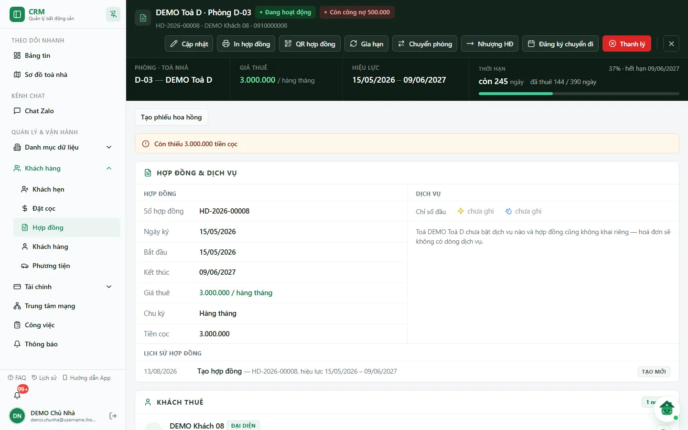
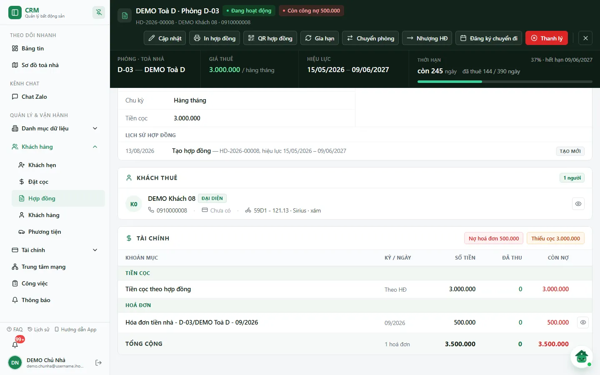

# Trang chi tiết hợp đồng

Trang chi tiết là nơi bạn xem toàn cảnh một hợp đồng thuê **trên một trang duy nhất** (không còn chia tab): thông tin hợp đồng và dịch vụ, lịch sử biến động, khách thuê, và bảng tài chính gom tiền cọc với hoá đơn. Thanh đầu trang màu tối luôn dính trên cùng, chứa mọi thao tác vòng đời (cập nhật, in, QR, gia hạn, chuyển phòng, nhượng, báo trả phòng, thanh lý). Mỗi khi cần "soi kỹ một hợp đồng" hoặc làm một nghiệp vụ trên nó, bạn vào đây.

::: info Điều kiện tiên quyết
- Quyền **Hợp đồng => Xem** (module `contracts`, action `view`) để mở trang chi tiết.
- Là nhân viên, bạn chỉ xem được hợp đồng thuộc các toà được gán phạm vi cho mình.
- Mỗi nút cần quyền riêng và chỉ hiện khi bạn có quyền: **Cập nhật** cần `contracts.edit`, **In hợp đồng** cần `contracts.print`, **Gia hạn** cần `contracts.renew`, **Chuyển phòng** / **Nhượng HĐ** cần `contracts.transfer`, **Đăng ký chuyển đi** / **Thanh lý** cần `contracts.terminate`, **Xoá** (hợp đồng nháp) cần `contracts.delete`.
:::

## Hướng dẫn từng bước

**Bước 1**: Mở trang chi tiết. Đường dẫn đầy đủ là `/contracts/<mã>` — bạn đến từ liên kết tên khách ở màn [Đặt cọc](/03-quan-ly-van-hanh/dat-coc/) (tab **Đủ / Thiếu cọc**), từ hồ sơ [khách hàng](/03-quan-ly-van-hanh/cu-dan/), từ thông báo, hoặc dán link. Ở màn danh sách [Hợp đồng](/03-quan-ly-van-hanh/hop-dong/), nút **Xem chi tiết** mở cùng nội dung này trong một cửa sổ.

**Bước 2**: Đọc thanh đầu trang:

- Tầng trên: **Toà · Phòng**, chip trạng thái (ví dụ **Đang hoạt động**), chip đỏ **Còn công nợ …** nếu hợp đồng còn nợ hoá đơn; dòng phụ ghi mã hợp đồng · khách đại diện · số điện thoại. Bên phải là hàng nút **Cập nhật**, **In hợp đồng**, **QR hợp đồng**, **Gia hạn**, **Chuyển phòng**, **Nhượng HĐ**, **Đăng ký chuyển đi**, **Thanh lý** (đỏ) và nút **Đóng** (✕) quay về danh sách.
- Tầng dưới: 4 ô **Phòng · Toà nhà**, **Giá thuê**, **Hiệu lực** (từ ngày – đến ngày) và **Thời hạn** (còn bao nhiêu ngày, đã thuê bao nhiêu ngày, thanh tiến độ % kèm ngày hết hạn).

**Bước 3**: Đọc dải cảnh báo ngay dưới thanh đầu (chỉ hiện khi có): **Còn thiếu … tiền cọc** (kèm lý do cho nợ nếu có) hoặc **Còn … cọc — thu trong hoá đơn đầu**; **Khách dự kiến trả phòng / Đến ngày / Đã quá ngày dự kiến trả phòng** kèm nút **Sửa / hủy báo trả phòng**; **Phiếu thanh lý chờ xử lý** (ví dụ phiếu chi "Trả khách thanh lý" chưa chọn sổ quỹ). Nút **Tạo phiếu hoa hồng** hiện khi hợp đồng còn cần lập phiếu hoa hồng môi giới / thưởng Sale.

**Bước 4**: Đọc khối **Hợp đồng & Dịch vụ**:

- Cột **Hợp đồng**: Số hợp đồng, Ngày ký, Bắt đầu, Kết thúc, Giá thuê, Chu kỳ, Tiền cọc, Ghi chú.
- Cột **Dịch vụ**: **Chỉ số đầu** điện/nước (hoặc "chưa ghi") và các dịch vụ đang áp với đúng nguồn giá (theo toà hay riêng hợp đồng).
- **Lịch sử hợp đồng**: mỗi sự kiện một dòng có nhãn — **TẠO MỚI**, **GIA HẠN**, **CHUYỂN PHÒNG**, **NHƯỢNG HĐ**, **THANH LÝ** — kèm ngày và tóm tắt (ví dụ mốc hiệu lực mới).

**Bước 5**: Kéo xuống khối **Khách thuê** (số người, khách **ĐẠI DIỆN**, số điện thoại, giấy tờ, phương tiện). Biểu tượng mắt mở chi tiết khách; biểu tượng giấy tờ mở hộp ảnh CCCD kèm thông tin trên thẻ.

**Bước 6**: Đọc khối **Tài chính** — một bảng gom theo nhóm với cột **Khoản mục**, **Kỳ / ngày**, **Số tiền**, **Đã thu**, **Còn nợ**:

- **Tiền cọc**: dòng **Tiền cọc theo hợp đồng** và các phiếu cọc thực thu (phiếu chưa duyệt không được tính).
- **Hoá đơn**: từng hoá đơn của hợp đồng (bấm biểu tượng mắt để **Xem chi tiết hoá đơn**) và các lần thanh toán.
- **Quyết toán** (hợp đồng đã thanh lý): **Cọc tính quyết toán**, **Công nợ cấn trừ**, **Phí phạt + thu thêm**, **Net quyết toán (hồ sơ)** hoặc **Cọc giữ làm doanh thu** (bỏ cọc).
- Dòng **Tổng cộng**; góc phải có các chip **Nợ hoá đơn …**, **Thiếu cọc …**.

**Bước 7**: In hợp đồng — ấn **In hợp đồng**, chọn mẫu biểu đã cấu hình, xem trước rồi in hoặc tải tài liệu.

**Bước 8**: Sửa thông tin — ấn **Cập nhật** để mở form **Cập nhật hợp đồng (mã HĐ)**, chỉnh xong ấn **Cập nhật**. Nút **Cập nhật** ẩn khi hợp đồng đã **Thanh lý**. Hợp đồng còn ở trạng thái **Nháp** có thêm nút **Xoá**.

**Bước 9**: Với hợp đồng **đã thanh lý**, đầu trang hiện khối **Hồ sơ trả phòng** với trạng thái **Đã trả phòng · Chờ quyết toán** hoặc **Đã chốt quyết toán**, loại thanh lý ban đầu/hiện tại, **Nội dung thanh lý**; hồ sơ đang chờ có nút **Quyết toán hồ sơ này** (xem [Thanh lý — Khách rời phòng](/03-quan-ly-van-hanh/thanh-ly-move-out/)). Hợp đồng đang hiệu lực có liên kết nhượng thì hiện thêm khối liên kết nhượng (xem [Gia hạn, chuyển phòng & nhượng](/03-quan-ly-van-hanh/gia-han-chuyen-phong/)).

::: tip Tiền cọc là hệ quả của phiếu cọc
Số **Đã thu** của nhóm Tiền cọc không phải ô bạn tự điền — nó được cộng từ các **phiếu cọc** đã duyệt gắn với hợp đồng (phiếu nhập lúc ký, phiếu giữ chỗ được chuyển sang, phiếu bổ sung cọc). Nếu số chưa khớp, kiểm tra từng phiếu và trạng thái duyệt/ghi sổ ở [Thu chi](/03-quan-ly-van-hanh/thu-chi/); đừng chỉnh tay con số. Chỉ phiếu đã ghi sổ (**POSTED**) mới chứng minh tiền đã vào quỹ.
:::

::: warning Thao tác vòng đời có thể khó hoàn tác
Các nút **Gia hạn**, **Chuyển phòng**, **Nhượng HĐ**, **Đăng ký chuyển đi** và nhất là **Thanh lý** thay đổi hợp đồng thật (đổi ngày, đổi phòng, đóng hợp đồng, ghi tiền…). Kiểm tra kỹ trước khi xác nhận trong từng hộp thoại.
:::

## Các tính năng khác trên màn hình

| Nút / Thành phần | Công dụng |
| --- | --- |
| **Đóng** (✕) | Trở về danh sách hợp đồng. |
| **Cập nhật** | Mở form hợp đồng để sửa. Ẩn khi hợp đồng đã **Thanh lý**. |
| **In hợp đồng** | Chọn mẫu biểu, xem trước rồi in / tải tài liệu. |
| **QR hợp đồng** | Mã QR / link công khai để khách tự tra hoá đơn mới nhất. Ẩn khi hợp đồng **Nháp** hoặc **Thanh lý**. |
| **Gia hạn** / **Chuyển phòng** / **Nhượng HĐ** | Xem [Gia hạn, chuyển phòng & nhượng](/03-quan-ly-van-hanh/gia-han-chuyen-phong/). Chỉ hiện khi hợp đồng đang hiệu lực. |
| **Đăng ký chuyển đi** | Mở hộp **Báo ngày dự kiến trả phòng** (hợp đồng vẫn đang ở đến khi thanh lý). |
| **Thanh lý** | Ghi nhận trả phòng và quyết toán — xem [Khách rời phòng](/03-quan-ly-van-hanh/thanh-ly-move-out/) / [Khách bỏ cọc](/03-quan-ly-van-hanh/thanh-ly-forfeit/). |
| **Tạo phiếu hoa hồng** | Lập phiếu hoa hồng môi giới / thưởng Sale còn thiếu sau khi ký. |
| Khối **Hợp đồng & Dịch vụ** | Điều khoản, chỉ số đầu, dịch vụ đang áp, lịch sử hợp đồng. |
| Khối **Khách thuê** | Danh sách người ở, khách đại diện, giấy tờ, phương tiện. |
| Khối **Tài chính** | Tiền cọc + hoá đơn (+ quyết toán) với cột Đã thu / Còn nợ. |

## Tình huống & lỗi thường gặp

| Tình huống | Cách xử lý |
| --- | --- |
| Không thấy một nút thao tác | Nút chỉ hiện khi bạn có đúng quyền (`edit`, `print`, `renew`, `transfer`, `terminate`, `delete`) và hợp đồng ở trạng thái phù hợp. Hợp đồng đã thanh lý không còn Gia hạn / Chuyển phòng / Thanh lý. |
| Chip **Chưa xác minh được công nợ** ở đầu trang | Chưa tải được hoá đơn của hợp đồng. Tải lại trang trước khi đọc công nợ. |
| Dải cảnh báo "Không tải được: …" | Một vài nguồn (phương tiện, tài chính…) chưa tải được; số liệu các mục đó có thể thiếu. Tải lại trang. |
| Số **Đã thu** ở nhóm Tiền cọc không khớp | Mở từng phiếu cọc và trạng thái duyệt/ghi sổ để đối chiếu; phiếu chưa duyệt không được tính. Không hoàn/thu theo một con số đơn lẻ. |
| Hợp đồng đã gia hạn nhưng chip vẫn **Đang hoạt động** | Đúng thiết kế: gia hạn giữ hợp đồng hiệu lực, chỉ dời ngày kết thúc. Xem dòng **GIA HẠN** ở **Lịch sử hợp đồng**. |
| Không thấy nút **QR hợp đồng** | QR ẩn với hợp đồng **Nháp** và **Thanh lý**. |
| Mở trang báo "ID hợp đồng không hợp lệ" / không tìm thấy | Đường dẫn sai hoặc hợp đồng đã bị xoá. Bấm **Quay lại danh sách** và mở lại từ [Hợp đồng](/03-quan-ly-van-hanh/hop-dong/). |

## Thử trực tiếp trên sandbox

<SandboxTry account="demo.chunha" app-path="/deposits" app-label="Mở màn Đặt cọc" fixtures="Snapshot 07/10/2026: HD-2026-00008 · DEMO Toà D · D-03 · DEMO Khách 08 · cọc 3.000.000 đ, đã thu 0 đ · 1 hoá đơn nợ 500.000 đ." view-only>

Làm quen trang chi tiết bằng một hợp đồng DEMO:

1. Ở màn **Đặt cọc**, ấn **Sổ cọc đầy đủ** → tab **Đủ / Thiếu cọc**, bấm tên một khách để mở trang chi tiết hợp đồng.
2. Đọc thanh đầu trang: chip trạng thái, chip **Còn công nợ**, 4 ô Phòng · Giá thuê · Hiệu lực · Thời hạn.
3. Kéo xuống đọc **Lịch sử hợp đồng**, **Khách thuê** và bảng **Tài chính** — để ý nhóm **Tiền cọc** (theo hợp đồng vs đã thu) tách khỏi nhóm **Hoá đơn**.
4. Ấn **In hợp đồng** để xem hộp chọn mẫu, rồi đóng — không bấm các nút thao tác khác.

Kết quả mong đợi: bạn đọc được toàn cảnh hợp đồng trên một trang và biết mỗi nút vòng đời nằm ở đâu.

</SandboxTry>

## Quy trình liên quan

- [Hợp đồng](/03-quan-ly-van-hanh/hop-dong/) — danh sách hợp đồng, soạn nháp và ký hợp đồng mới.
- [Gia hạn, chuyển phòng & nhượng](/03-quan-ly-van-hanh/gia-han-chuyen-phong/) — các thao tác Gia hạn, Chuyển phòng, Nhượng HĐ mở từ trang này.
- [Thanh lý — Khách rời phòng](/03-quan-ly-van-hanh/thanh-ly-move-out/) và [Khách bỏ cọc](/03-quan-ly-van-hanh/thanh-ly-forfeit/) — báo trả phòng, trả phòng và quyết toán.
- [Đặt cọc](/03-quan-ly-van-hanh/dat-coc/) — nguồn của các phiếu cọc phản ánh vào nhóm Tiền cọc.
- [Cư dân](/03-quan-ly-van-hanh/cu-dan/) — người ở gắn với hợp đồng.
- [Phương tiện](/03-quan-ly-van-hanh/phuong-tien/) — xe của khách hiển thị trong khối Khách thuê.
- [Hồ sơ CT01](/03-quan-ly-van-hanh/ho-so-ct01/) — khai báo tạm trú gắn với khách của hợp đồng.
