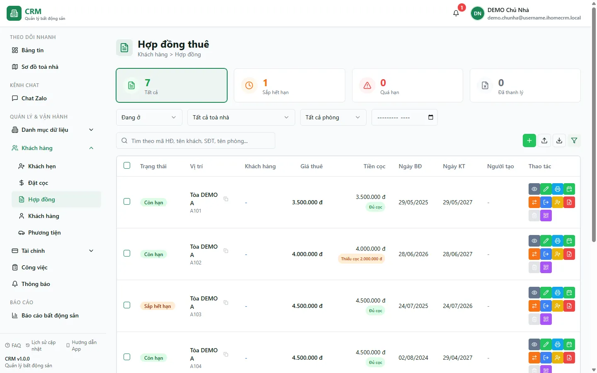

# Hợp đồng — danh sách & ký mới

Màn **Hợp đồng** là trục vận hành của toàn hệ thống: mỗi hợp đồng nối một **phòng** với một (nhóm) **khách**, chốt **giá thuê**, **tiền cọc**, **dịch vụ** và là gốc sinh ra mọi hoá đơn, công nợ về sau. Tại đây bạn tra cứu nhanh hợp đồng đang chạy, lọc theo trạng thái và toà/phòng, đọc ngay hợp đồng nào **đủ cọc** hay **thiếu cọc**, và **ký hợp đồng mới** cho khách vừa nhận phòng.

Điểm cần nắm: một phòng chỉ có **một hợp đồng đang hiệu lực** tại một thời điểm, và **cọc còn thiếu khi ký sẽ được gộp thẳng vào hoá đơn tháng đầu** chứ không tạo phiếu cọc riêng. Hiểu hai điều này giúp bạn đọc đúng con số và thao tác không bị nhầm.

::: info Điều kiện tiên quyết
- Quyền **Hợp đồng => Xem** (module `contracts`, action `view`) để mở màn danh sách.
- Muốn **Thêm** hoặc **Nhập** hợp đồng: cần quyền **Hợp đồng => Tạo** và có **phạm vi toà** được gán.
- Muốn **Xuất** Excel: cần quyền **Hợp đồng => Xuất**.
- Đã có sẵn **toà nhà**, **phòng** và **khách hàng** để gán vào hợp đồng. Nếu chưa, tạo trước theo [Căn hộ / Phòng](/03-quan-ly-van-hanh/can-ho-phong/) và [Cư dân](/03-quan-ly-van-hanh/cu-dan/).
- Là nhân viên, bạn chỉ thấy và thao tác được hợp đồng thuộc các toà trong phạm vi của mình.
:::

## Hướng dẫn từng bước

**Bước 1**: Vào menu **Khách hàng** => **Hợp đồng**. Màn hiện danh sách hợp đồng kèm **4 thẻ thống kê** ở đầu trang (**Tất cả** / **Sắp hết hạn** / **Quá hạn** / **Đã thanh lý**), ô tìm kiếm và các bộ lọc. Mỗi dòng hiển thị mã hợp đồng, phòng/toà, khách đại diện, giá thuê, thời hạn, cùng hai nhóm badge: trạng thái (**Còn hạn** / **Sắp hết hạn** / **Nháp**) và tình trạng cọc (**Đủ cọc** / **Thiếu cọc**).

**Bước 2**: Lọc danh sách theo nhu cầu. Ấn một **thẻ thống kê** để lọc nhanh (ví dụ **Sắp hết hạn** để soi các hợp đồng còn 1–30 ngày). Tại **ô lọc toà** (danh sách phẳng A→Z, gõ để tìm), ấn chọn đúng **1 toà** hoặc **Tất cả toà nhà**; khi đã chọn toà, ô **Phòng** (gộp theo tên) và ô **Tháng** giúp thu hẹp thêm. Các bộ lọc được giữ lại khi bạn tải lại trang (F5).

**Bước 3**: Cần tìm đúng một hợp đồng, gõ vào **ô tìm kiếm** — tìm được theo **mã hợp đồng**, **tên khách đại diện**, **số điện thoại** hoặc **tên phòng**. Kết quả và các thẻ thống kê áp dụng ngay.

**Bước 4**: Ấn vào một dòng để mở [trang chi tiết hợp đồng](/03-quan-ly-van-hanh/hop-dong-chi-tiet/) — xem đầy đủ thông tin chung, dịch vụ, hoá đơn, thanh toán và lịch sử, cùng các nút vòng đời (gia hạn, chuyển phòng, thanh lý...).

**Bước 5**: Muốn **ký hợp đồng mới**, ấn **Thêm** để mở form. Ký hợp đồng đi qua nhiều phần trên cùng một form:
- **Chọn phòng**: ấn chọn **Toà nhà** rồi **Phòng** (ô Phòng đổ theo toà đã chọn; phòng đang có hợp đồng hiệu lực sẽ không chọn được).
- **Chọn khách**: ấn chọn **khách đại diện** cho hợp đồng; bật/tắt **Dùng dịch vụ riêng cho hợp đồng** và điền **chỉ số điện / nước ban đầu** lúc nhận phòng.
- **Nhập tiền**: điền **Giá thuê**, **Tổng cọc**, **Đã thu cọc**, **Chu kỳ thanh toán**, mốc tính hoá đơn và **Khuyến mãi tháng đầu** (nếu có).
- **Xem trước hoá đơn**: form dựng sẵn **hoá đơn cọc + hoá đơn tháng đầu** với các dòng tự sinh; bạn **chỉnh trực tiếp** được (sửa mô tả/đơn giá/số lượng, thêm hoặc xoá dòng) trước khi lưu.

**Bước 6**: Nếu **Đã thu cọc** chưa bằng **Tổng cọc**, form bắt bạn chọn **cách xử lý cọc còn thiếu** và tick **Đồng ý cho nợ cọc**:
- **Cho nợ cọc** (DEBT): nhập **lý do** và **ngày hẹn bổ sung** — hệ thống ghi nhận phần thiếu là công nợ cọc.
- **Thu trong hoá đơn đầu** (FIRST_INVOICE): phần cọc thiếu được **thêm thành một dòng "Tiền cọc" ngay trong hoá đơn tháng đầu**.

Chọn xong ấn **Lưu**. Nếu chưa tick đồng ý cho nợ mà cọc còn thiếu, hệ thống chặn không cho lưu.

::: warning Cọc còn thiếu gộp vào hoá đơn tháng đầu — không phải phiếu cọc riêng
Khi bạn ký mà khách **chưa đóng đủ cọc**, phần thiếu **không** tạo thành một phiếu thu cọc độc lập. Nó được đưa thành **một dòng "Tiền cọc" trong hoá đơn tháng đầu** (chế độ thu trong hoá đơn đầu). Vì vậy hãy đọc con số ở **hoá đơn tháng đầu** để thu đúng, và đừng tạo thêm phiếu cọc tay cho phần này kẻo thu trùng. Phần cọc **đã thu** khi ký thì được ghi vào sổ **"CỌC (giữ hộ khách)"** như một phiếu thu cọc riêng — đây là nguồn để hệ thống tính lại "đã thu cọc" của hợp đồng.
:::

::: danger Ký hợp đồng là thao tác ghi tiền vào sổ
Lưu hợp đồng mới sẽ **tự ghi vào sổ quỹ**: tạo **phiếu thu cọc** (phần cọc đã thu) vào sổ **"CỌC (giữ hộ khách)"**, sinh **hoá đơn cọc + hoá đơn tháng đầu**, và ngay sau đó mở modal lập **phiếu chi hoa hồng**. Hãy kiểm tra lại phòng, khách, giá thuê và các con số cọc trước khi ấn **Lưu** — các bút toán này đi thẳng vào báo cáo dòng tiền và khó hoàn tác.
:::

::: tip Khuyến mãi (giảm giá) tháng đầu
Ô **Khuyến mãi tháng đầu** không trộn vào các dòng hoá đơn mà được ghi riêng vào phần **giảm trừ** của hoá đơn (kèm ghi chú lý do). Nếu bạn cấu hình khuyến mãi kéo dài nhiều tháng, các hoá đơn của những tháng kế sẽ **tự điền lại** mức giảm tương ứng khi được tạo — bạn không phải nhập lại từng tháng.
:::

## Các tính năng khác trên màn hình

| Nút / Bộ lọc | Công dụng |
| --- | --- |
| Ô tìm kiếm | Tìm hợp đồng theo mã hợp đồng, tên khách đại diện, số điện thoại hoặc tên phòng; áp ngay vào danh sách và thống kê. |
| Thẻ **Tất cả / Sắp hết hạn / Quá hạn / Đã thanh lý** | Thống kê nhanh; ấn vào để lọc danh sách theo nhóm tương ứng. |
| Ô lọc toà nhà | Chọn đúng **1 toà** hoặc **Tất cả toà nhà** (danh sách phẳng A→Z, gõ để tìm). |
| Bộ lọc **Phòng** | Thu hẹp theo phòng (gộp theo tên), chỉ liệt kê phòng của toà đang chọn. |
| Bộ lọc **Tháng** | Lọc theo tháng của hợp đồng. |
| Badge **Còn hạn / Sắp hết hạn / Nháp** | Trạng thái hiệu lực của hợp đồng; **Sắp hết hạn** là còn 1–30 ngày. |
| Badge **Đủ cọc / Thiếu cọc** | Tình trạng cọc; **Thiếu cọc** nghĩa là số cọc đã thu chưa bằng tổng cọc. |
| **Thêm** | Mở form ký hợp đồng mới (chọn phòng, khách, giá, cọc, xem trước hoá đơn). Cần quyền **Tạo** và phạm vi toà. |
| **Nhập** | Nhập hàng loạt hợp đồng từ file Excel (bắt buộc chọn toà trước). Cần quyền **Tạo**. |
| **Xuất** | Kết xuất **toàn bộ** hợp đồng theo bộ lọc hiện tại ra Excel (không chỉ trang đang xem). Cần quyền **Xuất**. |
| Nút thao tác mỗi dòng | **Sửa / Gia hạn / Chuyển phòng / Đăng ký chuyển đi / Nhượng / Thanh lý / Xoá** — ẩn bớt tuỳ trạng thái hợp đồng và quyền của bạn trên toà. |
| **Xem / In / QR** | Mở chi tiết, in hợp đồng, và tạo mã QR (`/c/<mã>`) cho khách tự tra hoá đơn mới nhất. |
| Ô **Vị trí** trên dòng | Ấn để sao chép **ảnh QR** (kèm nhãn phòng/toà) vào clipboard; không dùng được với hợp đồng đã nháp hoặc đã thanh lý. |

## Tình huống & lỗi thường gặp

| Tình huống | Cách xử lý |
| --- | --- |
| Danh sách trống dù chắc chắn có hợp đồng | Thường do bộ lọc còn dính giá trị cũ (bộ lọc giữ qua F5) hoặc do phạm vi quyền: nhân viên chỉ thấy hợp đồng thuộc toà được gán. Xoá bớt bộ lọc, chọn **Tất cả toà nhà** rồi thử lại. |
| Không thấy nút **Thêm / Nhập** | Bạn thiếu quyền **Hợp đồng => Tạo** hoặc chưa được gán phạm vi toà nào. Nhờ quản trị cấp quyền và phạm vi. |
| Không chọn được phòng khi ký hợp đồng | Phòng đang có hợp đồng **đang hiệu lực** khác. Một phòng chỉ có một hợp đồng hiệu lực — thanh lý hợp đồng cũ trước, hoặc chọn phòng khác. |
| Bấm **Lưu** nhưng bị chặn vì cọc | Cọc đã thu chưa đủ mà chưa tick **Đồng ý cho nợ cọc**. Chọn **Cho nợ cọc** (kèm lý do + ngày hẹn) hoặc **Thu trong hoá đơn đầu**, tick đồng ý rồi lưu lại. |
| Hợp đồng hiện **Thiếu cọc** dù khách nói đã đóng đủ | Số "đã thu cọc" được tính từ **phiếu thu cọc** thực tế trong sổ. Kiểm tra tab **Tiền cọc** ở [chi tiết hợp đồng](/03-quan-ly-van-hanh/hop-dong-chi-tiet/) xem đã có phiếu thu cọc tương ứng chưa. |
| Hợp đồng **đã gia hạn** nhưng trạng thái vẫn là **Còn hạn** (ACTIVE) | Đúng thiết kế: hợp đồng gia hạn **giữ nguyên hiệu lực (ACTIVE)**, chỉ dời ngày kết thúc; dấu "đã gia hạn" hiển thị ở trang chi tiết, không đổi trạng thái. |
| Nhập Excel tạo trùng hợp đồng trên cùng phòng | Luồng **Nhập** ghi thẳng dữ liệu và không kiểm tra "một phòng một hợp đồng". Rà soát file trước khi nhập; chỉ nhập cho phòng chưa có hợp đồng hiệu lực. |
| Tải danh sách báo lỗi | Ấn **Thử lại** trên panel lỗi để nạp lại; nếu vẫn lỗi, kiểm tra kết nối mạng rồi thử lại sau. |

## Thử trực tiếp trên sandbox

<SandboxTry account="demo.quanly" app-path="/contracts" app-label="Mở màn Hợp đồng" fixtures="7 HĐ: A101 đủ cọc, A102 thiếu cọc 2tr, A103 sắp hết hạn, A104 đã gia hạn, A105 KM, A201 nháp, B101">

Thực hành đọc trạng thái hợp đồng và tình trạng cọc:

1. Ấn thẻ **Sắp hết hạn** (hoặc lọc theo nhóm này) và kiểm tra danh sách nêu bật hợp đồng phòng **A103** — còn khoảng 21 ngày.
2. Gõ **A102** vào ô tìm kiếm; mở dòng kết quả và để ý badge **Thiếu cọc** với số cọc còn thiếu **2.000.000đ**.
3. Ấn nút **Thêm** để mở form ký hợp đồng mới và xem qua các phần: chọn phòng → chọn khách → nhập giá/cọc → xem trước hoá đơn cọc + tháng đầu. Không cần lưu — chỉ quan sát các bước.

Kết quả mong đợi: bạn đọc được trạng thái từng hợp đồng (Còn hạn / Sắp hết hạn / Nháp) cùng tình trạng cọc (Đủ cọc / Thiếu cọc), và nắm được trình tự các bước khi ký hợp đồng mới.

</SandboxTry>

## Quy trình liên quan

- [Chi tiết hợp đồng](/03-quan-ly-van-hanh/hop-dong-chi-tiet/) — xem đầy đủ thông tin, hoá đơn, thanh toán và lịch sử của một hợp đồng.
- [Gia hạn & chuyển phòng](/03-quan-ly-van-hanh/gia-han-chuyen-phong/) — kéo dài thời hạn hoặc chuyển hợp đồng sang phòng khác.
- [Đặt cọc](/03-quan-ly-van-hanh/dat-coc/) — thu và theo dõi cọc giữ chỗ trước khi ký hợp đồng.
- [Hoàn / bỏ cọc](/03-quan-ly-van-hanh/hoan-bo-coc/) — xử lý cọc khi khách rời phòng hoặc bỏ cọc.
- [Quy trình khách thuê](/01-bat-dau/quy-trinh-khach-thue/) — trình tự đầy đủ từ khách tiềm năng đến ký hợp đồng và vận hành.
- [Căn hộ / Phòng](/03-quan-ly-van-hanh/can-ho-phong/) — tra cứu tình trạng phòng, mở nhanh hợp đồng đang chạy trên phòng.
