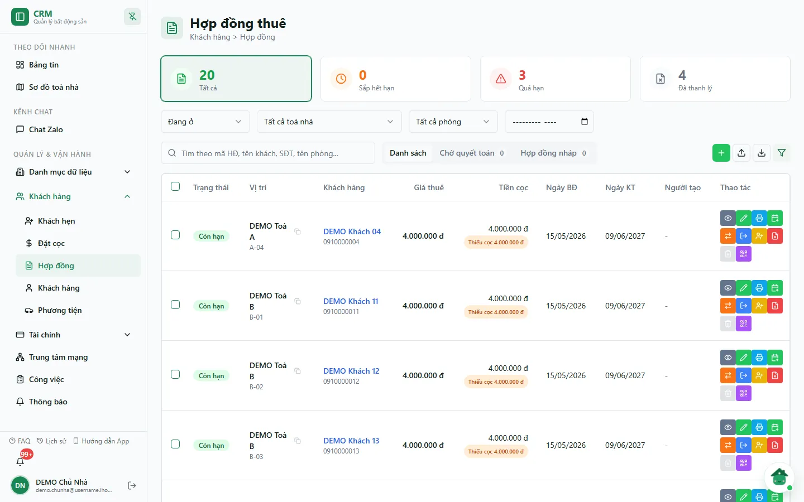
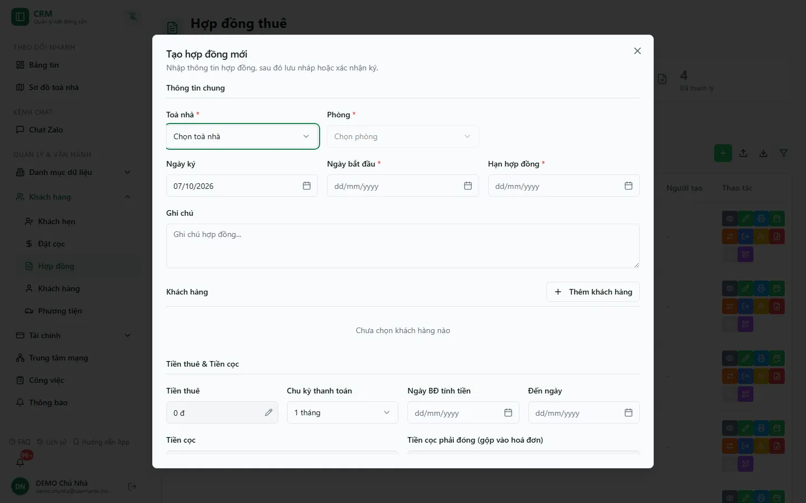
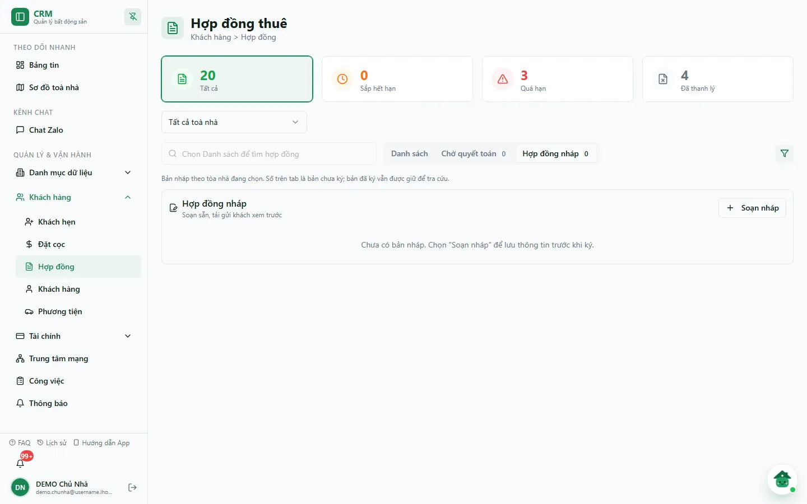
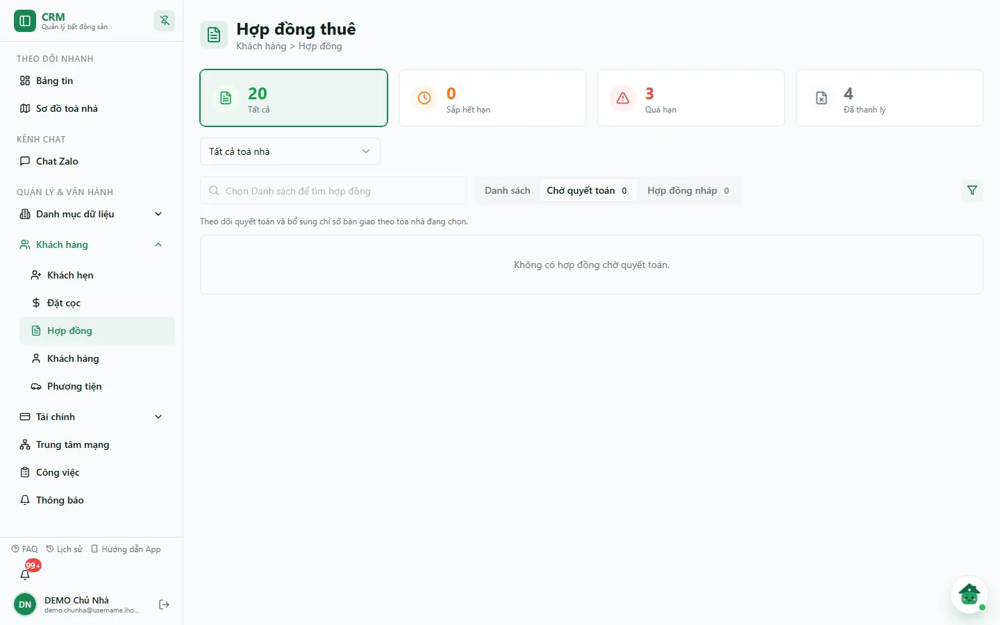

# Hợp đồng — danh sách, nháp & ký mới

Màn **Hợp đồng thuê** là trục vận hành của toàn hệ thống: mỗi hợp đồng nối một **phòng** với một (nhóm) **khách**, chốt **giá thuê**, **tiền cọc**, **dịch vụ** và là gốc sinh ra mọi hoá đơn, công nợ về sau. Tại đây bạn tra cứu hợp đồng đang chạy, đọc ngay hợp đồng nào **đủ cọc** hay **thiếu cọc**, **soạn nháp** gửi khách xem trước, **ký hợp đồng mới**, và theo dõi hai hàng việc của vòng đời: **báo trả phòng** và **hồ sơ chờ quyết toán**.

Điểm cần nắm: một phòng chỉ có **một hợp đồng đang hiệu lực** tại một thời điểm, và **cọc còn thiếu khi ký** được xử lý theo một trong hai cách: gộp vào **hoá đơn tháng đầu** hoặc theo dõi **nợ cọc**.

::: info Điều kiện tiên quyết
- Quyền **Hợp đồng => Xem** (module `contracts`, action `view`) để mở màn.
- Muốn **tạo**, **soạn nháp**, **nhập** hợp đồng: cần quyền **Hợp đồng => Tạo** và có **phạm vi toà** được gán. Sửa nháp cần **Sửa**, in/tải tài liệu nháp cần **In**.
- Muốn **Xuất** Excel: cần quyền **Hợp đồng => Xuất**.
- Đã có sẵn **toà nhà**, **phòng** và **khách hàng**. Nếu chưa, tạo trước theo [Căn hộ / Phòng](/03-quan-ly-van-hanh/can-ho-phong/) và [Cư dân](/03-quan-ly-van-hanh/cu-dan/).
- Là nhân viên, bạn chỉ thấy và thao tác được hợp đồng thuộc các toà trong phạm vi của mình.
:::

## Hướng dẫn từng bước

**Bước 1**: Vào menu **Khách hàng** => **Hợp đồng**. Màn **Hợp đồng thuê** hiện:

- **4 thẻ thống kê** bấm để lọc: **Tất cả** / **Sắp hết hạn** (còn 1–30 ngày) / **Quá hạn** / **Đã thanh lý**.
- Hàng **bộ lọc** (ẩn/hiện bằng biểu tượng phễu **Bộ lọc**): trạng thái (**Tất cả trạng thái** / **Đang ở** / **Thanh lý**), **Tất cả toà nhà**, **Tất cả phòng** (gộp theo tên, đổ theo toà), **Chọn tháng**.
- Ô **Tìm theo mã HĐ, tên khách, SĐT, tên phòng...**, ba tab **Danh sách** / **Chờ quyết toán N** / **Hợp đồng nháp N**, và các nút **+** (tạo hợp đồng), **Nhập**, **Xuất**.
- Bảng với các cột **Trạng thái**, **Vị trí**, **Khách hàng**, **Giá thuê**, **Tiền cọc**, **Ngày BĐ**, **Ngày KT**, **Người tạo**, **Thao tác**.

Trên mỗi dòng: badge trạng thái (**Còn hạn** / **Sắp hết hạn** / **Quá hạn** / **Sắp chuyển đi** / **Đã thanh lý** / **Đã nhượng** / **Nháp**) và dưới cột Tiền cọc là badge cọc (**Đủ cọc**, **Thiếu cọc …** hoặc **Cọc ở HĐ đầu …**). Ô **Vị trí** bấm vào để sao chép ảnh QR của phòng.

**Bước 2**: Lọc và tìm. Ấn một **thẻ thống kê** để lọc nhanh. Chọn **1 toà** ở ô toà nhà; khi đã chọn toà, ô **Phòng** và **Chọn tháng** giúp thu hẹp thêm. Gõ vào ô tìm kiếm để tìm theo **mã hợp đồng**, **tên khách đại diện**, **số điện thoại** hoặc **tên phòng**.

**Bước 3**: Thao tác trên một dòng — cột **Thao tác** có lưới nút (rê chuột để xem tên): **Xem chi tiết**, **Cập nhật**, **In hợp đồng**, **Gia hạn**, **Chuyển phòng**, **ĐK chuyển đi**, **Nhượng HĐ**, **Thanh lý**, **Xóa**, **QR hợp đồng**. Nút ẩn hoặc mờ tuỳ trạng thái hợp đồng và quyền của bạn trên toà. **Xem chi tiết** mở cửa sổ chi tiết ngay trên màn danh sách; trang đầy đủ tại `/contracts/<mã>` xem ở [Trang chi tiết hợp đồng](/03-quan-ly-van-hanh/hop-dong-chi-tiet/).

**Bước 4**: Ký hợp đồng mới — ấn nút **+** màu xanh để mở hộp thoại **Tạo hợp đồng mới**, gồm các phần:

- **Thông tin chung**: **Toà nhà \***, **Phòng \*** (phòng đang có hợp đồng hiệu lực không chọn được), **Ngày ký**, **Ngày bắt đầu \***, **Hạn hợp đồng \***, **Ghi chú**.
- **Khách hàng**: ấn **Thêm khách hàng** để chọn khách, đánh dấu khách đại diện. Chưa có hồ sơ thì tạo mới trong bộ chọn khách (có ô **Đọc CCCD** để dán/kéo thả/chụp ảnh thẻ — xem [cách đọc CCCD](/03-quan-ly-van-hanh/cu-dan/)).
- **Tiền thuê & Tiền cọc**: **Tiền thuê**, **Chu kỳ thanh toán**, **Ngày BĐ tính tiền** / **Đến ngày** (kỳ đầu), **Tiền cọc**, **Tiền cọc phải đóng (gộp vào hoá đơn)**, mục **Đã đặt cọc (khách đã đưa tiền mặt)** với nút **Thêm lần cọc** (mỗi lần: số tiền, sổ quỹ, ngày nhận). Phiếu cọc giữ chỗ cũ của phòng hiện màu xám (chỉ xem; phiếu chưa duyệt ghi "chưa duyệt (chưa tính)"). Khung **Lịch hỗ trợ tiền thuê** mặc định thu gọn ("Chưa có hỗ trợ") — bấm để mở khi cần giảm tiền thuê theo từng giai đoạn (tháng bắt đầu, mức hỗ trợ, người chịu **Toà chịu** / **Sale chịu**, nguồn khấu trừ).
- **Tiền phí dịch vụ**: dịch vụ áp cho hợp đồng; bật **Dùng dịch vụ riêng cho HĐ** nếu khác mặc định của toà.
- **Xem trước hoá đơn cọc + tháng đầu**: các dòng tự sinh (**Mô tả / Đơn giá / Thành tiền**), **Tạm tính**, **Giảm trừ**, **Tổng cộng**; sửa trực tiếp được trước khi lưu.

**Bước 5**: Nếu **Tổng đã đặt cọc** chưa bằng **Tiền cọc**, form hiện khung đỏ "Khách chưa đóng đủ cọc — còn thiếu …" và bắt chọn một cách:

- **Đóng đủ trong hoá đơn** — cọc còn thiếu tính vào hoá đơn tháng đầu, thu cùng hoá đơn (tự tách phiếu cọc khi thu).
- **Nợ cọc** — không vào hoá đơn; nhập **Lý do cho nợ cọc** và **Hẹn bổ sung cọc** để theo dõi, nhắc khách.

**Bước 6**: Ấn **Lưu** (hoặc **Lưu nháp** ở chân form). Hộp **Bạn muốn lưu hợp đồng thế nào?** hỏi:

- **Lưu nháp** — chưa giữ phòng và chưa ghi nhận thu tiền; bản nháp vào tab **Hợp đồng nháp** để soạn tiếp hoặc in gửi khách xem trước.
- **Xác nhận ký** — tạo hợp đồng chính thức khi đã kiểm tra và thống nhất với khách. Sau khi ký, hộp tạo phiếu hoa hồng môi giới có thể mở tiếp (bước riêng).

::: danger Ký hợp đồng là thao tác ghi tiền vào sổ
**Xác nhận ký** tạo hợp đồng, gắn khách, ghi phiếu cọc của các lần cọc đã nhập (vào đúng sổ quỹ bạn chọn), gắn phiếu cọc giữ chỗ của phòng và lập hoá đơn tháng đầu. Kiểm tra lại phòng, khách, giá thuê và cọc trước khi xác nhận. Sau khi lưu, mở hợp đồng để xác nhận phiếu cọc, hoá đơn đầu và trạng thái duyệt/ghi sổ; phiếu **chờ duyệt** chưa phải tiền đã vào quỹ (chỉ **POSTED** mới là tiền thật). Không tạo bù ngay nếu một phần chưa xuất hiện.
:::

**Bước 7**: Làm việc với hợp đồng nháp — mở tab **Hợp đồng nháp**. Khối **Hợp đồng nháp** ("Soạn sẵn, tải gửi khách xem trước") có nút **Soạn nháp** và danh sách bản nháp (khách đại diện, phiên bản, phòng, ngày bắt đầu, thời điểm cập nhật). Mỗi bản nháp có **Sửa nháp**, **In** (chọn mẫu và tải tài liệu của đúng phiên bản), **Xác nhận đã ký**, **Liên kết nhượng** và **Xóa nháp** (chỉ bản chưa ký). Số trên tab là số bản chưa ký; bản đã ký vẫn được giữ để tra cứu.

**Bước 8**: Ký từ bản nháp — ấn **Xác nhận đã ký**. Nếu nội dung nháp đã đổi so với tài liệu đã in, hệ thống yêu cầu lưu và **In hợp đồng** lại trước. Hộp **Xác nhận đã ký và nhận phòng** hiện phiên bản nháp, thời hạn, tiền thuê, cọc thoả thuận và yêu cầu:

- **Ngày nhận phòng thực tế** (khác ngày bắt đầu trên tài liệu thì phải sửa và xuất lại nháp).
- Tích **Khách đã ký đúng tài liệu nháp phiên bản N đã xuất** và **Phòng đã sẵn sàng và được bàn giao cho khách mới**.
- **Chỉ số điện/nước khi bàn giao** của phòng (số đã kiểm tra trên đồng hồ, **Thời điểm đo thực tế**).
- **Nguồn giữ chỗ/cọc của khách**: chọn giữ chỗ đang hiệu lực khớp phòng và khách (cọc đã nhận được chuyển đúng sang hợp đồng, không ghi phiếu cọc lần nữa) hoặc **Không chuyển nguồn giữ chỗ**.
- Nếu cọc còn thiếu: **Theo dõi nợ cọc, bổ sung sau** hoặc **Gộp cọc vào hoá đơn đầu để thu sau**; tích/bỏ **Tạo hoá đơn đầu theo kỳ tính tiền và dịch vụ đã lưu**.

Ấn **Xác nhận đã ký và nhận phòng**. Xong, hộp báo "Đã ghi nhận ký và nhận phòng · (mã hợp đồng)" và cho **Tải hợp đồng đã ký**.

**Bước 9**: Theo dõi báo trả phòng và quyết toán:

- Đầu tab **Danh sách**, khối **Cần xác nhận ngày trả phòng** liệt kê hợp đồng đã đến ngày khách hẹn trả: **Xem hợp đồng** hoặc **Cập nhật ngày trả** (xác nhận thực tế, đổi ngày hoặc hủy báo trả nếu khách ở tiếp).
- Tab **Chờ quyết toán** liệt kê hồ sơ khách đã trả phòng nhưng chưa quyết toán (chọn **Trả phòng, quyết toán sau** khi thanh lý); bấm **Quyết toán** để mở đúng hồ sơ. Khi có hồ sơ thiếu chỉ số bàn giao, tab hiện thêm ô vàng **Chỉ số N** và khối **Chờ bổ sung chỉ số bàn giao** với nút **Mở mốc bàn giao**.

Chi tiết các bước trả phòng/quyết toán xem [Thanh lý — Khách rời phòng](/03-quan-ly-van-hanh/thanh-ly-move-out/) và [Thanh lý — Khách bỏ cọc](/03-quan-ly-van-hanh/thanh-ly-forfeit/).

::: warning Không nhập Excel cho hợp đồng production nếu cần bảo toàn bất biến
Luồng **Nhập** ghi dữ liệu trực tiếp và bỏ qua một số kiểm tra/side effect của luồng tạo chuẩn, gồm nguy cơ nhiều hợp đồng hiệu lực trên cùng phòng và thiếu dữ liệu vòng đời liên quan. Với hợp đồng thật, dùng nút **+**. Chỉ dùng import cho dữ liệu migration đã được kiểm tra, có kế hoạch đối soát riêng và người có thẩm quyền phê duyệt.
:::

## Các tính năng khác trên màn hình

| Nút / Bộ lọc | Công dụng |
| --- | --- |
| Thẻ **Tất cả / Sắp hết hạn / Quá hạn / Đã thanh lý** | Thống kê nhanh; ấn vào để lọc danh sách (tự về tab **Danh sách**). |
| Bộ lọc trạng thái | **Tất cả trạng thái** / **Đang ở** / **Thanh lý**. |
| Ô toà / **Phòng** / **Chọn tháng** | Thu hẹp theo toà, phòng (gộp theo tên) và tháng. Ở tab Chờ quyết toán/Hợp đồng nháp chỉ còn ô toà. |
| Tab **Danh sách** / **Chờ quyết toán** / **Hợp đồng nháp** | Ba vùng làm việc; số trên tab là hồ sơ chờ quyết toán và bản nháp chưa ký. |
| **+** | Mở hộp **Tạo hợp đồng mới**. Cần quyền **Tạo** và phạm vi toà. |
| **Nhập** | Luồng migration ghi trực tiếp; tránh dùng cho hợp đồng production. |
| **Xuất** | Xuất **toàn bộ** hợp đồng theo bộ lọc hiện tại ra Excel. Cần quyền **Xuất**. |
| Lưới nút **Thao tác** | **Xem chi tiết / Cập nhật / In hợp đồng / Gia hạn / Chuyển phòng / ĐK chuyển đi / Nhượng HĐ / Thanh lý / Xóa / QR hợp đồng**. |
| Ô **Vị trí** | Sao chép ảnh QR phòng (kèm nhãn phòng/toà) vào clipboard. |
| Khối **Cần xác nhận ngày trả phòng** | Hợp đồng đã đến ngày hẹn trả; **Cập nhật ngày trả** để xác nhận/đổi/hủy báo trả. |

## Tình huống & lỗi thường gặp

| Tình huống | Cách xử lý |
| --- | --- |
| Danh sách trống dù chắc chắn có hợp đồng | Thường do bộ lọc còn dính giá trị cũ (mặc định trạng thái **Đang ở** ẩn hợp đồng đã thanh lý) hoặc do phạm vi quyền. Chọn **Tất cả trạng thái**, **Tất cả toà nhà** rồi thử lại. |
| Ô tìm kiếm bị mờ "Chọn Danh sách để tìm hợp đồng" | Bạn đang ở tab **Chờ quyết toán** hoặc **Hợp đồng nháp**. Chuyển về tab **Danh sách**. |
| Không thấy nút **+ / Nhập** | Bạn thiếu quyền **Hợp đồng => Tạo** hoặc chưa được gán phạm vi toà nào. |
| Không chọn được phòng khi ký hợp đồng | Phòng đang có hợp đồng **đang hiệu lực** khác. Thanh lý hợp đồng cũ trước, hoặc chọn phòng khác. |
| Bấm **Lưu** nhưng bị chặn vì cọc | Cọc đã nhập chưa đủ mà chưa chọn **Đóng đủ trong hoá đơn** hoặc **Nợ cọc** (nợ cọc phải có lý do và ngày hẹn). |
| Ký từ nháp báo "Nội dung đã đổi hoặc chưa có tài liệu. Cần lưu và in bản nháp trước khi ký." | Nháp đã sửa sau lần in. Lưu nháp, **In** lại đúng phiên bản rồi mới **Xác nhận đã ký**. |
| Nút **Xác nhận đã ký và nhận phòng** mờ | Chưa tích đủ hai xác nhận, chưa nhập/xác minh chỉ số bàn giao, ngày nhận phòng không khớp tài liệu, hoặc nguồn giữ chỗ đã chọn đã đổi — tải lại và chọn lại. |
| Hộp ký báo "Lần ký đã gửi cần được đối chiếu…" | Mạng chập chờn sau khi gửi. Bấm **Đối chiếu lần ký đã gửi**; không bấm ký lại từ đầu. |
| Hợp đồng hiện **Thiếu cọc** dù khách nói đã đóng đủ | Số "đã thu cọc" tính từ **phiếu cọc** đã duyệt gắn hợp đồng. Kiểm tra mục **Tài chính** ở [chi tiết hợp đồng](/03-quan-ly-van-hanh/hop-dong-chi-tiet/) và màn [Đặt cọc](/03-quan-ly-van-hanh/dat-coc/). |
| Hợp đồng **đã gia hạn** nhưng trạng thái vẫn **Còn hạn** | Đúng thiết kế: gia hạn giữ hợp đồng đang hiệu lực, chỉ dời ngày kết thúc; lần gia hạn ghi ở **Lịch sử hợp đồng** của trang chi tiết. |
| Tải danh sách báo lỗi | Ấn **Thử lại** trên khung lỗi; nếu vẫn lỗi, kiểm tra kết nối mạng rồi thử lại sau. |

## Thử trực tiếp trên sandbox

<SandboxTry account="demo.chunha" app-path="/contracts" app-label="Mở màn Hợp đồng" fixtures="Snapshot 07/10/2026: 20 hợp đồng, 0 sắp hết hạn, 3 quá hạn, 4 đã thanh lý; 0 hồ sơ chờ quyết toán, 0 bản nháp." view-only>

Thực hành đọc trạng thái hợp đồng và tình trạng cọc:

1. Ấn thẻ **Quá hạn** và kiểm tra danh sách có 3 hợp đồng; đọc badge **Thiếu cọc** trên từng dòng.
2. Chuyển qua tab **Chờ quyết toán** và **Hợp đồng nháp** để xem hai vùng làm việc (DEMO đang trống).
3. Ấn **+** để xem các phần của hộp **Tạo hợp đồng mới**, rồi ấn **Hủy** — không bấm **Lưu**, **Lưu nháp** hay **Xác nhận ký**.

Kết quả mong đợi: bạn đọc được trạng thái và tình trạng cọc từng hợp đồng, biết nơi soạn nháp, ký và theo dõi quyết toán mà không tạo dữ liệu DEMO nào.

</SandboxTry>

## Quy trình liên quan

- [Trang chi tiết hợp đồng](/03-quan-ly-van-hanh/hop-dong-chi-tiet/) — toàn cảnh một hợp đồng và các nút vòng đời.
- [Gia hạn, chuyển phòng & nhượng hợp đồng](/03-quan-ly-van-hanh/gia-han-chuyen-phong/) — kéo dài thời hạn, đổi phòng hoặc nhượng cho khách mới.
- [Thanh lý — Khách rời phòng](/03-quan-ly-van-hanh/thanh-ly-move-out/) — báo trả phòng, trả phòng và quyết toán.
- [Đặt cọc](/03-quan-ly-van-hanh/dat-coc/) — giữ chỗ và nhận cọc trước khi ký hợp đồng.
- [Hoàn / bỏ cọc](/03-quan-ly-van-hanh/hoan-bo-coc/) — xử lý cọc khi khách rời phòng hoặc bỏ cọc.
- [Quy trình khách thuê](/01-bat-dau/quy-trinh-khach-thue/) — trình tự đầy đủ từ khách tiềm năng đến ký hợp đồng và vận hành.
