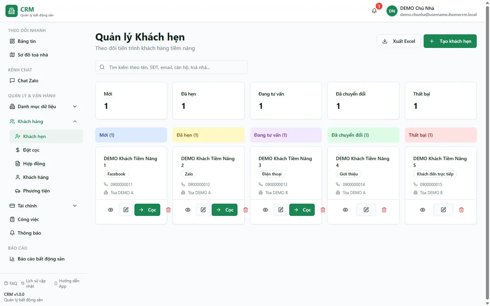
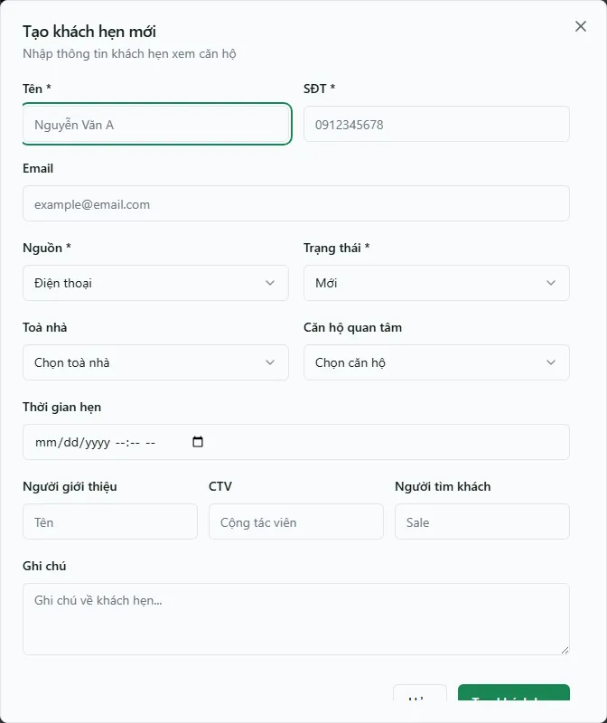

# Khách hẹn (Lead)

Màn **Khách hẹn** (còn gọi là *lead* — khách tiềm năng) là nơi bạn theo dõi từng khách từ lúc mới tiếp cận cho đến khi chốt cọc hoặc rớt. Toàn bộ khách được xếp thành một bảng **Kanban 5 cột** theo giai đoạn phễu sale, để bạn nhìn một cái là biết ai đang ở bước nào và cần chăm sóc tiếp thế nào. Dùng màn này mỗi ngày để nhập khách mới, đặt lịch hẹn xem căn hộ, đẩy khách qua các giai đoạn và cuối cùng **chuyển đổi lead thành đặt cọc**.

Đây là điểm khởi đầu của cả vòng đời khách thuê: **Khách hẹn → Đặt cọc → Hợp đồng → Cư dân**. Xem toàn cảnh quy trình ở trang [Quy trình khách thuê](/01-bat-dau/quy-trinh-khach-thue/).

::: info Điều kiện tiên quyết
- Quyền **Khách hẹn => Xem** (module `leads`, action `view`) để mở màn danh sách.
- Cần quyền **Tạo** để nhập lead mới, **Chuyển đổi** để chuyển lead sang đặt cọc, và **Xuất** để tải danh sách ra Excel.
- Là nhân viên, bạn chỉ thấy và sửa được lead thuộc **toà nhà được gán phạm vi** cho mình (lead có gắn toà). Lead chưa gắn toà đi theo quyền chung của module.
- Nên có sẵn toà nhà và căn hộ trong hệ thống để gắn "Căn hộ quan tâm" cho lead (xem [Căn hộ / Phòng](/03-quan-ly-van-hanh/can-ho-phong/)).
:::

## Hướng dẫn từng bước

**Bước 1**: Tại menu bên trái, ấn chọn **Khách hẹn**. Màn **Quản lý Khách hẹn** hiện bảng Kanban 5 cột, 5 thẻ đếm số lead theo giai đoạn ở đầu trang, ô tìm kiếm và hai nút **Xuất Excel** / **Tạo khách hẹn**.

**Bước 2**: Hiểu 5 giai đoạn của phễu (đọc từ trái sang phải). Mỗi thẻ lead nằm trong đúng một cột theo trạng thái của nó:

| Cột (giai đoạn) | Ý nghĩa |
| --- | --- |
| **Mới** | Khách vừa để lại thông tin, chưa hẹn gặp. |
| **Đã hẹn** | Đã chốt được lịch hẹn xem căn hộ. |
| **Đang tư vấn** | Đang trao đổi, thuyết phục để đi tới quyết định thuê. |
| **Đã chuyển đổi** | Khách đã chốt và được chuyển sang **đặt cọc** (kết thúc phễu, thành công). |
| **Thất bại** | Khách quyết định không thuê (kết thúc phễu, không thành). |

**Bước 3**: Nhập một khách hẹn mới. Ấn nút **Tạo khách hẹn** để mở hộp thoại **Tạo khách hẹn mới**, rồi điền:

- **Tên \*** và **SĐT \*** — bắt buộc.
- **Email** — không bắt buộc (nếu nhập phải đúng định dạng).
- **Nguồn \*** — khách đến từ đâu: **Facebook**, **Zalo**, **Điện thoại**, **Giới thiệu**, **Khách đến trực tiếp**, **Website** hoặc **Khác**.
- **Trạng thái \*** — mặc định **Mới**; giữ nguyên khi vừa tạo.
- **Toà nhà** và **Căn hộ quan tâm** — căn khách đang nhắm tới (chọn toà trước, danh sách căn lọc theo toà). Gắn toà ở đây cũng quyết định nhân viên nào thấy được lead.
- **Thời gian hẹn** — nếu đã có lịch hẹn xem căn hộ, chọn ngày giờ ở đây.
- **Người giới thiệu / CTV / Người tìm khách** — ghi công người mang khách về (cộng tác viên, sale).
- **Ghi chú** — nhu cầu, ngân sách, lưu ý riêng của khách.

Điền xong ấn **Tạo khách hẹn**. Thẻ lead mới xuất hiện ở cột **Mới**.

**Bước 4**: Đặt lịch hẹn xem căn hộ. Mở thẻ lead, ấn **Sửa** để vào hộp thoại **Chỉnh sửa khách hẹn**, điền **Thời gian hẹn**, rồi đổi ô **Trạng thái** sang **Đã hẹn** và ấn **Lưu thay đổi**. Thẻ tự nhảy sang cột **Đã hẹn**.

**Bước 5**: Đẩy lead qua các giai đoạn của phễu. Cách đổi giai đoạn là mở thẻ lead => **Sửa** => đổi ô **Trạng thái** => **Lưu thay đổi**. Ví dụ khi bắt đầu tư vấn thì chuyển sang **Đang tư vấn**.

::: tip Bảng Kanban không kéo-thả
Bạn **không** kéo thẻ giữa các cột được. Muốn đổi giai đoạn, hãy mở thẻ => **Sửa** => đổi ô **Trạng thái**. Đây là điểm hay gây nhầm — thẻ chỉ tự chuyển cột sau khi bạn lưu trạng thái mới.
:::

**Bước 6**: Khi khách đã chốt, tạo khoản cọc chính thức tại màn [Đặt cọc](/03-quan-ly-van-hanh/dat-coc/), kiểm tra phiếu và trạng thái giữ phòng tại đó, rồi quay lại lead => **Sửa** => chuyển **Trạng thái** sang **Đã chuyển đổi**. Đây là luồng nên dùng cho tiền thật.

Nút **Chuyển sang Đặt cọc** trên thẻ lead vẫn mở một hộp thoại cũ với các ô:

- Tích **Tạo khách hàng mới** để tạo hồ sơ khách từ tên + SĐT của lead; hoặc bỏ tích và chọn một khách đã có ở ô **Chọn khách hàng**.
- Chọn **Căn hộ \*** khách thuê.
- Nhập **Số tiền cọc \***, **Ngày đặt cọc \*** và **Giữ căn hộ đến \*** (hạn giữ chỗ).
- **Tạo đặt cọc** — không dùng để ghi nhận khoản cọc chính thức trong vận hành production.

Nếu chỉ cần cập nhật phễu sale, hãy đóng hộp thoại này và đổi trạng thái lead thủ công sau khi cọc chính thức đã được xác nhận ở `/deposits`.

::: danger Không dùng nút legacy để ghi tiền thật
Nút **Tạo đặt cọc** trong hộp thoại lead ghi qua nhiều request riêng vào các bảng legacy. Việc tạo khách, phiếu cọc và đổi trạng thái lead không có một giao dịch nguyên tử chung; lỗi giữa chừng có thể để lại dữ liệu dở dang hoặc trùng với hồ sơ chính thức. Với tiền thật, tạo cọc tại [Đặt cọc](/03-quan-ly-van-hanh/dat-coc/), xác minh phiếu/người nộp/phòng, rồi mới đánh dấu lead **Đã chuyển đổi**.
:::

::: warning "Chuyển sang Đặt cọc" là luồng legacy, không phải nguồn tiền chuẩn
Cọc sinh ra từ nút này tạo hồ sơ người-thuê legacy + phiếu cọc theo nhiều bước riêng, **không** hiển thị ở tab **Phiếu giữ chỗ** của màn [Đặt cọc](/03-quan-ly-van-hanh/dat-coc/) và **không** tạo giữ phòng kỹ thuật. Khi ký hợp đồng bạn còn phải nhập lại hồ sơ khách. Không tạo lại cọc ở cả hai nơi: nếu trước đây đã dùng nút legacy, hãy đối soát phiếu, khách/người nộp và phòng trước khi xử lý tiếp.
:::

::: tip Cọc gộp vào hoá đơn tháng đầu
Sau khi khách đặt cọc và ký hợp đồng, phần cọc còn thiếu (nếu có) sẽ được gộp thành một dòng **Tiền cọc** ngay trong **hoá đơn tháng đầu** của hợp đồng, chứ không thu thành phiếu riêng. Nhờ vậy khoản cọc không bị tính nhầm vào doanh thu. Chi tiết ở trang [Đặt cọc](/03-quan-ly-van-hanh/dat-coc/) và [Hợp đồng](/03-quan-ly-van-hanh/hop-dong/).
:::

**Bước 7**: Đánh dấu lead không thuê. Nếu khách quyết định không thuê, mở thẻ => **Sửa** => đổi **Trạng thái** sang **Thất bại**, ghi lý do vào ô **Ghi chú** để về sau còn tra cứu, rồi **Lưu thay đổi**. Thẻ chuyển sang cột **Thất bại**.

**Bước 8**: Xuất danh sách lead. Ấn **Xuất Excel** (nếu bạn có quyền **Xuất**) để tải toàn bộ danh sách khách hẹn ra file, phục vụ báo cáo hoặc chia việc cho sale.

## Các tính năng khác trên màn hình

| Nút / Bộ lọc | Công dụng |
| --- | --- |
| Ô tìm kiếm | Lọc nhanh theo **tên / SĐT / email / căn hộ / toà nhà**; áp ngay vào cả 5 cột và 5 thẻ đếm. Từ khoá được **giữ lại khi tải lại trang (F5)**. |
| 5 thẻ đếm đầu trang | Đếm số lead ở từng giai đoạn (**Mới / Đã hẹn / Đang tư vấn / Đã chuyển đổi / Thất bại**) theo phạm vi đang tìm kiếm. |
| **Tạo khách hẹn** | Mở hộp thoại nhập lead mới (chỉ hiện khi bạn có quyền **Tạo**). |
| **Xem chi tiết** (trên thẻ lead) | Mở hộp thoại xem đầy đủ liên hệ, nguồn, toà/căn quan tâm, lịch hẹn, ghi chú và nhật ký hoạt động của lead. |
| **Sửa** (trên thẻ lead) | Mở hộp thoại **Chỉnh sửa khách hẹn** — nơi đổi thông tin và đổi **Trạng thái** để chuyển giai đoạn. |
| **Chuyển sang Đặt cọc** (trên thẻ lead) | Mở luồng chuyển đổi legacy; chỉ dùng để nhận diện/kiểm tra, không dùng làm luồng tiền chính thức (xem Bước 6). |
| **Xoá** (trên thẻ lead hoặc trong hộp thoại Sửa) | Ẩn lead khỏi danh sách (xoá mềm), có hỏi xác nhận trước. |
| **Xuất Excel** | Tải danh sách lead ra file Excel (cần quyền **Xuất**). |

## Tình huống & lỗi thường gặp

| Tình huống | Nguyên nhân & cách xử lý |
| --- | --- |
| Kéo thẻ giữa các cột không được | Đúng thiết kế: bảng Kanban chỉ để xem. Đổi giai đoạn bằng cách mở thẻ => **Sửa** => đổi ô **Trạng thái** => **Lưu thay đổi**. |
| Không thấy nút **Tạo khách hẹn** hoặc **Xuất Excel** | Do quyền: nút **Tạo** cần quyền tạo lead, **Xuất Excel** cần quyền xuất. Nhờ quản lý cấp thêm quyền cho tài khoản của bạn. |
| Danh sách trống dù chắc chắn có lead | Nhân viên chỉ thấy lead thuộc toà được gán phạm vi. Kiểm tra lại phân quyền toà, và kiểm tra ô tìm kiếm còn dính từ khoá cũ (từ khoá giữ qua F5). |
| Không chọn được **Căn hộ quan tâm** | Chọn **Toà nhà** trước; danh sách căn hộ chỉ đổ ra sau khi đã chọn toà. |
| Lead đã xoá vẫn xuất hiện lại trên bảng | Đây là khoảng trống đã biết: thao tác xoá mềm ghi `deleted_at`, nhưng truy vấn danh sách hiện chưa luôn loại bản ghi đã xoá. Không xoá lặp lại để "thử"; ghi nhận mã/tên lead và báo quản trị kỹ thuật đối soát. |
| Đã chuyển đổi nhưng không thấy cọc ở màn **Đặt cọc** | Cọc từ nút **Chuyển sang Đặt cọc** đi theo cơ chế cũ, không hiện ở tab **Phiếu giữ chỗ** của /deposits (xem cảnh báo ở Bước 6). Muốn có cọc giữ chỗ chính thức, tạo cọc trực tiếp ở màn [Đặt cọc](/03-quan-ly-van-hanh/dat-coc/). |
| Cần thêm lịch hẹn nhưng không thấy ô ngày | Ô **Thời gian hẹn** nằm trong hộp thoại **Tạo khách hẹn mới** / **Chỉnh sửa khách hẹn** — mở form Sửa của lead để nhập. |

## Thử trực tiếp trên sandbox

<SandboxTry account="demo.chunha" app-path="/leads" app-label="Mở màn Khách hẹn" fixtures="Snapshot 13/08/2026: pipeline đang rỗng." view-only>

Pipeline hiện không có lead. Bài này chỉ dùng để định vị năm giai đoạn và các điều khiển:

1. Đọc năm cột **Mới / Đã hẹn / Đang tư vấn / Đã chuyển đổi / Thất bại** và empty state.
2. Nhận diện nút **Tạo khách hẹn**, ô tìm kiếm và bộ lọc; không tạo hoặc chuyển đổi lead trong bài quan sát.
3. Ấn **Tạo khách hẹn** để xem cấu trúc form, rồi đóng bằng **Hủy**; không điền hoặc lưu dữ liệu.
4. Khi có lead thật, mở bản ghi đang hiển thị và cập nhật trạng thái theo tiến độ sale thay vì dùng tên/số điện thoại fixture. Luồng tiền chính thức vẫn nằm ở màn [Đặt cọc](/03-quan-ly-van-hanh/dat-coc/).

Kết quả mong đợi: bạn nắm được phễu lead và hiểu rõ hai việc tách biệt: khoản cọc chính thức được tạo/đối soát ở `/deposits`, còn trạng thái **Đã chuyển đổi** của lead được cập nhật sau khi xác nhận nghiệp vụ đó.

</SandboxTry>

## Quy trình liên quan

- [Quy trình khách thuê](/01-bat-dau/quy-trinh-khach-thue/) — toàn cảnh vòng đời: Khách hẹn → Cọc → Hợp đồng → Cư dân.
- [Đặt cọc](/03-quan-ly-van-hanh/dat-coc/) — bước tiếp theo sau khi chuyển đổi lead; tạo và theo dõi phiếu giữ chỗ chính thức.
- [Hợp đồng](/03-quan-ly-van-hanh/hop-dong/) — ký hợp đồng cho khách đã cọc; cọc còn thiếu gộp vào hoá đơn tháng đầu.
- [Cư dân](/03-quan-ly-van-hanh/cu-dan/) — hồ sơ khách hàng chính thức sau khi ký hợp đồng.
- [Căn hộ / Phòng](/03-quan-ly-van-hanh/can-ho-phong/) — chọn căn hộ khách quan tâm và xem tình trạng phòng.
