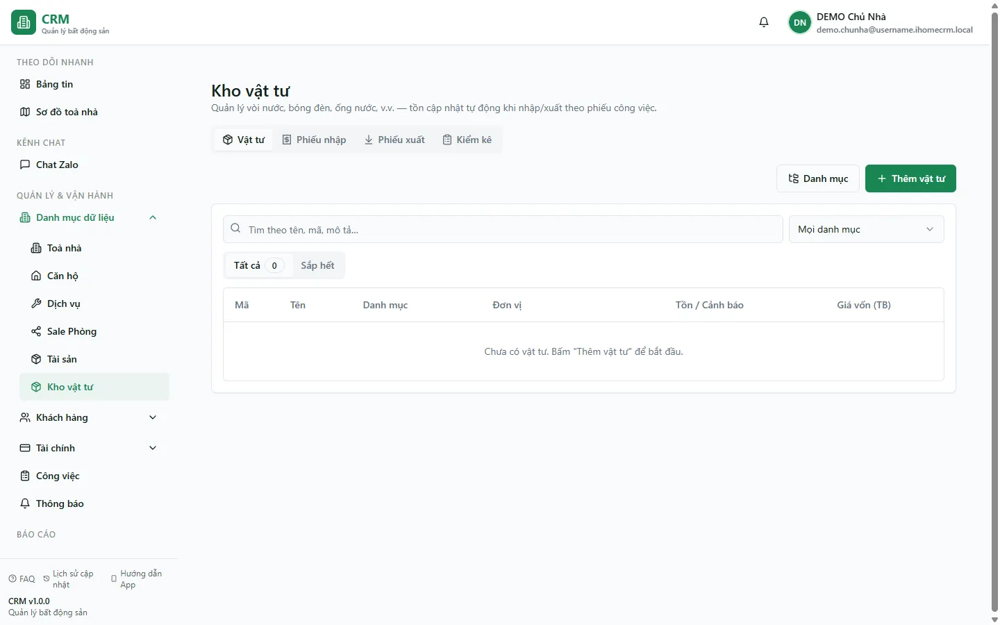

# Kho vật tư

Kho vật tư là nơi bạn theo dõi **vật tư tiêu hao** dùng cho bảo trì, sửa chữa toà nhà (bóng đèn, vòi nước, ống nước, sơn, keo…) — khác với **Tài sản** vốn theo dõi thiết bị có giá trị. Toàn hệ thống dùng **một kho chung duy nhất cho cả chuỗi**: mọi toà nhà chung một danh mục vật tư và một con số tồn kho, không tách theo toà. Mỗi loại vật tư có **tồn hiện tại** và **giá vốn trung bình** — hai con số này hệ thống **tự tính**, bạn không gõ tay; chúng chỉ thay đổi khi bạn lập một trong **ba loại phiếu**: phiếu **nhập** (cộng tồn), phiếu **xuất** (trừ tồn), và phiếu **kiểm kê** (điều chỉnh tồn cho khớp thực đếm). Trang này hướng dẫn bạn xem tồn kho, đặt ngưỡng cảnh báo tồn thấp, và lập ba loại phiếu đó.

::: info Điều kiện tiên quyết
- Quyền **Kho vật tư => Xem** (module `materials`, action `view`) để mở màn; quyền **Tạo / Sửa / Xoá** tương ứng để lập, sửa và xoá phiếu.
- Quyền kho vật tư là quyền **cấp tổ chức, không chia theo toà nhà** (đúng tinh thần "1 kho chung"). Ai không có quyền sẽ **không thấy** mục Kho vật tư trên menu.
- Quyền này **không tự đi kèm** các vai trò hệ thống cũ — chủ nhà phải tick riêng ở trang [Phân quyền](/05-cai-dat/phan-quyen/) (mục **Vật tư**, nhóm "Tài sản & Kho").
- Muốn gắn phiếu xuất vào một công việc cần thao tác bên [Công việc](/03-quan-ly-van-hanh/cong-viec/); muốn chọn nhà cung cấp trên phiếu nhập thì nhà cung cấp phải có sẵn trong [danh mục NCC](/05-cai-dat/nha-cung-cap/).
:::

## Hướng dẫn từng bước

**Bước 1**: Vào menu **Kho vật tư** (nhóm **Danh mục dữ liệu**). Màn mở ra với **4 tab**: **Vật tư** / **Phiếu nhập** / **Phiếu xuất** / **Kiểm kê**. Snapshot production ngày 13/08/2026 của tài khoản DEMO đang rỗng; khi có dữ liệu, tab **Vật tư** liệt kê từng loại cùng tồn kho.

**Bước 2**: Đọc bảng tồn kho. Mỗi dòng cho biết **Mã**, **Tên**, **Danh mục**, **Đơn vị**, **Tồn** (hiển thị bằng nhãn màu) và **Giá vốn TB** (giá vốn trung bình). Nhãn tồn có **3 mức**: **Hết hàng** (tồn ≤ 0, đỏ), **Sắp hết** (tồn ≤ ngưỡng cảnh báo, vàng) và **Còn** (xám). Dùng hai sub-tab **Tất cả** / **Sắp hết** để lọc nhanh những vật tư cần nhập thêm — vật tư vào nhóm "Sắp hết" khi **Tồn ≤ Ngưỡng cảnh báo** (`reorder_level`) mà bạn đặt cho nó.

**Bước 3**: Thêm hoặc sửa một vật tư — ấn **Thêm vật tư**. Tại form, điền:
- **Mã** (tuỳ chọn): mã vật tư do **bạn tự đặt** (ví dụ `BD-LED-9W`) — khác với mã phiếu, hệ thống không tự sinh mã vật tư.
- **Tên** (bắt buộc) và **Danh mục** (chọn từ danh sách nhóm; mở panel **Danh mục** để thêm/sửa nhóm như Đèn, Vòi nước…).
- **Đơn vị** (bắt buộc, mặc định **cái**) và **Ngưỡng cảnh báo** — số tồn mà từ đó trở xuống vật tư bị đánh dấu "Sắp hết".

Ấn **Lưu**. Lưu ý: form **không có ô nhập Tồn hay Giá vốn** — hai con số đó do hệ thống tính từ các phiếu, không khai tay.

Mã vật tư không có ràng buộc duy nhất ở cơ sở dữ liệu. Hệ thống vẫn có thể lưu hai vật tư trùng mã, nên hãy tự đặt mã không trùng trong kho chung để tìm kiếm và chọn dòng chính xác.

::: warning Tồn và giá vốn là số dẫn xuất — đừng tìm cách sửa tay
**Tồn** và **Giá vốn TB** chỉ thay đổi khi bạn lập phiếu **nhập / xuất / kiểm kê**. Không có chỗ nào chỉnh trực tiếp hai con số này, và bạn không nên tìm cách "ép" chúng cho khớp. Muốn tồn đúng thì lập phiếu kiểm kê; muốn giá vốn đúng thì lập phiếu nhập với đơn giá đúng.
:::

**Bước 4**: Nhập kho — sang tab **Phiếu nhập** và ấn **Tạo phiếu nhập**. Tại form:
1. Chọn **Ngày nhập** và **Nhà cung cấp** (chọn từ danh mục NCC có sẵn).
2. Thêm một hay nhiều **dòng**, mỗi dòng gồm **Vật tư**, **Số lượng** và **Đơn giá**; thành tiền mỗi dòng và **tổng phiếu** tự tính.
3. Ấn **Lưu**. Hệ thống sinh mã phiếu **MP-…**, **cộng số lượng vào tồn** và **cập nhật lại giá vốn trung bình** của các vật tư trong phiếu.

::: warning Nhập kho KHÔNG tự ghi phiếu chi tiền
Lập phiếu nhập chỉ làm tăng **tồn kho** và cập nhật **giá vốn** — nó **không** tạo phiếu chi, **không** trừ tiền sổ quỹ, và **không** vào báo cáo lợi nhuận/dòng tiền. Nếu bạn muốn ghi nhận khoản **tiền thật đã trả** để mua vật tư, hãy lập một **phiếu chi** riêng bên [Thu chi](/03-quan-ly-van-hanh/thu-chi/). Đây là hai việc tách rời nhau.
:::

**Bước 5**: Xuất kho — có **hai cách**:
- **Gắn công việc**: khi khai vật tư đã dùng cho một [công việc](/03-quan-ly-van-hanh/cong-viec/) bảo trì (trong dialog **Chi tiết công việc** hoặc ngay khi tạo công việc mới). Mỗi công việc gắn được **nhiều nhất một phiếu xuất**; cách này giúp quy chi phí vật tư về từng công việc.
- **Tạo tay, không gắn công việc**: ở tab **Phiếu xuất**, ấn **Tạo phiếu xuất**, chọn **Ngày xuất**, thêm các dòng vật tư + số lượng rồi **Lưu**.

Cả hai cách đều sinh mã **MU-…** và **trừ số lượng khỏi tồn**. Khi số lượng xuất **vượt tồn hiện có**, hệ thống chỉ **cảnh báo (viền vàng)** chứ **không chặn** — tồn có thể xuống số âm nếu bạn cứ lưu.

**Bước 6**: Kiểm kê / điều chỉnh tồn — sang tab **Kiểm kê**, ấn **Tạo phiếu kiểm kê**. Chọn một trong ba chế độ:
- **SET** (mặc định): nhập **tồn thực đếm được** cho từng vật tư; hệ thống tự tính chênh lệch so với tồn hiện tại và ghi đúng phần bù/trừ.
- **IN**: **cộng thêm** vào tồn (tìm thấy hàng thừa).
- **OUT**: **trừ bớt** tồn (hàng hỏng, mất).

Ấn **Lưu**. Hệ thống sinh mã **MA-…** và điều chỉnh tồn. Kiểm kê **chỉ đổi tồn, không đổi giá vốn** — giá vốn trung bình chỉ thay đổi qua phiếu nhập.

::: warning Chế độ SET dùng ngày hôm nay và tồn đang hiển thị
Ở chế độ **SET**, chênh lệch được tính từ con số tồn **đang hiển thị trên màn** (có thể cũ nếu người khác vừa nhập/xuất), và phiếu điều chỉnh luôn ghi **ngày hôm nay** — ô "Ngày kiểm kê" bạn chọn chỉ ghi vào phần lý do, không phải ngày phiếu. Nếu cần ngày phiếu đúng theo ngày bạn chọn, hãy dùng chế độ **IN** hoặc **OUT**. Trước khi SET một loạt, nên tải lại trang để tồn hiển thị là mới nhất.
:::

## Các tính năng khác trên màn hình

| Nút / Bộ lọc | Công dụng |
| --- | --- |
| 4 tab **Vật tư / Phiếu nhập / Phiếu xuất / Kiểm kê** | Chuyển giữa danh mục tồn kho và ba loại phiếu; mỗi tab có URL riêng (chia sẻ link trực tiếp được). |
| Sub-tab **Tất cả / Sắp hết** | Lọc nhanh vật tư còn đủ hay đã chạm ngưỡng cảnh báo tồn thấp. |
| Ô **tìm kiếm** (tab Vật tư) | Lọc theo tên / mã / mô tả vật tư; ô tìm và bộ lọc danh mục được **giữ lại khi tải lại trang (F5)**. |
| Bộ lọc **Danh mục** | Combobox gõ-để-tìm, lọc vật tư theo nhóm. |
| Panel **Danh mục** (gập/mở) | Thêm, sửa, xoá các nhóm vật tư (Đèn, Vòi nước…). Không xoá được nhóm còn vật tư đang dùng. |
| Nhãn tồn (**Hết hàng / Sắp hết / Còn**) | Màu hoá mức tồn so với ngưỡng cảnh báo của từng vật tư. |
| Nhãn **IN / OUT** (tab Kiểm kê) | Phân biệt phiếu điều chỉnh cộng tồn (IN, xanh) và trừ tồn (OUT, đỏ). |
| Cột **Người tạo** (tab Phiếu xuất) | Cho biết ai lập phiếu xuất và lúc nào; phiếu không gắn công việc hiện nhãn "(không gắn job)". |
| **Mở rộng dòng** (expand) | Bung một phiếu để xem chi tiết từng dòng vật tư, số lượng và giá vốn lúc xuất. |
| **Xoá vật tư** | Xoá mềm — vật tư biến khỏi danh sách nhưng **lịch sử phiếu vẫn giữ nguyên**. |
| **Xoá phiếu** | Xoá phiếu nhập/xuất/kiểm kê; hệ thống **tự tính lại tồn** cho các vật tư liên quan. |
| Dropdown **Nhà cung cấp** (form phiếu nhập) | Chỉ **chọn** từ danh mục có sẵn — hiện chưa có màn tạo NCC mới trong ứng dụng. |

## Tình huống & lỗi thường gặp

| Tình huống | Cách xử lý |
| --- | --- |
| Không thấy mục **Kho vật tư** trên menu | Bạn chưa có quyền `materials`. Quyền này **không tự kèm** vai trò cũ — nhờ chủ nhà bật ở [Phân quyền](/05-cai-dat/phan-quyen/), mục **Vật tư**. |
| Tồn kho của một vật tư ra **số âm** | Do đã xuất **vượt tồn** — hệ thống chỉ cảnh báo, không chặn. Lập phiếu **nhập** để bù, hoặc phiếu **kiểm kê** để đặt lại tồn đúng. |
| **Giá vốn TB không đổi** sau khi kiểm kê hay xuất | Đúng thiết kế: giá vốn **chỉ** thay đổi qua phiếu **nhập**. Kiểm kê/xuất chỉ đổi số lượng tồn. |
| Nhập kho rồi mà **sổ quỹ không thấy tiền ra** | Đúng: phiếu nhập **không** sinh phiếu chi. Muốn ghi tiền đã trả, lập **phiếu chi** riêng bên [Thu chi](/03-quan-ly-van-hanh/thu-chi/). |
| Con số ở sub-tab **Tất cả** nhỏ hơn tổng vật tư | Con số đó đếm theo **danh sách sau khi lọc** (đang ở "Sắp hết" hoặc đang gõ tìm kiếm). Xoá ô tìm và về "Tất cả" để thấy tổng thật. |
| Phiếu **SET** ghi **ngày hôm nay** thay vì ngày tôi chọn | Đúng hành vi của chế độ SET (ngày chọn chỉ vào phần lý do). Muốn giữ đúng ngày, dùng chế độ **IN** hoặc **OUT**. |
| Xoá một **công việc** xong thấy **tồn tăng lại** | Xoá công việc kéo theo xoá phiếu xuất gắn nó → hệ thống **cộng trả tồn** dù vật tư đã dùng thật. Cân nhắc kỹ trước khi xoá công việc có phiếu xuất. |
| Không **sửa** được phiếu xuất tay hay phiếu kiểm kê | Đúng: hai loại này chỉ **tạo / xoá**, không có nút sửa. Xoá rồi lập lại nếu cần đổi. |
| **Không tạo được nhà cung cấp mới** trên phiếu nhập | Ứng dụng hiện chưa có màn tạo NCC — nhờ quản trị thêm nhà cung cấp vào [danh mục NCC](/05-cai-dat/nha-cung-cap/) trước. |

## Thử trực tiếp trên sandbox

<SandboxTry account="demo.chunha" app-path="/materials" app-label="Mở màn Kho vật tư" fixtures="Snapshot 13/08/2026: bốn tab đang rỗng." view-only>

Quan sát cấu trúc kho mà không lập phiếu:

1. Chuyển qua **Vật tư / Phiếu nhập / Phiếu xuất / Kiểm kê** và đọc empty state của từng tab.
2. Nhận diện bộ lọc, cột tồn và các nút tạo phiếu; không mở/lưu phiếu trong bài quan sát.
3. Ghi nhớ phiếu kho và phiếu tiền là hai nghiệp vụ tách rời; khi có mua vật tư thật phải ghi tiền riêng ở Thu chi.

Kết quả mong đợi: bạn hiểu rằng tồn kho là con số **dẫn xuất** — chỉ thay đổi khi lập phiếu nhập / xuất / kiểm kê — và nhập kho không đụng tới sổ quỹ.

</SandboxTry>

## Quy trình liên quan

- [Công việc](/03-quan-ly-van-hanh/cong-viec/) — gắn phiếu xuất vật tư vào từng công việc bảo trì để quy chi phí.
- [Tài sản](/03-quan-ly-van-hanh/tai-san/) — theo dõi thiết bị có giá trị (máy lạnh, tủ lạnh…); dùng chung danh mục nhà cung cấp với kho vật tư.
- [Nhà cung cấp](/05-cai-dat/nha-cung-cap/) — danh mục NCC mà phiếu nhập kho và tài sản cùng dùng.
- [Thu chi](/03-quan-ly-van-hanh/thu-chi/) — lập phiếu chi để ghi nhận tiền thật đã trả khi mua vật tư (kho không tự sinh phiếu chi).
