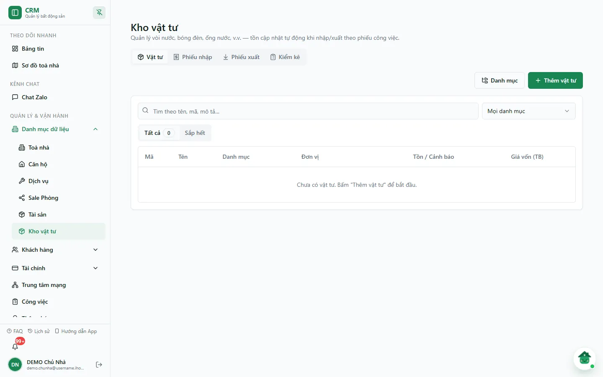
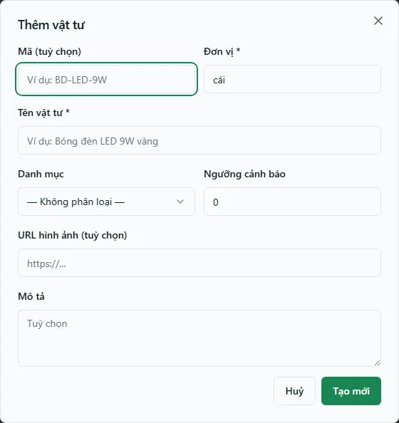
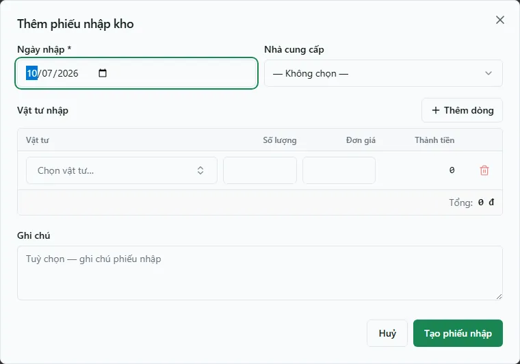
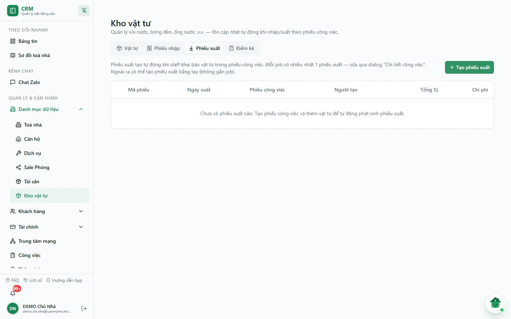
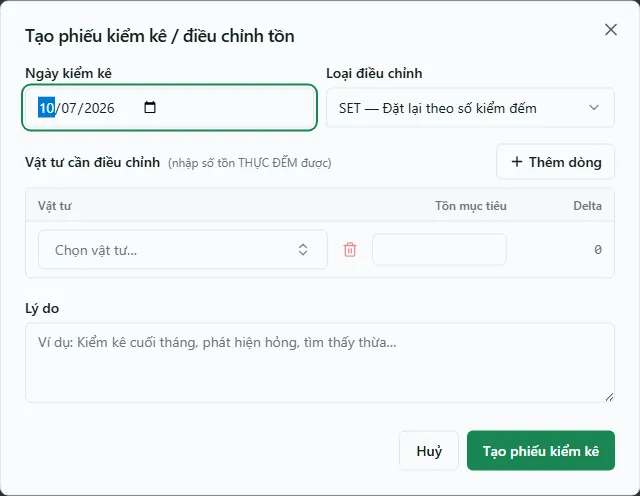

# Kho vật tư

Kho vật tư là nơi bạn theo dõi **vật tư tiêu hao** dùng cho bảo trì, sửa chữa toà nhà (bóng đèn, vòi nước, ống nước, sơn, keo…) — khác với **Tài sản** vốn theo dõi thiết bị có giá trị. Toàn hệ thống dùng **một kho chung duy nhất cho cả công ty**: mọi toà nhà chung một danh mục vật tư và một con số tồn kho, không tách theo toà. Mỗi loại vật tư có **tồn hiện tại** và **giá vốn trung bình** — hai con số này hệ thống **tự tính**, bạn không gõ tay; chúng chỉ thay đổi khi bạn lập một trong **ba loại phiếu**: phiếu **nhập** (cộng tồn), phiếu **xuất** (trừ tồn), và phiếu **kiểm kê** (điều chỉnh tồn cho khớp thực đếm).

Cả bốn phần nằm trên **một màn** với bốn tab, mỗi tab có đường dẫn riêng để chia sẻ link trực tiếp:

| Tab | Đường dẫn | Nội dung |
| --- | --- | --- |
| **Vật tư** | `/materials` | Danh mục vật tư, tồn kho, giá vốn TB, danh mục nhóm |
| **Phiếu nhập** | `/materials/purchases` | Phiếu nhập kho (cộng tồn, cập nhật giá vốn) |
| **Phiếu xuất** | `/materials/usages` | Phiếu xuất kho, gắn công việc hoặc tạo tay |
| **Kiểm kê** | `/materials/adjustments` | Phiếu kiểm kê / điều chỉnh tồn |

::: info Điều kiện tiên quyết
- Quyền **Vật tư => Xem** (module `materials`, action `view`) để mở màn; quyền **Tạo / Sửa / Xoá** tương ứng để lập, sửa và xoá phiếu.
- Quyền kho vật tư là quyền **cấp tổ chức, không chia theo toà nhà** (đúng tinh thần "1 kho chung"). Ai không có quyền sẽ **không thấy** mục **Kho vật tư** trên menu.
- Quyền này **không tự đi kèm** các vai trò hệ thống cũ — chủ nhà phải tick riêng ở trang [Phân quyền](/05-cai-dat/phan-quyen/) (mục **Vật tư**, nhóm "Tài sản & Kho").
- Muốn gắn phiếu xuất vào một công việc cần thao tác bên [Công việc](/03-quan-ly-van-hanh/cong-viec/); muốn chọn nhà cung cấp trên phiếu nhập thì nhà cung cấp phải có sẵn trong [danh mục NCC](/05-cai-dat/nha-cung-cap/).
:::

## Hướng dẫn từng bước

**Bước 1**: Vào menu **Danh mục dữ liệu** => **Kho vật tư**. Màn mở tab **Vật tư** với nút **Danh mục**, nút **Thêm vật tư**, ô **Tìm theo tên, mã, mô tả…**, ô lọc **Mọi danh mục** và hai tab phụ **Tất cả / Sắp hết**. Ảnh chụp ngày 07/10/2026 của tài khoản DEMO: kho đang **trống** ("Chưa có vật tư. Bấm "Thêm vật tư" để bắt đầu.").

**Bước 2**: Đọc bảng tồn kho. Mỗi dòng cho biết **Mã**, **Tên**, **Danh mục**, **Đơn vị**, **Tồn / Cảnh báo** (nhãn màu) và **Giá vốn (TB)**. Nhãn tồn có **3 mức**: **Hết hàng** (tồn ≤ 0, đỏ), **Sắp hết: N / ngưỡng M** (tồn ≤ ngưỡng cảnh báo, vàng) và **Còn N** (xám). Tab phụ **Sắp hết** (kèm số đỏ khi có) lọc nhanh những vật tư cần nhập thêm — vật tư vào nhóm này khi **Tồn ≤ Ngưỡng cảnh báo** bạn đặt cho nó.

**Bước 3**: Thêm hoặc sửa một vật tư — ấn **Thêm vật tư**. Tại hộp thoại, điền:

- **Mã (tuỳ chọn)**: mã vật tư do **bạn tự đặt** (ví dụ `BD-LED-9W`) — hệ thống không tự sinh mã vật tư.
- **Đơn vị \*** (mặc định **cái**) và **Tên vật tư \*** (ví dụ "Bóng đèn LED 9W vàng").
- **Danh mục** (mặc định **— Không phân loại —**) và **Ngưỡng cảnh báo** — số tồn mà từ đó trở xuống vật tư bị đánh dấu "Sắp hết".
- (Tuỳ chọn) **URL hình ảnh** và **Mô tả**.

Ấn **Tạo mới** (khi sửa vật tư, nút này là **Cập nhật**). Lưu ý: form **không có ô nhập Tồn hay Giá vốn** — hai con số đó do hệ thống tính từ các phiếu.

Muốn gom nhóm, bấm nút **Danh mục** để mở khung **Danh mục vật tư**: **Thêm danh mục**, hoặc bấm biểu tượng ba chấm trên từng nhóm để **Sửa / Xoá**. Không xoá được danh mục còn vật tư đang dùng.

Mã vật tư không có ràng buộc duy nhất ở cơ sở dữ liệu. Hệ thống vẫn có thể lưu hai vật tư trùng mã, nên hãy tự đặt mã không trùng trong kho chung để tìm kiếm và chọn dòng chính xác.

::: warning Tồn và giá vốn là số dẫn xuất — đừng tìm cách sửa tay
**Tồn** và **Giá vốn TB** chỉ thay đổi khi bạn lập phiếu **nhập / xuất / kiểm kê**. Không có chỗ nào chỉnh trực tiếp hai con số này. Muốn tồn đúng thì lập phiếu kiểm kê; muốn giá vốn đúng thì lập phiếu nhập với đơn giá đúng.
:::

**Bước 4**: Nhập kho — sang tab **Phiếu nhập** (bảng gồm **Mã phiếu**, **Ngày nhập**, **Nhà cung cấp**, **Tổng tiền**, **Ghi chú**) và ấn **Thêm phiếu nhập**. Tại hộp thoại **Thêm phiếu nhập kho**:

1. Chọn **Ngày nhập \*** và **Nhà cung cấp** (chọn từ danh mục có sẵn, hoặc để **— Không chọn —**).
2. Ở **Vật tư nhập**, bấm **Thêm dòng** để thêm một hay nhiều dòng, mỗi dòng gồm **Vật tư**, **Số lượng** và **Đơn giá**; **Thành tiền** từng dòng và **Tổng** phiếu tự tính.
3. (Tuỳ chọn) ghi **Ghi chú**, rồi ấn **Tạo phiếu nhập**. Hệ thống sinh mã phiếu **MP-…**, **cộng số lượng vào tồn** và **cập nhật lại giá vốn trung bình** của các vật tư trong phiếu.

Phiếu nhập đã lập có thể **Sửa** hoặc **Xoá** qua biểu tượng ba chấm cuối dòng; tồn và giá vốn được tính lại theo phiếu sau khi sửa/xoá.

::: warning Nhập kho KHÔNG tự ghi phiếu chi tiền
Lập phiếu nhập chỉ làm tăng **tồn kho** và cập nhật **giá vốn** — nó **không** tạo phiếu chi, **không** trừ tiền sổ quỹ, và **không** vào báo cáo lợi nhuận/dòng tiền. Nếu bạn muốn ghi nhận khoản **tiền thật đã trả** để mua vật tư, hãy lập một **phiếu chi** riêng bên [Thu chi](/03-quan-ly-van-hanh/thu-chi/); khoản đó chỉ thành tiền ra sổ quỹ khi phiếu chi được ghi sổ (**Đã Chi**). Đây là hai việc tách rời nhau.
:::

**Bước 5**: Xuất kho — tab **Phiếu xuất** (bảng gồm **Mã phiếu**, **Ngày xuất**, **Phiếu công việc**, **Người tạo**, **Tổng SL**, **Chi phí**). Có **hai cách** xuất:

- **Gắn công việc**: khai vật tư khi **Thêm công việc**, hoặc ở phần **Vật tư đã sử dụng** trong **Chi tiết công việc** rồi bấm **Lưu vật tư**. Mỗi công việc gắn được **nhiều nhất một phiếu xuất** — muốn đổi thì sửa qua Chi tiết công việc. Cách này giúp quy chi phí vật tư về từng công việc.
- **Tạo tay, không gắn công việc**: ở tab **Phiếu xuất**, ấn **Tạo phiếu xuất**; trong hộp thoại **Tạo phiếu xuất kho**, chọn **Ngày xuất \***, thêm các dòng **Vật tư xuất** + số lượng, ghi **Ghi chú** (lý do xuất) rồi lưu. Cột **Phiếu công việc** của phiếu này hiện "(không gắn job)".

Cả hai cách đều sinh mã **MU-…** và **trừ số lượng khỏi tồn**. Khi số lượng xuất **vượt tồn hiện có**, hệ thống chỉ **cảnh báo (viền vàng)** chứ **không chặn** — tồn có thể xuống số âm nếu bạn cứ lưu.

**Bước 6**: Kiểm kê / điều chỉnh tồn — sang tab **Kiểm kê** (bảng gồm **Mã phiếu**, **Ngày**, **Loại**, **Lý do**), ấn **Tạo phiếu kiểm kê**. Hộp thoại **Tạo phiếu kiểm kê / điều chỉnh tồn** có ô **Ngày kiểm kê**, **Loại điều chỉnh** với ba chế độ:

- **SET — Đặt lại theo số kiểm đếm** (mặc định): nhập **Tồn mục tiêu** (số thực đếm được) cho từng vật tư; cột **Delta** cho thấy chênh lệch so với tồn hiện tại, hệ thống ghi đúng phần bù/trừ.
- **IN — Nhập thêm** (ví dụ tìm thấy hàng thừa): **cộng thêm** vào tồn.
- **OUT — Xuất bớt** (ví dụ hỏng, mất): **trừ bớt** tồn.

Thêm dòng bằng **Thêm dòng**, ghi **Lý do** rồi ấn **Tạo phiếu kiểm kê**. Hệ thống sinh mã **MA-…** và điều chỉnh tồn. Kiểm kê **chỉ đổi tồn, không đổi giá vốn** — giá vốn trung bình chỉ thay đổi qua phiếu nhập.

::: warning Chế độ SET dùng tồn đang hiển thị và ngày hôm nay
Ở chế độ **SET**, chênh lệch được tính từ con số tồn **đang hiển thị trên màn** (có thể cũ nếu người khác vừa nhập/xuất), và phiếu điều chỉnh ghi theo **ngày hôm nay** — ô **Ngày kiểm kê** chỉ được đưa vào phần lý do khi bạn để trống ô **Lý do**. Nếu cần ngày phiếu đúng theo ngày bạn chọn, hãy dùng chế độ **IN** hoặc **OUT**. Trước khi SET một loạt, nên tải lại trang để tồn hiển thị là mới nhất.
:::

## Các tính năng khác trên màn hình

| Nút / Bộ lọc | Công dụng |
| --- | --- |
| 4 tab **Vật tư / Phiếu nhập / Phiếu xuất / Kiểm kê** | Chuyển giữa danh mục tồn kho và ba loại phiếu; mỗi tab có đường dẫn riêng (`/materials`, `/materials/purchases`, `/materials/usages`, `/materials/adjustments`). |
| Tab phụ **Tất cả / Sắp hết** | Lọc nhanh vật tư còn đủ hay đã chạm ngưỡng cảnh báo tồn thấp. |
| Ô **Tìm theo tên, mã, mô tả…** (tab Vật tư) | Lọc vật tư; ô tìm, bộ lọc danh mục và tab phụ Tất cả/Sắp hết được **giữ lại khi tải lại trang (F5)**. |
| Ô lọc **Mọi danh mục** | Ô gõ-để-tìm, lọc vật tư theo nhóm. |
| Nút **Danh mục** (gập/mở) | Mở khung **Danh mục vật tư** để thêm, sửa, xoá nhóm (Đèn, Vòi nước…). Không xoá được nhóm còn vật tư đang dùng. |
| Nhãn tồn (**Hết hàng / Sắp hết / Còn**) | Màu hoá mức tồn so với ngưỡng cảnh báo của từng vật tư. |
| Nhãn **IN / OUT** (tab Kiểm kê) | Phân biệt phiếu điều chỉnh cộng tồn (IN) và trừ tồn (OUT). |
| Cột **Người tạo** (tab Phiếu xuất) | Cho biết ai lập phiếu xuất; phiếu không gắn công việc hiện "(không gắn job)" ở cột Phiếu công việc. |
| **Mở rộng dòng** (mũi tên đầu dòng) | Bung một phiếu để xem từng dòng vật tư, số lượng, đơn giá hoặc giá vốn lúc xuất và thành tiền. |
| **Xoá vật tư** | Xoá mềm — vật tư biến khỏi danh sách nhưng **lịch sử phiếu vẫn giữ nguyên**. |
| **Sửa / Xoá phiếu nhập**, **Xoá phiếu kiểm kê** | Qua biểu tượng ba chấm cuối dòng; hệ thống **tự tính lại tồn** cho các vật tư liên quan. |
| Ô **Nhà cung cấp** (form phiếu nhập) | Chỉ **chọn** từ danh mục có sẵn — trang Nhà cung cấp hiện chưa có chức năng thêm mới. |

## Tình huống & lỗi thường gặp

| Tình huống | Cách xử lý |
| --- | --- |
| Không thấy mục **Kho vật tư** trên menu | Bạn chưa có quyền `materials`. Quyền này **không tự kèm** vai trò cũ — nhờ chủ nhà bật ở [Phân quyền](/05-cai-dat/phan-quyen/), mục **Vật tư**. |
| Tồn kho của một vật tư ra **số âm** | Do đã xuất **vượt tồn** — hệ thống chỉ cảnh báo, không chặn. Lập phiếu **nhập** để bù, hoặc phiếu **kiểm kê** để đặt lại tồn đúng. |
| **Giá vốn TB không đổi** sau khi kiểm kê hay xuất | Đúng thiết kế: giá vốn **chỉ** thay đổi qua phiếu **nhập**. Kiểm kê/xuất chỉ đổi số lượng tồn. |
| Nhập kho rồi mà **sổ quỹ không thấy tiền ra** | Đúng: phiếu nhập **không** sinh phiếu chi. Muốn ghi tiền đã trả, lập **phiếu chi** riêng bên [Thu chi](/03-quan-ly-van-hanh/thu-chi/). |
| Con số ở tab phụ **Tất cả** nhỏ hơn tổng vật tư | Con số đó đếm theo **danh sách sau khi lọc** (đang gõ tìm kiếm hoặc lọc danh mục). Xoá ô tìm và chọn "Mọi danh mục" để thấy tổng thật. |
| Phiếu **SET** ghi **ngày hôm nay** thay vì ngày tôi chọn | Đúng hành vi của chế độ SET. Muốn giữ đúng ngày, dùng chế độ **IN** hoặc **OUT**. |
| Xoá một **công việc** xong thấy **tồn tăng lại** | Xoá công việc kéo theo xoá phiếu xuất gắn nó → hệ thống **cộng trả tồn** dù vật tư đã dùng thật. Cân nhắc kỹ trước khi xoá công việc có phiếu xuất. |
| Không **sửa / xoá** được phiếu xuất ở tab Phiếu xuất | Tab này chỉ có **Tạo phiếu xuất** và xem chi tiết. Phiếu gắn công việc sửa qua **Chi tiết công việc**; phiếu kiểm kê chỉ **tạo / xoá**, không có nút sửa. |
| **Không tạo được nhà cung cấp mới** trên phiếu nhập | Ứng dụng hiện chưa có chức năng thêm NCC — nhờ quản trị bổ sung nhà cung cấp vào [danh mục NCC](/05-cai-dat/nha-cung-cap/) trước. |
| Hộp thoại báo chưa tải được danh mục / vật tư / nhà cung cấp | Bấm nút **Tải lại …** trong hộp thoại rồi mới lưu; khi dữ liệu nguồn chưa tải đủ, hộp thoại khoá nút lưu để tránh lưu sai. |

## Thử trực tiếp trên sandbox

<SandboxTry account="demo.chunha" app-path="/materials" app-label="Mở màn Kho vật tư" fixtures="Ảnh chụp 07/10/2026: bốn tab đang trống." view-only>

Quan sát cấu trúc kho mà không lập phiếu:

1. Chuyển qua **Vật tư / Phiếu nhập / Phiếu xuất / Kiểm kê** và để ý đường dẫn trên thanh địa chỉ đổi theo từng tab.
2. Đọc trạng thái trống của từng tab; ở tab **Phiếu xuất**, đọc dòng giải thích phiếu xuất tự tạo từ công việc.
3. (Tuỳ chọn) Mở **Thêm vật tư** hoặc **Tạo phiếu kiểm kê** để xem các ô, rồi bấm **Huỷ** — không bấm **Tạo mới / Tạo phiếu …**.

Kết quả mong đợi: bạn hiểu rằng tồn kho là con số **dẫn xuất** — chỉ thay đổi khi lập phiếu nhập / xuất / kiểm kê — và nhập kho không đụng tới sổ quỹ.

</SandboxTry>

## Quy trình liên quan

- [Công việc](/03-quan-ly-van-hanh/cong-viec/) — gắn phiếu xuất vật tư vào từng công việc bảo trì để quy chi phí.
- [Tài sản](/03-quan-ly-van-hanh/tai-san/) — theo dõi thiết bị có giá trị (máy lạnh, tủ lạnh…); dùng chung danh mục nhà cung cấp với kho vật tư.
- [Nhà cung cấp](/05-cai-dat/nha-cung-cap/) — danh mục NCC mà phiếu nhập kho và tài sản cùng dùng.
- [Thu chi](/03-quan-ly-van-hanh/thu-chi/) — lập phiếu chi để ghi nhận tiền thật đã trả khi mua vật tư (kho không tự sinh phiếu chi).
