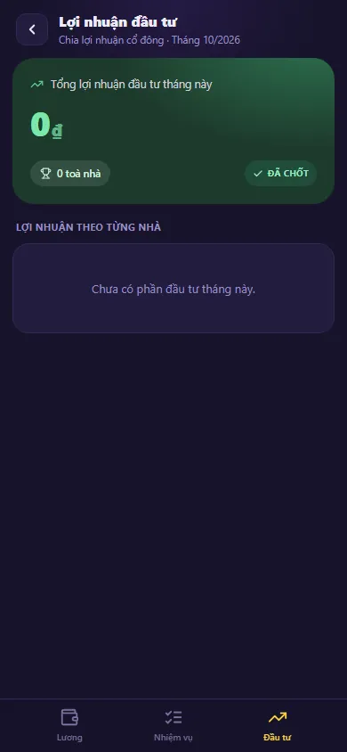

# Lương của tôi

Màn **Lương của tôi** là nơi nhân viên vận hành tự xem tiền lương của chính mình, không cần hỏi ai. Mọi con số được tính từ dữ liệu vận hành thật — ngày công, việc đã hoàn thành, hợp đồng ký ngoài giờ, phiếu hoa hồng, lợi nhuận đầu tư đã chốt, ứng lương và tiền phòng — và khớp đúng với số quản trị thấy ở [Bảng lương](/03-quan-ly-van-hanh/bang-luong/). Đây là màn **chỉ để xem**: bạn không ghi hay sửa tiền ở đây.

::: info Điều kiện tiên quyết
- Đã đăng nhập. Mọi tài khoản đều mở được `/finance/my-salary`; với nhân viên (không có quyền quản trị lương), bấm **Tài chính => Bảng lương** ở menu sẽ mở màn này ở **tab mới**.
- Đã được quản trị khai là người hưởng lương ở **Bảng lương => Cấu hình**. Nếu chưa, màn chỉ hiện dòng **"Bạn chưa được cấu hình hưởng lương. Liên hệ quản trị để được thiết lập."**
- Nên mở bằng **điện thoại**: màn là giao diện tối trọn màn hình, có thanh tab dưới đáy. Trên máy tính, cùng đường dẫn hiện bản bố cục rộng với cùng số liệu.
:::

## Hướng dẫn từng bước

**Bước 1**: Mở màn **Lương của tôi**. Đầu màn có lời chào kèm cấp độ, bộ chọn tháng **‹ T10/2026 ›** và nút quay lại (đóng tab). Thẻ lớn hiện **Tổng thu nhập tích luỹ tháng này** (nhãn **REALTIME**: số cập nhật theo dữ liệu mới), thanh tiến độ tới hạng kế tiếp (**Lên hạng …** hoặc **Đỉnh cao Vô địch** khi đã đạt mục tiêu), các chip khoản (**Lương cứng**, **Thưởng việc**, **Đầu tư**, **HH Sale**, **Đã ứng**, **Tiền phòng** — chỉ hiện khoản khác 0) và dòng **Còn nhận**.

- **Tổng thu nhập** = lương cứng + thưởng việc + đầu tư + hoa hồng (trước khi trừ).
- **Còn nhận** = thực nhận (đã trừ ứng lương và tiền phòng) − phần đã trả. Góc phải hiện **Đã trả …** khi đã có phiếu lương được duyệt, nếu chưa thì hiện **Chuỗi** ngày liên tục.
- Bấm một chip để mở bảng chi tiết của khoản đó (ví dụ từng dòng thưởng, từng phiếu hoa hồng, khoản ứng, khấu trừ tiền phòng tháng kế).

**Bước 2**: Kéo xuống để xem **Chặng nhiệm vụ tháng** (các mốc **Khởi động**, **Bứt phá**, **Lương cứng**, **Vô địch** theo mục tiêu thu nhập), bốn ô **Thợ sửa chữa**, **Cú đêm** (HĐ ngoài giờ / CN / lễ), **Chuỗi lửa**, **Chuyên cần** (số ngày công), danh sách **Nhiệm vụ đã hoàn thành** (**Tất cả ›**) và **Hành trình 6 tháng** để so sánh các tháng.

**Bước 3**: Dùng thanh tab dưới đáy:

- **Lương** — màn chính ở Bước 1–2.
- **Nhiệm vụ** — **Nhật ký nhiệm vụ** của tháng: từng việc đã cộng thành thưởng. Việc bị quản trị đánh dấu **Không tính** vẫn hiện nhưng thưởng bằng 0.
- **Đầu tư** — **Lợi nhuận đầu tư**: **Tổng lợi nhuận đầu tư tháng này**, số toà, nhãn **Đã chốt**/**Chờ chốt** và **Lợi nhuận theo từng nhà**. Chỉ có số khi bạn đồng thời là cổ đông và lợi nhuận toà đã được chốt.

**Bước 4**: Đổi tháng bằng **‹ ›** ở đầu màn. Bạn lùi được về các tháng cũ, nhưng không xem vượt mốc tháng được phép. Mặc định bạn thấy **tháng trước** cho tới khi tháng trước được quản trị **chốt**, sau đó mới thấy tháng hiện tại; quản trị có thể bật/tắt riêng từng tháng ở **Tháng hiển thị cho nhân viên**.

::: warning Số của tháng chưa chốt là tạm tính
Với tháng chưa chốt, số có thể đổi khi bạn làm thêm việc, ký thêm hợp đồng, khi phiếu hoa hồng được duyệt hoặc khi quản trị loại một việc khỏi thưởng. Chỉ khi quản trị **chốt kỳ**, số mới đóng băng.
:::

::: warning "Còn nhận" không phải trạng thái đã nhận tiền
Thực nhận và phần **Đầu tư** cho biết số được tính cho bạn. Phiếu chi lương do quản trị lập phải được **duyệt**, và tiền chỉ thật sự ra khỏi sổ quỹ khi phiếu ở trạng thái **Đã Chi** (`posting_status = POSTED`).
:::

::: tip Thưởng ngay khi hoàn thành việc
Khi bấm **Hoàn thành** một việc có thưởng ở [Việc của tôi](/02-theo-doi-nhanh/viec-cua-toi/), popup và thông báo cho biết kết quả tại thời điểm đó; khoản tháng vẫn theo bảng kê hiện hành.
:::

## Các tính năng khác trên màn hình

| Thành phần | Công dụng |
| --- | --- |
| Thẻ **Tổng thu nhập tích luỹ tháng này** | Tổng các khoản cộng của tháng đang xem, cập nhật theo dữ liệu mới |
| Chip khoản | Bấm để xem chi tiết từng khoản cộng/trừ |
| **Còn nhận** | Thực nhận trừ phần đã trả |
| **Chặng nhiệm vụ tháng** | Tiến độ so với các mốc thu nhập của tháng |
| Bốn ô thống kê | Số việc sửa chữa, HĐ ngoài giờ/CN/lễ, chuỗi ngày, ngày công |
| **Hành trình 6 tháng** | So sánh thu nhập các tháng đã chốt |
| Tab **Nhiệm vụ** / **Đầu tư** | Nhật ký việc tính thưởng; lợi nhuận đầu tư theo từng nhà |

## Tình huống & lỗi thường gặp

| Tình huống | Nguyên nhân & cách xử lý |
| --- | --- |
| Màn hiện **"Bạn chưa được cấu hình hưởng lương"** | Nhờ quản trị thêm bạn ở **Bảng lương => Cấu hình** |
| Chỉ thấy tháng trước, không thấy tháng này | Tháng trước chưa được chốt; đây là chính sách hiển thị, không phải lỗi |
| Không bấm được **›** sang tháng sau | Đã tới tháng mới nhất bạn được xem |
| Thưởng ít hơn dự kiến | Kiểm loại việc, ảnh hoàn thành, điều kiện giờ/ngày, và việc có bị đánh dấu **Không tính** không |
| Tab **Đầu tư** báo **Chờ chốt** hoặc bằng 0 | Lợi nhuận toà chưa chốt, hoặc bạn không phải cổ đông của toà nào; xem [Chia lợi nhuận](/03-quan-ly-van-hanh/chia-loi-nhuan/) |
| Chưa thấy **HH Sale** | Phiếu hoa hồng chưa được gán cho bạn hoặc tên người nhận chưa khớp biệt danh; nhờ quản trị kiểm |
| Số thay đổi giữa các lần xem | Bình thường với tháng chưa chốt |

## Thử trực tiếp trên sandbox

<SandboxTry account="demo.quanly" app-path="/finance/my-salary" app-label="Mở màn Lương của tôi" fixtures="DEMO 07/10/2026: demo.quanly được cấu hình lương 8.000.000đ, tháng 10/2026 tạm tính, chưa có nhiệm vụ và đầu tư" view-only>

**Bài tập chỉ xem**

1. Mở màn bằng điện thoại, đọc thẻ tổng thu nhập, chip khoản và dòng **Còn nhận**.
2. Bấm chip **Lương cứng** để xem chi tiết rồi đóng; kéo xuống xem chặng nhiệm vụ.
3. Chuyển qua tab **Nhiệm vụ** và **Đầu tư**, rồi thử lùi một tháng.

**Kết quả mong đợi**

- Màn khớp các nhãn như bài mô tả.
- Không có dữ liệu nào bị tạo hoặc sửa (màn chỉ đọc).

</SandboxTry>

## Quy trình liên quan

- [Bảng lương](/03-quan-ly-van-hanh/bang-luong/) — phía quản trị: cấu hình, chốt kỳ, lập phiếu chi lương.
- [Việc của tôi](/02-theo-doi-nhanh/viec-cua-toi/) — hoàn thành việc để nhận thưởng.
- [Chia lợi nhuận](/03-quan-ly-van-hanh/chia-loi-nhuan/) — nguồn của phần **Đầu tư**.
- [Ví cá nhân](/03-quan-ly-van-hanh/vi-ca-nhan/) — tiền cá nhân, tách khỏi tiền vận hành.
