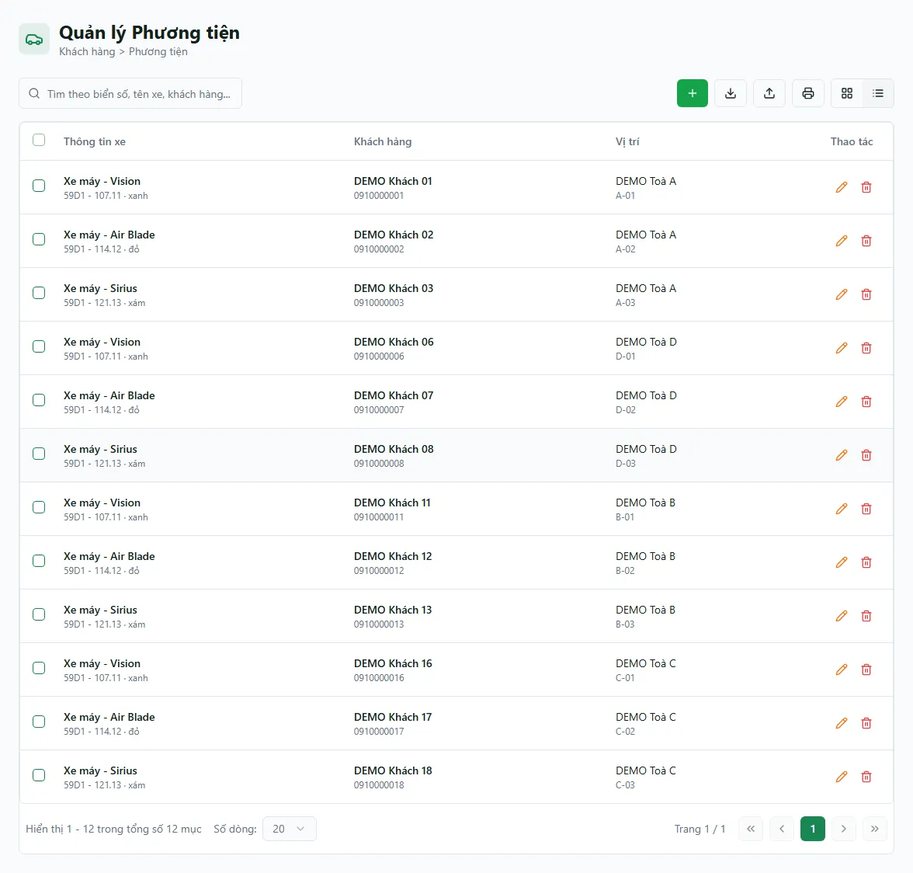

# Phương tiện

Màn **Phương tiện** là nơi quản lý xe của khách đang thuê: mỗi xe có thể gắn với cư dân, phòng và toà, kèm biển số/số vé. Bản desktop hiện truy vấn cố định loại `MOTORBIKE`, trong khi bản mobile hỗ trợ các loại xe khác; vì vậy danh sách desktop không phải toàn bộ phương tiện của tổ chức.

::: tip Snapshot production DEMO (13/08/2026)
Với tài khoản `demo.chunha`, `/vehicles` tải xong hiển thị **12 xe**, phân trang **1/1**. Các dòng đang thấy là xe máy như **Vision**, **Air Blade**, **Sirius**, gắn với các khách `DEMO Khách` và phòng **A-01**, **A-02**...; lượt xác minh chỉ xem và console không có lỗi.
:::

Xe được phân theo **loại** (xe máy, ô tô, xe đạp, xe điện, loại khác). Trường `parking_fee` có thể được hiển thị trong hồ sơ nhưng form phương tiện hiện không cho sửa; không coi nó là nguồn tự động sinh hoá đơn hay mức phí dịch vụ đang áp dụng.

::: info Điều kiện tiên quyết
- Quyền **Phương tiện => Xem** (module `vehicles`, action `view`) để mở màn danh sách.
- Quyền **Thêm** / **Sửa** trên module `vehicles` nếu muốn thêm, sửa hoặc xoá xe.
- Đã có **cư dân** (khách thuê) và **phòng** trong hệ thống để gắn xe vào. Nếu chưa, tạo trước ở trang [Cư dân](/03-quan-ly-van-hanh/cu-dan/) và [Căn hộ / Phòng](/03-quan-ly-van-hanh/can-ho-phong/).
- Là nhân viên, bạn chỉ thấy và quản lý được xe thuộc các **toà được gán phạm vi** cho mình; xe chưa gắn toà thì chỉ người quản lý toàn hệ thống mới sửa/xoá được.
:::

## Hướng dẫn từng bước

**Bước 1**: Tại menu bên trái, ấn chọn **Phương tiện**. Màn hiện danh sách xe kèm ô tìm kiếm; mỗi dòng cho biết **loại xe**, **dòng xe**, **màu**, **biển số**, **chủ xe / cư dân**, **phòng – toà** và **số vé xe**.

**Bước 2**: Dùng ô **tìm kiếm** ở đầu trang để tra nhanh theo **biển số**, **dòng xe**, **tên chủ xe** hoặc **tên cư dân**. Kết quả áp ngay vào danh sách. Ô tìm kiếm và các bộ lọc được giữ lại khi bạn tải lại trang (F5).

**Bước 3**: Muốn thêm xe, ấn **Thêm** để mở form. Trên desktop, luồng hiện tập trung/hard-pin **Xe máy (`MOTORBIKE`)**; để thao tác và lọc đủ loại xe, dùng giao diện mobile. Điền các trường:
- **Loại xe** — trên mobile có Xe máy / Ô tô / Xe đạp / Xe điện / Khác; desktop có thể cố định Xe máy.
- **Dòng xe** (ví dụ "Honda Vision"), **Màu**, **Biển số**.
- **Chủ xe** — tên người đứng tên xe (có thể khác cư dân).
- **Số vé xe** — mã vé gửi xe bạn cấp cho khách.
- **Cư dân**, **Toà nhà**, **Phòng** — chọn để gắn xe vào đúng khách và đúng phòng.

Điền xong ấn **Lưu**. Xe mới xuất hiện ngay trong danh sách và trong tab **Phương tiện** ở trang chi tiết của cư dân.

**Bước 4**: Cần chỉnh, ấn **Sửa** trên dòng xe, đổi thông tin rồi ấn **Lưu**. Muốn bỏ một xe (khách trả xe, nhập nhầm…), ấn **Xoá** — xe được ẩn khỏi danh sách.

::: warning `parking_fee` chỉ là trường hiển thị ở luồng này
Form thêm/sửa xe không có ô cập nhật `parking_fee`, và trường này không tự chứng minh phí đã được đưa vào dịch vụ/hóa đơn. Thiết lập và đối chiếu phí gửi xe bằng cấu hình dịch vụ/hợp đồng/hoá đơn đang áp dụng; không sửa dữ liệu phương tiện để kỳ vọng phát sinh billing.
:::

::: warning Xoá xe khó khôi phục từ giao diện
Nút **Xoá** ẩn xe khỏi mọi danh sách (xoá mềm). Bản ghi vẫn còn trong hệ thống nhưng **giao diện không có nút khôi phục** — muốn có lại, bạn phải thêm mới thủ công. Trước khi xoá, hãy chắc chắn đúng xe cần bỏ; nếu chỉ đổi thông tin, dùng **Sửa** thay vì Xoá.
:::

## Các tính năng khác trên màn hình

| Nút / Bộ lọc | Công dụng |
| --- | --- |
| Ô tìm kiếm | Tìm xe theo **biển số**, **dòng xe**, **tên chủ xe** hoặc **tên cư dân**; áp ngay vào danh sách. |
| Bộ lọc **Toà nhà** | Lọc xe theo toà đang gửi. |
| Bộ lọc **Phòng** | Lọc xe theo phòng (gộp theo tên phòng; nhiều toà cùng số phòng sẽ gom chung một mục). |
| Bộ lọc **Dòng xe** / **Màu** | Lọc theo dòng xe hoặc màu; danh sách gợi ý lấy từ chính các xe đang có. |
| **Thêm** | Mở form tạo xe mới (chỉ hiện khi bạn có phạm vi quản lý và quyền thêm). |
| **Sửa** | Mở form chỉnh thông tin xe (hiện theo phạm vi toà của từng xe). |
| **Xoá** | Ẩn xe khỏi danh sách (xoá mềm). |

::: tip Lọc đủ loại xe trên bản điện thoại
Bản desktop hard-pin truy vấn `MOTORBIKE` và ẩn ô lọc loại. Muốn xem/lọc ô tô, xe đạp, xe điện hoặc loại khác, dùng bản mobile với bộ lọc loại xe, toà và phòng.
:::

## Tình huống & lỗi thường gặp

| Tình huống | Cách xử lý |
| --- | --- |
| Không thấy nút **Thêm** / **Nhập** | Bạn thiếu quyền thêm xe hoặc nút import/export chưa được triển khai. Nhờ quản trị cấp quyền `vehicles` cho tài khoản. |
| Thấy xe nhưng không sửa/xoá được | Sửa/Xoá mở theo **toà của từng xe** — bạn chỉ thao tác được với xe thuộc toà mình phụ trách. Xe chưa gắn toà chỉ người quản lý toàn hệ thống mới sửa được. |
| Danh sách trống dù chắc chắn có xe | Kiểm tra bộ lọc và phạm vi toà. Truy vấn lỗi có thể hiện như danh sách rỗng; tải lại/kiểm tra mạng hoặc nhờ quản trị xác minh. Nếu xe không phải `MOTORBIKE`, xem trên mobile. |
| Không lọc được đủ loại (ô tô/xe đạp/xe điện) | Bản desktop ẩn ô lọc loại xe và ưu tiên xe máy. Mở bản điện thoại để lọc đủ các loại xe. |
| Không nhập được **phí giữ xe** trong form | Đúng hiện trạng: form thêm/sửa xe chưa mở ô phí giữ xe. Phí giữ xe hiển thị ở hồ sơ cư dân; đặt/điều chỉnh qua dịch vụ giữ xe của phòng. |
| Nút **Xuất Excel** / **Nhập Excel** bấm không thấy gì | Hai nút hiện là stub, chưa thực hiện import/export. Không dùng chúng để xác nhận đã sao lưu hoặc nạp dữ liệu; thêm/sửa thủ công trong phạm vi được phép. |

## Thử trực tiếp trên sandbox

<SandboxTry account="demo.chunha" app-path="/vehicles" app-label="Mở màn Phương tiện" fixtures="12 xe DEMO; Vision/Air Blade/Sirius; phòng A-01, A-02..." view-only>

Bài tập **chỉ xem** trên snapshot đang hiển thị:

1. Quan sát tổng số **12 xe** và phân trang **1/1**.
2. Đọc các dòng xe máy **Vision**, **Air Blade**, **Sirius**; đối chiếu tên khách `DEMO Khách` và phòng **A-01**, **A-02**... ở từng dòng.
3. Dùng ô tìm kiếm để lọc một dòng đang hiển thị, mở lại danh sách và xác nhận phân trang vẫn là **1/1**. Không ấn **Thêm**, **Lưu**, **Sửa** hoặc **Xoá**.

Kết quả mong đợi: bạn nhận diện được snapshot phương tiện DEMO hiện hành và đọc đúng liên kết xe–khách–phòng mà không ghi dữ liệu.

</SandboxTry>

## Quy trình liên quan

- [Cư dân](/03-quan-ly-van-hanh/cu-dan/) — hồ sơ khách thuê; xe được gắn vào cư dân và hiện lại trong tab Phương tiện của hồ sơ.
- [Căn hộ / Phòng](/03-quan-ly-van-hanh/can-ho-phong/) — quản lý phòng, nơi gắn xe khi khách gửi xe.
- [Hợp đồng](/03-quan-ly-van-hanh/hop-dong/) — hợp đồng thuê của khách đứng tên xe.
