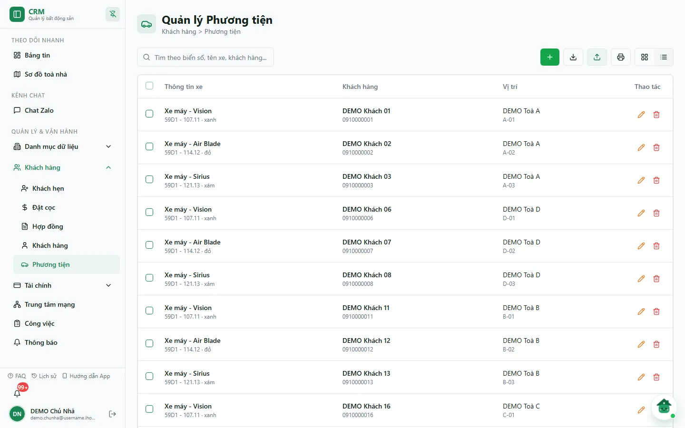
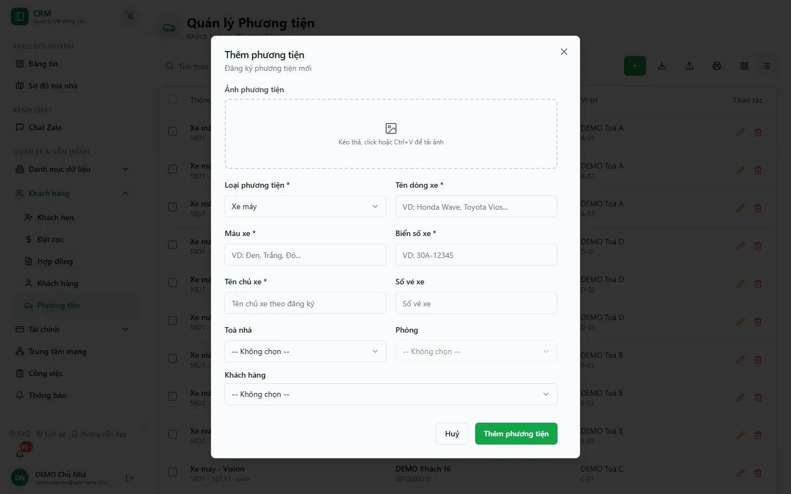

# Phương tiện

Màn **Quản lý Phương tiện** là nơi quản lý xe của khách đang thuê: mỗi xe có thể gắn với khách hàng, phòng và toà, kèm biển số/số vé. Bản desktop luôn lọc cố định loại **Xe máy**, trong khi bản điện thoại có bộ lọc loại xe; vì vậy danh sách desktop không phải toàn bộ phương tiện của tổ chức.

::: tip Snapshot production DEMO (07/10/2026)
Với tài khoản `demo.chunha`, `/vehicles` hiển thị **12 xe máy** (**Vision**, **Air Blade**, **Sirius**) gắn với các khách `DEMO Khách` ở phòng **A-01…A-03**, **B-01…B-03**, **C-01…**, **D-01…D-03**.
:::

Xe được phân theo **loại** (xe máy, ô tô, xe đạp, xe điện, loại khác). Trường phí gửi xe có thể hiển thị trong hồ sơ khách nhưng form phương tiện không cho sửa; không coi nó là nguồn tự động sinh hoá đơn hay mức phí dịch vụ đang áp dụng.

::: info Điều kiện tiên quyết
- Quyền **Phương tiện => Xem** (module `vehicles`, action `view`) để mở màn danh sách.
- Quyền **Thêm** / **Sửa** / **Xoá** trên module `vehicles` nếu muốn thêm, sửa hoặc xoá xe.
- Đã có **khách hàng** và **phòng** trong hệ thống để gắn xe vào. Nếu chưa, tạo trước ở trang [Cư dân](/03-quan-ly-van-hanh/cu-dan/) và [Căn hộ / Phòng](/03-quan-ly-van-hanh/can-ho-phong/).
- Là nhân viên, bạn chỉ thấy và quản lý được xe thuộc các **toà được gán phạm vi** cho mình; xe chưa gắn toà thì chỉ người quản lý toàn hệ thống mới sửa/xoá được.
:::

## Hướng dẫn từng bước

**Bước 1**: Tại menu bên trái, ấn chọn **Khách hàng** => **Phương tiện**. Màn **Quản lý Phương tiện** hiện ô **Tìm theo biển số, tên xe, khách hàng...**, hàng nút biểu tượng (**+** thêm, **Xuất**, **Nhập**, **In**, **Dạng lưới** / **Dạng danh sách**) và bảng với các cột **Thông tin xe** (loại – dòng xe, biển số · màu), **Khách hàng** (tên + SĐT), **Vị trí** (toà + phòng), **Thao tác** (sửa / xoá).

**Bước 2**: Dùng ô tìm kiếm để tra nhanh theo **biển số**, **tên xe** hoặc **tên khách hàng**. Kết quả áp ngay vào danh sách; từ khoá được giữ lại khi tải lại trang (F5).

**Bước 3**: Muốn thêm xe, ấn **+** màu xanh để mở hộp **Thêm phương tiện** ("Đăng ký phương tiện mới"). Điền:

- **Ảnh phương tiện** (kéo thả, bấm chọn hoặc Ctrl+V).
- **Loại phương tiện \*** (mặc định **Xe máy**), **Tên dòng xe \*** (ví dụ "Honda Wave"), **Màu xe \***, **Biển số xe \***.
- **Tên chủ xe \*** — tên người đứng tên đăng ký xe (có thể khác khách thuê).
- **Số vé xe** — mã vé gửi xe bạn cấp cho khách.
- **Toà nhà**, **Phòng**, **Khách hàng** — chọn để gắn xe vào đúng khách và đúng phòng (mặc định **-- Không chọn --**).

Điền xong ấn **Thêm phương tiện** (hoặc **Huỷ** để bỏ). Xe mới xuất hiện trong danh sách và trong thẻ **Phương tiện** của hồ sơ khách.

**Bước 4**: Cần chỉnh, ấn biểu tượng bút chì trên dòng xe để mở hộp **Sửa phương tiện**, đổi thông tin rồi ấn **Cập nhật**. Muốn bỏ một xe (khách trả xe, nhập nhầm…), ấn biểu tượng thùng rác — xe được ẩn khỏi danh sách.

::: warning Phí gửi xe chỉ là trường hiển thị ở luồng này
Form thêm/sửa xe không có ô phí gửi xe, và trường phí trên hồ sơ không tự chứng minh phí đã được đưa vào dịch vụ/hoá đơn. Thiết lập và đối chiếu phí gửi xe bằng cấu hình dịch vụ/hợp đồng/hoá đơn đang áp dụng.
:::

::: warning Xoá xe khó khôi phục từ giao diện
Xoá là xoá mềm: bản ghi vẫn còn trong hệ thống nhưng **giao diện không có nút khôi phục** — muốn có lại, bạn phải thêm mới thủ công. Nếu chỉ đổi thông tin, dùng **Sửa** thay vì Xoá.
:::

## Các tính năng khác trên màn hình

| Nút / Bộ lọc | Công dụng |
| --- | --- |
| Ô tìm kiếm | Tìm xe theo **biển số**, **tên xe** hoặc **tên khách hàng**. |
| **+** | Mở hộp **Thêm phương tiện** (chỉ hiện khi bạn có phạm vi quản lý và quyền thêm). |
| Bút chì / thùng rác | Mở hộp **Sửa phương tiện** / xoá mềm xe (theo phạm vi toà của từng xe). |
| **Xuất** / **Nhập** | Hiện chỉ báo "tính năng đang phát triển" — chưa xuất/nhập dữ liệu. |
| **In** | In màn hình danh sách hiện tại. |
| Bộ lọc **Tòa nhà / Phòng / Dòng xe / Màu** | Chỉ có trên bản điện thoại (nút **Lọc dữ liệu**). |

::: tip Lọc đủ loại xe trên bản điện thoại
Bản desktop cố định loại **Xe máy** và không có bảng lọc. Muốn xem/lọc ô tô, xe đạp, xe điện hoặc lọc theo toà, phòng, dòng xe, màu, dùng bản điện thoại.
:::

## Tình huống & lỗi thường gặp

| Tình huống | Cách xử lý |
| --- | --- |
| Không thấy nút **+** | Bạn thiếu quyền thêm xe hoặc chưa được gán phạm vi toà. Nhờ quản trị cấp quyền `vehicles`. |
| Thấy xe nhưng không sửa/xoá được | Sửa/Xoá mở theo **toà của từng xe** — bạn chỉ thao tác được với xe thuộc toà mình phụ trách. |
| Danh sách trống dù chắc chắn có xe | Kiểm tra từ khoá tìm kiếm và phạm vi toà. Nếu xe không phải **Xe máy**, xem trên bản điện thoại. |
| Thêm ô tô nhưng không thấy trong danh sách desktop | Đúng hiện trạng: desktop chỉ hiện xe máy. Xe vẫn được lưu; xem trên điện thoại hoặc trong hồ sơ khách. |
| Bấm **Xuất** / **Nhập** chỉ hiện thông báo | Hai nút chưa được triển khai. Không dùng chúng để sao lưu hay nạp dữ liệu. |

## Thử trực tiếp trên sandbox

<SandboxTry account="demo.chunha" app-path="/vehicles" app-label="Mở màn Phương tiện" fixtures="Snapshot 07/10/2026: 12 xe máy DEMO (Vision / Air Blade / Sirius) gắn khách DEMO và phòng các toà A–D." view-only>

Bài tập **chỉ xem**:

1. Đọc các dòng xe **Vision**, **Air Blade**, **Sirius**; đối chiếu tên khách `DEMO Khách` và cột **Vị trí** ở từng dòng.
2. Gõ `59D1 - 121` vào ô tìm kiếm để lọc các xe Sirius, rồi xoá từ khoá.
3. Ấn **+** để xem các ô của hộp **Thêm phương tiện**, rồi **Huỷ**. Không ấn **Thêm phương tiện**, **Cập nhật** hoặc xoá.

Kết quả mong đợi: bạn đọc đúng liên kết xe – khách – phòng mà không ghi dữ liệu.

</SandboxTry>

## Quy trình liên quan

- [Cư dân](/03-quan-ly-van-hanh/cu-dan/) — hồ sơ khách; xe gắn với khách hiện lại trong thẻ Phương tiện của hồ sơ.
- [Căn hộ / Phòng](/03-quan-ly-van-hanh/can-ho-phong/) — quản lý phòng, nơi gắn xe khi khách gửi xe.
- [Hợp đồng](/03-quan-ly-van-hanh/hop-dong/) — hợp đồng thuê của khách đứng tên xe.
