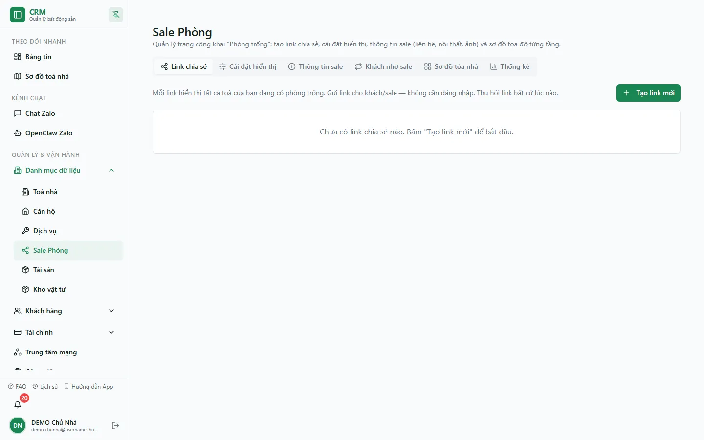

# Sale Phòng (đăng phòng cho thuê)

Màn **Sale Phòng** là nơi bạn vận hành trang phòng trống công khai — một trang web đẹp mà **khách xem không cần đăng nhập**. Bạn tạo **link chia sẻ** để gửi cho sale/khách, chỉnh **cách hiển thị** (số ngày báo "sắp trống", hotline), đăng **ảnh và thông tin sale** cho từng phòng/toà, vẽ **sơ đồ tầng** bằng kéo-thả, đăng lại **phòng khách nhờ sale**, và xem **thống kê** người xem đã bấm gì. Trang công khai luôn hiển thị **đúng phòng đang trống tại thời điểm hiện tại** vì hệ thống suy trạng thái từ hợp đồng thật, không phụ thuộc bạn có nhớ cập nhật hay không.

::: info Điều kiện tiên quyết
- Quyền **Sale Phòng => Xem** (module `sale_phong`, action `view`) để mở màn.
- Mỗi tab cần một quyền chi tiết riêng: **Link chia sẻ** (`manage_tokens`), **Cài đặt hiển thị** (`manage_settings`), **Thông tin sale** (`manage_images`), **Khách nhờ sale** (`manage_pass_listings`), **Sơ đồ tòa nhà** (`edit_floor_plan`), **Thống kê** (`view_analytics`). Thiếu quyền nào thì ẩn tab đó.
- Đã có **toà nhà** và **phòng** trong hệ thống. Trang công khai chỉ hiện toà có ít nhất một phòng **trống / sắp trống / khách nhờ sale**.
- Muốn ảnh sale hiện đẹp thì nên đăng **ảnh phòng** và **ảnh bìa toà** trước (tab **Thông tin sale**).
- Là nhân viên, bạn chỉ thao tác trên các toà được gán phạm vi cho mình.
:::

## Hướng dẫn từng bước

**Bước 1**: Tại menu bên trái, vào **Danh mục dữ liệu => Sale Phòng**. Màn mở ra với **6 tab**: **Link chia sẻ**, **Cài đặt hiển thị**, **Thông tin sale**, **Khách nhờ sale**, **Sơ đồ tòa nhà** và **Thống kê**. Bạn chỉ thấy những tab mà mình có quyền.

::: warning DEMO hiện chưa có link chia sẻ
Snapshot production ngày 13/08/2026 hiển thị empty state **Chưa có link chia sẻ nào**. Tài liệu không tự tạo link chỉ để lấy ảnh vì đó là một thay đổi dữ liệu; phần dưới mô tả quy trình tạo/thu hồi, còn ảnh phản ánh đúng trạng thái hiện tại.
:::

**Bước 2**: Tạo link chia sẻ — ở tab **Link chia sẻ**, ấn nút tạo link mới, đặt **Nhãn** gợi nhớ (ví dụ "Gửi sale khu Gò Vấp") rồi lưu. Hệ thống sinh một **mã token ngẫu nhiên 6 ký tự** và tạo đường dẫn dạng `https://ptcrm.vercel.app/r/<token>`. Mã này **không chứa thông tin của bạn** nên chia sẻ an toàn.

**Bước 3**: Với mỗi link trong danh sách, bạn có thể **Sao chép link**, **Mở thử** (xem đúng những gì khách sẽ thấy), **đổi nhãn**, **Thu hồi** hoặc **Xoá**. Dán link vào Zalo/Facebook/tin nhắn để gửi cho khách hoặc cộng tác viên sale.

::: warning Thu hồi khác Xoá
**Thu hồi** một link làm nó ngừng hoạt động ngay (khách mở sẽ thấy "Liên kết không hợp lệ hoặc đã hết hạn"), nhưng bạn có thể **khôi phục** lại sau. **Xoá** thì mất hẳn, không lấy lại được. Nếu chỉ muốn tạm ngưng một chiến dịch sale, hãy **Thu hồi** thay vì Xoá.
:::

**Bước 4**: Chỉnh cách hiển thị — sang tab **Cài đặt hiển thị**. Đặt **Số ngày báo "sắp trống"** (`soon_days`, từ 0 đến 365, mặc định 30): phòng có hợp đồng sắp hết hạn hoặc khách đã đăng ký chuyển đi **trong khoảng số ngày này** sẽ hiện nhãn **Sắp trống** kèm ngày dự kiến trống. Chọn **Hotline hiển thị** để đặt số điện thoại khách bấm **Gọi / Zalo** trên trang (bỏ trống thì dùng hotline đang bật đầu tiên của bạn). Cài đặt này áp cho **mọi link** của bạn.

**Bước 5**: Đăng ảnh và thông tin sale — sang tab **Thông tin sale**. Chọn theo **phòng** để nhập **nội thất/tiện ích** (dạng thẻ) và **tải nhiều ảnh** phòng cùng lúc; có nút **đồng bộ ảnh sang các phòng cùng mẫu** để đỡ đăng lại. Chọn theo **toà** để nhập **liên hệ quản lý riêng của toà**, **link chỉ đường (Google Maps)** và **ảnh bìa toà**. Ngoài ra mỗi phòng có ô **Khuyến mãi** (gửi khách được) và ô **Thưởng sale** (chỉ nội bộ, khách không thấy) — nhập ở màn quản lý phòng.

**Bước 6**: Vẽ sơ đồ tầng — sang tab **Sơ đồ tòa nhà**. Chọn toà và tầng, rồi **kéo-thả** vị trí từng phòng, thang máy, cầu thang, hành lang cho khớp thực tế. Có **hoàn tác** (nhiều bước), **snap theo lưới**, nút **Tự sắp xếp** để xếp lại tự động. Ấn **Lưu** để ghi sơ đồ. Trên trang công khai, khách chuyển sang chế độ **Sơ đồ** sẽ thấy đúng cách bố trí bạn đã vẽ; tầng nào chưa vẽ thì hệ thống tự xếp tạm.

**Bước 7**: Đo hiệu quả — sang tab **Thống kê** để xem trang công khai đang hoạt động ra sao: tổng lượt xem, phòng được xem nhiều nhất, xu hướng theo thời gian, hiệu quả từng link chia sẻ và các lỗi. Bạn lọc theo **khoảng ngày**, **link**, **toà nhà** và có thể **loại trừ lượt xem nội bộ** (lượt do chính nhân viên mở). Bộ lọc được **giữ lại khi tải lại trang (F5)**.

## Các tính năng khác

### Khách nhờ sale (đăng lại phòng đang có khách)

Khi khách đang thuê nhờ công ty **sale / pass / sang phòng giùm**, phòng đó vẫn đang có hợp đồng nên bình thường không lên kênh công khai. Tab **Khách nhờ sale** là lớp đăng riêng cho tình huống này — **không đụng tới trạng thái phòng hay hợp đồng**:

- Chọn phòng, hệ thống **điền sẵn tên và số điện thoại khách đại diện** (khách đang thuê), bạn có thể chọn khách khác.
- Nhập **chính sách sale của khách** (ví dụ "Giảm khách 500k tháng đầu"), **giá pass**, **ngày dự kiến trống**.
- Bật cờ **Liên hệ quản lý** nếu khách không muốn lộ số: trên trang công khai phòng vẫn hiện nhưng nút **Gọi** trỏ về **hotline/quản lý toà** thay vì số của khách. Số khách vẫn được lưu và hiển thị **nội bộ** trong tab này.

Phòng đăng ở đây hiện trên trang công khai với **màu riêng** (khách nhờ sale) kèm chính sách và giá pass của khách. Nhân viên có quyền `manage_pass_listings` trong phạm vi toà cũng làm được, không riêng chủ nhà.

### Trang công khai (/r/:token) khách nhìn thấy gì

Khi khách mở link, họ **không đăng nhập** mà vẫn xem được mọi toà của bạn đang có phòng trống, ở 2 chế độ: **Danh sách** (thẻ ảnh + giá + tiện ích) và **Sơ đồ** (bố trí phòng từng tầng). Bấm vào một phòng mở bảng chi tiết: bộ ảnh, giá/cọc/tiền điện, khuyến mãi, và các nút **Gọi / Zalo / Chỉ đường / Chia sẻ / Tải ảnh**. Trang tự làm mới định kỳ nên khách luôn thấy tình trạng phòng gần đúng thời điểm hiện tại. Riêng nút **Tạo cọc giữ phòng** chỉ hiện khi **sale đang đăng nhập và có quyền tạo cọc** — khách vãng lai không bao giờ thấy.

Nút cọc nhanh thử tạo giữ chỗ canonical 24 giờ rồi mới tạo voucher, nhưng hai bước không nguyên tử và giữ chỗ có thể fail-open khi writer/quyền/hạ tầng không sẵn sàng. Vì vậy sale phải tải lại để kiểm phòng đã được giữ và kiểm voucher đã `POSTED`; không suy ra đã khoá phòng hay đã thu tiền chỉ từ việc hộp thoại báo thành công.

### Phiên bản điện thoại

Mở `/sale-phong` trên điện thoại, màn mặc định chuyển sang bản mobile: xem nhanh **phòng trống của chính bạn** (không cần link), và một chế độ **Quản lý** gồm đủ 6 chức năng như bản máy tính, cùng ràng buộc quyền.

## Tình huống & lỗi thường gặp

| Tình huống | Cách xử lý |
| --- | --- |
| Khách mở link báo **"Liên kết không hợp lệ hoặc đã hết hạn"** | Link đã bị **Thu hồi** hoặc **Xoá**. Vào tab **Link chia sẻ**: nếu còn trong danh sách đã thu hồi thì **Khôi phục**, nếu đã xoá thì **tạo link mới**. |
| Trang công khai hiện **toà lạ / phòng mẫu** không phải của bạn | Bạn đang mở trang **không có token hợp lệ** nên hệ thống hiện **dữ liệu mẫu** để xem thử giao diện. Hãy mở đúng link `/r/<token>` bạn đã tạo. |
| Một **toà không lên** trang công khai | Trang chỉ hiện toà có ít nhất một phòng **trống / sắp trống / khách nhờ sale**. Toà đã kín khách sẽ không xuất hiện, trừ khi có phòng đăng ở tab **Khách nhờ sale**. |
| Phòng **còn hợp đồng nhưng vẫn hiện trống** trên trang | Trang suy trạng thái từ **hợp đồng thật**, không từ cờ trạng thái phòng. Kiểm tra hợp đồng của phòng còn **hiệu lực** không; nếu hợp đồng đã kết thúc thì phòng đúng là trống. |
| Vừa tạo **cọc giữ chỗ** nhưng phòng vẫn hiện trống | Cọc nhanh và giữ chỗ là hai request riêng; bước giữ chỗ có thể fail-open. Tải lại trang, kiểm tra phiếu cọc ở [Đặt cọc giữ chỗ](/03-quan-ly-van-hanh/dat-coc/) và xác nhận trạng thái phòng trước khi hứa đã khoá phòng cho khách. |
| Ô **Thưởng sale** khách có nhìn thấy không | Không. **Thưởng sale** là ghi chú **nội bộ**, không nằm trong nội dung chia sẻ cho khách. Ô **Khuyến mãi** thì có gửi khách được. |
| Tab **Sắp trống** không hiện dù hợp đồng sắp hết | Kiểm tra **Số ngày báo "sắp trống"** ở tab **Cài đặt hiển thị** — hợp đồng phải sắp hết hạn (hoặc khách đã đăng ký chuyển đi) **trong khoảng số ngày** đó mới hiện nhãn Sắp trống. |
| Không thấy một số tab | Mỗi tab cần quyền chi tiết riêng (xem Điều kiện tiên quyết). Nhờ quản trị bật quyền `sale_phong.*` tương ứng ở [Phân quyền](/05-cai-dat/phan-quyen/). |

## Thử trực tiếp trên sandbox

<SandboxTry account="demo.sale" app-path="/sale-phong" app-label="Mở màn Sale Phòng" fixtures="snapshot hiện chưa có link chia sẻ; có phòng trống trong dữ liệu DEMO" view-only>

Thực hành đăng phòng trống và xem link công khai:

1. Lần lượt mở **6 tab** để làm quen: **Link chia sẻ**, **Cài đặt hiển thị**, **Thông tin sale**, **Khách nhờ sale**, **Sơ đồ tòa nhà**, **Thống kê**.
2. Ở tab **Link chia sẻ**, quan sát empty state và nút **Tạo link mới**; không tạo link trong tài khoản dùng chung nếu chưa có kế hoạch dọn dữ liệu.
3. Sang **Cài đặt hiển thị**, **Thông tin sale**, **Khách nhờ sale**, **Sơ đồ tòa nhà** và **Thống kê** để kiểm tra các bề mặt hiện có.
4. Khi cần thử vòng đời link, dùng một fixture riêng có cleanup hoặc tạo rồi xoá/thu hồi theo quy trình quản trị đã thống nhất.

Kết quả mong đợi: bạn hiểu vòng đời một link chia sẻ (tạo → gửi → thu hồi/khôi phục) và thấy trang công khai hiển thị đúng phòng trống mà không cần khách đăng nhập. Xong bấm **Reset** để trả sandbox về trạng thái ban đầu.

</SandboxTry>

## Quy trình liên quan

- [Hotline](/05-cai-dat/hotline/) — quản lý số điện thoại khách bấm Gọi/Zalo trên trang công khai (chọn ở tab Cài đặt hiển thị).
- [Đặt cọc giữ chỗ](/03-quan-ly-van-hanh/dat-coc/) — nhận cọc giữ phòng; phòng đã cọc tự biến khỏi danh sách trống trên trang công khai.
- [Căn hộ / Phòng](/03-quan-ly-van-hanh/can-ho-phong/) — nơi nhập giá, loại phòng, trạng thái và ảnh nguồn cho từng phòng.
- [Toà nhà](/03-quan-ly-van-hanh/toa-nha/) — thông tin toà, địa chỉ và ảnh bìa dùng cho trang công khai.
- [Phân quyền](/05-cai-dat/phan-quyen/) — bật các quyền chi tiết `sale_phong.*` cho từng tab và quyền tạo cọc nhanh.
- [Chat Zalo](/03-quan-ly-van-hanh/chat-zalo/) — kênh trả lời khách nhắn tới từ trang phòng trống.
